# 2-3—4 树

 在上一篇文章中介绍了2-3树的定义以及插入删除操作。
本篇文章将在2-3树的基础上更进一步，
介绍比2-3树更为复杂的数据结构2-3-4树。
之所以介绍2-3-4树是因为2-3-4树与极为重要的红黑树有着等价关系，
通过先学习2-3-4树为后面学习红黑树打下基础，
增进对于红黑树的理解。

2-3树不再是单纯的二叉树了，因为2-3树中除了2-节点之外还存在3-节点。
在2-3树的基础上进一步扩展，2-3-4树在2-3树的基础上添加4-节点。
4-节点可以存储3个键值，最多可以拥有4棵子树。

### 定义

* 每个节点每个节点有1、2或3个key，分别称为2-节点，3-节点，4-节点。
* 所有叶子节点到根节点的长度一致（也就是说叶子节点都在同一层）。
* 每个节点的key从左到右保持了从小到大的顺序，两个key之间的子树中所有的 key一定大于它的父节点的左key，小于父节点的右key。

下图所示既是一棵2-3-4树。其中，有5个2-节点，2个3-节点和1个4-节点。

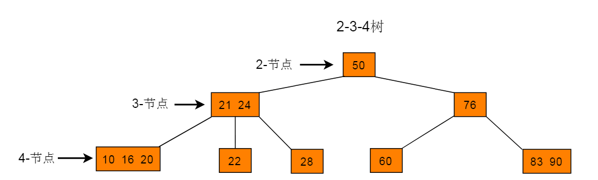

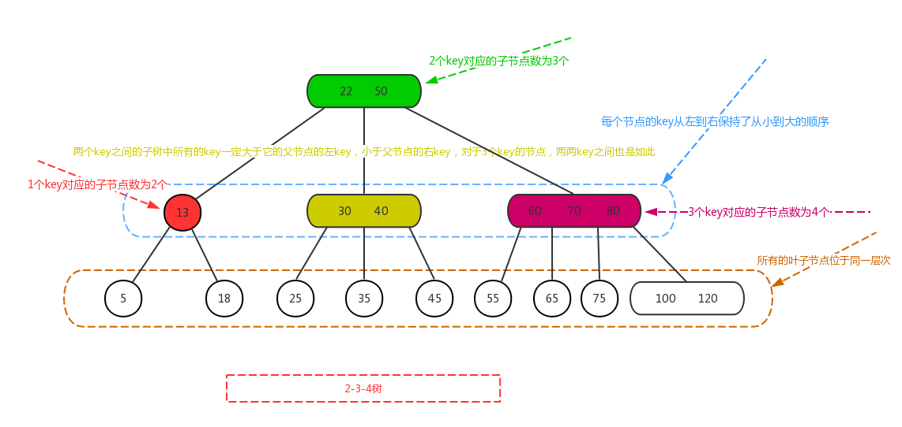

### 查找

2-3-4树的查找类似了二叉树的查找过程，通过键值的比较来决定遍历方向。

在下图所示树中查找key为22的节点。

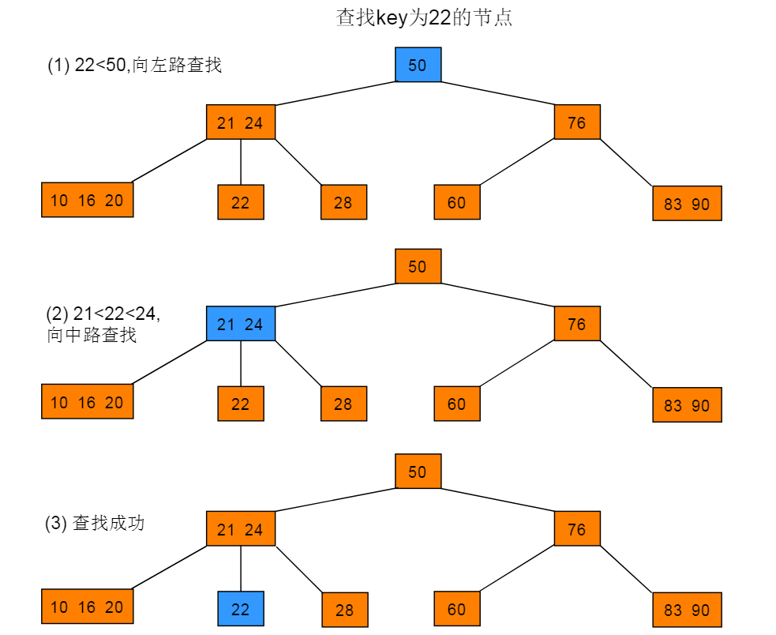

在下图所示树中查找key为15的节点。

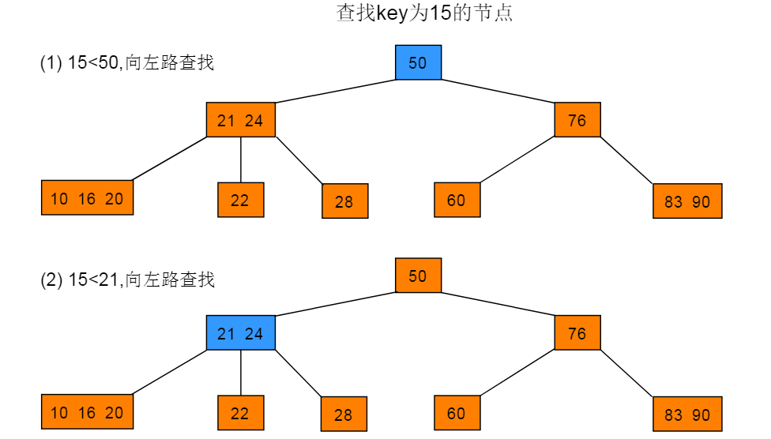
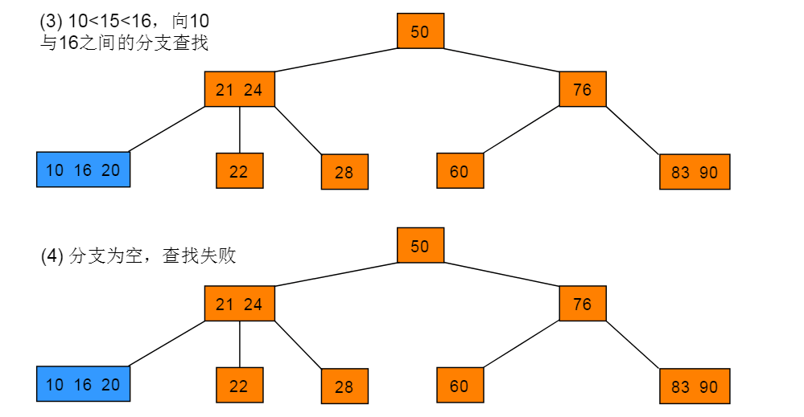

### 插入

2-3-4树插入节点跟删除节点的处理，实际上跟2-3树很像，特别是插入节点，基本上跟2-3树是一模一样，只是分裂的条件由2个key变成了3个key而已，即，

1. 如果待插入的节点不是3个key，则直接插入即可；
2. 如果待插入的节点有3个key，则对节点进行分裂，
即3个key加上待插入的key，这4个key分裂成1个key跟2个子节点，
然后将分裂之后的4个key中的父节点看作向上层插入的key，
然后重复1、2步骤，直到满足2-3-4树的定义性质。

如下图所示，插入“125”，而此时待插入节点有3个key，需要对节点进行分裂，

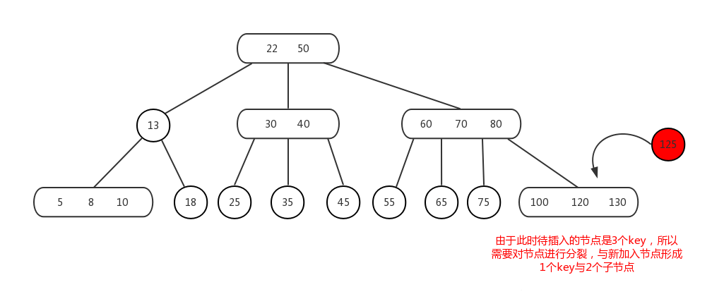

“100 125 130”节点分裂之后，如下图所示，分裂成父节点“120”与两个子节点“100”与“125 130”，此时将父节点“120”看作向上层插入的key，

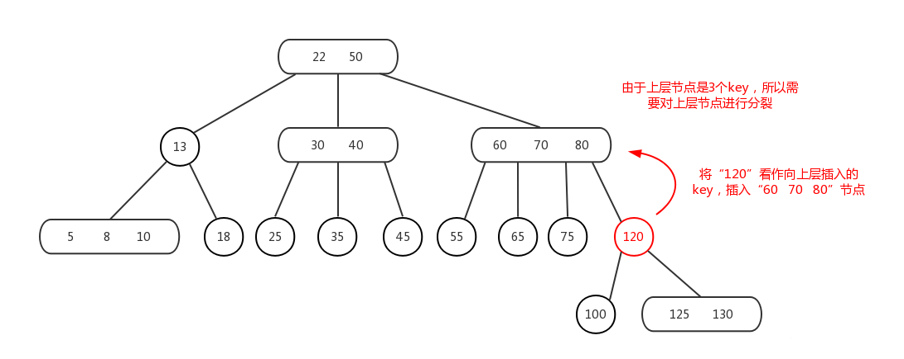

而又由于“120”的上层节点是“60 70 80”是3个key的节点，则需要对3个key节点进行分裂，如下图所示，分裂成父节点”70”与子节点“60”与“80 120”，

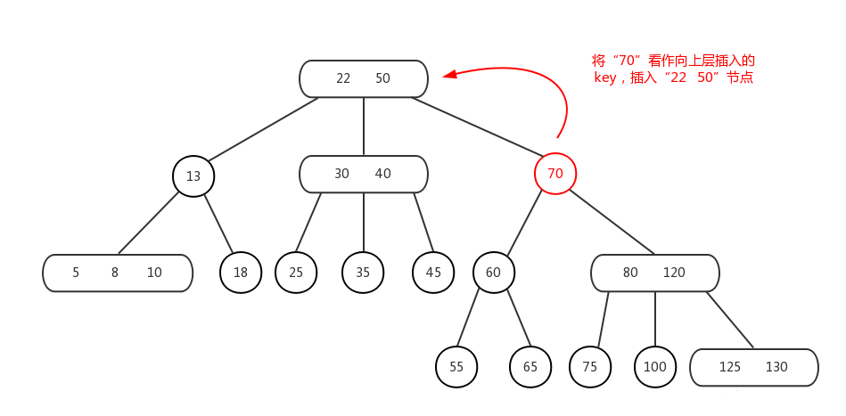

将父节点“70”看作向上层插入的key，此时上层节点“22 50”是2个key，则直接插入即可，结果如下图所示，此时满足2-3-4树，完成调整。

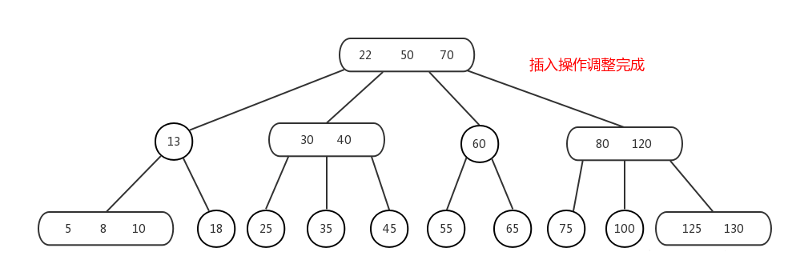

2-3-4树节点的插入就差不多这样了，也比较简单的，
其实从前面到这里可以看出一些规律，就是不管是二叉查找树也好，
平衡二叉树，以及2-3树的节点插入，相对来说都算简单，
但是对于一棵树节点的删除却比较复杂，
有的甚至需要不断的回溯到根节点才能把树调整平衡。

所以，关于2-3-4树节点的删除也不简单，至少比节点的插入要复杂麻烦的多，
但这里就讲个大概，类比2-3树节点删除去推就可以推出来，思路是一致的。

### 删除

2-3-4树节点的删除，首先，如果删除的key不存在，则删除失败。
类比2-3树总结也是两个判断：

1. 删除的是什么节点？
2. 删除了节点之后是否符合满足2-3-4树的性质？

2-3-4树有4种节点，1个key与非1个key的节点 和 是否为叶子节点 的组合，即：

1. 非1个key的叶子节点；
2. 仅1个key的叶子节点；3.非1个key的非叶子节点；4.仅1个key的非叶子节点。

###### 2-3-4节点删除操作：

* 当删除的节点是非1个key的叶子节点，则将要删除的目标key删除即可；
* 当删除的节点是非叶子节点，无论待删除节点的key是多少个，先使用中序遍历找到待删除节点的后继节点，然后将后继节点与待删除节点位置互换，此时就将问题转化为删除节点为叶子节点（平衡树的非叶子节点中序遍历后继节点肯定叶子节点），如果该叶子是非1个key，则跟情况（1）一样，如果该节点是只有1个key，则跟后面的情况（3）一样；
* 当删除的节点是1个key的叶子节点，则将节点删除，此时树肯定需要调整，即：

 1. 当父节点是1个key（即此时仅有一个兄弟节点），兄弟节点是非1个key，则将兄弟节点的一个key上移成父节点，而父节点下移成子节点，此时树满足2-3-4树，完成调整。
 2. 当父节点是1个key，兄弟节点也是1个key，则此时将父节点与兄弟节点合并，将合并后的节点看成当前节点，然后重复（3）的判断，即判断合并后的当前节点的兄弟节点与父节点的情况，然后走对应的a.b.c处理，直到满足2-3-4树，完成调整。
 3. 当父节点是非1个key，即此时有两个或三个兄弟节点，此时看相邻兄弟节点是否“丰满”，也即是否为3个key，如下，

    i. 若删除节点的相邻兄弟节点为非3个key，则父节点的一个key下移，与相邻兄弟节点合并，此时树满足2-3树，完成调整；
    
    ii. 若删除节点的相邻兄弟节点为3个key，则父节点的一个key下移成1个key的节点，相邻兄弟节点的一个key上移与父节点合并，此时树满足2-3树，完成调整；

下面画几个图演示一下吧，如下图所示，符合（3）中的 b 情况，
即对兄弟节点“18”与父节点“13”合并，

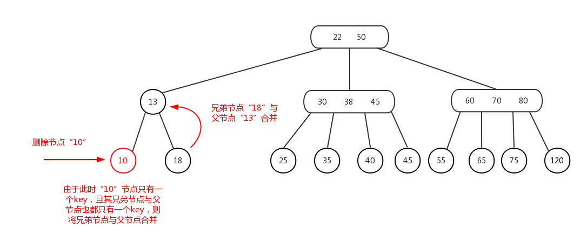

合并之后，如下图所示，此时符合（3）中 c 的 ii 情况，即对节点“22”做左旋操作（参考2-3树文章最后的备注部分），

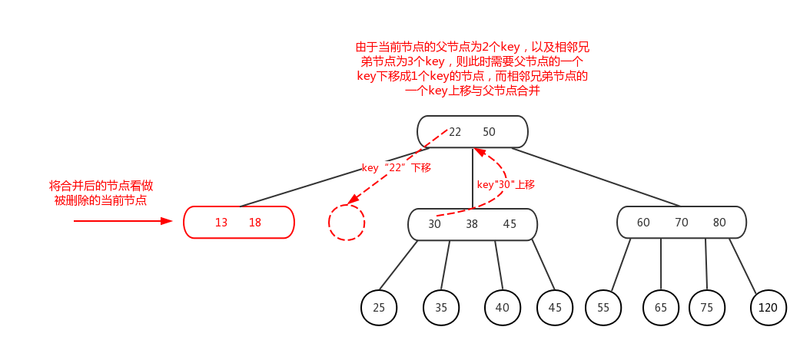

左旋结果如下图所示，此时2-3-4树调整完成。

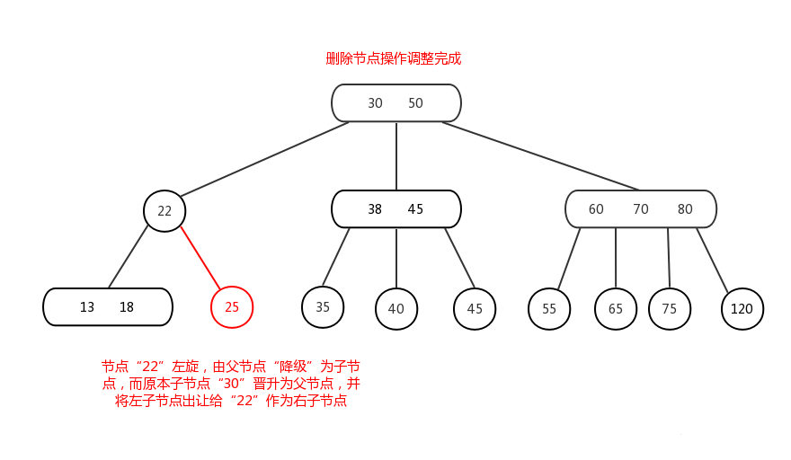

最后再重复一点，关于2-3-4树节点删除情况（3）中的 b ：
“将合并后的节点看成当前节点，然后重复（3）的判断，
即判断合并后的当前节点的兄弟节点与父节点的情况” 这句话，
由于此时合并后的当前节点，其兄弟节点，是带有子节点的，
所以此时重复（3）的判断之后，如果是 c 中的 i 或 ii 情况，
对于（兄弟）key的上移与（父）key的下移，对应的子节点是需要出让的，
即此时的变换，实际上为左旋或右旋，具体是左旋还是右旋，看对应的场景。
