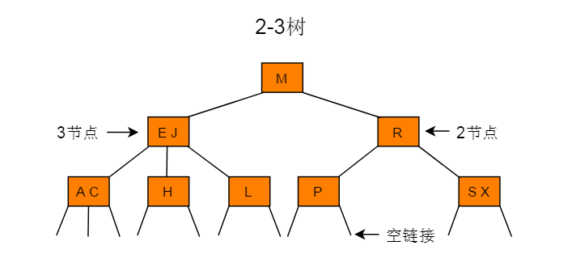
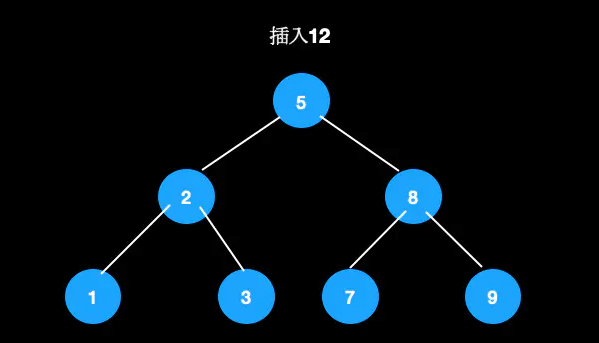
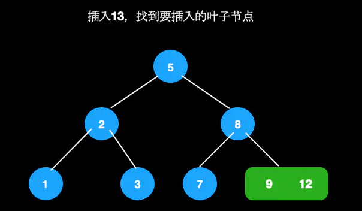
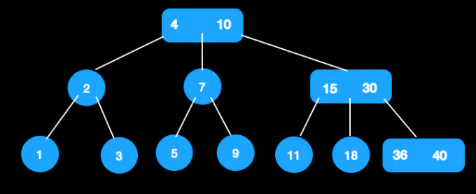
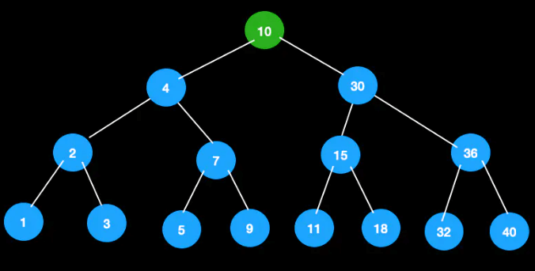
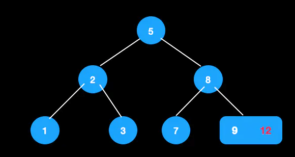
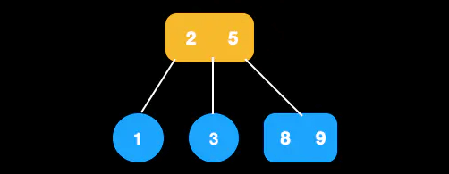
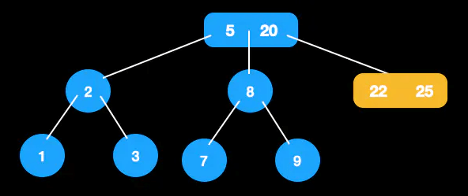

# 2-3 树

前面讲到了二叉搜索树(BST)和二叉平衡树(AVL)，二叉搜索树在最好的情况下搜索的时间复杂度为O(logn)，但如果插入节点时，插入元素序列本身就是有序的，那么BST树就退化成一个线性表了，搜索的时间复杂度为O(n)。

如果想要减少比较次数，就需要降低树的高度。在插入和删除节点时，要保证插入节点后不能使叶子节点之间的深度之差大于1，这样就能保证整棵树的深度最小，这就是AVL树解决BST搜索性能降低的策略。但由于每次插入或删除节点后，都可能会破坏AVL的平衡，而要动态保证AVL的平衡需要很多操作，这些操作会影响整个数据结构的性能，除非是在树的结构变化特别少的情形下，否则AVL树平衡带来的搜索性能提升有可能还不足为了平衡树所带来的性能损耗。

因此，引入了2-3树来提升效率。2-3树本质也是一种平衡搜索树，但2-3树已经不是一棵二叉树了，因为2-3树允许存在3-这种节点，3-节点中可以存放两个元素，并且可以有三个子节点。

### 定义

* 对于2-节点，和普通的BST节点一样，有一个数据域和两个子节点指针，两个子节点要么为空，要么也是一个2-3树，当前节点的数据的值要大于左子树中所有节点的数据，要小于右子树中所有节点的数据。
* 对于3-节点，有两个数据域a和b和和三个子节点指针，左子树中所有的节点数据要小于a，中子树中所有节点数据要大于a而小于b，右子树中所有节点数据要大于b。

下图所示的树为一棵2-3树，树中共有5个2-节点和3个3-节点。

### 性质

* 对于每一个结点有1或者2个关键码。
* 当节点有1个关键码的时，节点有2个子树。
* 当节点有2个关键码时，节点有3个子树。
* 所有叶子点都在树的同一层。

### 查找

2-3树的查找类似二叉搜索树的查找过程，根据键值的比较来决定查找的方向。

例如：在下图所示的2-3树中查找键为H的节点：

例如：在下图所示的2-3树中查找键为B的节点：

### 节点分裂与合并

在将插入之前，先介绍一下节点分裂与合并。

2-3树只能存在2节点和3节点，由于插入的时候会引入4节点，所以我们需要将其分裂。

#### 节点分裂

比如单个4节点，只需将中间节点往上提，左边值作为其左子树，右边值作为其右子树即可。

#### 节点合并

比如有父节点的4节点，节点分裂后，需与父节点进行合并。若合并后父节点还是4节点，则继续分裂，直至满足定义为止。下图中6与3合并后，满足条件，无需再进行操作。

### 插入

插入一个节点后，也要满足2-3树的定义。
我们需要找到一个适合的位置来插入新的值，但是和二叉树不同的是，
它不会生成新的叶子节点来存储，而是找到合适的叶子节点来进行合并。

但是注意，插入的原则是尽量保持树的高度，也就是尽量不要增加树的高度。
因为树的高度越小，查找效率会更高。

下面分几种情况来说明不同的处理情况。其关键字是往上分裂，从下往上生长。

#### 空树

生成新节点，则其为根节点。

#### 待插入节点为2节点

如果不能直接放到空的子节点，则放到父节点中，此时成为3节点，仍然满足定义。比如我们在这棵树中插入12。

首先找到待插入节点9。

节点9为2节点，可直接插入。

#### 待插入节点为3节点

这种情况下，稍微会复杂一些，因为涉及到分裂，且跟待插入节点的父节点有关。
假定待插入节点为p，待插入节点的父节点为pp。

将节点强插到p中，此时p中会有三个值，我们暂且称之为4节点。
4节点是不满足2-3树的定义的，因此需要将4节点中的某个节点往上抽离，
与pp进行合并。这时需要考虑pp的类型了。

###### 若pp为二节点

将分裂的节点放到pp中，则pp成为3节点，满足定义。比如我们在这棵树中插入13。

找到待插入叶子节点[9,12]

插入13，变成4节点

进行分裂，合并到父节点，插入完成

###### 若pp为三节点

将分裂的节点放到pp中，则pp成为了4节点，不满足定义，那么4-节点需要提出一个值，并向上合并，这时需要重新设置新旧节点的关系。往上合并的过程就是继续套用这几种情况。好的情况是往上的过程中遇到了2节点，且平衡，则结束；坏的情况是一直到根节点，并且根节点是3树，那么只好继续往上分裂出新的根节点，然后处理新节点与其他节点的关系，此时树高增加了1。

比如在这颗树中插入18。

插入18，找到叶子节点插入，成为4节点

向上分裂，将18插入父节点，变成4节点，需继续分裂

根节点成为3节点，插入结束

以上的插入，树的高度都没有变化。下面说一种树的高度会+1的情况。

比如在这棵树中插入32。

找到待插入的节点直接插入32

分裂节点，此时父节点变成4节点，还需分裂

此时根节点为4节点，需分裂

生成新的根节点，树的高度加1

### 删除

删除的情况会复杂一些，下面分几种情况来说。

#### 待删除的值在叶子节点

###### 叶子节点为3节点

直接删除即可。如下图12可直接删除。

删除后，3节点成2节点。

###### 叶子节点为2节点

这里需要区分临近兄弟节点的类型。先将节点删除。

* 兄弟节点为3节点

此时被删除后，节点会为空。通过向兄弟节点借一个最近的键值，然后再调整该节点与父节点的值。

比如在这颗树中删除7。

向兄弟节点借最近节点，此时大小关系不满足

调整大小，8，9交换，满足定义

* 兄弟节点为2节点，这时需要判断父节点类型

**父节点为3节点**，此时兄弟节点不够借，父节点降元，从3节点变成2节点，与兄弟节点合并。

比如从这棵树中删除36。

30与18合并，3节点变成2节点，删除完成

**父节点为2节点**，将父节点和兄弟节点合并，形成新的节点，这是把新节点当做当前节点，不断套用上述几种情况进行调整，直至平衡。
这种情况下，若根节点是2节点，树的高度会减1。

从这颗树中删除12

兄弟节点和父节点都为2节点，进行合并。此时新节点为[8,9]。

当前节点([8,9])的父节点和兄弟节点都为2节点，还需进行合并（即节点2,5合并）合并完成如下图。

从这棵树中删除30

节点30的父节点和兄弟节点为2节点，进行合并，此时[22,25]为新节点。

把[22,25]看作当前节点，由于其兄弟节点为2节点，
父节点为3节点，父节点降元，调整完成。

#### 待删除的值在父节点

将该节点与其前驱或后继节点交换，然后删除交换后的叶子节点，此时转换成上一种情况的处理。

使用中序遍历的顺序，前驱就是指其前一个节点，后继是指其后面的一个节点。最直接的定位如下：

* 前驱节点：该节点左子树最右节点
* 后继节点：该节点右子树最左节点

比如下图，5的前驱是3，后继是7。

**那为什么要用前驱/后继节点交换呢？**

因为，用前驱/后继节点交换后，才能保持大小顺序。
后继节点是右子树中最小的节点，与父节点交换后，排除待删除的叶节点，
仍保持左子树<新父节点<右子树的关系。
同理，前驱节点是左子树中最大的节点，交换后，仍能保持。

这里我们使用**后继节点**来进行替换。

从这颗树中删除节点5。

由于5的后继节点是7，先将值进行交换。
这时候目的就是删除叶子节点5，于是可以转换成**其父节点和兄弟节点都为2节点**的情况进行调整。

### 总结
* 先找插入结点，若结点有空(即2-结点)，则直接插入。如结点没空(即3-结点)，
则插入使其临时容纳这个元素，然后分裂此结点，把中间元素移到其父结点中。对父结点亦如此处理。
（中键一直往上移，直到找到空位，在此过程中没有空位就先搞个临时的，再分裂。）

* 2-3树插入算法的根本在于这些变换都是局部的：
除了相关的结点和链接之外不必修改或者检查树的其他部分。每次变换中，
变更的链接数量不会超过一个很小的常数。所有局部变换都不会影响整棵树的有序性和平衡性。

* 同时，通过上面树的深度增加的例子，可以看出2-3树和标准二叉树不同，
标准的二叉树的的深度是由上到下的增加的，而2-3树的深度生长是由下至上的。
