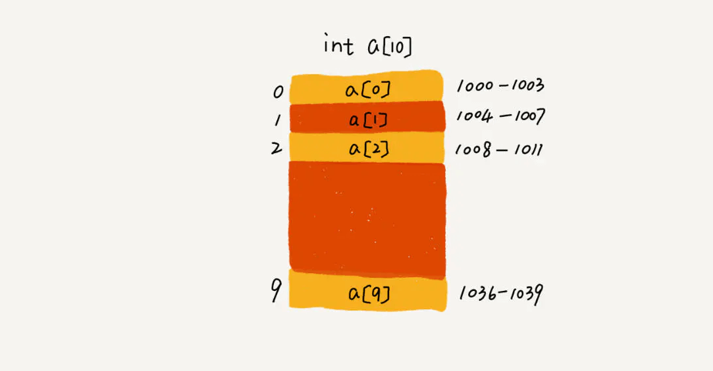

# 数组(array)
数组是数据结构中很基本的结构，很多编程语言都内置数组。

在Java中当创建数组时会在内存中划分出**一块连续的内存**，
然后当有数据进入的时候会将数据按顺序的存储在这块连续的内存中。
当需要读取数组中的数据时，需要提供数组中的索引，然后数组根据索引将内存中的数据取出来，
返回给读取程序。

在Java中并不是所有的数据都能存储到数组中，只有相同类型的数据才可以一起存储到数组中。

在Java语言中，数组是对象（An object is a class instance or an array.），
而且是动态创建的。数组超类是Objcet，可以在数组上调用Object类的所有方法。
每个数组都有一个关联的Class对象，与具有相同组成类型的所有其他数组共享

虽然数组类型不是一个class，但每个数组的Class对象的行为如下：

* 每个数组类型的直接超类都是Object。
* 每个数组类型都实现了Cloneable和java.io.Serializable接口。

数组在java里是一种特殊类型，既不是基本数据类型（开玩笑，当然不是）也不是引用数据类型。
有别于普通的“类的实例”对象，java里数组不是类，所以也就没有对应的class文件，数组类型是由jvm从元素类型合成出来的；在jvm中获取数组的长度是用arraylength这个专门的字节码指令的；
在数组的对象头里有一个_length字段，记录数组长度，只需要去读_length字段就可以了。

##### 所有的数据结构都支持几个基本操作：读取、插入、删除。

因为数组在存储数据时是按顺序存储的，存储数据的内存也是连续的，
所以他的特点就是寻址读取数据比较容易，插入和删除比较困难。

##### 简单解释一下为什么

在读取数据时，只需要告诉数组要从哪个位置（索引）取数据就可以了，
数组会直接把你想要的位置的数据取出来给你。
插入和删除比较困难是因为这些存储数据的内存是连续的，
要插入和删除就需要变更整个数组中的数据的位置。

##### 举个例子：

一个数组中编号0->1->2->3->4这五个内存地址中都存了数组的数据，
但现在你需要往4中插入一个数据，那就代表着从4开始，
后面的所有内存中的数据都要往后移一个位置。这可是很耗时的。

    数组是线性表，就是数据排成像一条直线一样的结构，除了数组，链表，队列，栈都是线性结构
    而非线性表就是二叉树，堆，图等，数据之间不是简单的先后关系。

##### 数组和链表的区别？

我们时常会回答：链表适合插入，删除，时间复杂度为O(1);
数组适合查找，查找时间复杂度是O(1)

实际上，这种表达是不准确的，数组是适合查找，但是查找的时间复杂度并不是O(1).
即便是排好序的数组，用二分查找，时间复杂度也是O(logn)。
所以，正确的表述是，数组支持随机访问，根据下表随机访问的时间复杂度是O(1)

##### 为什么数组插入会很低效？

你插入一个元素，其他元素就要往后面排，最坏的情况是O(N)，
因为我们在每个位置插入元素的概率是一样，
所以平均情况时间复杂度是（1+2+。。。n）/n = O(n)

如果数组中的数据是有序的，我们在某一位置插入一个新的元素，
就必须按照刚才的方法搬移后面的数据，
但是，若数组没有任何规律，如果要插入到第k个位置，为了避免大规模搬移，
还有一个简单的就是直接将第k位数据搬移到数组元素的最后，把新的元素直接放入第k个位置。

那删除操作呢？

和插入数据类似，内存因为是连续的,也需要搬移，若删除数组末尾数据，就是O(1)，
删除开头就是O(n)，平均也是O(n)。

##### 为什么大多数语言数组都是0开头？而不是1开头呢？

从数组存储的内存模型上来看，“下标”最确切的定义应该是“偏移(offset)”,
如果用a来表示数组的首地址，
a[0]就是偏移为0的位置，也就是首地址，a[k]就表示偏移k个type_size的位置，
所以计算a[k]的内存地址只需要a[k]_address = base_address + k * type_size
若是数组从1开始计数，
那么我们计算数组元素a[k]的内存地址就是
a[k]_address = base_address + (k-1) * type_size

从1开始编号，每次随机访问数组元素都多了一次减法运算，
对于cpu来说，就是多了一次减法指令。

##### 一个Characters数组不是一个String
在Java语言中，一个char数组并不是一个String，并且String和char数组都不会被'\ u0000'（NUL字符）终止。

String对象是不可变的，它的内容永远不变，而char数组有可变元素。

String类中的toCharArray方法返回一个包含与String相同字符序列的字符数组。StringBuffer类在可变字符数组上实现有用的方法。

##### 为什么数组有length属性，而字符串没有？或者，为什么字符串有length()方法，而数组没有？

一旦数组被创建，他的长度就是固定的了。
数组的长度可以作为final实例变量的长度。
因此，长度可以被视为一个数组的属性。

String背后的数据结构是一个char数组,
所以没有必要来定义一个不必要的属性（因为该属性在char数值中已经提供了）。

##### 对象数组和基本类型数组
对象数组和基本类型数组在使用上几乎是相同的，
唯一的区别就是对象数组保存的是引用，基本类型数组直接保存基本类型的值。

多维数组中构成矩阵的每个向量都可以具有任意的长度（这被称为粗糙数组）。

##### 数组与其他种类的容器
数组与其他种类的容器之间的区别有三方面：效率、类型和保存基本类型的能力。

在Java中，数组是一种效率最高的存储和随机访问对象引用序列的方式。

数组是一个简单的线性序列，这使得元素访问非常快速。
付出的代价是数组对象的大小被固定，并且在其生命周期中不可改变。
数组之所以优于泛型之前的同期，就是因为可以创建一个数组去持有某种具体类型。

在泛型之前，其他的容器在处理对象时，都将他们视为没有任何具体类型，即将这些对象当做Java中根类的根类Object处理。
有了泛型后，容器可以指定并检查它们所持有对象的类型，并且有了自动包装机制，容器看起来还能够持有基本类型。
随着自动包装机制的出现，容器已经可以与数组几乎一样方便的用于基本类型中了。

**数组硕果仅存的优点就是效率** 。
然而，如果要解决更一般化的问题，数组可能会受到过多的限制，因此在这些情形下还是会使用容器。

##### 容器能否完全替代数组？

针对数组类型，很多语言都提供了容器类，比如 Java 中的 ArrayList、C++ STL 中的 vector。
在项目开发中，什么时候适合用数组，什么时候适合用容器呢？

* 这里我拿 Java 语言来举例。如果你是 Java 工程师，
几乎天天都在用 ArrayList，对它应该非常熟悉。
那它与数组相比，到底有哪些优势呢？

* 我个人觉得，ArrayList 最大的优势就是可以将很多数组操作的细节封装起来。
比如前面提到的数组插入、删除数据时需要搬移其他数据等。
另外，它还有一个优势，就是支持动态扩容。

* 数组本身在定义的时候需要预先指定大小，因为需要分配连续的内存空间。
如果我们申请了大小为 10 的数组，当第 11 个数据需要存储到数组中时，
我们就需要重新分配一块更大的空间，将原来的数据复制过去，
然后再将新的数据插入。

* 如果使用 ArrayList，我们就完全不需要关心底层的扩容逻辑，
ArrayList 已经帮我们实现好了。每次存储空间不够的时候，
它都会将空间自动扩容为 1.5 倍大小。

* 不过，这里需要注意一点，因为扩容操作涉及内存申请和数据搬移，
是比较耗时的。所以，如果事先能确定需要存储的数据大小，
最好在创建 ArrayList 的时候事先指定数据大小。

##### 有些时候，用数组会更合适些，我总结了几点自己的经验。

* Java ArrayList 无法存储基本类型，比如 int、long，
需要封装为 Integer、Long 类，
而 Autoboxing、Unboxing 则有一定的性能消耗，
所以如果特别关注性能，或者希望使用基本类型，就可以选用数组。

* 如果数据大小事先已知，并且对数据的操作非常简单，
用不到 ArrayList 提供的大部分方法，也可以直接使用数组。

* 还有一个是我个人的喜好，当要表示多维数组时，
用数组往往会更加直观。比如 Object[][] array；
而用容器的话则需要这样定义：ArrayList<ArrayList > array。

##### 数组的算法实现

* [冒泡排序](../Chapter03/BubbleSort.md)
* [直接选择排序](../Chapter03/SelectionSort.md)

##### 栈内存
在方法中定义的一些基本类型的变量和对象的引用变量都在方法的栈内存中分配，
当在一段代码中定义一个变量时，java就在栈内存中为这个变量分配内存空间，
当超出变量的作用域后，java会自动释放掉为该变量所分配的内存空间。

##### 堆内存
堆内存用来存放由new运算符创建的对象和数组，在堆中分配的内存，
由java虚拟机的自动垃圾回收器来管理。

在堆中创建了一个数组或对象后，同时还在栈内存中定义一个特殊的变量。
让栈内存中的这个变量的取值等于数组或者对象在堆内存中的首地址，
栈中的这个变量就成了数组或对象的引用变量，
引用变量实际上保存的是数组或对象在堆内存中的地址（也称为对象的句柄），
以后就可以在程序中使用栈的引用变量来访问堆中的数组或对象。

##### 与结构或类中的字段的区别
数组中的所有元素都具有相同类型(这一点和结构或类中的字段不同，它们可以是不同类型)。
数组中的元素存储在一个连续性的内存块中，
并通过索引来访问(这一点也和结构和类中的字段不同，它们通过名称来访问)。

##### 面试中关于数组的常见问题

* 寻找数组中第二小的元素

    第一种：先排序然后找出第一个大于array[0]的数
    第二种：定义两个变量分别代表第一小和第二小的数,以此和数组的数进行比较
    第三种：用小顶堆，但是这个比较适合找出数组中第n小的数
    
* 找到数组中第一个不重复出现的整数

   * 第一种：计数排序法，把数组出现的次数放到另一个数组中，然后找出全部出现一次的数字和原始数组嵌套遍历，原始数组最先出现在新数组的即为第一个。
   * 第二种：双循环：内循环中一个也没重复的即为第一个，即刻停止，时间复杂度是O(N^2)
   * 第三种：借助有序哈希表。每一个数字作为key，出现的次数为value，这个算法的时间复杂度是O(n)
    
* 合并两个有序数组
    
> 第一种：混合插入有序数组，由于两个数组都是有序的，所以只要按顺序比较大小即可。
    
* 将数组里的正数排在数组的后面，正数排在数组的后面。但不改变原先正数和正数的排列次序。

    
    例：input: -5，2，-3, 4，-8，-9, 1, 3，-10；output: -5, -3, -8, -9, -10, 2, 4, 1, 3。

