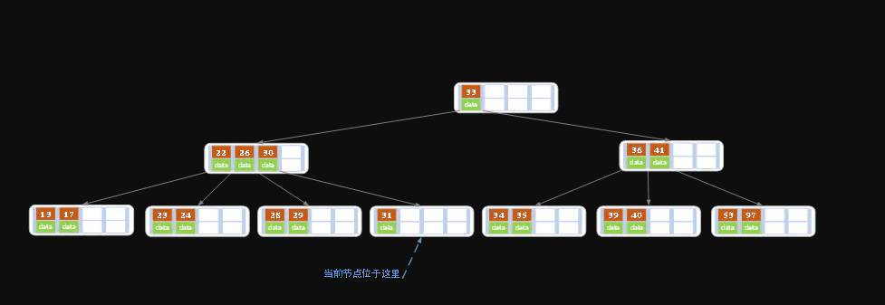

# B 树

网上有些博客说B树和B-树是两种树，这是纯属扯淡。

B树也叫平衡多叉查找树

### 定义
B 树可以看作是对2-3查找树的一种扩展，一棵N阶的B树 (N叉树)的特性如下：

* B树中所有节点的孩子节点数中的最大值称为B树的阶，记为N（重点）
* 树中的每个节点至多有N棵子树 ---即：如果定了N，则这个B树中任何节点的子节点数量都不能超过N
* 若根节点不是终端节点，则至少有两棵子树
* 除根节点和叶节点外，所有点至少有m/2棵子树（上溢）
* 所有的叶子结点都位于同一层。

下图是一个N=4 阶的B树:


可以看到B树是2-3树的一种扩展，他允许一个节点有多于2个的元素。

B树的插入及平衡化操作和2-3树很相似，这里就不介绍了。下面动画演示往B树中依次插入如下数据

    6 10 4 14 5 11 15 3 2 12 1 7 8 8 6 3 6 21 5 15 15 6 32 23 45 65 7 8 6 5 4
    


### 为什么我们要引入B树呢？有二叉树不是很好吗？

存在即合理。所以还是有存在的理由的。
B树的时间复杂度与二叉树一样，均为O(logN)。
然而**Ｂ树出现是因为磁盘ＩＯ。ＩＯ操作的效率很低，
那么，当在大量数据存储中，
查询时我们不能一下子将所有数据加载到内存中，只能逐一加载磁盘页，
每个磁盘页对应树的节点。
造成大量磁盘ＩＯ操作（最坏情况下为树的高度）。
平衡二叉树由于树深度过大而造成磁盘IO读写过于频繁，
进而导致效率低下。**

所以，我们为了减少磁盘ＩＯ的次数，就你必须降低树的深度，将“瘦高”的树变得“矮胖”。

PS：这里我找到了一个讲述很好的二叉树与B树的比较链接。大家可以阅读以下。

http://m.elecfans.com/article/662237.html

### B树的查找操作

查找操作的理解不难。我直接用几张图来阐述一下。

在B树上进行查找和二叉树的查找很相似，二叉树是每个节点上有一个关键子和两个分支。B树上每个节点有K个关键字和K+1个分支。二叉树的查找只考虑向左还是向右走，而B树中需要由多个分支决定。

B树的查找分两步，首先查找节点，由于B树通常是在磁盘上存储的所以这步需要进行磁盘IO操作。第二步是查找关键字，当找到某个节点后将该节点读入内存中然后通过顺序或者折半查找来查找关键字。若没有找到关键字，则需要判断大小来找到合适的分支继续查找。

###### 如下有一个3阶的B树，观察查找元素21的过程：


第一次磁盘IO：


第二次磁盘IO：


这里有一次内存比对：分别跟3与12比对。

第三次磁盘IO:


这里有一次内存比对，分别跟14与21比对

由于B树相对于二叉树来说矮胖了许多，
所以它所涉及的IO操作也相对少了许多。不过根据我们上面的分析，
其在查找数据的时候并没有减少比较次数。
但是我们知道，我们在比较数据的时候是在内存中进行的，
所以相对来说时间上会更加迅速，几乎可以忽略。

而相同数量的key在B树中生成的节点要远远少于二叉树中的节点，
相差的节点数量就等同于磁盘IO的次数。
这样到达一定数量后，性能的差异就显现出来了。

    这里先放下一个问题，既然我的介数M是自行设定的。那么我们的M如果很小那么会变成类似于二叉树，那么当M很大的时候呢？
    
    我认为当M很大会导致比较次数过多，在当前磁盘空间能容纳的范围下也有可能导致比较次数过多而导致效率降低的情况。


#### 代码实现

首先是 关键字的实现

```java
/**
     * 
     * 私有内部类 代表关键字以及数据域
     */
    class Entry<K, V> {

        private K key;
        private V value;

        public void setKey(K key) {
            this.key = key;
        }

        public K getKey() {
            return this.key;
        }

        public void setValue(V value) {
            this.value = value;
        }

        public V getValue() {
            return this.value;
        }
        public Entry(K key, V value) {
            this.key = key;
            this.value = value;
        }

        public Entry() {
        }
        @Override
        public String toString() {
            return "key: " + this.key + " , ";
        }

    }
```


返回值的封装实现

```java
  class SearchResult<V> {
        private boolean isExist;
        private V value;
        private int index; //索引

        //构造方法，将查询结果封装入对象
        public SearchResult(boolean isExist, int index, V value) {
            this.isExist = isExist;
            this.index = index;
            this.value = value;
        }

        public boolean isExist() {
            return isExist;
        }

        public V getValue() {
            return value;
        }

        public int getIndex() {
            return index;
        }
    }

```

节点的代码实现

```java
/**
     * description: 节点列表
     * @params entries关键字列表  children儿子节点列表 索引为2的关键字的左子树为2右子树为2+1
     */
    class Node<K,V> {

        //关键字列表
        private List<Entry<K,V>> entries;
        //子树列表
        private List<Node<K, V>> children;
        //是否为叶子节点
        private boolean leaf;
        //键值比较函数对象，如果采用倒序或者其它排序方式，传入该对象
        private Comparator<K> kComparator;
        //比较两个key，如果没有传入自定义排序方式则采用默认的升序
        /**
         * description: 默认情况下是返回key2.comPareto(key1)也就是key2>key1 返回大于0的值 == 等于0 <小于0
         */
        public int compare(K key1, K key2) {

            return this.kComparator == null ? ((Comparable<K>) key2).compareTo(key1) : kComparator.compare(key1, key2);
        }
        Node() {
            this.entries = new LinkedList<Entry<K, V>>();
            this.children = new LinkedList<Node<K, V>>();
            this.leaf = false;
        }
        Node(Comparator<K> kComparator) {
            this();
            this.kComparator = kComparator;
        }
        //返回本节点的关键字字数
        public int nodeSize() {
            return this.entries.size();
        }

        public List<Entry<K, V>> getEntries() {
            return entries;
        }

        public void setEntries(List<Entry<K, V>> entries) {
            this.entries = entries;
        }

        public List<Node<K, V>> getChildren() {
            return children;
        }

        public void setChildren(List<Node<K, V>> children) {
            this.children = children;
        }

        public boolean isLeaf() {
            return leaf;
        }

        public void setLeaf(boolean leaf) {
            this.leaf = leaf;
        }

        public Comparator<K> getkComparator() {
            return kComparator;
        }

        public void setkComparator(Comparator<K> kComparator) {
            this.kComparator = kComparator;
        }

        /**

         * description: 查找当前节点有没有这个key本质上就是一个二分搜索 index是给插入关键字用的判断是要插入到mid的哪个位置
         * 关于返回值的index要明白 索引为0的关键字的左子树为0 右子树为0+1 经过推断可以一直延续下去
         * 所以如果没找到key就会返回合适的子树索引
         * 索引可以直接使用 如果是叶子节点
         * @params [key]
         * @return BTreeNode<K, V>.SearchResult<V>
         */
        public SearchResult<V> search(K key){
            int left = 0; //左指针
            int right = this.nodeSize()-1;//右指针
            V res = null;//返回值
            int mid = (left+right)/2;//中间的位置
            boolean isExist = false; //判断是否找到了
            int index = 0; //要找的关键字的下标
            while(left<right){
                mid = (left+right)/2;//中间的位置
                Entry<K,V> midEntry = this.entries.get(mid);//拿到中间的关键字
                int comparator = this.compare(key,midEntry.getKey());
                if(comparator == 0){//找到了
                    break;
                }else {
                    if(comparator==1){//midKey大于key 在左侧
                        right = mid-1;
                    }else{//在右侧
                        left = mid+1;
                    }
                }
            }
            //二分查找结束了
            if(left<right){ //证明查找是被提前结束的 所以就是找到了
                isExist = true;
                index = mid;
                res = this.entries.get(mid).getValue();
            }else{
                if(left == right){
                    K midKey = this.entries.get(left).getKey();//虽然没有找到key但是找到了离key最近的一个关键字
                    int comRe = compare(midKey, key); //判断key和关键字哪个大
                    if(comRe == 0){//找到了
                        isExist = true;
                        index = mid;
                        res = this.entries.get(mid).getValue();
                    }else{
                        if(comRe>0){ //key大 那么就是关键字的右子树
                            isExist = false;
                            index = left + 1;
                            res = null;
                        }else { //key小 返回当前left的左子树
                            isExist = false;
                            index = left ;
                            res = null;
                        }
                    }
                }else {//走到这里也是因为right<left 意思就是 要查找的key比left要小所以返回left关键字的左子树
                    isExist = false;
                    index = left;
                    res = null;
                }
            }
            return new SearchResult<V>(isExist, index, res);
        }

        //删除给定索引位置的项
        public Entry<K, V> removeEntry(int index) {
            Entry<K, V> re = this.entries.get(index);
            this.entries.remove(index);
            return re;
        }

        //得到index处的项
        public Entry<K, V> entryAt(int index) {
            return this.entries.get(index);
        }
        //将新项插入指定位置 这里设置成private封装
        // 会使用到这里只有两种情况一个是叶子节点的插入关键字以及确定好了位置
        //节点分裂但是也已经确定好了位置
        private void insertEntry(Entry<K, V> entry, int index) {
            this.entries.add(index, entry);
        }
        //将新关键字插入 如果存在相同的关键字key不允许插入
        public boolean insertEntry(Entry<K,V> entry){
            SearchResult<V> result = search(entry.getKey()); //这里会返回适合的节点
            if (result.isExist()) { //如果有了相同的key就不然插入
                return false;
            } else {
                insertEntry(entry, result.getIndex());
                return true;
            }
        }
        //更新项，如果项存在，更新其值并返回原值，否则直接插入
        public V putEntry(Entry<K, V> entry) {
            SearchResult<V> re = search(entry.getKey());
            if (re.isExist) {
                Entry oldEntry = this.entries.get(re.getIndex());
                V oldValue = (V) oldEntry.getValue();
                oldEntry.setValue(entry.getValue());
                return oldValue;
            } else {
                insertEntry(entry);
                return null;
            }
        }
        //获得指定索引的子节点
        public Node childAt(int index) {
            return this.children.get(index);
        }

        //删除给定索引的子节点
        public void removeChild(int index) {
            this.children.remove(index);
        }

        //将新的子节点插入到指定位置
        public void insertChild(Node<K, V> child, int index) {
            this.children.add(index, child);
        }
    }
```

上面最关键的方法是SearchResult

作用是： 查找在某个节点查找传入关键字

有可能会面临的情况

1. left<right 循环被提前结束找到了就没什么好说了直接返回
2. left==right，如果left下标的关键字大于要找的关键字那么就返回 left作为索引，如果是小于要找的关键字就返回 left+1作为索引
3. left>right 要查找的key比left要小所以返回left作为索引
4. 关于没有找到的情况下那个索引是指向子树的，比如用下图做例子0012关键字的索引是1他的左子树的索引是就是这个关键字的索引 右子树的索引就是关键字索引加1


```java
public class BTreeNode<K,V> {

    //默认是5阶树
    private Integer DEFAULT_T = 5;
    //根节点
    private Node<K, V> root;

    private int m = DEFAULT_T;
    //非根节点的最小项数，体现的是除了根节点，其余节点都是分裂而来的！

    //这里体现了除根节点和叶子节点外每个节点的最小儿子数量
    private int nodeMinSize = m/2;

    //节点的最大儿子数 
    private int nodeMaxSize = m;
    //节点的最大关键字数
    private int keyMaxSize = m-1;
    //节点的最小关键字数
    private int keyMinSize = m/2;
    //比较函数对象
    private Comparator<K> kComparator;
    //查找

    public BTreeNode(Integer DEFAULT_T) {
        this.root = new Node<>();
        this.root.setLeaf(true);
        m = DEFAULT_T;
        nodeMinSize = m/2;
        nodeMaxSize = m;
        keyMaxSize = m-1;
        keyMinSize = m/2;
        this.DEFAULT_T = DEFAULT_T;
    }
}
```


### B树的插入

对高度为ｋ的m阶B树，新结点一般是插在叶子层。通过检索可以确定关键码应插入的结点位置。然后分两种情况讨论：
1.  若该结点中关键码个数小于m-1，则直接插入即可。
2. 若该结点中关键码个数等于m-1，则将引起结点的分裂。以中间关键码为界将结点一分为二，产生一个新结点，并把中间关键码插入到父结点(ｋ-1层)中重复上述工作，最坏情况一直分裂到根结点，建立一个新的根结点，整个B树增加一层。

例如：在下面的B树中插入key：4


第一步：检索key插入的节点位置如上图所示，在3,5之间；

第二步：判断节点中的关键码个数：节点3，5已经是两元素节点，无法再增加（已经 = 3-1）。父亲节点 2， 6 也是两元素节点，也无法再增加。根节点9是单元素节点，可以升级为两元素节点。；

第三步：结点分裂：拆分节点3，5与节点2，6，让根节点9升级为两元素节点4，9。节点6独立为根节点的第二个孩子。

最终结果如下图：虽然插入比较麻烦，但是这也能确保Ｂ树是一个自平衡的树。


另一个例子：


当插入一个关键字60后,节点内的关键字个数超过出了m-1=2，此时必须进行节点分裂，分裂的过程如上图所示。

### B树的删除

B树的删除操作相对较为复杂，

1. 首先，根据key删除记录，如果B树中的记录中不存对应key的记录，则删除失败。

2. 之后我们需要分一下四种情况来考虑。
（下面的例子中以5阶B树为例，介绍B树的删除操作，5阶B树中，
结点最多有4个key,最少有2个key）对于删除key的过程来说，
对于叶结点和非叶结点其实差别在一个地方，
那就是如果当前我们操作的是非叶结点，
那么后继key（这里的后继key指最接近当前删除值，且大于当前删除值的值）覆盖要删除的key，
然后在后继key所在的子支中删除该后继key。

* 原始状态


在上述情况下接着删除27。从上图可知27位于非叶子结点中，所以用27的后继替换它。
从图中可以看出，27的后继为28，我们用28替换27，然后在28（原27）的右孩子结点中删除28。

删除后的结果如下图所示。


* 之后我们就把非叶结点的情况转换为了处理叶结点的情况。

此时我们就要分一下几种情况来考虑如何处理叶结点。

   ① 该结点key个数>=Ceil(m/2)-1（上界，例如m=5，那么最后为2），结束删除操作，否则执行下一步。
   
   ② 该结点key的个数<Ceil(m/2)-1，且兄弟结点key个数>Ceil(m/2)-1，则父结点中的key下移到该结点，兄弟结点中的一个key上移，删除操作结束。

紧接上面的例子。


删除后发现，当前叶子结点的记录的个数小于2（<Ceil(m/2)-1），而它的兄弟结点中有3个记录（>Ceil(m/2)-1 当前结点还有一个右兄弟，
选择右兄弟就会出现合并结点的情况，不论选哪一个都行，只是最后B树的形态会不一样而已），
我们可以从兄弟结点中借取一个key。
所以父结点中的28下移，兄弟结点中的26上移，删除结束。

结果如下图所示。


   ③ 如果该结点key的个数<Ceil(m/2)-1，且兄弟结点key个数<=Ceil(m/2)-1，那么将父结点中的key下移与当前结点及它的兄弟结点中的key合并，形成一个新的结点。原父结点中的key的两个孩子指针就变成了一个孩子指针，指向这个新结点。

* 原图为


在上述情况下删除32。



当删除后，当前结点中只有一个key（个数<Ceil(m/2)-1），而兄弟结点中也仅有2个key（<=Ceil(m/2)-1）。
所以只能让父结点中的30下移和这个两个孩子结点中的key合并，成为一个新的结点，当前结点的指针指向父结点。

结果如下图所示。


由于我们移动了父结点中的数据，所以其key值减少，那么我们就要对当前父结点进行考虑。

* 下面看一个考虑父结点的例子


上述情况下，我们接着删除key为40的记录，删除后结果如下图所示。


同理，当前结点的记录数小于2（根据情况③），
兄弟结点中没有多余key，所以父结点中的key下移，
和兄弟（这里我们选择左兄弟，选择右兄弟也可以）结点合并，
合并后的指向当前结点的指针就指向了父结点。


同理，对于当前结点而言只能继续合并了，最后结果如下所示。（根据情况③）


合并后结点当前结点满足条件，删除结束。


#### B-Tree与二叉查找树的对比

我们知道二叉查找树查询的时间复杂度是O（logN），
查找速度最快和比较次数最少，既然性能已经如此优秀，但为什么实现索引是使用B-Tree而不是二叉查找树，关键因素是磁盘IO的次数。

数据库索引是存储在磁盘上，当表中的数据量比较大时，索引的大小也跟着增长，达到几个G甚至更多。
当我们利用索引进行查询的时候，不可能把索引全部加载到内存中，只能逐一加载每个磁盘页，这里的磁盘页就对应索引树的节点。

###### 二叉树

我们先来看二叉树查找时磁盘IO的次：定义一个树高为4的二叉树，查找值为10：
