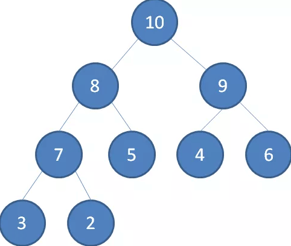
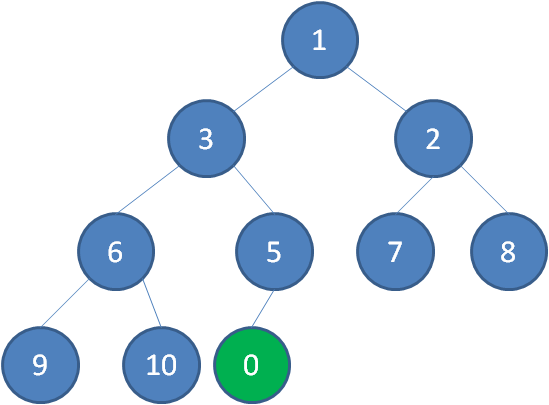
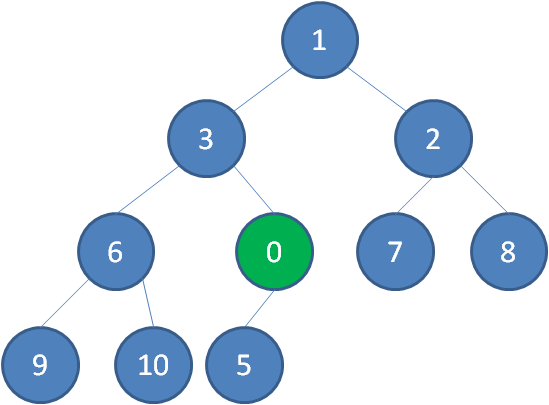
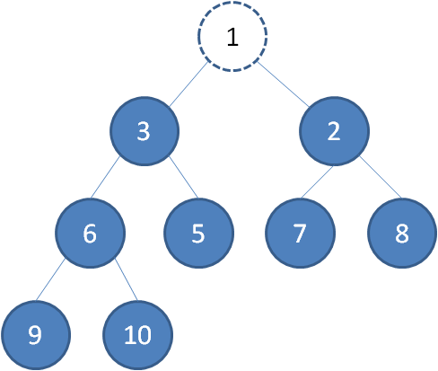
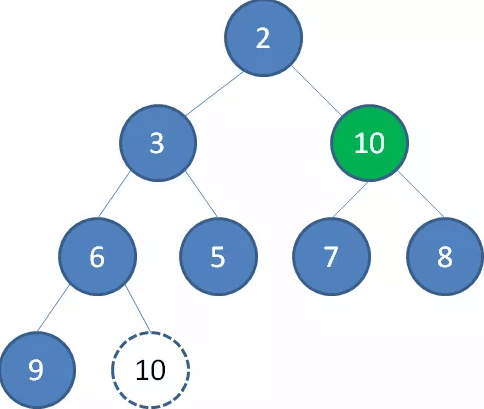
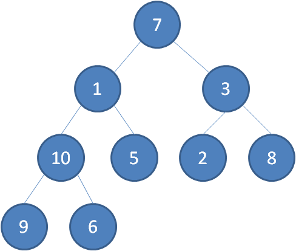
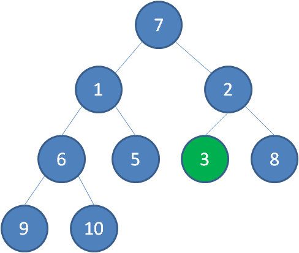
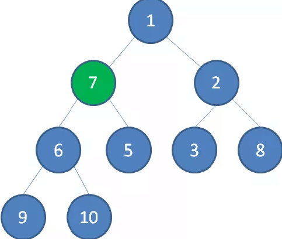
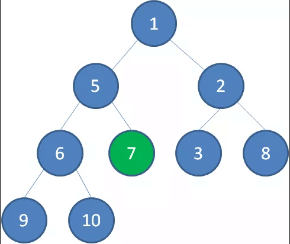
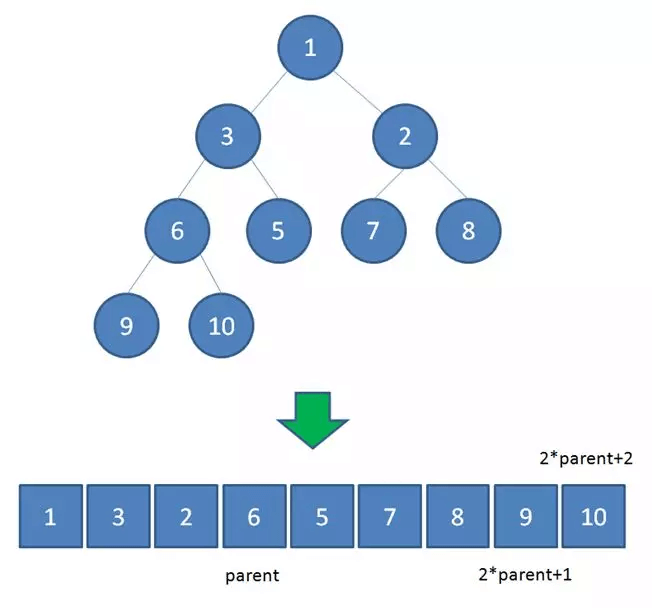

# 二叉堆

二叉堆是一种特殊的堆，二叉堆是完全二元树（二叉树）或者是近似完全二元树（二叉树）。


### 二叉堆有两种

* 最大堆：父结点的键值总是**大于或等于**任何一个子节点的键值；



* 最小堆：父结点的键值总是**小于或等于**任何一个子节点的键值。


二叉堆的根节点叫做**堆顶**

最大堆和最小堆的特点，决定了在最大堆的堆顶是整个堆中的最大元素；最小堆的堆顶是整个堆中的最小元素。

### 堆的自我调整

对于二叉堆，如下有几种操作：
* 插入节点
* 删除节点
* 构建二叉堆

这几种操作都是基于堆的自我调整。

下面让我们以最小堆为例，看一看二叉堆是如何进行自我调整的。

#### 插入节点

二叉堆的节点插入，插入位置是完全二叉树的最后一个位置。比如我们插入一个新节点，值是 0。




这时候，我们让节点0的它的父节点5做比较，如果0小于5，则让新节点“上浮”和父节点交换位置。





继续用节点0和父节点3做比较，如果0小于3，则让新节点继续“上浮”。


继续比较，最终让新节点0上浮到了堆顶位置。


#### 删除节点

二叉堆的节点删除过程和插入过程正好相反，所删除的是处于堆顶的节点。
比如我们删除最小堆的堆顶节点1。




这时候，为了维持完全二叉树的结构，我们把堆的最后一个节点10补到原本堆顶的位置。


接下来我们让移动到堆顶的节点10和它的左右孩子进行比较，如果左右孩子中最小的一个（显然是节点2）比节点10小，那么让节点10“下沉”。


    


继续让节点10和它的左右孩子做比较，左右孩子中最小的是节点7，由于10大于7，让节点10继续“下沉”。

   


这样一来，二叉堆重新得到了调整。


#### 构建二叉堆

构建二叉堆，也就是把一个无序的完全二叉树调整为二叉堆，本质上就是让**所有非叶子节点依次下沉**。

我们举一个无序完全二叉树的例子：

  


首先，我们从最后一个非叶子节点开始，也就是从节点10开始。如果节点10大于它左右孩子中最小的一个，则节点10下沉。


  


接下来轮到节点3，如果节点3大于它左右孩子中最小的一个，则节点3下沉。

  


接下来轮到节点1，如果节点1大于它左右孩子中最小的一个，则节点1下沉。事实上节点1小于它的左右孩子，所以不用改变。

接下来轮到节点7，如果节点7大于它左右孩子中最小的一个，则节点7下沉。


  


节点7继续比较，继续下沉。


  


这样一来，一颗无序的完全二叉树就构建成了一个最小堆。


## 堆的代码实现

在撸代码之前，我们还需要明确一点：

    二叉堆虽然是一颗完全二叉树,但它的存储方式并不是链式存储，而是顺序存储。换句话说，二叉堆的所有节点都存储在数组当中。

  


数组中，在没有左右指针的情况下，如何定位到一个父节点的左孩子和右孩子呢？

像图中那样，我们可以依靠数组下标来计算。

假设父节点的下标是parent，那么它的左孩子下标就是 2 * parent + 1；它的右孩子下标就是  2 * parent + 2 。

比如上面例子中，节点6包含9和10两个孩子，节点6在数组中的下标是3，节点9在数组中的下标是7，节点10在数组中的下标是8。

7 = 3*2+1

8 = 3*2+2

刚好符合规律。

还有一个规律就是完全二叉树的的叶子节点占总长度的一半;比如一个长度为10的完全二叉树那么它的非叶子节点占5个,叶子节点就是总下表5开始的。

有了这个前提，下面的代码就更好理解了：

```java

```

代码中有一个优化的点，就是父节点和孩子节点做连续交换时，并不一定要真的交换，只需要先把交换一方的值存入temp变量，做单向覆盖，循环结束后，再把temp的值存入交换后的最终位置。


#### 堆的好处

二叉堆正是实现堆排序以及[优先级队列](PriorityQueue.md)的基础。
