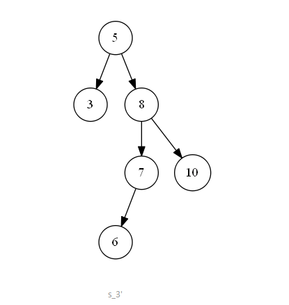

# 二叉搜索树

    二叉查找树（Binary Search Tree），（又：二叉搜索树，二叉排序树）
    
所谓二叉搜索树（Binary Search Tree），又叫二叉排序树，
简单而言就是左子树上所有节点的值均小于根节点的值，
而右子树上所有结点的值均大于根节点的值，
左小右大，并不是乱序，因此得名二叉排序树。

一个新事物不能凭空产生，那二叉搜索树又有什么用呢？

有了二叉搜索树，当你要查找一个值，
就不需要遍历整个序列或者说遍历整棵树了，
可以根据当前遍历到的结点的值来确定搜索方向，
这就好比你要去日本，假设你没有见过世界地图，
你不知道该往哪个方向走，
只能满地球找一遍才能保证一定能够到达日本；
而如果你见过世界地图，你知道日本在中国的东边，
你就不会往西走、往南走、往北走。
这种思维在搜索中被叫做“剪枝”，
把不必要的分枝剪掉可以提高搜索效率。
在二叉搜索树中查找值，每次都会把搜索范围缩小，
与二分搜索的思维类似。


#### 创建二叉搜索树

现有序列：A = {61, 87, 59, 47, 35, 73, 51, 98, 37, 93}。根据此序列构造二叉搜索树过程如下：

1. i = 0，A[0] = 61，节点61作为根节点；
2. i = 1，A[1] = 87，87 > 61，且节点61右孩子为空，故81为61节点的右孩子；
3. i = 2，A[2] = 59，59 < 61，且节点61左孩子为空，故59为61节点的左孩子；
4. i = 3，A[3] = 47，47 < 59，且节点59左孩子为空，故47为59节点的左孩子；
5. i = 4，A[4] = 35，35 < 47，且节点47左孩子为空，故35为47节点的左孩子；
6. i = 5，A[5] = 73，73 < 87，且节点87左孩子为空，故73为87节点的左孩子；
7. i = 6，A[6] = 51，47 < 51，且节点47右孩子为空，故51为47节点的右孩子；
8. i = 7，A[7] = 98，98 < 87，且节点87右孩子为空，故98为87节点的右孩子；
9. i = 8，A[8] = 93，93 < 98，且节点98左孩子为空，故93为98节点的左孩子；

创建完毕后如下图中的二叉搜索树：


#### 构造复杂度

二叉搜索树的构造过程，也就是将节点不断插入到树中适当位置的过程。该操作过程，与查询节点元素的操作基本相同，不同之处在于：

* 查询节点过程是，比较元素值是否相等，相等则返回，不相等则判断大小情况，迭代查询左、右子树，直到找到相等的元素，或子节点为空，返回节点不存在
* 插入节点的过程是，比较元素值是否相等，相等则返回，表示已存在，不相等则判断大小情况，迭代查询左、右子树，直到找到相等的元素，或子节点为空，则将节点插入该空节点位置。

由此可知，单个节点的构造复杂度和查询复杂度相同，为 ~。

使用二叉搜索树可以提高查找效率，其平均时间复杂度为O(log2n)。


#### 二叉搜索树的两种极端情况：

1. 完全二叉树，所有节点尽量填满树的每一层，上一层填满后还有剩余节点的话，则由左向右尽量填满下一层
2. 每一层只有一个节点的二叉树。如下图所示：


#### 插入

###### 插入流程：
1. 先检测该元素是否在树中已经存在。如果已经存在，则不进行插入；
2. 若元素不存在，则进行查找过程，并将元素插入在查找结束的位置。

###### 图解过程


#### 删除复杂度

二叉搜索树的节点删除包括两个过程，查找和删除。查询的过程和查询复杂度已知，
这里说明一下删除节点的过程。

###### 节点的删除有以下三种情况：

1. 待删除节点度为零；
2. 待删除节点度为一；
3. 待删除节点度为二。

第一种情况如下图 s_1 所示，待删除节点值为 “6”，
该节点无子树，删除后并不影响二叉搜索树的结构特性，
可以直接删除。即二叉搜索树中待删除节点度为零时，
该节点为叶子节点，可以直接删除；


第二种情况如下图 s_2 所示，待删除节点值为 “7”，该节点有一个左子树，删除节点后，为了维持二叉搜索树结构特性，需要将左子树“上移”到删除的节点位置上。即二叉搜索树中待删除的节点度为一时，可以将待删除节点的左子树或右子树“上移”到删除节点位置上，以此来满足二叉搜索树的结构特性。


第三种情况如下图 s_3 所示，待删除节点值为 “9”，该节点既有左子树，也有右子树，删除节点后，为了维持二叉搜索树的结构特性，需要从其左子树中选出一个最大值的节点，“上移”到删除的节点位置上。即二叉搜索树中待删除节点的度为二时，可以将待删除节点的左子树中的最大值节点“移动”到删除节点位置上，以此来满足二叉搜索树的结构特性。

    其实在真实的实现代码中，该情况下的实际节点删除操作是：
    1.查找出左子树中的最大值节点 
    2.替换待删除节点  的值为  的值
    3.删除  节点
    因为  作为左子树的最大值节点，所以节点的度一定是 0 或 1，所以删除节点的情况就转移为以上两种情况。
    




之前提到二叉搜索树中节点的删除操作，包括查询和删除两个过程，这里称删除节点后，维持二叉搜索树结构特性的操作为“稳定结构”操作，观察以上三种情况可知：

* 前两种情况下，删除节点后，“稳定结构”操作的复杂度都是常数级别，即整个的节点删除操作复杂度为 ~；
* 第三种情况下，设删除的节点为 ，“稳定结构”操作需要查找  节点左子树中的最大值，也就是左子树中最“右”的叶子结点，即“稳定结构”操作其实也是一种内部的查询操作，所以整个的节点删除操作其实就是两个层次的查询操作，复杂度同为 ~；

#### 性能分析

由以上查询复杂度、构造复杂度和删除复杂度的分析可知，三种操作的时间复杂度皆为 ~。下面分析线性结构的三种操作复杂度，以二分法为例：

* 查询复杂度，时间复杂度为 ，优于二叉搜索树；
* 元素的插入操作包括两个步骤，查询和插入。查询的复杂度已知，插入后调整元素位置的复杂度为 ，即单个元素的构造复杂度为：
* 删除操作也包括两个步骤，查询和删除，查询的复杂度已知，删除后调整元素位置的复杂度为 ，即单个元素的删除复杂度为：
由此可知，二叉搜索树相对于线性结构，在构造复杂度和删除复杂度方面占优；在查询复杂度方面，二叉搜索树可能存在类似于斜树，每层上只有一个节点的情况，该情况下查询复杂度不占优势。

#### 总结

二叉搜索树的节点查询、构造和删除性能，与树的高度相关，如果二叉搜索树能够更“平衡”一些，避免了树结构向线性结构的倾斜，则能够显著降低时间复杂度。二叉搜索树的存储方面，相对于线性结构只需要保存元素值，树中节点需要额外的空间保存节点之间的父子关系，所以在存储消耗上要高于线性结构。


```java
package datastructure.tree;


import lombok.Setter;

import java.util.Queue;
import java.util.concurrent.LinkedBlockingDeque;

/**
 * 二叉排序树：二叉排序树（Binary Sort Tree），又称二叉查找树（Binary Search Tree），也称二叉搜索树。
 * 
 * @author liuyi27
 * 
 *         <p>
 *         二叉排序树或者是一棵空树，或者是具有下列性质的二叉树:
 *         </p>
 *         <p>
 *         （1）若左子树不空，则左子树上所有结点的值均小于或等于它的根结点的值；
 *         </p>
 *         <p>
 *         （2）若右子树不空，则右子树上所有结点的值均大于或等于它的根结点的值；
 *         </p>
 *         <p>
 *         （3）左、右子树也分别为二叉排序树；
 *         </p>
 *
 */
@Setter
public class BinarySortTree {

	private int data;
	private BinarySortTree lchild, rchild;

	/**
	 * 递归查找二叉排序树T中是否存在key 指针f指向T的双亲，其初始调用值为NULL 若查找成功，* 则指针p指向该数据元素结点，并返回TRUE
	 * 否则指针p指向查找路径上访问的最后一个结点并返回FALSE
	 */
	// 如果树是空的，则查找结束，无匹配。
	// 如果被查找的值和根结点的值相等，查找成功。否则就在子树中继续查找。如果被查找的值小于根结点的值就选择左子树，大于根结点的值就选择右子树。
	public static boolean search(BinarySortTree tree, int key) {

		if (tree == null) {
			return false;
		}

		if (tree.data == key) {

			return true;
		}
		System.out.println(tree.data);
		if (key < tree.data) {
			System.out.println("<");
			/* 在左子树中继续查找 */
			return search(tree.lchild, key);
		} else {
			System.out.println(">");
			/* 在右子树中继续查找 */
			return search(tree.rchild, key);
		}
	}

	/**
	 * 若查找的key已经有在树中，则p指向该数据结点。 若查找的key没有在树中，则p指向查找路径上最后一个结点。
	 * 
	 * @param tree
	 * @param key
	 * @return
	 */
	public static BinarySortTree add(BinarySortTree tree, int key) {
		if (tree == null) {
			tree = new BinarySortTree();
			tree.data = key;
			return tree;
		}

		if (key < tree.data) {
			tree.lchild = add(tree.lchild, key);
		} else {
			tree.rchild = add(tree.rchild, key);
		}
		return tree;
	}

	public static BinarySortTree create(BinarySortTree tree, int[] array) {

		for (int i = 0; i < array.length; i++) {
			tree = add(tree, array[i]);
		}

		return tree;
	}

	public static boolean remove(BinarySortTree tree, int key) {
		if (tree == null) {

			return false;
		}

		if (tree.data == key) {
			return delete(tree);
		} else if (tree.data > key) {
			return remove(tree.lchild, key);
		} else {
			return remove(tree.rchild, key);
		}

	}

	/**
	 * 1）删除结点为叶子结点； 2）删除的结点只有左子树； 3）删除的结点只有右子树 4）删除的结点既有左子树又有右子树。
	 * 
	 * @param tree
	 * @return
	 */
	private static boolean delete(BinarySortTree tree) {

		if (tree.rchild == null) {
			// 右子树空则只需重接它的左子树（待删结点是叶子也走此分支)
			tree = tree.lchild;
		} else if (tree.lchild == null) {
			// 只需重接它的右子树
			tree = tree.rchild;
		} else {
			// 左右子树均不空
			// 转左
			BinarySortTree tempP = null;
			BinarySortTree temp = tree.lchild;
			// 然后向右到尽头（找待删结点的前驱）
			while (temp.rchild != null) {
				tempP = temp;
				temp = temp.rchild;
			}
			
			// TODO 感觉非常有问题
			if (tempP != null) {
				tempP.rchild = null;
			}else {
				temp.lchild = null;
			}
			
			// 将被删结点前驱的值取代被删结点的值(指向被删结点的直接前驱)
			tree.data = temp.data;

		}

		return true;
	}

	public static void layerOrder(BinarySortTree node, Queue<BinarySortTree> queue) {

		if (node != null && queue.isEmpty()) {
			// 将当前节点放入队列首指针所指位置
			queue.add(node);
			System.out.print(queue.poll().data + " ");
		} else {
			System.out.print(node.data + " ");
		}

		if (node.lchild != null) {
			queue.add(node.lchild);
		}

		if (node.rchild != null) {
			queue.add(node.rchild);
		}

		BinarySortTree nextNode = queue.poll();
		if (nextNode != null) {
			layerOrder(nextNode, queue);
		}

	}

	public static void main(String[] args) {

		int[] array = { 10, 4, 6, 34, 32, 5, 2, 1, 11, 23 };
		BinarySortTree tree = null;
		tree = create(tree, array);
		Queue<BinarySortTree> queue = new LinkedBlockingDeque<BinarySortTree>();
		layerOrder(tree, queue);

		System.out.println("查找1");
//		System.out.println(search(tree, 10));
//		System.out.println(search(tree, 4));
//		System.out.println(search(tree, 6));
//		System.out.println(search(tree, 34));
//		System.out.println(search(tree, 32));
//		System.out.println(search(tree, 5));
//		System.out.println(search(tree, 2));
//		System.out.println(search(tree, 11));
//		System.out.println(search(tree, 23));
		System.out.println("查找1");
		boolean result = remove(tree, 4);
		System.out.println("");
		System.out.println(result);
		layerOrder(tree, queue);
		System.out.println("");
		System.out.println("查找2");
//		System.out.println(search(tree, 10));
//		System.out.println(search(tree, 4));
//		System.out.println(search(tree, 34));
//		System.out.println(search(tree, 32));
//		System.out.println(search(tree, 2));
//		System.out.println(search(tree, 11));
//		System.out.println(search(tree, 23));
		System.out.println(search(tree, 5));
		System.out.println(search(tree, 6));
	}
}


```

```java

import java.util.Random;

/**
 * 二叉搜索树
 * @author 爱学习的程序员
 * @version V1.0
 */
public class BST{
    // 根结点
    public static Node root = null;
    /**
     * 二叉搜索树的结点类
     */
    public static class Node{
        // 父结点
        Node p;
        // 左孩子
        Node left;
        // 右孩子
        Node right;
        // 关键字
        int key;
        public Node(Node p, Node left, Node right, int key){
            this.p = p;
            this.left = left;
            this.right = right;
            this.key = key;
        }
    }
    
    /**
     * 插入结点
     * @param z 待插入结点
     * @return 根结点
     */
    public static void insert(Node z){
        // 树为空，直接作为根结点
        if(root == null)
            root = z;
        else{
            Node y = null;
            Node x = root;
            // 寻求树中结点z的合适位置
            while(x != null){
                y = x;
                if(z.key < x.key)
                    x = x.left;
                else
                    x = x.right;
            }
            z.p = y;
            if(z.key < y.key)
                y.left = z;
            else
                y.right = z;
        }
    }

    /**
     * 中序遍历二叉搜索树
     * @param x 树中结点
     * @return 无
     */
    public static void inorderTreeWalk(Node x){
        if(x!=null){
            inorderTreeWalk(x.left);
            System.out.print(x.key+"\t");
            inorderTreeWalk(x.right);
        }
    }
    
    /**
     * 二叉搜索树中查找一个具有指定关键字的结点
     * @param x 树中结点
     * @param k 关键字
     * @return 无
     */
    public static Node search(Node x, int k){
       while(x != null && x.key != k){
           if(k < x.key)
                x = x.left;
            else
                x = x.right;
       }
       return x;
    }

    /**
     * 二叉搜索树中关键字最小的结点
     * @param x 树中结点
     * @return 关键字最小的结点
     */
    public static Node minimum(Node x){
        while(x.left != null)
            x = x.left;
        return x;
    }

    /**
     * 二叉搜索树中关键字最大的结点
     * @param x 树中结点
     * @return 关键字最大的结点
     */
    public static Node maxmum(Node x){
        while(x.right != null)
            x = x.right;
        return x;
    }


    /**
     * 结点的后继（中序遍历）
     * @param x 树中结点
     * @return 结点的后继
     */
    public static Node successor(Node x){
        // 如果x的右子树不为空，则x的后继为x的右子树中具有最小关键字的结点
        if(x.right != null)
            return minimum(x.right);
        // 如果x的右子树为空，则x的后继为x的最底层祖先，而且它的左孩子也是x的一个祖先（左孩子是x即可）
        else{
            Node y = x.p;
            while(y !=null && x == y.right){
                x = y;
                y = y.p;
            }
            return y;
        }
    }

    /**
     * 结点的先驱（代码与结点的后继对称）
     * @param x 树中结点
     * @return 结点的先驱
     */
    public static Node predecessor(Node x){
        if(x.left != null)
            return maxmum(x.left);
        else{
            Node y = x.p;
            while(y !=null && x == y.left){
                x = y;
                y = y.p;
            }
            return y;
        }
    }

    /**
     * 二叉搜索树内移动子树（用另一棵子树替换一棵子树，并成为其父结点的孩子结点）
     * @param u 被替换子树的根结点
     * @param v 替换子树的根结点
     * @return 无
     */
    public static void transplant(Node u, Node v){
        if(u.p == null)
            root = v;
        else if(u == u.p.left)
            u.p.left = v;
        else
            u.p.right = v;
        if(v != null)
            v.p = u.p;
    }
    
    /**
     * 删除指定结点
     * @param z 待删除结点
     * @return 无
     */
    public static void delete(Node z){
        // 如果z最多有一个孩子结点，则直接调用transplant
        if(z.left == null)
            transplant(z, z.right);
        else if(z.right == null)
            transplant(z, z.left);
        // 如果z两个孩子结点都存在，则寻找其后继
        else{
            // z的后继
            Node y = minimum(z.right);
            if(y.p != z){
                transplant(z, z.right);
                y.right = z.right;
                y.right.p = y;
            }
            transplant(z, y);
            y.left = z.left;
            y.left.p = y;
        }
    }
    public static void main(String[] args){
        Random rand = new Random();
        // 结点数组
        Node[] node = new Node[10];
        int i = 0;
        System.out.println("生成二叉树结点并插入树中：");
        for(i = 0; i < node.length ;i++){
            node[i] = new Node(null, null, null, rand.nextInt(100) + 1);
            System.out.print(node[i].key+"\t");
            insert(node[i]);
        }
        // 中序遍历
        System.out.println("\n"+"中序遍历二叉搜索树：");
        inorderTreeWalk(root);
        // 查找指定结点
        Node x = search(root, node[5].key);
        System.out.println("\n"+"查找结果：");
        System.out.println("自身关键字："+x.key+"\t"+"父结点的关键字："+x.p.key);
        // 具有最小关键字的结点
        x = minimum(root);
        System.out.println("树中最小关键字："+x.key);
        // 具有最大关键字的结点
        x = maxmum(root);
        System.out.println("树中最大关键字："+x.key);
        // x的后继
        x = predecessor(node[5]);
        System.out.println("前驱的关键字："+x.key);
        // x的前驱
        x = successor(node[5]);
        System.out.println("后继的关键字："+x.key);     
        // 删除结点，并中序输出观看结果
        delete(node[5]);
        System.out.println("删除结点：");
        inorderTreeWalk(root);
    }
}


```
