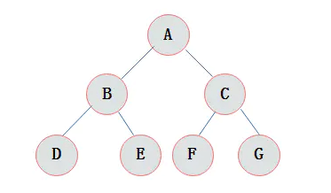
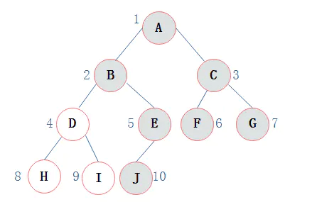

# 二叉树(BinaryTree)

二叉树是n(n>=0)个结点的有限集合，
该集合或者为空集（称为空二叉树），或者由一个根结点和两棵互不相交的、分别称为根结点的左子树和右子树组成。


#### 二叉树特点

由二叉树定义以及图示分析得出二叉树有以下特点：
1. 每个结点最多有两颗子树，所以二叉树中不存在度大于2的结点。
2. 左子树和右子树是有顺序的，次序不能任意颠倒。
3. 即使树中某结点只有一棵子树，也要区分它是左子树还是右子树。

#### 二叉树性质

1. 在二叉树的第i层上最多有2i-1 个节点 。（i>=1）
2. 二叉树中如果深度为k,那么最多有2k-1个节点。(k>=1）
3. n0=n2+1 n0表示度数为0的节点数，n2表示度数为2的节点数。
4. 在完全二叉树中，具有n个节点的完全二叉树的深度为[log2n]+1，其中[log2n]是向下取整。
5. 若对含 n 个结点的完全二叉树从上到下且从左至右进行 1 至 n 的编号，则对完全二叉树中任意一个编号为 i 的结点有如下特性：


    (1) 若 i=1，则该结点是二叉树的根，无双亲, 否则，编号为 [i/2] 的结点为其双亲结点;
    (2) 若 2i>n，则该结点无左孩子， 否则，编号为 2i 的结点为其左孩子结点；
    (3) 若 2i+1>n，则该结点无右孩子结点， 否则，编号为2i+1 的结点为其右孩子结点。
    
#### 斜树

斜树：所有的结点都只有左子树的二叉树叫左斜树。所有结点都是只有右子树的二叉树叫右斜树。这两者统称为斜树。


#### 满二叉树

在一棵二叉树中。如果所有分支结点都存在左子树和右子树，并且所有叶子都在同一层上，这样的二叉树称为满二叉树。
满二叉树的特点有：
1. 叶子只能出现在最下一层。出现在其它层就不可能达成平衡。
2. 非叶子结点的度一定是2。
3. 在同样深度的二叉树中，满二叉树的结点个数最多，叶子数最多。



#### 完全二叉树

对一颗具有n个结点的二叉树按层编号，如果编号为i(1<=i<=n)的结点与同样深度的满二叉树中编号为i的结点在二叉树中位置完全相同，则这棵二叉树称为完全二叉树。


特点：
1）叶子结点只能出现在最下层和次下层。
2）最下层的叶子结点集中在树的左部。
3）倒数第二层若存在叶子结点，一定在右部连续位置。
4）如果结点度为1，则该结点只有左孩子，即没有右子树。
5）同样结点数目的二叉树，完全二叉树深度最小。
注：满二叉树一定是完全二叉树，但反过来不一定成立。

#### 二叉树的存储结构

###### 顺序存储
二叉树的顺序存储结构就是使用一维数组存储二叉树中的结点，并且结点的存储位置，就是数组的下标索引。


上图所示的一棵完全二叉树采用顺序存储方式，如下图表示：


由图上图可以看出，当二叉树为完全二叉树时，结点数刚好填满数组。
那么当二叉树不为完全二叉树时，采用顺序存储形式如何呢?




其中浅色结点表示结点不存在。那么上图所示的二叉树的顺序存储结构如下图所示：


其中，∧表示数组中此位置没有存储结点。
此时可以发现，顺序存储结构中已经出现了空间浪费的情况。
那么对于右斜树极端情况对应的顺序存储结构如下图所示：


由上图可以看出，对于这种右斜树极端情况，采用顺序存储的方式是十分浪费空间的。
因此，顺序存储一般适用于完全二叉树。


###### 二叉链表

既然顺序存储不能满足二叉树的存储需求，那么考虑采用链式存储。
由二叉树定义可知，二叉树的每个结点最多有两个孩子。
因此，可以将结点数据结构定义为一个数据和两个指针域。
表示方式如下图所示：


定义节点代码

```java

class Node<E>{

    E data;
    Node<E> rchild;
    Node<E> lchild;
    
}

```

则完全二叉树可以采用下图表示。


上图中采用一种链表结构存储二叉树，这种链表称为二叉链表。

#### 二叉树遍历

二叉树的遍历是指从二叉树的根结点出发，
按照某种次序依次访问二叉树中的所有结点，
使得每个结点被访问一次，且仅被访问一次。
二叉树的访问次序可以分为四种：

    前序遍历: 根->左子树->右子树
    中序遍历: 左子树->根->右子树
    后序遍历; 左子树->右子树->根
    层序遍历

###### 前序遍历

通俗的说就是从二叉树的根结点出发，
当第一次到达结点时就输出结点数据，
按照先向左在向右的方向访问。


上图所示二叉树访问如下：

1. 从根结点出发，则第一次到达结点A，故输出A;
2. 继续向左访问，第一次访问结点B，故输出B；
3. 按照同样规则，输出D，输出H；
4. 当到达叶子结点H，返回到D，此时已经是第二次到达D，故不在输出D，进而向D右子树访问，D右子树不为空，则访问至I，第一次到达I，则输出I；
5. I为叶子结点，则返回到D，D左右子树已经访问完毕，则返回到B，进而到B右子树，第一次到达E，故输出E；
6. 向E左子树，故输出J；
7. 按照同样的访问规则，继续输出C、F、G；

则上图所示二叉树的前序遍历输出为：

    ABDHIEJCFG

###### 中序遍历

就是从二叉树的根结点出发，当第二次到达结点时就输出结点数据，按照先向左在向右的方向访问。

上图所示二叉树中序访问如下：

1. 从根结点出发，则第一次到达结点A，不输出A，继续向左访问，第一次访问结点B，不输出B；继续到达D，H；
2. 到达H，H左子树为空，则返回到H，此时第二次访问H，故输出H；
3. H右子树为空，则返回至D，此时第二次到达D，故输出D；
4. 由D返回至B，第二次到达B，故输出B；
5. 按照同样规则继续访问，输出J、E、A、F、C、G；

则上图所示二叉树的中序遍历输出为：

    HDIBJEAFCG
    
###### 后序遍历

就是从二叉树的根结点出发，当第三次到达结点时就输出结点数据，按照先向左在向右的方向访问。

上图所示二叉树后序访问如下： 

1. 从根结点出发，则第一次到达结点A，不输出A，继续向左访问，第一次访问结点B，不输出B；继续到达D，H；
2. 到达H，H左子树为空，则返回到H，此时第二次访问H，不输出H；
3. H右子树为空，则返回至H，此时第三次到达H，故输出H；
4. 由H返回至D，第二次到达D，不输出D；
5. 继续访问至I，I左右子树均为空，故第三次访问I时，输出I；
6. 返回至D，此时第三次到达D，故输出D；
7. 按照同样规则继续访问，输出J、E、B、F、G、C，A；

则上图所示二叉树的后序遍历输出为：

    HIDJEBFGCA
    
###### 层次遍历

层次遍历就是按照树的层次自上而下的遍历二叉树。
针对上图所示二叉树的层次遍历结果为：

    ABCDEFGHIJ

虽然二叉树的遍历过程看似繁琐，但是由于二叉树是一种递归定义的结构，
故采用递归方式遍历二叉树的代码十分简单。
递归实现代码如下：

```java
package datastructure.tree;

import lombok.Getter;
import lombok.Setter;

import java.util.Queue;
import java.util.concurrent.LinkedBlockingDeque;

/**
 * 二叉树
 * 
 * <p>
 * 定义:二叉树是n(n>=0)个结点的有限集合，该集合或者为空集（称为空二叉树），或者由一个根结点和两棵互不相交的、分别称为根结点的左子树和右子树组成
 * </p>
 * <p>
 * 二叉树特点: 由二叉树定义以及图示分析得出二叉树有以下特点： 1）每个结点最多有两颗子树，所以二叉树中不存在度大于2的结点。
 * 2）左子树和右子树是有顺序的，次序不能任意颠倒。 3）即使树中某结点只有一棵子树，也要区分它是左子树还是右子树。
 * </p>
 * <p>
 * 二叉树性质: 1）在二叉树的第i层上最多有2i-1 个节点 。（i>=1） 2）二叉树中如果深度为k,那么最多有2k-1个节点。(k>=1）
 * 3）n0=n2+1 n0表示度数为0的节点数，n2表示度数为2的节点数。
 * 4）在完全二叉树中，具有n个节点的完全二叉树的深度为[log2n]+1，其中[log2n]是向下取整。 5）若对含 n
 * 个结点的完全二叉树从上到下且从左至右进行 1 至 n 的编号，则对完全二叉树中任意一个编号为 i 的结点有如下特性：
 * </p>
 * <p>
 * (1) 若 i=1，则该结点是二叉树的根，无双亲, 否则，编号为 [i/2] 的结点为其双亲结点; (2) 若 2i>n，则该结点无左孩子， 否则，编号为
 * 2i 的结点为其左孩子结点； (3) 若 2i+1>n，则该结点无右孩子结点， 否则，编号为2i+1 的结点为其右孩子结点。 。
 * </p>
 * 
 * @author liuyi27
 *
 */
@Setter
@Getter
public class BinaryTree {

	private Object data;
	private BinaryTree lchild, rchild;

	/**
	 * 前序遍历递归算法
	 * <p>
	 * 前序遍历通俗的说就是从二叉树的根结点出发，当第一次到达结点时就输出结点数据，按照先向左再向右的方向访问。
	 * </p>
	 */
	public void preOrderTraverse(BinaryTree tree) {
		if (tree == null) {
			return;
		}

		System.out.print(tree.getData());
		preOrderTraverse(tree.getLchild());
		preOrderTraverse(tree.getRchild());
	}

	/**
	 * 中序遍历递归算法
	 * <p>
	 * 中序遍历就是从二叉树的根结点出发，当第二次到达结点时就输出结点数据，按照先向左再向右的方向访问
	 * </p>
	 */
	public void inOrderTraverse(BinaryTree tree) {
		if (tree == null) {
			return;
		}

		inOrderTraverse(tree.getLchild());
		System.out.print(tree.getData());
		inOrderTraverse(tree.getRchild());
	}

	/**
	 * 后序遍历递归算法
	 * <p>
	 * 后序遍历就是从二叉树的根结点出发，当第三次到达结点时就输出结点数据，按照先向左再向右的方向访问
	 * </p>
	 */
	public void postOrderTraverse(BinaryTree tree) {
		if (tree == null) {
			return;
		}

		postOrderTraverse(tree.getLchild());
		postOrderTraverse(tree.getRchild());
		System.out.print(tree.getData());
	}

	/**
	 * 前序建立二叉树
	 */
	public static void preCreate() {

	}

	/**
	 * 层序遍历
	 * <p>
	 * 层次遍历就是按照树的层次自上而下的遍历二叉树
	 * </p>
	 * 
	 * @param node
	 * @param queue
	 */
	public void LayerOrder(BinaryTree node, Queue<BinaryTree> queue) {

		if (node != null && queue.isEmpty()) {
			// 将当前节点放入队列首指针所指位置
			queue.add(node);
			System.out.print(queue.poll().getData());
		} else {
			System.out.print(node.getData());
		}

		if (node.lchild != null) {
			queue.add(node.lchild);
		}

		if (node.rchild != null) {
			queue.add(node.rchild);
		}

		BinaryTree nextNode = queue.poll();
		if (nextNode != null) {
			this.LayerOrder(nextNode, queue);
		}

	}

	public static void main(String[] args) {

		BinaryTree biTree2L3L = new BinaryTree();
		biTree2L3L.setData("D");

		BinaryTree biTree2L = new BinaryTree();
		biTree2L.setData("B");
		biTree2L.setLchild(biTree2L3L);

		BinaryTree biTree2R = new BinaryTree();
		biTree2R.setData("C");

		BinaryTree biTree = new BinaryTree();
		biTree.setData("A");
		biTree.setLchild(biTree2L);
		biTree.setRchild(biTree2R);

		Queue<BinaryTree> queue = new LinkedBlockingDeque<BinaryTree>();
		biTree.LayerOrder(biTree, queue);
		System.out.println("");
		biTree.preOrderTraverse(biTree);
		System.out.println("");
		biTree.inOrderTraverse(biTree);
		System.out.println("");
		biTree.postOrderTraverse(biTree);


	}
}

```

#### 面试中关于二叉树结构的常见问题

* 求二叉树的高度


* 在二叉树中查找给定节点的祖先节点

* 求二叉树的最低公共祖先LCA

性质:如果两条链有公共祖先,那么公共祖先往上的结点都重合.因为如果x=x',那么x->next=x'->next必然成立.

可能性一:若是二叉搜索树.

1如果x,y小于root,则在左边找

2如果x,y大于root,则在右边找

3如果x,y在root之间,则root就是LCA

可能性二:不是二叉搜索树,甚至不是二叉树,但是,每个一节点都有parent指针

那么解法有2:

1:空间换时间:从x,y到root的链表可以保存在栈中,找出最后一个相同结点即可.

2.不用空间换时间,多重扫描法,x,y到root两条链路可能一长一短,相差为n个结点,那么长链表先前移n步,然后,二者同步前移,找到第一个相同结点即可.(树不含环,这种办法有效.)

可能性三:这是一棵只有left和right的平凡二叉树.

那么需要辅助空间,空间换时间法,先调用16.中的GetNodePath()获得两条从root->x和root->y的链表路径.然后比较两条链表,找到最后一个相同的结点即可.


```c

//若是二叉搜索树,返回x和y的公共最低祖先LCA
 
node* LowestCommonAncestor1(node* root,node* x,node* y)
{
	if(!root || !x || !y) return NULL;
	if(x->value < root->value && y->value < root->value)
		return LowestCommonAncestor1(root->left,x,y);
	else if(x->value > root->value && y->value > root->value)
		return LowestCommonAncestor1(root->right,x,y);
	else 
		return root;
}
//若不是搜索二叉树,但是,每个结点都有父结点,空间换时间法,否则需要重重复复地扫描路径
node* LowestCommonAncestor2(node* x,node* y)
{
	stack<node*> st1,st2;
	while(x)
	{
		st1.push(x);
		x=x->p;
	}
	while(y)
	{
		st2.push(y);
		y=y->p;
	}
	node* pLCA=NULL;
	while(!st1.empty() && !st2.empty() && st1.top()==st2.top())
	{
		pLCA=st1.top();
		st1.pop();
		st2.pop();
	}	
	return pLCA;
}
//不用空间换时间法
int GetListLength(node* x)
{
	int Count=0;
	while(x)
	{
		++Count;
		x=x->p;
	}
	return Count;
}
int Myabs(int val)
{
	return val > 0 ? val : -val;
}
node* LowestCommonAncestor3(node* x,node* y)
{
	int LengthX=GetListLength(x);
	int LengthY=GetListLength(y);
	node* pLong=x,*pShort=y;
	if(LengthX < LengthY)
	{
		pLong=y;
		pShort=x;
	}
	for(int i=0;i<Myabs(LengthX-LengthY);++i)
		pLong=pLong->p;
	while( pLong && pShort && pLong !=pShort)
	{
		pLong=pLong->p;
		pShort=pShort->p;
	}
	if(pLong == pShort)
		return pLong;
	return NULL;
}
//既不是二叉搜索树,也不没有parent指针,只是一棵平凡的二叉树
bool GetNodePath(node* root, node* pNode, list<node*>& path);
node* LowestCommonAncestor4(node* root,node* x,node* y)
{
	list<node*> path1;
	list<node*> path2;
	GetNodePath(root,x,path1);
	GetNodePath(root,y,path2);
	node* pLCA=NULL;
	list<node*>::const_iterator it1=path1.begin();
	list<node*>::const_iterator it2=path2.begin();
	while(it1 != path1.end() && it2 != path2.end() && *it1 == * it2)
	{
		pLCA=*it1;
		++it1;
		++it2;
	}	
	return pLCA;

}

```

* 已知前序遍历序列和中序遍历序列，确定一棵二叉树。

* 已知后序遍历序列和中序遍历序列，确定一棵二叉树。

* 在二叉树中找出和为某一值的所有路径

要求所有路径,路径即root到某一结点的结点之集合.这是一个深度优先原则的搜索.我们很容易想到先序遍历.

为了跟踪路径和,我们需要一个额外的辅助栈来跟踪递归调用栈的操作过程.

在进入到下一个调用FindPath(left)和FindPath(right)时,递归栈会将root压入栈,因此我们也模仿进栈.当FindPath(left)和FindPath(right)返回,FindPath(root)运行周期到之后,
局部函数变量root会被析造,root会从递归栈中弹出,因此,我们也从辅助栈中弹出root,只需要在中间加上判断条件,将满足条件的结果输出即可.改成迭代版也很简单.

```c
void FindPath(node* root,int expectedSum,vector<int>& Path,int currentSum);//先序遍历改装版
void FindPath(node* root,int expectedSum)
{
	int currentSum=0;
	vector<int> Path;
	FindPath(root,expectedSum,Path,currentSum);
}
void FindPath(node* root,int expectedSum,vector<int>& Path,int currentSum)//先序遍历改装版
{
	if(!root)
		return ;
	//访问根结点,同时将root->value加入辅助栈
	currentSum += root->value;
	Path.push_back(root->value);
	if(root->left==NULL && root->right ==NULL && currentSum == expectedSum)
	{
		for(vector<int>::size_type i=0; i < Path.size(); ++i)
			cout<<Path[i]<<' ';
		cout<<endl;
	}
	FindPath(root->left,expectedSum,Path,currentSum);
	FindPath(root->right,expectedSum,Path,currentSum);
	//递归栈中,此时返回时,会将父结点销毁,因为,局部函数生命周期已经到了.
	//所以辅助栈也需要和递归栈同步,将栈顶元素弹栈,同时当前路径减去栈顶元素
	Path.pop_back();
	currentSum-=root->value;
}

```

* 编写一个程序，把一个有序整数数组放到二叉树中

这道题做法非常多,单纯是这么要求比较奇怪,因此,我选择广度优先插入,
利用队列实现,其实插成一个链表,或者随便插入不知道可不可以?没有其它要求真不知道怎么弄.

* 判断整数序列是不是二叉搜索树的后序遍历结果

典型的递归思维,后序遍历,根在最后,因此用根将二叉搜索树可以分成左右子树,再递归处理左右子树即可.

* 求二叉树的镜像

画出一个特例,我们发现只需要交换每个结点的左右指针(注意:不是数值)即可.因此在先序遍历的时候换指针即可,没有顺序要求.

* 一棵排序二叉树（即二叉搜索树BST），令 f=(最大值+最小值)/2，设计一个算法，找出距离f值最近、大于f值的结点。复杂度应尽可能低。

BST中最大值是最右边的值,最小值是最左边的值,这样就容易求出f,再求f的父指针或者右指针都可以?(我是这么认为的).这里求父指针.

* 把二叉搜索树转变成排序的双向链表

其实就是中序遍历的迭代版本,只是将中间的访问结点代码换成了调整指针.这种办法返回的是链表的最后一个指针LastVist,因为是双链表,这也可以接受.

* 打印二叉树中的所有路径.

和前边的思路类似,用辅助栈记录递归栈的运行过程,先序遍历(深搜)的过程中,遇到叶子结点(!left && !right的结点)就输出辅助栈的内容.

* 求二叉树中从根到某一结点的一条路径.

思路一如既往还是利用辅助栈来追踪递归调用栈的运行过程,只是过程有所区别,将结点入栈,如果在结点的左边能找到一条路径,那么不需要和递归栈同步(即弹栈),直接返回true,如果左边没找到这样的一条路径,再到右边找,如果找到了,返回true.如果左右都找不到存在一条这样的路径,则说明在这个结点上不可能存在这样的路径,需要在辅助栈中弹出这个结点.再遍历其它结点.实质上也是先序遍历的改装版.

* 判断B子树是否是A子树的子结构

* 利用先序和中序结果重建二叉树

* 求二叉树中叶子结点的个数

* 求二叉树中节点的最大距离。

如果我们把二叉树看成一个图，父子节点之间的连线是双向的，我们定义距离为两个节点之间边的个数。（来自编程之美）

特点：相距最远的两个节点，一定是两个叶子节点，或者一个结点到它的根节点。（为什么？）因为如果当前结点不是叶子结点，即它还有子结点，那么它的子结点到另一个端点的距离肯定可以达到更远。如果是根结点，那么根结点只可能有一条支路。

* 打印二叉树中某层的结点。

* 判断两棵二叉树是否相等


