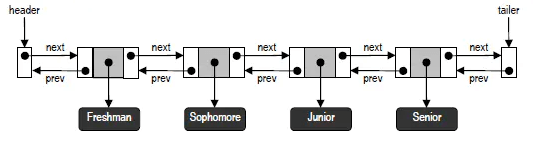

# 双端队列

队列的一种变型--双端队列（Double-ended queue），简称为Deque。
顾名思义，也就是前端与后端都支持插入和删除操作的队列。

### 双端队列的ADT(AbstractDataType)

双端队列ADT支持的基本操作

| 操作方法 | 功能描述 |
| :---- | :---- |
| insertFirst(x) | 将对象x 作为首元素插入<br>输入：一个对象<br>输出：无|
| insertLast(x) | 将对象x 作为末元素插入<br>输入：一个对象<br>输出：无|
| removeFirst() |  若队列非空，则将首元素删除，并将其返回 否则，报错<br>输入：无<br>输出：对象|
| removeLast() |  若队列非空，则将末元素删除，并将其返回 否则，报错<br>输入：无<br>输出：对象|

此外，还可能支持以下方法：

| 操作方法 | 功能描述 |
| :---- | :---- |
| first() | 若队列非空，则返回首元素的内容 否则，报错<br>输入：无<br>输出：一个对象|
| last() | 若队列非空，则返回末元素的内容 否则，报错<br>输入：无<br>输出：一个对象|
| size() |  返回队列中当前包含的元素数目<br>输入：无<br>输出：非负整数|
| isEmpty() |  检查队列是否为空<br>输入：无<br>输出：布尔标志|

### 基于双向链表实现的双端队列

##### 定义接口

```java
package dsa.Deque;

import dsa.Queue.ExceptionQueueEmpty;

public interface Deque {
    public int getSize();// 返回队列中元素数目

    public boolean isEmpty();// 判断队列是否为空

    public Object first() throws ExceptionQueueEmpty;// 取首元素（但不删除）

    public Object last() throws ExceptionQueueEmpty;// 取末元素（但不删除）

    public void insertFirst(Object obj);// 将新元素作为首元素插入

    public void insertLast(Object obj);// 将新元素作为末元素插入

    public Object removeFirst() throws ExceptionQueueEmpty;// 删除首元素

    public Object removeLast() throws ExceptionQueueEmpty;// 删除末元素

    public void Traversal();// 遍历
}
```

在基于NLNode类实现双向链表的时候，为了使编程更加简洁，
通常我们都要在最前端和最后端各设置一个哑元节点（Dummy node）。
这两个节点分别称作头节点（Header node）和尾节点（Trailer node），
起哨兵（Sentinel）的作用。也就是说，它们并不存储任何实质的数据对象，
头（尾）节点的next（prev）引用指向首（末）节点，
而prev（next）引用为空。如此构成的双向链表结构


##### 双向链表节点类

```java
package dsa.Deque;

import other.Position;

/*
 * 基于位置接口实现的双向链表节点类
 */

public class DLNode implements Position {
    private Object element;// 数据对象
    private DLNode prev;// 指向前驱节点
    private DLNode next;// 指向后继节点

    /**************************** 构造函数 ****************************/
    public DLNode() {
        this(null, null, null);
    }

    public DLNode(Object e, DLNode p, DLNode n) {
        element = e;
        prev = p;
        next = n;
    }

    // 注意三个参数的次序：数据对象、前驱节点、后继节点
    /**************************** Position接口方法 ****************************/
    // 返回存放于该位置的元素
    public Object getElem() {
        return element;
    }

    // 将给定元素存放至该位置，返回此前存放的元素
    public Object setElem(Object e) {
        Object oldElem = element;
        element = e;
        return oldElem;
    }

    /**************************** 双向链表节点方法 ****************************/
    // 找到后继位置
    public DLNode getNext() {
        return next;
    }

    // 找到前驱位置
    public DLNode getPrev() {
        return prev;
    }

    // 修改后继位置
    public void setNext(DLNode newNext) {
        next = newNext;
    }

    // 修改前驱位置
    public void setPrev(DLNode newPrev) {
        prev = newPrev;
    }
}
```

##### 基于双向链表实现双端队列实现

```java
package dsa.Deque;

import dsa.Queue.ExceptionQueueEmpty;

public class Deque_DLNode implements Deque {
    protected DLNode header;// 指向头节点（哨兵）
    protected DLNode trailer;// 指向尾节点（哨兵）
    protected int size;// 队列中元素的数目
    // 构造函数

    public Deque_DLNode() {
        header = new DLNode();
        trailer = new DLNode();
        header.setNext(trailer);
        trailer.setPrev(header);
        size = 0;
    }

    // 返回队列中元素数目
    public int getSize() {
        return size;
    }

    // 判断队列是否为空
    public boolean isEmpty() {
        return (0 == size) ? true : false;
    }

    // 取首元素（但不删除）
    public Object first() throws ExceptionQueueEmpty {
        if (isEmpty())
            throw new ExceptionQueueEmpty("意外：双端队列为空");
        return header.getNext().getElem();
    }

    // 取末元素（但不删除）
    public Object last() throws ExceptionQueueEmpty {
        if (isEmpty())
            throw new ExceptionQueueEmpty("意外：双端队列为空");
        return trailer.getPrev().getElem();
    }

    // 在队列前端插入新节点
    public void insertFirst(Object obj) {
        DLNode second = header.getNext();
        DLNode first = new DLNode(obj, header, second);
        second.setPrev(first);
        header.setNext(first);
        size++;
    }

    // 在队列后端插入新节点
    public void insertLast(Object obj) {
        DLNode second = trailer.getPrev();
        DLNode first = new DLNode(obj, second, trailer);
        second.setNext(first);
        trailer.setPrev(first);
        size++;
    }

    // 删除首节点
    public Object removeFirst() throws ExceptionQueueEmpty {
        if (isEmpty())
            throw new ExceptionQueueEmpty("意外：双端队列为空");
        DLNode first = header.getNext();
        DLNode second = first.getNext();
        Object obj = first.getElem();
        header.setNext(second);
        second.setPrev(header);
        size--;
        return (obj);
    }

    // 删除末节点
    public Object removeLast() throws ExceptionQueueEmpty {
        if (isEmpty())
            throw new ExceptionQueueEmpty("意外：双端队列为空");
        DLNode first = trailer.getPrev();
        DLNode second = first.getPrev();
        Object obj = first.getElem();
        trailer.setPrev(second);
        second.setNext(trailer);
        size--;
        return (obj);
    }

    // 遍历
    public void Traversal() {
        DLNode p = header.getNext();
        while (p != trailer) {
            System.out.print(p.getElem() + " ");
            p = p.getNext();
        }
        System.out.println();
    }
}
```
