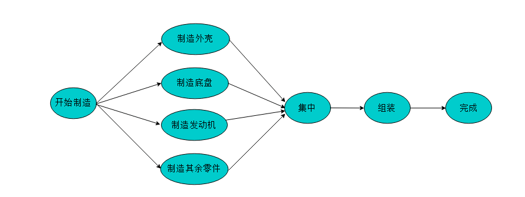

# 图关键路径

关键路径是图中一个比较重要的知识点，它的用处也很大。例如：利用关键路径可以帮助企业哪些生产步骤是整个生产进度的关键，提高这些生产步骤的效率就能提高整个生产过程的效率。

在进一步学习求解关键路径前首先需要明确一些重要概念。

### 重要概念

* AOV网：用顶点表示活动，用弧表示活动间的优先关系的有向图。称为顶点表示活动的网（Activity On Vertex Network），简称为AOV网。在图的拓扑排序中已经详细讲解了AOV网的定义和性质。下面我们来看与AOV网十分类似的数据结构——AOE网。

* AOE网：AOE网是一个带权的有向无环图。AOE网中只有一个入度为零的点（称为源点）和一个出度为零的点（称为汇点）。在AOV网顶点表示事件（Event），弧表示活动，权表示活动持续的时间。
在AOE网中，顶点之间不仅只有事件的前后驱动关系，又加入了活动的持续时间制约。在AOE网中只有在某顶点所代表的事件发生后，从该顶点出发的各活动才能开始。只有在进入某顶点的各活动都结束，该顶点所代表的事件才能发生。

例如：图2.1以制造汽车为例简易说明AOV网和AOE网的区别：

                    AOV
    
AOE    

由实例可以看出在AOV网中，顶点代表的是活动，弧代表各个活动之间的制约关系。
而在AOE网中，顶点代表的是事件，弧代表的是活动，且弧的权值代表完成此活动需要的时间。          

### 关键路径

* 事件的最早发生时间ve[k]：事件的最早发生时间ve[k]是指从源点开始到顶点vk的最大路径长度。这个长度决定了从顶点vk发出的活动能够开工的最早时间。
* 事件的最晚发生时间vl[k]：,事件的最晚发生时间vl[k]是指在不推迟整个工期的前提下，事件vk允许的最晚发生时间。
* 活动的最早开始时间e[i]：若活动ai是由弧<vk , vj>表示，则活动ai的最早开始时间应等于事件vk的最早发生时间。因此，有：e[i]=ve[k]
* 活动的最晚开始时间l[i]：活动ai的最晚开始时间是指，在不推迟整个工期的前提下， ai必须开始的最晚时间。若ai由弧<vk , vj>表示，则ai的最晚开始时间要保证事件vj的最晚发生时间不拖后。因此，有：l[i]=vl[j]-weight<vk , vj>
* 关键路径：在AOE网中，从始点到终点具有最大路径长度（该路径上的各个活动所持续的时间之和）的路径称为关键路径。
* 关键活动：关键路径上的活动称为关键活动。关键活动：e[ ai]=l[ ai]的活动 

对AOE网有待研究的问题是:

1. 完成整个工程至少需要多少时间？
  完成整个工程的时间即求解出AOE网由源点到汇点的最长路径长度。
2. 那些活动是影响工程进度的关键？
  关键活动的延期必然导致整个工期的推迟。也就是说处于关键路径上的关键活动是没有松弛时间的。而处于非关键路径上的活动可以有适当的松弛时间。

### 求解过程

1. 输入e条弧<vk , vj>，建立AOE网的存储结构。
2. 从源点v1出发，令ve[1]=0。按拓扑有序序列次序求其余各顶点的最早发生时间ve[k]（2<=k<=n），ve[k]=max{ve[j]+weight(<vj , vk>)}。如果得到的拓扑有序序列中顶点个数小于网中顶点的个数n，说明网中存在环路，不能求关键路径算法终止，否则执行步骤（3）。   （3）从汇点vn出发，令vl[n]=ve[n]，按逆拓扑有序序列求其余各顶点的最晚发生时间vl[k]（n-1>=k>=1），vl[k]=min{vl[vj]-weight(<vk , vj>)}。
3. 根据各顶点的ve值和vl值，求每条弧的最早开始时间e[ai]。e[ai]等于弧ai的弧尾顶点vk的最早发生时间ve[k]。
4. 根据各顶点的ve值和vl值计算每条弧的最晚开始时间l[ai]。l[ai]等于弧头顶点vk的最晚发生时间减去弧ai的权值。
5. 若某条弧ai满足e[ai]=l[ai]则为关键活动，由所有关键活动构成的网的一条或几条关键路径。

### 实例图解

例如：下图所示的AOE网的关键路径求解过程。
   

1. 首先，根据求出图中各顶点代表的事件最早开始时间。顶点v1为源点，则ve[1]=0。完成活动a1的时间需要3天，顶点v1到顶点v2的最长路径长度为3，则v2的最早开始时间为3，则ve[2]=3。同理得出ve[3]=2，ve[4]=6。
2. 由顶点v1到顶点v5有4条路径，分别为1->2->5，1->4->5，1->2->4->5，1->3->4->5。选择四条路径中最长的一条1->2->5或者1->4->5，对应的路径长度为7，则ve[5]=7。按照相同的方式，分别求出ve[6]=5，ve[7]=10。得到各事件的最早开始时间如下表：
