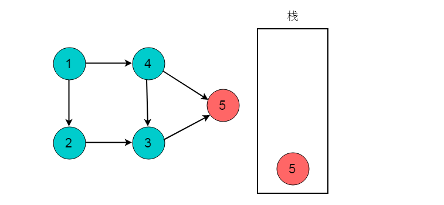
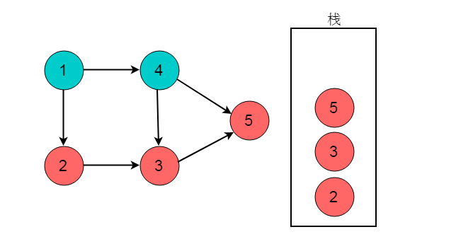
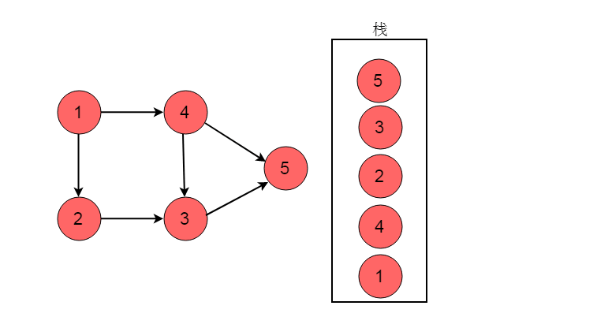

# 图拓扑排序


在工程实践中,一个工程项目往往由若干个子项目组成。这些子项目间往往有两种关系:
1. 先后关系，即必须在某个项完成后才能开始实施另一个子项目。
2. 子项目间无关系，即两个子项目可以同时进行,互不影响。

例如：在工厂里产品的生产线上，一个产品由若干个零部件组成。零部件生产时，也存在这两种关系:
1. 先后关系，即一个部件必须在完成后才能生产另一个部件;
2. 部件间无先后关系，即这两个部件可以同时生产。

那么如何合理的分配资源才能保证工程能够按时完成呢？将任务作为图的顶点，将任务之间的依赖关系作为图的边，这样就可以将实际问题抽象为数据结构图论中的典型问题——图的拓扑排序。

### 重要概念

* 有向无环图（Directed Acyclic Graph, DAG）是有向图的一种，字面意思的理解就是图中没有环。常常被用来表示事件之间的驱动依赖关系，管理任务之间的调度。
* AOV网：在每一个工程中，可以将工程分为若干个子工程，这些子工程称为活动。如果用图中的顶点表示活动，以有向图的弧表示活动之间的优先关系，这样的有向图称为AOV网，即顶点表示活动的网。
   在AOV网中，如果从顶点vi到顶点j之间存在一条路径，则顶点vi是顶点vj的前驱，顶点vj是顶点vi的后继。活动中的制约关系可以通过AOV网中的表示。 在AOV网中，不允许出现环，如果出现环就表示某个活动是自己的先决条件。
   因此需要对AOV网判断是否存在环，可以利用有向图的拓扑排序进行判断。
* 拓扑序列：设G=(V,E)是一个具有n个顶点的有向图，V中的顶点序列v1,v2,…,vn,满足若从顶点vi到vj有一条路径，则在顶点序列中顶点vi必在vj之前，则我们称这样的顶点序列为一个拓扑序列。
* 拓扑排序：拓扑排序是对一个有向图构造拓扑序列的过程。

### 拓扑排序

拓扑排序（Topological Sorting）是一个有向无环图（DAG, Directed Acyclic Graph）的所有顶点的线性序列。且该序列必须满足下面两个条件：
1. 每个顶点出现且只出现一次。
2. A在B前面，则不存在B在A前面的路径。( 不能成环！！！！)
3. 顶点的顺序是保证所有指向它的下个节点在被指节点前面！(例如A—>B—>C那么A一定在B前面，B一定在C前面)。所以，这个核心规则下只要满足即可，所以拓扑排序序列不一定唯一！

注：有向无环图（DAG）才有拓扑排序，非DAG图没有拓扑排序一说。


### 拓扑排序算法分析


正常步骤为(方法不一定唯一)：

* 从DGA图中找到一个 没有前驱的顶点输出。(可以遍历，也可以用优先队列维护)
* 删除以这个点为起点的边。(它的指向的边删除，为了找到下个没有前驱的顶点)
* 重复上述，直到最后一个顶点被输出。如果还有顶点未被输出，则说明有环！

对于上图的简单序列，可以简单描述步骤为：

1. 删除1或2输出


2. 删除2或3以及对应边


3. 删除3或者4以及对应边


4. 重复以上规则步骤


这样就完成一次拓扑排序，得到一个拓扑序列，但是这个序列并不唯一！从过程中也看到 有很多选择方案，
具体得到结果看你算法的设计了。但只要满足即是拓扑排序序列。

另外观察 12436579这个序列满足我们所说的有关系的节点指向的在前面，
被指向的在后面。如果完全没关系那不一定前后(例如1,2)

##### 拓扑排序代码实现

对于拓扑排序，如何用代码实现呢？对于拓扑排序，虽然在上面详细介绍了思路和流程，也很通俗易懂。但是实际上代码的实现还是很需要斟酌的，
如何在空间和时间上能够得到较好的平衡且取得较好的效率？

首先要考虑 存储。对于节点，首先他有联通点这么多属性。遇到稀疏矩阵还是用邻接表比较好。
因为一个节点的指向节点较少，用 邻接矩阵较浪费资源。

> 另外，如果是1，2，3，4，5，6这样的序列求拓扑排序，我们可以考虑用数组，但是如果遇到1，2，88，9999类似数据，可以考虑用map中转一下。那么，

我们具体的代码思想为：

* 新建node类，包含节点数值和它的指向(这里直接用list集合替代链表了)
* 一个数组包含node(这里默认编号较集中)。初始化，添加每个节点指向的时候同时被指的节点入度+1！(A—>C)那么C的入度+1；
* 扫描一遍所有node。将所有入度为0的点加入一个 栈(队列)。
* 当栈(队列)不空的时候，抛出其中任意一个node(栈就是尾，队就是头，顺序无所谓，上面分析了只要同时入度为零可以随便选择顺序)。将node输出，并且 node指向的所有元素入度减一。如果某个点的入度被减为0，那么就将它加入栈(队列)。
* 重复上述操作，直到栈为空。

这里主要是利用栈或者队列储存入度只为0的节点，只需要初次扫描表将入度为0的放入栈(队列)中。

* 这里你或许会问为什么。
* 因为节点之间是有相关性的，一个节点若想入度为零，那么它的父节点(指向节点)肯定在它为0前入度为0，拆除关联箭头。从父节点角度，它的这次拆除联系，可能导致被指向的入读为0，也可能不为0(还有其他节点指向儿子)

至于具体demo：

```java
package Graph;

import java.util.ArrayDeque;
import java.util.ArrayList;
import java.util.List;
import java.util.Queue;
import java.util.Stack;

public class tuopu {
	static class node
	{
		int value;
		List<Integer> next;
		public node(int value) {
			this.value=value;
			next=new ArrayList<Integer>();
		}
		public void setnext(List<Integer>list) {
			this.next=list;
		}
	}

	public static void main(String[] args) {
		// TODO Auto-generated method stub
		node []nodes=new node[9];//储存节点
		int a[]=new int[9];//储存入度
		List<Integer>list[]=new ArrayList[10];//临时空间，为了存储指向的集合
		for(int i=1;i<9;i++)
		{
			nodes[i]=new node(i);
			list[i]=new ArrayList<Integer>();
		}
		initmap(nodes,list,a);
		
		//主要流程
		//Queue<node>q1=new ArrayDeque<node>();
		Stack<node>s1=new Stack<node>();
		for(int i=1;i<9;i++)
		{
			//System.out.print(nodes[i].next.size()+" 55 ");
			//System.out.println(a[i]);
			if(a[i]==0) {s1.add(nodes[i]);}
			
		}
		while(!s1.isEmpty())
		{
			node n1=s1.pop();//抛出输出
		    
			System.out.print(n1.value+" ");
			
			List<Integer>next=n1.next;
			for(int i=0;i<next.size();i++)
			{
				a[next.get(i)]--;//入度减一
				if(a[next.get(i)]==0)//如果入度为0
				{
					s1.add(nodes[next.get(i)]);
				}
			}
		}
	}

	private static void initmap(node[] nodes, List<Integer>[] list, int[] a) {
		list[1].add(3);
		nodes[1].setnext(list[1]);
		a[3]++;
		list[2].add(4);list[2].add(6);
		nodes[2].setnext(list[2]);
		a[4]++;a[6]++;
		list[3].add(5);
		nodes[3].setnext(list[3]);
		a[5]++;
		list[4].add(5);list[4].add(6);
		nodes[4].setnext(list[4]);
		a[5]++;a[6]++;
		list[5].add(7);
		nodes[5].setnext(list[5]);
		a[7]++;
		list[6].add(8);
		nodes[6].setnext(list[6]);
		a[8]++;
		list[7].add(8);
		nodes[7].setnext(list[7]);
		a[8]++;
		
	}
}
```
输出结果

> 2 4 6 1 3 5 7 8


当然，上面说过用栈和队列都可以！如果使用队列就会得到 12345678的拓扑序列

至于图的构造，因为没有条件可能效率并不高，算法也可能不太完美.

### 入度表法

入度表法是根据顶点的入度来判断是否存在依赖关系。若顶点入度不为0。则必然此顶点的事件有前驱依赖事件，因此每次选取入度为0的顶点输出，则符合拓扑排序的性质。

##### 算法流程

1. 从图中选择一个入度为0的顶点，输出该顶点。
2. 从图中删除该节点及其所有出边（即与之邻接的所有顶点入度-1）
3. 反复执行这两个步骤，直至所有节点都输出，即整个拓扑排序完成；或者直至剩下的图中再没有入度为0的节点，这就说明此图中有回路，不可能进行拓扑排序。

##### 实例图解
例如：下图所示的有向无环图，采用入度表的方法获取拓扑排序过程。


1. 选择图中入度为0的顶点1，输出顶点1。删除顶点1，并删除以顶点1为尾的边。删除后图为：


2. 继续选择入度为0的顶点。现在，图中入度为0的顶点有2和4，这里我们选择顶点2，输出顶点2。删除顶点2，并删除以顶点2为尾的边。删除后图为：


3. 选择入度为0的顶点4，输出顶点4.删除顶点4，并删除以顶点4为尾的边。删除后图为：


4. 选择入度为0的顶点3，输出顶点3.删除顶点3，并删除以顶点3为尾的边。删除后图为：


5. 最后剩余顶点5，输出顶点5，拓扑排序过程结束。最终的输出结果为：


##### 性能分析

算法时间复杂度分析：统计所有节点入度的时间复杂性为（VE）；接下来删边花费的时间也是（VE），总花费时间为O（VE）。若使用队列保存入度为0的顶点，则可以将这个算法复杂度将为O（V+E）。


### DFS方法

深度优先搜索过程中，当到达出度为0的顶点时，需要进行回退。在执行回退时记录出度为0的顶点，将其入栈。则最终出栈顺序的逆序即为拓扑排序序列。

##### 算法流程

1. 对图执行深度优先搜索。
2. 在执行深度优先搜索时，若某个顶点不能继续前进，即顶点的出度为0，则将此顶点入栈。
3. 最后得到栈中顺序的逆序即为拓扑排序顺序。

##### 实例图解

例如下图所示的有向无环图，采用DFS的方法获取拓扑排序过程。


1. 选择起点为顶点1,，开始执行深度优先搜索。顺序为1->2->3->5。


2. 深度优先搜索到达顶点5时，顶点5出度为0。将顶点5入栈。


3. 深度优先搜索执行回退，回退至顶点3。此时顶点3的出度为0，将顶点3入栈。


4. 回退至顶点2，顶点2出度为0，顶点2入栈。


5. 回退至顶点1，顶点1可以前进位置为顶点4，顺序为1->4。


6. 顶点4出度为0，顶点4入栈。


7. 回退至顶点1，顶点1出度为0，顶点1入栈。


8. 栈的逆序为1->4->2->3->5。此顺序为拓扑排序结果。

### 性能分析

时间复杂度分析：首先深度优先搜索的时间复杂度为O(V+E)，而每次只需将完成访问的顶点存入数组中，需要O(1)，因而总复杂度为O(V+E)。

