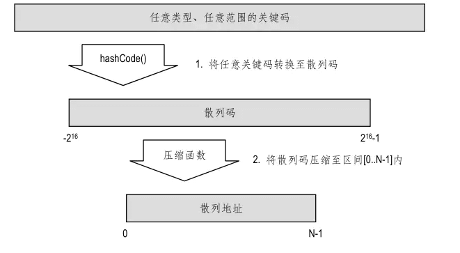

# 哈希表(Hash table)

散列表（Hash table）——将条目的关键码视作其在映射结构中的存放位置

散列表由两个要素构成：桶数组与散列函数

### 桶数组

散列表使用的桶数组（Bucket array ），其实就是一个容量为 N 的普通数组 A[0..N-1]，只不过在这里，我们将其中的每个单元都想象为一个“桶”（Bucket），每个桶单元里都可以存放一个条目。

另外我们还需要某一函数，将任意关键码转换为介于 0 与 N-1 之间的整数⎯⎯这个函数就是所谓的散列函数（Hash function）。

### 散列函数

为了将散列技术推广至一般类型的关键码，我们需要借助散列函数 h，将关键码 key映射为一个整数 h(key) ∈ [0..N-1]，并将对应的条目存放至第 h(key)号桶内，其中 N 为桶数组的容量。

> 如果将桶数组记作 A[ ]，这一技术就可以总结为“将条目 e = (key, value)存放至 A [ h ( key ) ] 中”。

反过来，为了查找关键码为 key 的条目，只需取出桶单元 A[h(key)]中存放的对象。因此，h(key)也被称作 e 的散列地址。

不过，若要兑现上述构思，还需要满足另一个条件—— h( )是一个单射，即不同的关键码key1 ≠ key2 必然对应于不同的散列地址h(key1) ≠ h(key2)。不幸的是，在绝大多数应用问题中，这一条件都很难满足。如果不同关键码的散列地址相同，我们就说该散列发生了冲（Collision）。

一个好的散列函数 h()必须兼顾以下两条基本要求：

*  h( )应该尽可能接近单射；
* 对于任何关键码 key，h(key)的计算必须能够在 O(1)时间内完成。

关于散列函数的计算，Java有其特有的习惯。Java将h(key)的计算划分为两步：
1. 将一般性的关键码key转换为一个称作“散列码”的整数；
2. 然后再通过所谓的“压缩函数”将该整数映射至区间[0..N-1]内。



### 散列码

Java 可以帮助我们将任意类型的关键码 key 转换为一个整数，称作 key 的散列码（Hash code）。请注意，散列码距离我们最终所需的散列地址还有很大距离⎯⎯它不见得落在区间[0..N-1]内，甚至不见得是正的整数。

不过这并不要紧，在这一阶段我们最关心的是：各关键码的散列码之间，应尽可能地减少冲突。显然，要是在这一阶段就发生冲突，后面的冲突就无法避免。

此外，从判等器的判等效果来看，散列码必须与关键码对象相互一致：被判等器 EqualityTester 判定为相等的两个关键码，对应的散列码也应该相等。

Java 的通用类 Object 提供了一个默认的散列码转换方法 hashCode()，利用它可以将任意对象实例映射为“代表”该对象的某个整数。具体来说，hashCode()方法的返回值是一个 32 位 int 型整数（实际上，这一默认 hashCode()方法所返回的不过就是对象在内存中的存储地址）。

遗憾的是，这一看似再自然不过的方法，实际上存在着严重的缺
陷，因此我们在使用时需格外小心。

> 比如，这种散列码的转换办法对字符串型关键码就极不适用。若两个字符串对象完全相等，本应该将它们转换为同一散列码，但由于它们的内存地址不同，由 hashCode()得到的散列码将绝对不会一样。
  实际上，在实现 String 类时，Java 已经将 Object 类的 hashCode()方法改写为一种更加适宜于字符串关键码的方法。
  
### 压缩函数

##### 模余法
      
最简单的压缩办法，就是取 N 为素数，并将散列码 i 映射为：

    ** | i | mod N **

之所以将 N 选取为素数，是为了最大程度地将散列码均匀地映射至[0..N-1]区间内。
比如，对于散列码集合{200, 205, 210, 215, …, 690, 695, 700}，若选取 N = 100，则其中的每个散列码都会与另外的至少四个关键码相冲突；而若改用 N = 101，则不会有任何冲突。

##### MAD 法

采用一种将乘法（Mutiply）、加法（Add）和除法（Divide）结合起来的方法，该方法也因此得名。具体来说，对于散列码 i，MAD 法会将 i 映射为：

    ** | a×i + b | mod N **

其中 N 仍为素数，a>0，b>0，a mod N ≠ 0，它们都是在确定压缩函数时随机选取的常数。

##### 基于散列表实现映射类

我们给出基于散列表实现的映射结构：

```java
package dsa.Map;

import dsa.Iterator.Iterator;
import dsa.Iterator.IteratorElement;
import dsa.List.List;
import dsa.List.List_DLNode;
import dsa.PriorityQueue.Entry;

public class Map_HashTable implements Map {

    /*
     * 基于散列表实现的映射结构 采用分离链策略解决冲突
     */

    private Map[] A;// 桶数组，每个桶本身也是一个（基于列表实现的）映射结构
    private int N;// 散列表长
    private final double maxLemda = 0.75;// 装填因子上限
    private int size;// 映射结构的规模
    private EqualityTester T;// 判等器
    // 默认构造方法

    public Map_HashTable() {
        this(0, new EqualityTesterDefault());
    }

    // 构造方法
    public Map_HashTable(int n, EqualityTester t) {
        T = t;
        N = p(n);// 桶数组容量取为不小于n的最小素数
        A = new Map[N];
        for (int i = 0; i < N; i++)
            A[i] = new Map_DLNode(T);
        size = 0;
    }

    /***************************** 辅助方法 *****************************/
    // 散列定址函数（采用模余法）
    private int h(Object key) {
        return key.hashCode() % N;
    }

    // 判断n是否为素数
    private static boolean prime(int n) {
        for (int i = 3; i < 1 + Math.sqrt(n); i++)
            if (n / i * i == n)
                return false;
        return true;
    }

    // 取不小于n的最小素数
    private static int p(int n) {
        if (3 > n)
            n = 3;
        n = n | 1;// 奇数化
        while (!prime(n))
            n += 2;
        return n;
    }

    /***************************** ADT方法 *****************************/
    // 查询映射结构当前的规模
    public int getSize() {
        return size;
    }

    // 判断映射结构是否为空
    public boolean isEmpty() {
        return 0 == size;
    }

    // 若M中存在以key为关键码的条目，则返回该条目的数据对象；否则，返回null
    public Object get(Object key) {
        return A[h(key)].get(key);
    }

    // 若M中不存在以key为关键码的条目，则将条目(key, value)加入到M中并返回null
    // 否则，将已有条目的数据对象替换为value，并返回原先的数据对象
    public Object put(Object key, Object value) {
        Object oldValue = A[h(key)].put(key, value);
        if (null == oldValue) {// 若插入的条目未出现于原散列表中，则
            size++;// 更新规模记录
            if (size > N * maxLemda)
                rehash();// 若装填因子过大，则重散列
        }
        return oldValue;
    }

    // 若M中存在以key为关键码的条目，则删除之并返回其数据对象；否则，返回null
    public Object remove(Object key) {
        Object oldValue = A[h(key)].remove(key);
        if (null != oldValue)
            size--;
        return oldValue;
    }

    // 返回M中所有条目的一个迭代器
    // 将各桶对应的映射结构的迭代器串接起来，构成整体的迭代器
    public Iterator entries() {
        List L = new List_DLNode();
        for (int i = 0; i < N; i++) {
            Iterator it = A[i].entries();
            while (it.hasNext())
                L.insertLast(it.getNext());
        }
        return new IteratorElement(L);
    }

    // 重散列
    private void rehash() {
        Iterator it = this.entries();
        N = p(N << 1);
        A = new Map[N];// 桶数组容量至少加倍
        for (int i = 0; i < N; i++)
            A[i] = new Map_DLNode(T);// 为每个桶分配一个子映射
        while (it.hasNext()) {// 将其对应的映射结构中的
            Entry e = (Entry) it.getNext();// 各条目逐一取出，将其
            Object k = e.getKey();// 关键码和
            Object v = e.getValue();// 数据对象
            A[h(k)].put(k, v);// 整合为新的条目，插入对应的子映射中
        }
    }
}
```

##### 装填因子

对于散列表的性能而言，装填因子λ = n/N是最重要的影响因素。

如果λ > 1，则冲突在所难免。

实际上，关于散列表平均复杂度的分析结果指出：

* 采取分离链策略时应该保持λ < 0.9，
* 采取开放定址策略时则应该保持λ < 0.5

这些都得到了实验统计的证明。

若采用分离链策略，则在发生冲突的桶中，对条目的查找将退化为对链表的查找。因此，随着λ不断接近于 1，发生冲突的概率也将不断接近于 100%，从而导致更多的时间消耗于对链表的查找，使得各种操作的效率下降。

当采用开放定址策略时，随着λ超过 0.5 并不断提高，条目在桶数组中聚集的程度将急速加剧，于是，需要经过越来越多次的探测才能完成一次查找。

### 重散列

通常都采用重散列的方法⎯⎯将所有条目全部取出，将桶数组的规模
加倍，然后将各条目重新插入其中。

> 例如，Java 内建的 java.util.HashMap 类实现了映射结构的 ADT，在创建该类的对象时，程序员可以指定装填因子的上限（默认设置为 0.75）。一旦装填因子超出这一范围，java.util.HashMap会自动进行重散列（Rehashing）。
  

### 面试中关于哈希结构的常见问题

* 在数组中查找对称键值对
* 追踪遍历的完整路径
* 查找数组是否是另一个数组的子集
* 检查给定的数组是否不相交
