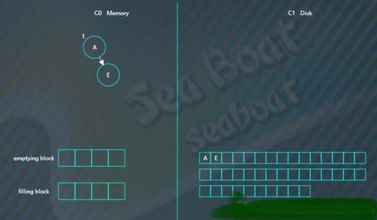
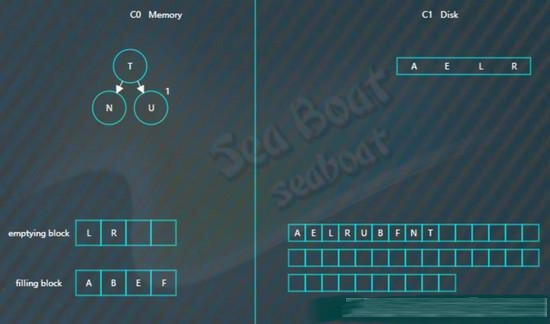

# LSM树

LSM树，即日志结构合并树(Log-Structured Merge-Tree)。
其实它并不属于一个具体的数据结构，它更多是一种数据结构的设计思想。
大多NoSQL数据库核心思想都是基于LSM来做的，
只是具体的实现不同。

它的核心思路其实非常简单，就是假定内存足够大，因此不需要每次有数据更新就必须将数据写入到磁盘中，
而可以先将最新的数据驻留在内存中，等到积累到最后多之后，再使用归并排序的方式将内存内的数据合并追加到磁盘队尾
(因为所有待排序的树都是有序的，可以通过合并排序的方式快速合并到一起)。

LSM具有批量特性，存储延迟。当写读比例很大的时候（写比读多），LSM树相比于B树有更好的性能。因为随着insert操作，为了维护B树结构，节点分裂。
读磁盘的随机读写概率会变大，性能会逐渐减弱。 多次单页随机写，变成一次多页随机写,复用了磁盘寻道时间，极大提升效率。

LSM Tree弄了很多个小的有序结构，比如每m个数据，在内存里排序一次，下面100个数据，再排序一次……这样依次做下去，我就可以获得N/m个有序的小的有序结构。

在查询的时候，因为不知道这个数据到底是在哪里，所以就从最新的一个小的有序结构里做二分查找，找得到就返回，找不到就继续找下一个小有序结构，一直到找到为止。
很容易可以看出，这样的模式，读取的时间复杂度是(N/m)*log2N 。读取效率是会下降的。

当然也可以做一些优化
* Bloom filter: 就是个带随即概率的bitmap,可以快速的告诉你，某一个小的有序结构里有没有指定的那个数据的。于是就可以不用二分查找，而只需简单的计算几次就能知道数据是否在某个小集合里啦。效率得到了提升，但付出的是空间代价。
* compact:小树合并为大树:因为小树他性能有问题，所以要有个进程不断地将小树合并到大树上，这样大部分的老数据查询也可以直接使用log2N的方式找到，不需要再进行(N/m)*log2n的查询了

### LSM树诞生背景

传统关系型数据库使用btree或一些变体作为存储结构，能高效进行查找。
但保存在磁盘中时它也有一个明显的缺陷，那就是逻辑上相离很近但物理却可能相隔很远，这就可能造成大量的磁盘随机读写。
随机读写比顺序读写慢很多，为了提升IO性能，我们需要一种能将随机操作变为顺序操作的机制，于是便有了LSM树。
LSM树能让我们进行顺序写磁盘，从而大幅提升写操作，作为代价的是牺牲了一些读性能。

### 关于磁盘IO

磁盘读写时涉及到磁盘上数据查找，地址一般由柱面号、盘面号和块号三者构成。也就是说移动臂先根据柱面号移动到指定柱面，然后根据盘面号确定盘面的磁道，最后根据块号将指定的磁道段移动到磁头下，便可开始读写。

整个过程主要有三部分时间消耗，查找时间(seek time) +等待时间(latency time)+传输时间(transmission time) 。分别表示定位柱面的耗时、将块号指定磁道段移到磁头的耗时、将数据传到内存的耗时。
整个磁盘IO最耗时的地方在查找时间，所以减少查找时间能大幅提升性能。

### LSM树原理

LSM树由两个或以上的存储结构组成，比如在论文中为了方便说明使用了最简单的两个存储结构。一个存储结构常驻内存中，称为C0 tree，具体可以是任何方便健值查找的数据结构，比如红黑树、map之类，甚至可以是跳表。
另外一个存储结构常驻在硬盘中，称为C1 tree，具体结构类似B树。C1所有节点都是100%满的，节点的大小为磁盘块大小。

### 插入步骤

大体思路是：插入一条新纪录时，首先在日志文件中插入操作日志，以便后面恢复使用，日志是以append形式插入，所以速度非常快；将新纪录的索引插入到C0中，这里在内存中完成，不涉及磁盘IO操作；当C0大小达到某一阈值时或者每隔一段时间，将C0中记录滚动合并到磁盘C1中；对于多个存储结构的情况，当C1体量越来越大就向C2合并，以此类推，一直往上合并Ck。

### 合并步骤

合并过程中会使用两个块：emptying block和filling block。

从C1中读取未合并叶子节点，放置内存中的emptying block中。从小到大找C0中的节点，与emptying block进行合并排序，合并结果保存到filling block中，并将C0对应的节点删除。不断执行第2步操作，合并排序结果不断填入filling block中，当其满了则将其追加到磁盘的新位置上，注意是追加而不是改变原来的节点。合并期间如故宫emptying block使用完了则再从C1中读取未合并的叶子节点。C0和C1所有叶子节点都按以上合并完成后即完成一次合并。

### 关于优化措施

本文用图阐述LSM的基本原理，但实际项目中其实有很多优化策略，而且有很多针对LSM树优化的paper。比如使用布隆过滤器快速判断key是否存在，还有做一些额外的索引以帮助更快找到记录等等。

### 插入操作

向LSM树中插入

A E L R U

首先会插入到内存中的C0树上，这里使用AVL树，插入“A”，先向磁盘日志文件追加记录，然后再插入C0

插入“E”，同样先追加日志再写内存，

继续插入“L”，旋转后如下，

插入“R”“U”，旋转后最终如下。

假设此时触发合并，则因为C1还没有树，所以emptying block为空，直接从C0树中依次找最小的节点。filling block长度为4，这里假设磁盘块大小为4。

开始找最小的节点，并放到filling block中，

继续找第二个节点，

以此类推，填满filling block

开始写入磁盘，C1树，

继续插入

B F N T

先分别写日志，然后插入到内存的C0树中

假如此时进行合并，先加载C1的最左边叶子节点到emptying block，

接着对C0树的节点和emptying block进行合并排序，首先是“A”进入filling block，

然后是“B”，

合并排序最终结果为，

将filling block追加到磁盘的新位置，将原来的节点删除掉，

继续合并排序，再次填满filling block，

将filling block追加到磁盘的新位置，上一层的节点也要以磁盘块（或多个磁盘块）大小写入，尽量避开随机写。另外由于合并过程可能会导致上层节点的更新，可以暂时保存在内存，后面在适当时机写入。

### 查找操作
 
查找总体思想是先找内存的C0树，找不到则找磁盘的C1树，然后是C2树，以此类推。

假如要找“B”，先找C0树，没找到。

接着找C1树，从根节点开始，

找到“B”。

### 删除操作

删除操作为了能快速执行，主要是通过标记来实现，在内存中将要删除的记录标记一下，后面异步执行合并时将相应记录删除。

比如要删除“U”，假设标为#的表示删除，则C0树的“U”节点变为，

而如果C0树不存在的记录，则在C0树中生成一个节点，并标为#，查找时就能在内存中得知该记录已被删除，无需去磁盘找了。比如要删除“B”，那么没有必要去磁盘执行删除操作，直接在C0树中插入一个“B”节点，并标为#。

假如对写操作的吞吐量比较敏感，可采用日志策略（顺序读写，只追加不修改）来提升写性能。存在问题：数据查找需要倒序扫描，花费很多时间。比如，预写日志WAL，WAL的中心概念是数据文件（存储着表和索引）的修改必须在这些动作被日志记录之后才被写入，即在描述这些改变的日志记录被刷到持久存储以后。如果我们遵循这种过程，我们不需要在每个事务提交时刷写数据页面到磁盘，因为我们知道在发生崩溃时可以使用日志来恢复数据库：任何还没有被应用到数据页面的改变可以根据其日志记录重做（这是前滚恢复，也被称为REDO）。使用WAL可以显著降低磁盘的写次数，因为只有日志文件需要被刷出到磁盘以保证事务被提交，而被事务改变的每一个数据文件则不必被刷出。

其只是提高了写的性能，对于更为复杂的读性能，需要寻找其他的方法，其中有四种方法来提升读性能：

* 二分查找: 将文件数据有序保存，使用二分查找来完成特定key的查找。
* 哈希：用哈希将数据分割为不同的bucket
* B+树：使用B+树 或者 ISAM 等方法，可以减少外部文件的读取
* 外部文件： 将数据保存为日志，并创建一个hash或者查找树映射相应的文件。

所有的四种方法都可以有效的提高了读操作的性能（最少提供了O(log(n)) )，但是，却丢失了日志文件超好的写性能，上面这些方法，都强加了总体的结构信息在数据上，数据被按照特定的方式放置，所以可以很快的找到特定的数据，但是却对写操作不友善，让写操作性能下降。更糟糕的是，当需要更新hash或者B+树的结构时，需要同时更新文件系统中特定的部分，这就是造成了比较慢的随机读写操作，这种随机的操作要尽量减少。

既要保证日志文件好的写性能，又要在一定程度上保证读性能，所以LSM-Tree应运而生。

讲LSM树之前，需要提下三种基本的存储引擎，这样才能清楚LSM树的由来：

* 哈希存储引擎  是哈希表的持久化实现，支持增、删、改以及随机读取操作，但不支持顺序扫描，对应的存储系统为key-value存储系统。对于key-value的插入以及查询，哈希表的复杂度都是O(1)，明显比树的操作O(n)快,如果不需要有序的遍历数据，哈希表就是your Mr.Right
* B树存储引擎是B树（关于B树的由来，数据结构以及应用场景可以看之前一篇博文）的持久化实现，不仅支持单条记录的增、删、读、改操作，还支持顺序扫描（B+树的叶子节点之间的指针），对应的存储系统就是关系数据库（Mysql等）。
* LSM树（Log-Structured Merge Tree）存储引擎和B树存储引擎一样，同样支持增、删、读、改、顺序扫描操作。而且通过批量存储技术规避磁盘随机写入问题。当然凡事有利有弊，LSM树和B+树相比，LSM树牺牲了部分读性能，用来大幅提高写性能。

LSM树（Log Structured Merge Tree，结构化合并树）的思想非常朴素，就是将对数据的修改增量保持在内存中，达到指定的大小限制后将这些修改操作批量写入磁盘（由此提升了写性能），是一种基于硬盘的数据结构，与B-tree相比，能显著地减少硬盘磁盘臂的开销。当然凡事有利有弊，LSM树和B+树相比，LSM树牺牲了部分读性能，用来大幅提高写性能。

读取时需要合并磁盘中的历史数据和内存中最近的修改操作,读取时可能需要先看是否命中内存，否则需要访问较多的磁盘文件（存储在磁盘中的是许多小批量数据，由此降低了部分读性能。但是磁盘中会定期做merge操作，合并成一棵大树，以优化读性能）。LSM树的优势在于有效地规避了磁盘随机写入问题，但读取时可能需要访问较多的磁盘文件。

代表数据库：nessDB、leveldb、hbase等

核心思想的核心就是放弃部分读能力，换取写入的最大化能力，放弃磁盘读性能来换取写的顺序性。极端的说，基于LSM树实现的HBase的写性能比Mysql高了一个数量级，读性能低了一个数量级。

### LSM操作

LSM树 插入数据可以看作是一个N阶合并树。数据写操作（包括插入、修改、删除也是写）都在内存中进行，

数据首先会插入内存中的树。当内存树的数据量超过设定阈值后，会进行合并操作。合并操作会从左至右便利内存中树的子节点 与 磁盘中树的子节点并进行合并，会用最新更新的数据覆盖旧的数据（或者记录为不同版本）。当被合并合并数据量达到磁盘的存储页大小时。会将合并后的数据持久化到磁盘，同时更新父节点对子节点的指针。

LSM树 读数据 磁盘中书的非子节点数据也被缓存到内存中。在需要进行读操作时，总是从内存中的排序树开始搜索，如果没有找到，就从磁盘上的排序树顺序查找。

在LSM树上进行一次数据更新不需要磁盘访问，在内存即可完成，速度远快于B+树。当数据访问以写操作为主，而读操作则集中在最近写入的数据上时，使用LSM树可以极大程度地减少磁盘的访问次数，加快访问速度。

LSM树 删除数据 前面讲了。LSM树所有操作都是在内存中进行的，那么删除并不是物理删除。而是一个逻辑删除，会在被删除的数据上打上一个标签，当内存中的数据达到阈值的时候，会与内存中的其他数据一起顺序写入磁盘。 这种操作会占用一定空间，但是LSM-Tree 提供了一些机制回收这些空间。

### LSM VS B树

B树被广泛应用于各种传统数据库。采用了B树的存储系统，所有数据都是排序的，并将这些数据分成一个个page。而B树就是指向这些page的索引组成的m阶树。每次读写数据的过程就是顺着B树查找或更新各个page的过程。B树相对于AVL、红黑树等的优点在于可以减少文件读写次数。
对比LSM和B树之前，我们先来考虑一下它们为什么会设计成这样。要设计一个系统，我们可以从最简单的设计出发。对于存储系统，最简单的就是把记录直接写到记录文件的末尾，这样的做法写效率是最高的。然而要查询某一条记录，需要遍历整个文件，这是无法接受的。为了快速查询，一个办法是建立hash索引，但是hash索引有其自己的问题，比如数据量大的时候，索引在内存中就放不下了。另一个办法就是事先对数据进行排序。从排好序的文件中查找记录有一箱的数据结构可以用，平衡二叉树、堆、红黑树等等，还有今天的主角B树（啊，不，B树只是被来出来陪衬的，今天的主角是LSM）。
这里的关键是“事先”是什么时候。首先会想到的思路是在写入的时候。在计算机系统中真正foundmental的创新是很不容易的。大多数的优化其实都是tradeoff，也就是牺牲一点A，得到一点B。在这里，一共两种操作，写入或者读取，为了提高读取效率，我们就要在写入的时候多做一些事情。对于B树，这多做的事情首先是找到正确的位置，其次还会有page的分裂等。
大多数时候，B树的表现是很优秀的，他也一直很努力的提高自己，不断增加新技能，进化出了B+\B*树等进化体。然而当系统同时服务的客户越来越来多，对吞吐量的要求越来越高。B树表示在大并发写操作的时候，压力有点大，因为要做的事情有点多。那怎么办，为了读取数据的时候轻松一点，这些事情不得不做啊。
当B树不堪重负的时候，主角LSM树登场了。他说，想要有高的写吞吐，就给我减负，我可管不了那么多，我可是主角。作者也很无奈，想想也是，哪个主角没几个挂呢，给他开挂吧。本来都是写入的时候要做的事，就少做一点吧，给你几个后台线程，剩下的事情用它们做吧。有了这几个后台线程帮忙，LSM树处理大量写入的能力一下就上来了。LSM由此直接拿下Hbase、Cassandra、kudu等大量地盘。老大哥B树表示，他有挂，我很慌。
到这里就比较清楚了，B树把所有的压力都放到了写操作的时候，从根节点索引到数据存储的位置，可能需要多次读文件；真正插入的时候，又可能会引起page的分裂，多次写文件。而LSM树在插入的时候，直接写入内存，只要利用红黑树保持内存中的数据有序即可，所以可以提供更高的写吞吐。不过，把compaction交给后台线程来做，意味着有时间差，读取的时候，通常不止一个SSTable，要么逐个扫描，要么先merge，所以会影响到读效率。另外，当后台线程做compaction的时候，占用了IO带宽，这时也会影响到写吞吐。所以B树还不会被LSM取代。

### Hbase VS kudu

Hbase 的存储实现是LSM的典型应用，适合大规模在线读写。然而，除了这种OLTP的访问模式，正如我在大数据场景与挑战中提到的，还有一种OLAP的数据访问模式，Hbase其实是不合适的。对此，最常见的做法是定期把数据导出到专门针对OLAP场景的存储系统。这个做法一点都不优雅，因为一份同样的数据同时存在两个不同的地方，而且还会有一个不一致的时间窗口。Kudu就是为了解决这个问题而诞生的。我最早看到kudu就很有兴趣，也很好奇，一个存储系统能同时满足OLTP和OLAP两种场景，那是厉害的。不过现在kudu由于运维成本等其他问题还没有被广泛采用，挺可惜的。
扯远了，我们来看为了更好的支持OLAP，kudu对LSM做了哪些优化。OLAP经常会做列选择，所有的OLAP存储引擎都是以列式存储的。kudu也想到了这一点。kudu的memtable(在kudu中叫MemRowSet)还是同之前一样，只是SSTable(在kudu中叫DiskRowSet)改成了列式存储。对于列式存储，读取一个记录需要分别读每个字段，因此kudu精心设计了RowSet中的索引(针对并发访问等改进过的B树)，加速这个过程。
除了列式存储，kudu保证一个key只可能出现在一个RowSet中，并记录了每个RowSet中key的最大值和最小值，加速数据的范围查找。这也意味着，对于数据更新，不能再像之前一样直接插入memtable即可。需要找到对应的RowSet去更新，为了保持写吞吐，kudu并不直接更新RowSet，而是又新建一个DeltaStore，专门记录数据的更新。所以，后台除了RowSet的compaction线程，还要对DeltaStore进行merge和apply。从权衡的角度考虑，kudu其实是牺牲了一点写效率，单记录查询效率，换取了批量查询效率。

### 这样看来，从B树到LSM，到kudu对LSM的优化，其实都是针对不同场景不同的访问需求做出的各种权衡而已。了解了这些，我们在选择这些技术的时候心里就有底了。另外，权衡并不是那么容易的事。怎么样牺牲A去补偿B，可能有不同的策略。研究现有系统的一些思想，有助于当我们自己面临问题的时候，有更多思路。

