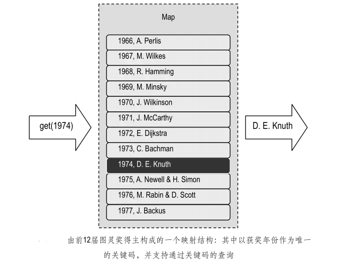

# 映射（Map）

实际上，借助关键码直接查找数据元素并对其进行操作的这一形式，已经为越来越多的数据结构所采用，也成为现代数据结构的一个重要特征。

本文将要讨论的映射（Map）及后面要介绍的词典（Dictionary）结构，
就是其中最典型的例子，** 它们对优先队列中利用关键码的思想做了进一步发挥和推广——不再只是可以读取或修改最小元素，
而是能够对任意给定的关键码进行查找，并修改相应的元素。**

与优先队列一样，映射和词典中存放的元素也是一组由关键码和数据合成的条目。

* 映射要求不同条目的关键码互异
* 词典则允许多个条目拥有相同的关键码。

映射（Map）也是一种存放一组条目的容器。与优先队列一样，映射中的条目也是形如(key, value)的组合对象，
其中 key 为关键码对象，value 为具体的数据对象。

需要特别指出的是，在映射中，各条目的关键码不允许重复冗余。比如，若准备将某个学校所有学生的记录组织为一个映射结构，
则不能以年龄或班级作为关键码，因为不同记录的这些信息都有可能重复；反过来，通常学号都是学生的唯一标识，故可以将学号作为关键码。



### 映射的实现

##### 映射的接口

```java
package dsa.Map;

import dsa.Iterator.Iterator;

public interface Map {

    /*
     * 映射结构接口
     */
    // 查询映射结构当前的规模
    public int getSize();

    // 判断映射结构是否为空
    public boolean isEmpty();

    // 若映射中存在以key为关键码的条目，则返回该条目的数据对象；否则，返回null
    public Object get(Object key);

    // 若映射中不存在以key为关键码的条目，则插入条目(key, value)并返回null
    // 否则，将已有条目的数据对象替换为value，并返回原先的数据对象
    public Object put(Object key, Object value);

    // 若映射中存在以key为关键码的条目，则删除之并返回其数据对象；否则，返回null
    public Object remove(Object key);

    // 返回映射中所有条目的一个迭代器
    public Iterator entries();
}
```

##### 判等器
由其 ADT 描述可知，映射结构必须能够比较任意一对关键码是否相等，
每个映射结构在被创建的时候，都需要指定某一具体标准，
以便进行关键码的比较。因此，为了实现映射结构，
首先必须实现这样的一个判等器（Equality tester）：

```java
package dsa.Map;

public interface EqualityTester {

    /*
     * 判等器接口
     */
    public boolean isEqualTo(Object a, Object b);// 若a与b相等，则返回true；否则，返回false
}
```

```java
package dsa.Map;

public class EqualityTesterDefault implements EqualityTester {
    /*
     * 默认判等器
     */
    public EqualityTesterDefault() {
    }

    public boolean isEqualTo(Object a, Object b) {
        return (a.equals(b));
    }// 使用Java提供的判等器
}
```
尽管上面的默认判等器也是通过标准的equals()方法实现的，但重要的是，利用这种模式，程序员完全可以编写出独立的通用判等器而无需触及对象内部的结构。

##### 基于列表实现映射类 

实现映射结构的最简单办法，就是直接将映射 M 中的条目组织成双向链表形式的一个列表 L。

这样，getSize()和 isEmpty()方法可以直接套用 List 接口中对应的方法。而在 get(key)、put(key, value)和 remove(key)方法中为了确定操作条目的位置，可以将 S 中的元素逐一与给定的 key 做对比。

```java
package dsa.Map;

import dsa.Iterator.Iterator;
import dsa.Iterator.IteratorElement;
import dsa.List.List;
import dsa.List.List_DLNode;
import dsa.PriorityQueue.Entry;
import dsa.PriorityQueue.EntryDefault;
import other.Position;

public class Map_DLNode implements Map {
    /*
     * 基于列表实现映射结构
     */
    private List L;// 存放条目的列表
    private EqualityTester T;// 判等器
    // 构造方法

    public Map_DLNode() {
        this(new EqualityTesterDefault());
    }

    // 默认构造方法
    public Map_DLNode(EqualityTester t) {
        L = new List_DLNode();
        T = t;
    }

    /***************************** ADT方法 *****************************/
    // 查询映射结构当前的规模
    public int getSize() {
        return L.getSize();
    }

    // 判断映射结构是否为空
    public boolean isEmpty() {
        return L.isEmpty();
    }

    // 若M中存在以key为关键码的条目，则返回该条目的数据对象；否则，返回null
    public Object get(Object key) {
        Iterator P = L.positions();
        while (P.hasNext()) {
            Position pos = (Position) P.getNext();
            Entry entry = (EntryDefault) pos.getElem();
            if (T.isEqualTo(entry.getKey(), key))
                return entry.getValue();
        }
        return null;
    }

    // 若M中不存在以key为关键码的条目，则将条目(key, value)加入到M中并返回null
    // 否则，将已有条目的数据对象替换为value，并返回原先的数据对象
    public Object put(Object key, Object value) {
        Iterator P = L.positions();
        while (P.hasNext()) {// 逐一对比
            Position pos = (Position) P.getNext();// 各个位置
            Entry entry = (EntryDefault) pos.getElem();// 处的条目
            if (T.isEqualTo(entry.getKey(), key)) {// 若发现key已出现在某个条目中，则
                Object oldValue = entry.getValue();// 先保留该条目原先的数据对象
                L.replace(pos, new EntryDefault(key, value));// 再替之以新数据对象
                return oldValue;// 最后返回原先的数据对象。注意：返回null时的歧义
            }
        } // 若此循环结束，说明key尚未在M中出现，因此
        L.insertFirst(new EntryDefault(key, value));// 将新条目插至表首，并
        return null;// 返回null标志
    }

    // 若M中存在以key为关键码的条目，则删除之并返回其数据对象；否则，返回null
    public Object remove(Object key) {
        Iterator P = L.positions();
        while (P.hasNext()) {// 逐一对比
            Position pos = (Position) P.getNext();// 各个位置
            Entry entry = (EntryDefault) pos.getElem();// 处的条目
            if (T.isEqualTo(entry.getKey(), key)) {// 若发现key已出现在某个条目中，则
                Object oldValue = entry.getValue();// 先保留该条目原先的数据对象
                L.remove(pos);// 删除该条目
                return oldValue;// 最后返回原先的数据对象。注意：返回null时的歧义
            }
        } // 若此循环结束，说明key尚未在映射中出现，因此
        return null;// 返回null标志
    }

    // 返回M中所有条目的一个迭代器
    public Iterator entries() {
        return new IteratorElement(L);
    }// 直接利用List接口的方法生成元素迭代器
}
```

上述实现虽然简单，但效率不高。为了执行其中的 get(key)、put(key, value)或 remove(key)方法，都需要扫描整个列表。
