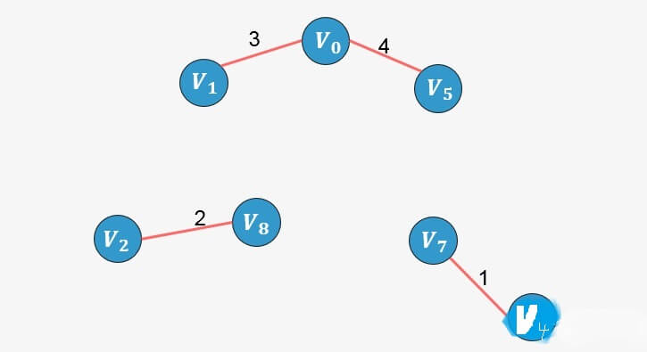
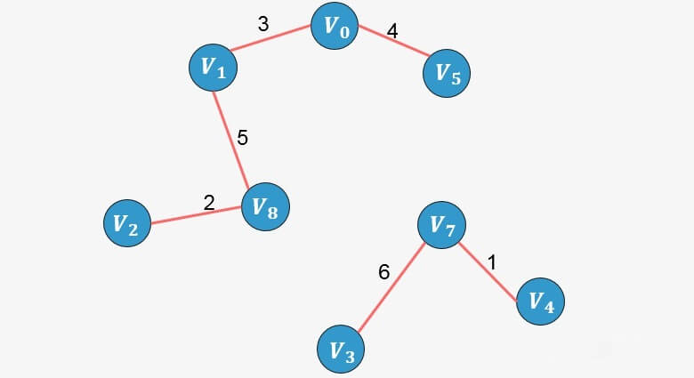
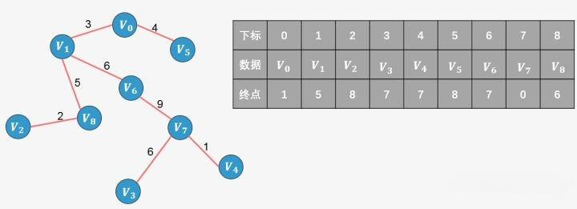
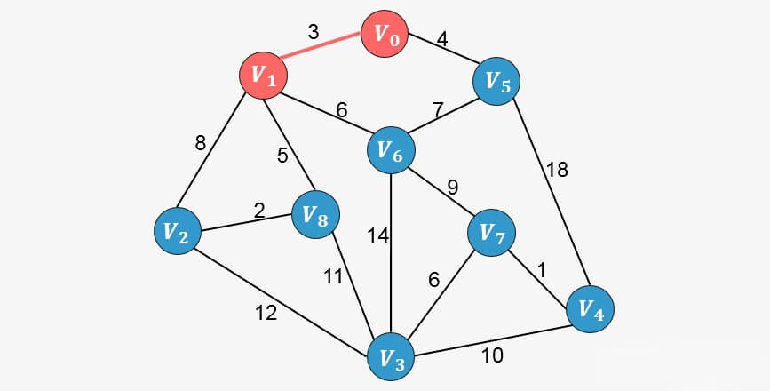
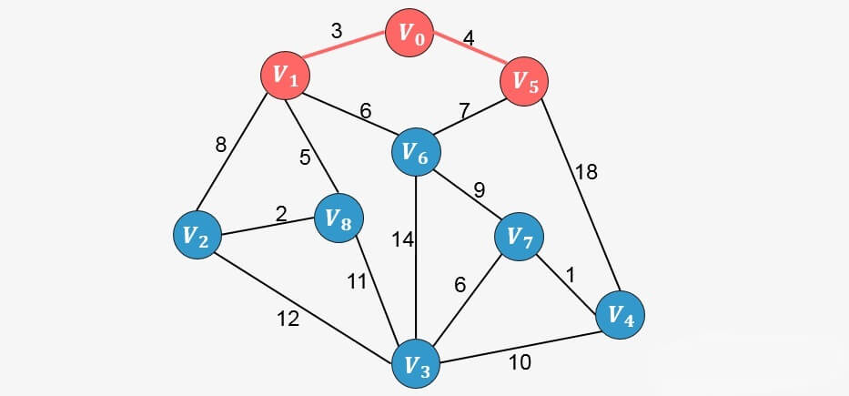
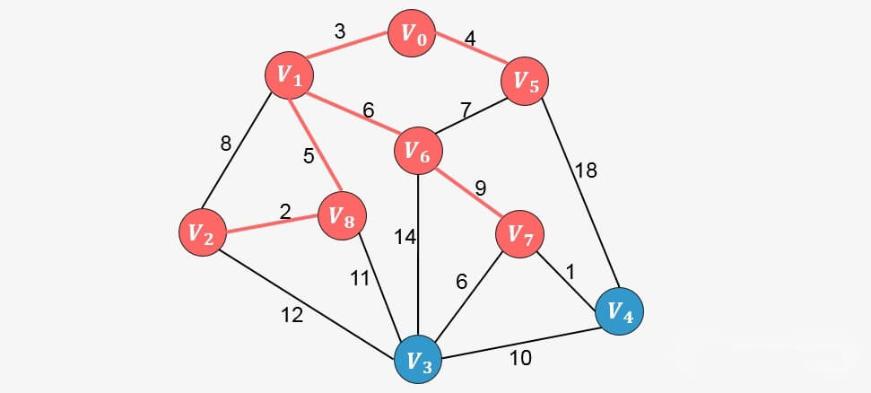

# 最小生成树

### 生成树
在无向图G中，如果从顶点V1到顶点V2有路径，则称V1和V2是连通的，
如果对于图中任意两个顶点Vi和Vj都是连通的，则称G是连通图(Connected Graph)。

无向图中的极大连通子图称为连通分量。

注意以下概念：

* 首先要是子图，并且子图是要连通的；
* 连通子图含有极大顶点数；

具有极大顶点数的连通子图包含依附于这些顶点的所有边


在有向图G中，如果对于每一对Vi到Vj都存在路径，则称G是强连通图。

有向图中的极大强连通子图称为有向图的强连通分量。

下图左侧并不是强连通图（不满足每一对Vi到Vj都存在路径），右侧是。并且右侧是左侧的极大强连通子图，也是左侧的强连通分量。


最后我们再来看连通图的生成树定义。

所谓的一个连通图的生成树是一个极小的连通子图，它含有图中全部的n个顶点，但只有构成一棵树的n-1条边。


如果一个有向图恰有一个顶点入度为0，其余顶点的入度均为1，则是一棵有向树。

### 生成树的定义

一个连通图的生成树是一个极小的连通子图，它包含图中全部的n个顶点，但只有构成一棵树的n-1条边。


可以看到一个包含3个顶点的完全图可以产生3颗生成树。对于包含n个顶点的无向完全图最多包含 ![[公式]](https://www.zhihu.com/equation?tex=n%5E%7Bn-2%7D) 颗生成树。比如上图中包含3个顶点的无向完全图，生成树的个数为：  ![[公式]](https://www.zhihu.com/equation?tex=3%5E%7B3-2%7D%3D3).

### 生成树的属性

* 一个连通图可以有多个生成树；
* 一个连通图的所有生成树都包含相同的顶点个数和边数；
* 生成树当中不存在环；
* 移除生成树中的任意一条边都会导致图的不连通， 生成树的边最少特性；
* 在生成树中添加一条边会构成环。
* 对于包含n个顶点的连通图，生成树包含n个顶点和n-1条边；
* 对于包含n个顶点的无向完全图最多包含 [公式] 颗生成树。

### 最小生成树

所谓一个 带权图 的最小生成树，就是原图中边的权值最小的生成树 ，所谓最小是指边的权值之和小于或者等于其它生成树的边的权值之和。

首先你明白最小生成树是和带权图联系在一起的；如果仅仅只是非带权的图，只存在生成树。其他的，我们看栗子解决就好了。


上图中，原来的带权图可以生成左侧的两个最小生成树，这两颗最小生成树的权值之和最小，且包含原图中的所有顶点。

看图就是清晰，一下子理解了，但我们又如何从原图得到最小生成树呢？

最小生成树算法有很多，其中最经典的就是克鲁斯卡尔（Kruskal）算法和 普里姆（Prim）算法，也是我们考试、面试当中经常遇到的两个算法。

### Kruskal算法

克鲁斯卡尔算法（Kruskal）是一种使用贪婪方法的最小生成树算法。 该算法初始将图视为森林，图中的每一个顶点视为一棵单独的树。
 一棵树只与它的邻接顶点中权值最小且不违反最小生成树属性（不构成环）的树之间建立连边。


第一步：将图中所有的边按照权值进行非降序排列；


第二步：从图中所有的边中选择可以构成最小生成树的边。

1. 选择权值最小的边 ![[公式]](https://www.zhihu.com/equation?tex=V_4-V_7)：没有环形成，则添加：


2. 选择边 ![[公式]](https://www.zhihu.com/equation?tex=V_2-V_8)：没有形成环，则添加：


3. 选择边 ![[公式]](https://www.zhihu.com/equation?tex=V_0-V_1)：没有形成环，则添加：


4.  选择边 ![[公式]](https://www.zhihu.com/equation?tex=V_0-V_5)：没有形成环，则添加：


5. 选择边 ![[公式]](https://www.zhihu.com/equation?tex=V_1-V_8)：没有形成环，则添加：


6. 选择边 ![[公式]](https://www.zhihu.com/equation?tex=V_3-V_7)：没有形成环，则添加：


7. 选择边 ![[公式]](https://www.zhihu.com/equation?tex=V_1-V_6)：没有形成环，则添加：
  

8. 选择边 ![[公式]](https://www.zhihu.com/equation?tex=V_5-V_6)：添加这条边将导致形成环，舍弃，不添加；
9. 选择边 ![[公式]](https://www.zhihu.com/equation?tex=V_1-V_2)：添加这条边将导致形成环，舍弃，不添加；
10. 选择边 ![[公式]](https://www.zhihu.com/equation?tex=V_6-V_7)：没有形成环，则添加：
  

此时已经包含了图中顶点个数9减1条边，算法停止。

##### 我们该如何判断添加一条边后是否形成环呢？

要判断添加一条边 X-Y 是否形成环，我们可以判断顶点X在最小生成树中的终点与顶点Y在最小生成树中的终点是否相同，如果相同则说明存在环路，否则不存环路，从而决定是否添加一条边。

所谓终点，就是将所有顶点按照从小到大的顺序排列好之后；某个顶点的终点就是"与它连通的最大顶点"。看下图，我们可以对图中顶点进行排序，排序后的顶点存放在一个数组中，每一个顶点则对应一个下标，同样的我们针对排序后的数组创建一个顶点的终点数组，初始时图中的每一个顶点是一棵树，每一个顶点的终点初始化为自身，我们用0来表示。

  

回到之前的算法执行过程，我们配合这个终点数组再来一次。

1. 选择权值最小的边 ![[公式]](https://www.zhihu.com/equation?tex=V_4-V_7)：没有环形成（![[公式]](https://www.zhihu.com/equation?tex=V_4) 的终点为4， ![[公式]](https://www.zhihu.com/equation?tex=V_7)的终点为7），则添加，并更新终点数组：
  
此时发现4的终点更新为7；

2. 选择边 ![[公式]](https://www.zhihu.com/equation?tex=V_2-V_8)：没有形成环（![[公式]](https://www.zhihu.com/equation?tex=V_2) 的终点为2， ![[公式]](https://www.zhihu.com/equation?tex=V_8)的终点为8），则添加，并更新终点数组：
  
2的终点更新为8；

3. 选择边 ![[公式]](https://www.zhihu.com/equation?tex=V_0-V_1)：没有形成环（![[公式]](https://www.zhihu.com/equation?tex=V_0) 的终点为0， ![[公式]](https://www.zhihu.com/equation?tex=V_1)的终点为1），则添加，并更新终点数组：
 
0的终点更新为1；

4. 选择边![[公式]](https://www.zhihu.com/equation?tex=V_0-V_5)：没有形成环（![[公式]](https://www.zhihu.com/equation?tex=V_0) 的终点为1，![[公式]](https://www.zhihu.com/equation?tex=V_5)的终点为5），则添加，并更新终点数组：
 
将 1的终点更新为5；

5. 选择边 ![[公式]](https://www.zhihu.com/equation?tex=V_1-V_8)：没有形成环（![[公式]](https://www.zhihu.com/equation?tex=V_1) 的 终点为5， ![[公式]](https://www.zhihu.com/equation?tex=V_8) 的 终点为8），则添加，并更新数组：
 
将 5的终点更新为8；

6. 选择边![[公式]](https://www.zhihu.com/equation?tex=V_3-V_7)：没有形成环（![[公式]](https://www.zhihu.com/equation?tex=V_3)的 终点为3， ![[公式]](https://www.zhihu.com/equation?tex=V_7) 的 终点为7 ），则添加，并更新数组：
 
将 3的终点更新为7；

7. 选择边  ![[公式]](https://www.zhihu.com/equation?tex=V_1-V_6)：没有形成环 （![[公式]](https://www.zhihu.com/equation?tex=V_1) 的 终点为8，![[公式]](https://www.zhihu.com/equation?tex=V_6) 的 终点为6 ），则添加，并更新终点数组：
 
将 8的终点更新为6；

8. 选择边![[公式]](https://www.zhihu.com/equation?tex=V_5-V_6)：添加这条边将导致形成环 （![[公式]](https://www.zhihu.com/equation?tex=V_5)的 终点为6， ![[公式]](https://www.zhihu.com/equation?tex=V_6) 的 终点为6 ，两个顶点的终点相同则说明添加后会形成环），舍弃，不添加；

9. 选择边![[公式]](https://www.zhihu.com/equation?tex=V_1-V_2)：添加这条边将导致形成环（![[公式]](https://www.zhihu.com/equation?tex=V_1)的 终点为6，![[公式]](https://www.zhihu.com/equation?tex=V_2) 的 终点为6 ，两个顶点的终点相同则说明添加后会形成环），舍弃，不添加；

10. 选择边 ![[公式]](https://www.zhihu.com/equation?tex=V_6-V_7)：没有形成环（![[公式]](https://www.zhihu.com/equation?tex=V_6) 的 终点为6， ![[公式]](https://www.zhihu.com/equation?tex=V_7) 的 终点为7 ），则添加：
 
将 6的终点更新为7；此时已经包含了图中顶点个数9减1条边，算法停止。

##### 实现

```java
int Find(int *parent, int f)
{
 while( parent[f] > 0 )
 {
  f = parent[f];
 }
 
 return f;
}

// Kruskal算法生成最小生成树
void MiniSpanTree_Kruskal(MGraph G)
{
 int i, n, m;
 Edge edges[MAGEDGE]; // 定义边集数组
 int parent[MAXVEX];  // 定义parent数组用来判断边与边是否形成环路
 int eCount = 0;
 for( i=0; i < G.numVertexes; i++ )
 {
  parent[i] = 0;
 }
 
 for( i=0; i < G.numEdges; i++ )
 {
  n = Find(parent, edges[i].begin); // 4 2 0 1 5 3 8 6 6 6 7
  m = Find(parent, edges[i].end);  // 7 8 1 5 8 7 6 6 6 7 7
  
  if( n != m )  // 如果n==m，则形成环路，不满足！
  {
   
   parent[n] = m; // 将此边的结尾顶点放入下标为起点的parent数组中，表示此顶点已经在生成树集合中
   printf("(%d, %d) %d ", edges[i].begin, edges[i].end, edges[i].weight);
   ++eCount;
   if( eCount == (G.numVertexes-1)){
    break;
   }
  }
 }
}
```

##### 时间复杂度分析

O(ElogE)或者O(ElogV)，其中E代表图中的边的数目，V代表图中的顶点数目。对图中的边按照非降序排列需要O(ElogE)的时间。排序后遍历所有的边并判断添加边是否构成环，判断添加一条边是否构成环最坏情况下需要O(logV)，关于这个复杂度等到景禹给你们谈并查集的时候再分析；因此，总的时间复杂度为O(ElogE + ElogV)，其中E的值最大为V(V-1)/2，因此O(logV) 等于 O(logE)。因此，总的时间复杂度为O(ElogE) 或者O(ElogV)。

### Prim算法

普里姆算法在找最小生成树时，将顶点分为两类，一类是在查找的过程中已经包含在生成树中的顶点（假设为 A 类），剩下的为另一类（假设为 B 类）。

对于给定的连通网，起始状态全部顶点都归为 B 类。在找最小生成树时，选定任意一个顶点作为起始点，并将之从 B 类移至 A 类；然后找出 B 类中到 A 类中的顶点之间权值最小的顶点，将之从 B 类移至 A 类，如此重复，直到 B 类中没有顶点为止。所走过的顶点和边就是该连通图的最小生成树。

我们同样以下图为栗子进行说明：

 

假如从顶点 ![[公式]](https://www.zhihu.com/equation?tex=V_0) 出发，顶点![[公式]](https://www.zhihu.com/equation?tex=V_1) 、![[公式]](https://www.zhihu.com/equation?tex=V_5)的权值分别为3、4，所以对于顶点 ![[公式]](https://www.zhihu.com/equation?tex=V_0)来说，到顶点 ![[公式]](https://www.zhihu.com/equation?tex=V_1) 的权值最小，将顶点 ![[公式]](https://www.zhihu.com/equation?tex=V_1) 加入到生成树中：

 

继续分析与顶点 ![[公式]](https://www.zhihu.com/equation?tex=V_0) 和 ![[公式]](https://www.zhihu.com/equation?tex=V_1) 相邻的所有顶点（包括 ![[公式]](https://www.zhihu.com/equation?tex=V_2) 、![[公式]](https://www.zhihu.com/equation?tex=V_5)、![[公式]](https://www.zhihu.com/equation?tex=V_6)、![[公式]](https://www.zhihu.com/equation?tex=V_8)），其中权值最小的为 ![[公式]](https://www.zhihu.com/equation?tex=V_5) ， 将 ![[公式]](https://www.zhihu.com/equation?tex=V_5)  添加到生成树当中：

 

继续分析与顶点![[公式]](https://www.zhihu.com/equation?tex=V_0) 和 ![[公式]](https://www.zhihu.com/equation?tex=V_1) 、![[公式]](https://www.zhihu.com/equation?tex=V_5)相邻的所有顶点中权值最小的顶点，发现为 ![[公式]](https://www.zhihu.com/equation?tex=V_8) ，则添加到生成树当中。

 

继续分析与生成树中已添加顶点相邻的顶点中权值最小的顶点，发现为![[公式]](https://www.zhihu.com/equation?tex=V_2) ，则添加到生成树中：

 

重复上面的过程，直到生成树中包含图中的所有顶点，我们直接看接下来的添加过程：

 

 

 

 

此时算法结束，我们找出了图中的最小生成树。

### 时间复杂度分析

上面的代码中，当 i == 1的时候，内层的 while 与 for 循环中 j 的取值范围是从 1 到 n-1，内循环一共计算了 2(n-1) 次，其中n为图中的顶点个数；

当 i == 2 的时候，内层循环还是一共计算 2(n-1) 次；

以此类推......

i 取最大值 n -1，内层循环还是一共计算 2(n-1) 次；

所以，整体的执行次数就是 (n-1) * 2(n-1)，Prim算法的复杂度是 [公式] 级别的。

### 应用实例

某公司规模不断扩大，在全国各地设立了多个分公司，为了提高公司的工作效率，使各分公司之间的信息可以更快、更准确的进行交流，该公司决定要在各分公司之间架设网络，由于地理位置和距离等其他因素，使各个分公司之间架设网线的费用不同，公司想各分公司之间架设网线的费用降到最低，那么应该怎样来设计各分公司及总公司之间的线路？该公司的所有分公司及总公司的所在位置如下图所示，顶点代表位置及公司名称，边表示可以架设网线的路线，边上的数字代表架设该网线所需要的各种花费的总和。这样就构成了一个带权的连通图，从而问题就转化为求所得到的带权连通图的最小生成树。

 


### 总结

最小生成树的问题，简单得理解就是给定一个带有权值的连通图（连通网），从众多的生成树中筛选出权值总和最小的生成树，即为该图的最小生成树。

最经典的两个最小生成树算法： Kruskal 算法与 Prim 算法。两者分别从不同的角度构造最小生成树，Kruskal 算法从边的角度出发，使用贪心的方式选择出图中的最小生成树，而 Prim 算法从顶点的角度出发，逐步找各个顶点上最小权值的边来构建最小生成树的。

最小生成树问题应用广泛，最直接的应用就是网线架设、道路铺设。还可以间接应用于纠错的LDPC码、Renyi 熵图像配准、学习用于实时脸部验证的显著特征、减少蛋白质氨基酸序列测序中的数据存储，在湍流（turbulent）中模拟粒子交互的局部性，以及用于以太网桥接的自动配置，以避免在网络中形成环路。除此之外，最小生成树在聚类算法中也是应用广泛。

所以一定要搞懂最小生成树、Kruskal 算法及Prim 算法奥！！！
