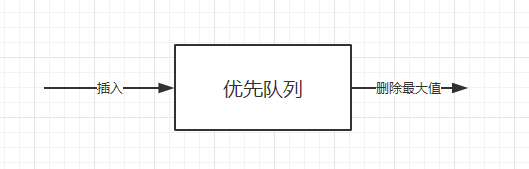
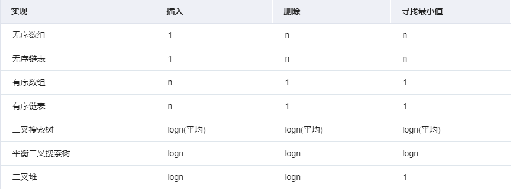

# 优先队列

听这个名字就能知道，优先队列也是一种队列，只不过不同的是，优先队列的出队顺序是按照优先级来的；在有些情况下，可能需要找到元素集合中的最小或者最大元素，可以利用优先队列ADT来完成操作，优先队列ADT是一种数据结构，它支持插入和删除最小值操作（返回并删除最小元素）或删除最大值操作（返回并删除最大元素）；
这些操作等价于队列的**enQueue**和**deQueue**操作，区别在于，对于优先队列，元素进入队列的顺序可能与其被操作的顺序不同，作业调度是优先队列的一个应用实例，它根据优先级的高低而不是先到先服务的方式来进行调度；



如果最小键值元素拥有最高的优先级，那么这种优先队列叫作**升序优先队列**（即总是先删除最小的元素），类似的，如果最大键值元素拥有最高的优先级，那么这种优先队列叫作**降序优先队列**（即总是先删除最大的元素）；由于这两种类型时对称的，所以只需要关注其中一种，如升序优先队列；

#### 优先队列的应用
* 数据压缩：赫夫曼编码算法；
* 最短路径算法：Dijkstra算法；
* 最小生成树算法：Prim算法；
* 事件驱动仿真：顾客排队算法；
* 选择问题：查找第k个最小元素；
* 等等等等....

#### 优先队列的实现比较


#### 二叉堆

[二叉堆）](./BinaryHeap.md)

基于二叉堆实现的简单降序优先队列
```java
package datastructure.queue;

import java.util.Arrays;

/**
 * 降序优先队列
 */
public class MaxPriorityQueue {
    private int size = 0;
    private int[] array;

    public MaxPriorityQueue() {
        array = new int[32];
    }

    public MaxPriorityQueue(int size) {
        array = new int[size];
    }

    public MaxPriorityQueue(int[] array) {
        this.size = array.length;
        this.array = array;
        synchronized (this.array) {

            for (int parentIndex = 0; parentIndex < this.size / 2; parentIndex++) {
                int childIndex = 2 * parentIndex + 1;
                if (childIndex + 1 < this.size && array[childIndex] < array[childIndex + 1]) {
                    childIndex++;
                }
                if (array[childIndex] > array[parentIndex]) {
                    int temp = array[parentIndex];
                    array[parentIndex] = array[childIndex];
                    array[childIndex] = temp;
                }
            }
        }


    }

    public void add(int element) {

        if (size >= array.length) {
            System.out.println("resize");
            resize();
            System.out.println("resize over");
        }

        array[size++] = element;
        upAdjust();
    }

    public int pop() {

        if (size < 1) {
            throw new RuntimeException("the queue is empty!");
        }

        int head = array[0];
        array[0] = array[--size];
        downAdjust();
        return head;
    }

    private void downAdjust() {
        int parentIndex = 0;
        int temp = array[parentIndex];
        int childIndex = 2 * parentIndex + 1;
        while (childIndex < this.size) {
            if (childIndex + 1 < this.size && array[childIndex] < array[childIndex + 1]) {
                childIndex++;
            }
            if (array[childIndex] > temp) {

                array[parentIndex] = array[childIndex];
                parentIndex = childIndex;
                childIndex = 2 * parentIndex + 1;
            } else {
                break;
            }
        }
        array[parentIndex] = temp;
    }

    private void upAdjust() {
        int childIndex = this.size - 1;
        int parentIndex = (childIndex - 1) / 2;
        int temp = this.array[childIndex];
        while (childIndex > 0 && temp > array[parentIndex]) {
            array[childIndex] = array[parentIndex];
            childIndex = parentIndex;
            parentIndex = (childIndex - 1) / 2;
        }
        this.array[childIndex] = temp;
    }

    private void resize() {
        int newSize = this.size * 2;
        this.array = Arrays.copyOf(this.array, newSize);
    }

    public int size() {
        return this.size;
    }


    public static void main(String[] args) {
        int[] array = {1, 2, 9, 4, 6, 7, 8, 3, 0, 5};

        System.out.println("原始数组：" + Arrays.toString(array));
        MaxPriorityQueue queue = new MaxPriorityQueue(array);
        System.out.println("准备添加");
        queue.add(14);
        queue.add(11);
        queue.add(20);
        queue.add(12);
        System.out.println("添加完");

        int size = queue.size();
        for (int i = 0; i < size; i++) {
            System.out.println(queue.pop());
        }

    }

}

```

#### java 中的优先队列

在Java中也实现了自己的优先队列**java.util.PriorityQueue**，与我们自己写的不同之处在于，Java中内置的为最小堆，然后就是一些函数名不一样，底层还是维护了一个Object类型的数组，大家可以戳戳看有什么不同，另外如果想要把最小堆变成最大堆可以给PriorityQueue传入自己的比较器

#### LeetCode相关题目整理

###### 23. 合并K个排序链表


###### 215. 数组中的第K个最大元素

###### 239. 滑动窗口最大值

###### 264. 丑数 II


###### 295.数据流的中位数

###### 347. 前K个高频元素

###### 692. 前K个高频单词

