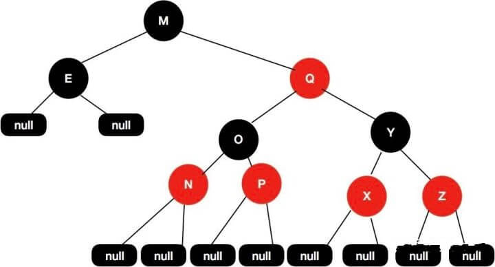
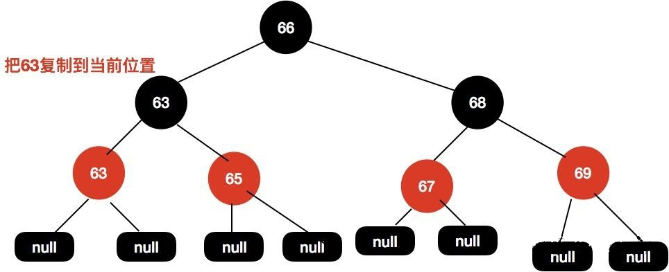

# 红黑树

红黑树是树的数据结构中最为重要的一种。Java的容器TreeSet、TreeMap均使用红黑树实现。
JDK1.8中HashMap中也加入了红黑树。C++ STL中的map和set同样使用红黑树实现。

红黑树和平衡二叉树类似，本质上都是为了解决排序二叉树在极端情况下退化成链表导致检索效率大大降低的问题。
红黑树最早是由 Rudolf Bayer 于 1972 年发明的。
红黑树首先肯定是一个排序二叉树，它在每个节点上增加了一个存储位来表示节点的颜色，
可以是 RED 或 BLACK 。

下图所示的一棵红黑树：

平衡二叉树真的很不错，在查找时既有着二叉查找树的优越性，
在插入时还能通过调整继续保持着。那么为什么还要使用到红黑树呢？我觉得可以从以下两个方面来考虑：

1. 删除：对于平衡二叉树来说，在最坏情况下，需要维护从被删节点到根节点这条路径上所有节点的平衡性，
旋转的量级是O(logN)。但是红黑树就不一样了，最多只需3次旋转就会重新平衡，旋转的量级是O(1)。

2. 保持平衡：平衡二叉树高度平衡，这也就意味着在大量插入和删除节点的场景下，
平衡二叉树为了保持平衡需要调整的频率会更高。

注意：在大量查找的情况下，平衡二叉树的效率更高，也是首要选择。在大量增删的情况下，红黑树是首选。

鉴于以上原因，因此我们才使用到了红黑树这种更好的结构。

### 定义

红黑树是每个节点都带有颜色属性的平衡二叉查找树 ，颜色为红色或黑色。
除了二叉查找树一般要求以外，对于任何有效的红黑树我们增加了如下的额外要求(红黑树的特性):

1. 每个节点要么是红色，要么是黑色。
1. 根节点永远是黑色的。
1. 所有的叶子节点都是空节点（即null），并且是黑色的。
1. 每个红色节点的两个子节点都是黑色。（从每个叶子到根的路径上不会有两个连续的红色节点。）
1. 从任一节点到其子树中每个叶子节点的路径都包含相同数量的黑色节点。

    针对上面的 5 种性质，我们简单理解下，
    对于性质 1 和性质 2 ，相当于是对红黑树每个节点的约束，根节点是黑色，其他的节点要么是红色，要么是黑色。
    对于性质 3 中指定红黑树的每个叶子节点都是空节点，而且叶子节点都是黑色，但 Java 实现的红黑树会使用 null 来代表空节点，因此我们在遍历 Java里的红黑树的时候会看不到叶子节点，而看到的是每个叶子节点都是红色的，这一点需要注意。
    对于性质 5，这里我们需要注意的是，这里的描述是从任一节点，从任一节点到它的子树的每个叶子节点黑色节点的数量都是相同的，这个数量被称为这个节点的黑高。如果我们从根节点出发到每个叶子节点的路径都包含相同数量的黑色节点，这个黑色节点的数量被称为树的黑色高度。树的黑色高度和节点的黑色高度是不一样的，这里要注意区分。
    
其实到这里有人可能会问了，红黑树的性质说了一大堆，
那是不是说只要保证红黑树的节点是红黑交替就能保证树是平衡的呢？

其实不是这样的，我们可以看来看下面这张图：

左边的子树都是黑色节点，但是这个红黑树依然是平衡的，5 条性质它都满足。
这个树的黑色高度为 3，从根节点到叶子节点的最短路径长度是 2，该路径上全是黑色节点，包括叶子节点，
从根节点到叶子节点最长路径为 4，每个黑色节点之间会插入红色节点。
通过上面的性质 4 和性质 5，其实上保证了没有任何一条路径会比其他路径长出两倍，所以这样的红黑树是平衡的。

其实这算是一个推论，红黑树在最差情况下，最长的路径都不会比最短的路径长出两倍。
其实红黑树并不是真正的平衡二叉树，它只能保证大致是平衡的，因为红黑树的高度不会无限增高，
在实际应用用，红黑树的统计性能要高于平衡二叉树，但极端性能略差。

###### 定义节点名称：

    父节点——P(Parent)
    祖父节点——G(GrandParent)
    叔叔节点——U(Uncle)
    当前节点——C(Current)
    兄弟节点——B(Brother)
    左孩子——L(Left)
    右孩子——R(Right)

### 性质

根节点到任意叶子节点的路径长度，最多相差一半。若树存在最短路径，则最短路径上均为黑色节点，
那么第五条性质保证根节点到达最长路径与最短路径所包含的黑色节点数目相同，若最短路径长为N，
则最长路径M=N+红色节点数目，性质4要求红色节点必定不连续，因此红色节点数目最多为N，
则最长路径与最短路径最多相差N。

### 红黑树与AVL

AVL是一种极度平衡的二叉树，那为什么不用AVL呢？因为AVL插入删除要保持平衡，
相比红黑树要慢一些，需要左旋右旋等等。但实际上它的旋转也只是几个场景的套用
，哪些场景需要怎么旋转，理解就行了。

而红黑树是近似平衡的（黑平衡），也就是说它不像AVL那样绝对的平衡，
所以添加/删除节点后的平衡操作没那么多。

所以对于插入和删除操作较多的场景，用红黑树效率会高一些。

### 将2-3树转换成红黑树

* 主要思想：3节点分裂成2节点。

将3节点的第一个元素，作为第二个元素的左节点，并用红色的线连接，此时红色线连接的节点就相当于红色。

将2-3树按照以上思想转换后，就得到了一颗红黑树。用这种方式理解是不是简单多了呢？

同时也有几个问题值得我们思考：

* 为什么红链规定在左边呢？

我觉得是前人的一个约定，为了保持统一，简化处理，都放在左边。那都放右边是不是也可以呢？

* 没有任何一个节点同时与两个红链接相连

因为一个红链表示一个3节点，如果有2个红链相连，则表示为4节点，不符合2-3树定义。

* 根节点为黑色

只有3节点的左链才为红色。根节点没有父节点，不可能为红色。

* 根节点到叶子节点经过的黑色节点数目相同

因为2-3树是完美平衡的。红黑树中经过的黑节点数=其层数。

### 2-3-4树和红黑树的等价关系

如果一棵树满足红黑树，把红色节点收缩到其父节点，就变成了2-3-4树，
所有红色节点都与其父节点构成3或4节点，其它节点为2节点。
一颗红黑树对应唯一形态的2-3-4树，但是一颗2-3-4树可以对应多种形态的红黑树
（主要是3节点可以对应两种不同的红黑树形态）。

之前的文章已经详细介绍了2-3-4树的性质与操作。

2-3-4树和红黑树是完全等价的，但是2-3-4树的编程实现相对复杂，
所以一般是通过实现红黑树来实现替代2-3-4树，
而红黑树也同样保证在O(logN)的时间内完成查找、插入和删除操作。

### 查找

红黑树的查找操作与二叉搜索树查找方式一致，这里不再赘述。

### 插入

想要彻底理解红黑树，除了上面说到的理解红黑树的性质以外，就是理解红黑树的插入操作了。
红黑树的插入和普通排序二叉树的插入基本一致，排序二叉树的要求是左子树上的所有节点都要比根节点小，
右子树上的所有节点都要比跟节点大，当插入一个新的节点的时候，
首先要找到当前要插入的节点适合放在排序二叉树哪个位置，然后插入当前节点即可。
红黑树和排序二叉树不同的是，红黑树需要在插入节点调整树的结构来让树保持平衡。

一般情况下，红黑树中新插入的节点都是红色的，那么，为什么说新加入到红黑树中的节点要是红色的呢？

这个问题可以这样理解，我们从性质5中知道，当前红黑树中从根节点到每个叶子节点的黑色节点数量是一样的，
此时假如新的黑色节点的话，必然破坏规则，但加入红色节点却不一定，
除非其父节点就是红色节点，因此加入红色节点，破坏规则的可能性小一些。

接下来我们重点来讲红黑树插入新节点后是如何保持平衡的。

给定下面这样一颗红黑树：

当我们插入值为66的节点的时候，示意图如下：

很明显，这个时候结构依然遵循着上述5大特性，无需启动自动平衡机制调整节点平衡状态。
如果再向里面插入值为51的节点呢，这个时候红黑树变成了这样。

这样的结构实际上是不满足性质4的，红色两个子节点必须是黑色的，而这里49这个红色节点现在有个51的红色节点与其相连。

这个时候我们需要调整这个树的结构来保证红黑树的平衡。

首先尝试将49这个节点设置为黑色，如下示意图。

这个时候我们发现黑高是不对的，其中 60-56-45-49-51-null 这条路径有 4 个黑节点，其他路径的黑色节点是 3 个。

接着调整红黑树，我们再次尝试把45这个节点设置为红色的，如下图所示：

这个时候我们发现问题又来了，56-45-43 都是红色节点的，出现了红色节点相连的问题。

于是我们需要再把 56 和 43 设置为黑色的，如下图所示。

于是我们把 68 这个红色节点设置为黑色的。

对于这种红黑树插入节点的情况下，我们可以只需要通过变色就可以保持树的平衡了。但是并不是每次都是这么幸运的，当变色行不通的时候，我们需要考虑另一个手段就是旋转了。
例如下面这种情况，同样还是拿这颗红黑树举例。

现在这颗红黑树，我们现在插入节点65。

我们尝试把 66 这个节点设置为黑色，如下图所示。

这样操作之后黑高又出现不一致的情况了，60-68-64-null 有 3 个黑色节点，而60-68-64-66-null 这条路径有 4 个黑色节点，这样的结构是不平衡的。

或者我们把 68 设置为黑色，把 64 设置为红色，如下图所示：

但是，同样的问题，上面这颗红黑树的黑色高度还是不一致，60-68-64-null 和 60-68-64-66-null 这两条路径黑色高度还是不一致。

这种情况如果只通过变色的情况是不能保持红黑树的平衡的。

#### 红黑树的旋转

接下来我们讲讲红黑树的旋转，旋转分为左旋和右旋。

###### 左旋

文字描述：逆时针旋转两个节点，让一个节点被其右子节点取代，而该节点成为右子节点的左子节点。

文字描述太抽象，接下来看下图片展示。

首先断开节点PL与右子节点G的关系，同时将其右子节点的引用指向节点C2；然后断开节点G与左子节点C2的关系，同时将G的左子节点的应用指向节点PL。

接下来再放下 gif 图，希望能帮助大家更好地理解左旋，图片来自网络。

###### 右旋

文字描述：顺时针旋转两个节点，让一个节点被其左子节点取代，而该节点成为左子节点的右子节点。

右旋的图片展示：

首先断开节点G与左子节点PL的关系，同时将其左子节点的引用指向节点C2；然后断开节点PL与右子节点C2的关系，同时将PL的右子节点的应用指向节点G。

右旋的gif展示（图片来自网络）:

介绍完了左旋和右旋基本操作，我们来详细介绍下红黑树的几种旋转场景。

左左节点旋转（插入节点的父节点是左节点，插入节点也是左节点）

如下图所示的红黑树，我们插入节点是65。

操作步骤如下可以围绕祖父节点 69 右旋，再结合变色，步骤如下所示：

左右节点旋转（插入节点的父节点是左节点，插入节点是右节点）

还是上面这颗红黑树，我们再插入节点 67。

这种情况我们可以这样操作，先围绕父节点 66 左旋，
然后再围绕祖父节点 69 右旋，最后再将 67 设置为黑色，把 69 设置为红色，
如下图所示。

右左节点旋转（插入节点的父节点是右节点，插入节点左节点）
如下图这种情况，我们要插入节点68。

这种情况，我们可以先围绕父节点 69 右旋，接着再围绕祖父节点 66 左旋，
最后把 68 节点设置为黑色，把 66 设置为红色，我们的具体操作步骤如下所示。

右右节点旋转（插入节点的父节点是右节点，插入节点也是右节点）
还是来上面的图来举例，我们在这颗红黑树上插入节点 70 。

我们可以这样操作围绕祖父节点 66 左旋，再把旋转后的根节点 69 设置为黑色，
把 66 这个节点设置为红色。具体可以参看下图：

### 红黑树的删除

删除相对插入来说，相对更复杂一点，
但是复杂的地方是因为在删除节点的这个操作情况有很多种，
但是插入不一样，插入节点的时候实际上这个节点的位置是确定的，
在节点插入成功后只需要调整红黑树的平衡就可以了。

但是删除不一样的是，删除节点的时候我们不能简单地把这个节点设置为null，
因为如果这个节点有子节点的情况下，不能简单地把当前删除的节点设置为null，
这个被删除的节点的位置需要有新的节点来填补。这样一来，需要分多种情况来处理了。

#### 删除节点是根节点
直接删除根节点即可。

#### 删掉节点的左子节点和右子节点都是为空
直接删除当前节点即可。

#### 删除节点有一个子节点不为空
这个时候需要使用子节点来代替当前需要删除的节点，然后再把子节点删除即可。

给定下面这棵树，当我们需要删除节点69的时候。

首先用子节点代替当前待删除节点，然后再把子节点删除。

最终的红黑树结构如下面所示，这个结构的红黑树我们是不需要通过变色+旋转来保持红黑树的平衡了，因为将子节点删除后树已经是平衡的了。

还有一种场景是当我们待删除节点是黑色的，黑色的节点被删除后，树的黑高就会出现不一致的情况，这个时候就需要重新调整结构。

还是拿上面这颗删除节点后的红黑树举例，我们现在需要删除节点67。

因为67 这个节点的两个子节点都是null，所以直接删除,得到如下图所示结构：

这个时候我们树的黑高是不一致的，左边黑高是3，右边是2，所以我们需要把64节点设置为红色来保持平衡。

###### 删除节点两个子节点都不为空

删除节点两个子节点都不为空的情况下，跟上面有一个节点不为空的情况下也是有点类似，
同样是需要找能替代当前节点的节点，找到后，把能替代删除节点值复制过来，然后再把替代节点删除掉。

* 先找到替代节点，也就是前驱节点或者后继节点
* 然后把前驱节点或者后继节点复制到当前待删除节点的位置，然后在删除前驱节点或者后继节点。

那么什么叫做前驱，什么叫做后继呢？ 前驱是左子树中最大的节点，后继则是右子树中最小的节点。

前驱或者后继都是最接近当前节点的节点，当我们需要删除当前节点的时候，也就是找到能替代当前节点的节点，能够替代当前节点肯定是最接近当前节点。

在当前删除节点两个子节点不为空的场景下，我们需要再进行细分，主要分为以下三种情况。
第一种，前驱节点为黑色节点，同时有一个非空节点

如下面这样一棵树，我们需要删除节点64：

首先找到前驱节点，把前驱节点复制到当前节点：

接着删除前驱节点。

这个时候63和60这个节点都是红色的，我们尝试把60这个节点设置为黑色即可使整个红黑树达到平衡。

第二种，前驱节点为黑色节点，同时子节点都为空

前驱节点是黑色的，子节点都为空，这个时候操作步骤与上面基本类似。

如下操作步骤：

因为要删除节点64，接着找到前驱节点63，把63节点复制到当前位置，然后将前驱节点63删除掉，变色后出现黑高不一致的情况下，最后把63节点设置为黑色，把65节点设置为红色，这样就能保证红黑树的平衡。

第三种，前驱节点为红色节点，同时子节点都为空

给定下面这颗红黑树，我们需要删除节点64的时候。

同样地，我们找到64的前驱节点63，接着把63赋值到64这个位置。

然后删除前驱节点。

删除节点后不需要变色也不需要旋转即可保持树的平衡。

### 红黑树在 Java 中的实现

Java 中的红黑树实现类是 TreeMap ，
接下来我们尝试从源码角度来逐行解释 TreeMap 这一套机制是如何运作的。

### 思考题

* 请画出下图的插入自平衡处理过程。

* 黑结点可以同时包含一个红子结点和一个黑子结点吗？
答：可以。如下图的F结点：

* 请画出下图的删除自平衡处理过程。

