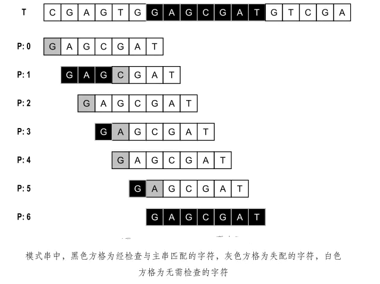

# 串 （String）

> 串是由有限个字符组成的一种线性结构，其中每个字符都来自某个字符表（Alphabet）Σ，比如 ASCII 字符集或 Unicode 字符集。

串具有两个突出的特点：结构简单，规模庞大。

* 结构简单，一方面是线性结构，另一方面是指字符表规模不大，在某些应用问题中，字符表的规模甚至可能极小。以生物信息序列为例，
组成蛋白质（文本）的氨基酸（字符）只有约 20 种，而组成DNA序列（文本）的碱基（字符）则只有 4 种。
* 然而，这类文本的规模往往很大，其中每个字符都大量重复地出现，串中字符的重复率一般非常高。

**这里我们将直接采用Java本身提供的String类**

### 串模式匹配（String pattern matching）

在串文本的众多应用问题中，会反复涉及到一项非常基本的判断性操作：

> 给定串 T（称作主串）和串 P（称作模式串），T 中是否存在的某个子串与 P 相同？如果存在，找到该子串在 T 中的起始位置。

实际上，根据具体应用的不同，串匹配问题有多种形式：

* 有些场合属于串匹配检测（Pattern detection）问题：我们只关心是否存在匹配，而不关心具体的匹配位置。
* 有些场合则属于定位（Pattern location）问题：若经判断的确存在匹配，则还需要确定具体的匹配位置。
* 有些场合属于计数（Pattern counting）问题：倘若有多处匹配，统计出这些匹配子串的总数。
* 有些场合则属于枚举（Pattern enumeration）问题：在有多处匹配时，报告出所有匹配的具体位置。

比如，以上邮件过滤器的例子就属于检测型问题：一旦特征匹配，即可判定为垃圾邮件，从而直接删除，或者将其隔离以待用户确认，此时我们并不关心特征串的具体位置。
然而，反病毒系统的任务则属于枚举型问题：不仅必须在二进制代码中找出所有的病毒特征串，还需要报告它们的具体位置，以便修复。

### 蛮力算法

蛮力串匹配算法是最直接、直观的方法。

我们想象着将主串和模式串分别写在两条印有等间距方格的纸带上，主串对应的纸带固定，模式串的首字符与主串的首字符对齐，沿水平方向放好。主串的前m个字符将与模式串的m个字符两两对齐。

接下来，自左向右检查对齐的每一对字符：如果匹配，则转向下一对字符；如果失配，则说明在这个位置主串与模式串无法匹配，于是将模式串对应的纸带右移一个字符，然后从首字符开始重新对比。

若经过检查，当前的m个字符对都是匹配的，则匹配成功，并返回匹配子串的位置。




### 蛮力算法的具体实现

```java
package other;

public class PM_BruteForce {

    /*
     * 串模式匹配：蛮力算法 若返回位置i > length(T) - length(P)，则说明失配 否则，i为匹配位置
     */

    //////////////////////////////////////////////////////////////////////////
    // T: 0 1 . . . i i+1 . . . i+j . . n-1
    // --------------------|-------------------|------------
    // P: 0 1 . . . j . .
    // |-------------------|
    //////////////////////////////////////////////////////////////////////////
    public static int PM(String T, String P) {
        int i;// 模式串相对于主串的起始位置
        int j;// 模式串当前字符的地址
        for (i = 0; i <= T.length() - P.length(); i++) {// 主串从第i个字符起，与
            for (j = 0; j < P.length(); j++) {// 模式串的当前字符逐次比较
                if (T.charAt(i + j) != P.charAt(j))
                    break;// 若失配，模式串右移一个字符
            }
            if (j >= P.length())
                break;// 找到匹配子串
        }
        return (i);
    }
}
```

在最坏情况下蛮力算法的运行时间为主串、模式串长度的乘积，因此只适用于小规模的串匹配应用。


### 如何实现文本编辑器中的查找功能？

文本编辑器中的查找替换功能，我想你应该不陌生吧？比如，我们在 Word 中把一个单词统一替换成另一个，用的就是这个功能。
你有没有想过，它是怎么实现的呢？

当然，你用上一节讲的 BF 算法和 RK 算法，也可以实现这个功能，但是在某些极端情况下，BF 算法性能会退化的比较严重，
而 RK 算法需要用到哈希算法，而设计一个可以应对各种类型字符的哈希算法并不简单。

对于工业级的软件开发来说，我们希望算法尽可能的高效，并且在极端情况下，性能也不要退化的太严重。
那么，对于查找功能是重要功能的软件来说，比如一些文本编辑器，它们的查找功能都是用哪种算法来实现的呢？有没有比 BF 算法和 RK 算法更加高效的字符串匹配算法呢？

今天，我们就来学习 BM（Boyer-Moore）算法。它是一种非常高效的字符串匹配算法，有实验统计，它的性能是著名的KMP 算法的 3 到 4 倍。BM 算法的原理很复杂，比较难懂，学起来会比较烧脑，我会尽量给你讲清楚，同时也希望你做好打硬仗的准备。好，现在我们正式开始！

* BF算法: 即暴力匹配算法，循环遍历匹配。
* RK算法: 即根据哈希值进行匹配。假设主串长度为 m ，模式串长度为 n ，则只需计算主串中 m-n+1 个子串的哈希值，然后与模式串的哈希值相比即可。

哈希算法可以自定义。

比如使用字符集的个数作为几进制，然后将其转换成整数。

如果字符中只包含 a-z， 那么字符集的个数为 26 。则转换成 26 进制。

    "aab" => ('a' - 'a') * 26 * 26 + ('a' - 'a') * 26 + ('b' - 'a') * 1

当有哈希冲突时，即当遇到不同的子串有相同哈希值时，再次与模式串的字符逐个比较是否相等。

* BM算法: 从后向前匹配，效率比经典的 KMP 算法还要快 3~4 倍。

### 坏字符规则

当遇到不匹配的字符（称之为坏字符），在模式串中的下标为 si 。

* 如果模式串中该字符不存在，则直接向后移动一个模式串的长度。
* 如果存在，下标为 xi , 则移动 (si-xi) 位，使其跟主串的坏字符对应。

移动后，继续从模式串末尾开始匹配。

记录模式串中每个字符对应的 index ，重复的会被靠后的位置替代。

### 好后缀规则

当遇到不匹配的字符，将已经匹配过的字符（称之为好后缀）。

1. 在模式串中查找是否能匹配整个好后缀，如有，则移动至对齐。
1. 若没有，则在模式串中查找是否有前缀子串跟好后缀的后缀子串匹配，若有，则移动最长的前缀子串与其对应。若没有，则直接移动整个模式串。
   * 后缀子串，最后一个字符跟其对齐，不包括首字符。abc，后缀子串为c，bc。
   * 前缀子串，第一个字符跟其对齐，不包括末尾。abc，前缀子串为a，ab。

### 求好后缀的匹配串的位置

记录 suffix[k] = i ，k 表示后缀长度。subffix[1] = 1，表示最后一个字符在i=1开始是匹配的。如果不存在，则 suffix[k] = -1 。

比如字符串 "dacda", suffix 数组如下。

    suffix[1] = 1
    suffix[2] = 0
    suffix[3] = -1
    suffix[4] = -1

由于还需要判断是否有前缀子串与后缀的后缀子串匹配，所以还需记录是否有前缀子串，prefix[k] = 0，表示末尾 k 位数，有匹配的前缀子串。若为 -1 ，则没有。

根据 suffix 数组，如果其值为 0，则表示有前缀子串。

    prefix[1] = false
    prefix[2] = true
    prefix[3] = false
    prefix[4] = false

suffix 数组计算方法：

> 模式串中的 0-i(0<=i<m-1) 子串与整个模式串求公共后缀。如果有多个，保存最靠后的位置。

代码如下：

```code
// pattern-模式串，m-模式串长度。
var j = 0
while j < m - 1 {
    var i = j
    var k = 0
    
    // 求公共后缀，从末尾比较
    while i >= 0, pattern[m - k - 1] == pattern[i] {
        k += 1
        suffix[k] = i
            
        i -= 1
    }

    if i == -1 {
        prefix[k] = true
    }
    
    j += 1
}
```

### 坏字符规则与好后缀规则结合

取移动步数最大的。

完整算法：

```code
// p-模式串，m-模式串长度，s-主串，n-主串长度
function bm() {
    var i = 0
    while i <= n - m {
        var j = m -1
        while j >= 0 {
            if s[i+j] != p[j] {
                break;
            }
            j -= 1
        }
        
        if j < 0 {
            return i
        }
        
        // j是坏字符
        let x = j - bc[p[j]]
        
        var y = 0
        // 有好后缀
        if j < m - 1 {
            // 求y
            y = getGoodSuffix(j)
        }
        
        step = max(x,y)
        
        i += step
    }

    return -1
}


function getGoodSuffix(_ j: Int) -> Int {
    // 坏字符后面一个j+1，后缀长度为m-()
    let k = m - 1 - j
    if suffix[k] != -1 {
        return j + 1 - suffix[k]
    }
    
    // 遍历所有后缀子串
    var r = m + 2
    while r <= m - 1 {
        if prefix[r] {
            return r
        }
        r += 1
    }
}
```

### KMP算法

从前往后匹配。

当遇到不匹配的字符时，下标为j，查找前面匹配的字符串的前缀与后缀匹配的最大长度值 k = next[j - 1] ，然后模式串 j = k 。

即前 m 个字符，前缀与后缀匹配的最大长度为 k 。记为 next[m-1] = k 。

计算 next 数组，采用动态规划。

假设 next[i] = k, 若 pattern[i+1] = patter[k], 则 next[i+1] = k+1 ;
若不相等，则从 next[k-1] 再开始计算。

```code
// 模式串：pattern[]，n：模式串长度

var i = 0
var j = 1
var k = 0
next=[0]

while j < n {
    if patter[j] == patter[i] {
        next[j] = ++k
        j += 1
        i += 1
    } else {
        let l = next[k - 1]
        if l > 0 {
            i = l
            k = l
        } else {
            next[j] = 0
            j += 1
        }
    }
}
```

代码

```code
// m-主串长度，n-模式串长度
var i = 0
var j = 0
while i < m {
    if s[i] == pattern[j] {
        j += 1
        i += 1

        // 匹配完成
        if j == n {
            return i - j
        }
    } else {
        if i < m {
            if j >= 1 {
                j = next[j - 1]
            } else {
                i += 1
            }
        }
    }
}

return -1
```
