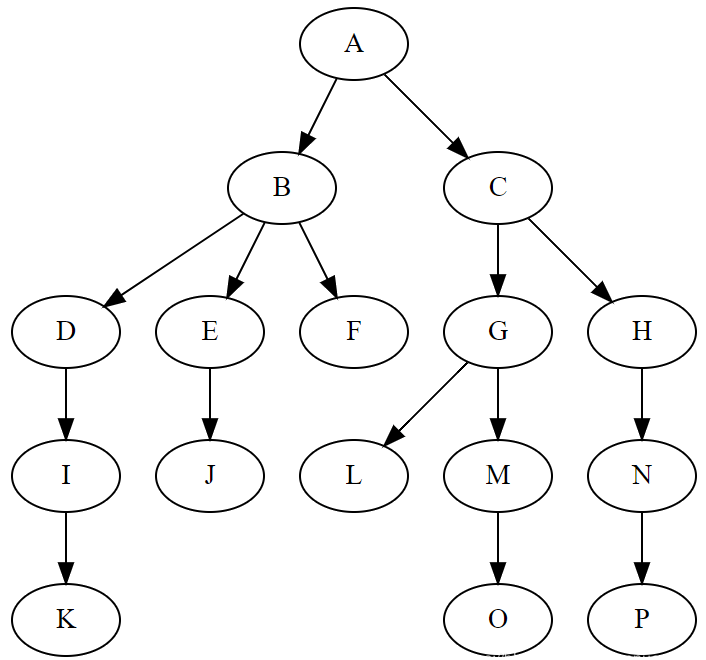
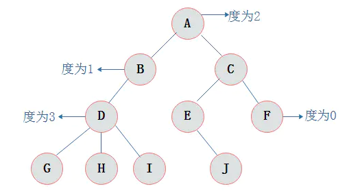
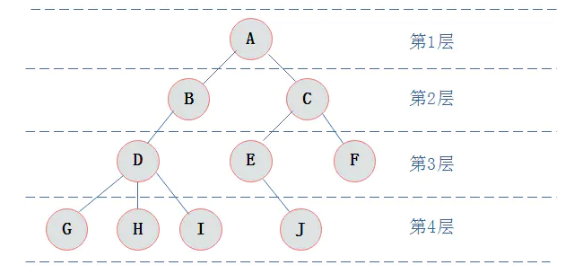

# 树

树状图是一种数据结构，它是由n（n>=0）个有限结点组成一个具有层次关系的集合。
把它叫做“树”是因为它看起来像一棵倒挂的树，也就是说它是根朝上，而叶朝下的。
它具有以下的特点：

* 每个结点有零个或多个子结点；
* 没有父结点的结点称为根结点；
* 每一个非根结点有且只有一个父结点；
* 除了根结点外，每个子结点可以分为多个不相交的子树；

n=0时称为空树。

在任意一颗非空树中：

* 有且仅有一个特定的称为根（Root）的结点；
* 当n>1时，其余结点可分为m(m>0)个互不相交的有限集T1、T2、......、Tn，其中每一个集合本身又是一棵树，并且称为根的子树。

此外，树的定义还需要强调以下两点：

* n>0时根结点是唯一的，不可能存在多个根结点，数据结构中的树只能有一个根结点。
* m>0时，子树的个数没有限制，但它们一定是互不相交的。

###### 名词理解：

* 结点：指树中的一个元素；
* 结点的度：指结点拥有的子树的个数，二叉树的度不大于2；

* 数的度：指树中的最大结点度数；
* 叶子：度为0的结点，也称为终端结点；
* 高度：叶子节点的高度为1，根节点高度最高；
* 层：根在第一层，以此类推；

#### 面试中关于树结构的常见问题

* 在二叉搜索树中查找第k个最大值

* 查找与根节点距离k的节点

