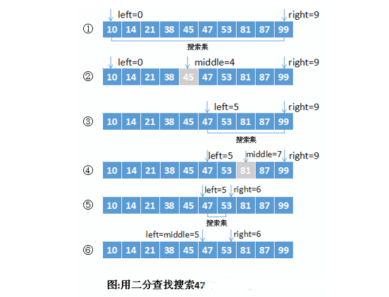

# 二分查找

适用于数据量较大时，但是数据需要先排好顺序

### 说明
元素必须是有序的，如果是无序的则要先进行排序操作。

### 基本思想
也称为是折半查找，属于有序查找算法。
用给定值k先与中间结点的关键字比较，中间结点把线形表分成两个子表，若相等则查找成功；
若不相等，再根据k与该中间结点关键字的比较结果确定下一步查找哪个子表，这样递归进行，
直到查找到或查找结束发现表中没有这样的结点。

例如，在{53，14，99，38，45，87，10，81，47，21}这个查找表使用折半查找算法查找数据之前，需要首先对该表中的数据按照所查的关键字进行排序：{10，14，21，38，45，47，53，81，87，99}，采用折半查找算法查找关键字为 47 的过程为：



###  复杂度分析
最坏情况下，关键词比较次数为log2(n+1)，
且期望时间复杂度为O(log2n)；

折半查找的前提条件是需要有序表顺序存储，对于静态查找表，
一次排序后不再变化，折半查找能得到不错的效率。
但对于需要频繁执行插入或删除操作的数据集来说，
维护有序的排序会带来不小的工作量，那就不建议使用。——《大话数据结构》

### 代码实现

```java
package algorithm.seek;

/**
 * 二分法查找: 适用于数据量较大时，但是数据需要先排好顺序
 */
public class BinarySearch {

    /**
     * @param array  数集合
     * @param target 目标数
     */
    private static int binary(int[] array, int target) {

        int low = 0;
        int high = array.length - 1;
        while (low <= high) {
            int middle = (low + high) / 2;

            if (target == array[middle]) {
                return middle;
            }

            if (target > array[middle]) {
                low = middle + 1;
            }

            if (target < array[middle]) {
                high = middle - 1;
            }
        }

        // 没找到返回 -1
        return -1;
    }

    public static void main(String[] args) {
        int[] a = {1, 2, 3, 4, 5, 6, 7, 8, 9};
        int value = binary(a, 9);
        System.out.println(value);
    }
}

```
