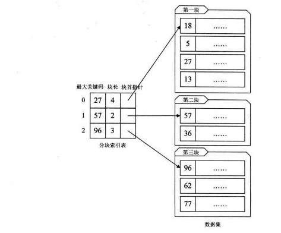

# 分块查找

思路：它是顺序查找的一种改进方法。

具体来说是二分查找和顺序查找的结合产物，
即首先在构建的索引表上面进行二分查找，
而后在锁定的区间内进行顺序查找



将n个数据元素"按块有序"划分为m块（m ≤ n）。
每一块中的结点不必有序，但块与块之间必须"按块有序"；
即第1块中任一元素的关键字都必须小于第2块中任一元素的关键字；

* step1 先选取各块中的最大关键字构成一个索引表；
* step2 查找分两个部分：先对索引表进行二分查找或顺序查找，
以确定待查记录在哪一块中；然后，在已确定的块中用顺序法进行查找。


### 代码实现

```java

```
