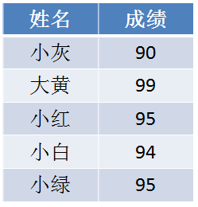
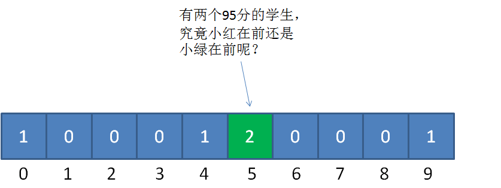
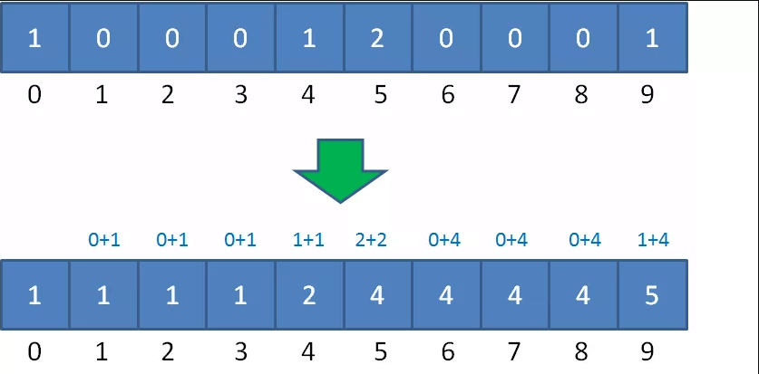

# 计数排序

​    计数排序 的核心在于将输入的数据值转化为键存储在额外开辟的数组空间中。 作为一种线性时间复杂度的排序，计数排序要求输入的数据必须是有确定范围的整数。

    计数排序(Counting sort) 是一种稳定的排序算法。计数排序使用一个额外的数组C，其中第i个元素是待排序数组A中值等于i的元素的个数。然后根据数组C来将A中的元素排到正确的位置。它只能对整数进行排序。

#### 算法描述

* 步骤1：找出待排序的数组中最大和最小的元素；
* 步骤2：统计数组中每个值为i的元素出现的次数，存入数组C的第i项；
* 步骤3：对所有的计数累加（从C中的第一个元素开始，每一项和前一项相加）；
* 步骤4：反向填充目标数组：将每个元素i放在新数组的第C(i)项，每放一个元素就将C(i)减去1。

#### 动图演示


#### 代码实现

```java
package algorithm.sort;

import java.util.Arrays;

public class CountingSort {

    public static void main(String[] args) {

        int[] array = {1, 2, 9, 4, 6, 7, 8, 3, 0, 5, 7, 6};
        System.out.println("原始数组：" + Arrays.toString(array));
        System.out.println("排序后数组：" + Arrays.toString(CountingSort.countingSort(array)));
    }

    private static int[] countingSort(int[] array) {
        if (array.length < 2) {
            return array;
        }

        int min = array[0], max = array[0];
        for (int a : array) {
            if (a < min) {
                min = a;
            }
            if (a > max) {
                max = a;
            }
        }

        //根据数列最大值和最小值的差值确定统计数组的长度
        int[] buket = new int[max - min + 1];

        //偏移量
        int bias = 0 - min;

        for (int i = 0; i < array.length; i++) {
            //buket[array[i] + bias] = ++buket[array[i] + bias];
            buket[array[i] + bias] ++;
        }

        int index = 0;
        for (int i = 0; i < buket.length; i++) {
            for (int j = 0; j < buket[i]; j++) {
                array[index++] = i + bias;
            }
        }


        return array;
    }

}

```


#### 算法分析

 当输入的元素是n 个0到k之间的整数时，它的运行时间是 O(n + k)。计数排序不是比较排序，排序的速度快于任何比较排序算法。由于用来计数的数组C的长度取决于待排序数组中数据的范围（等于待排序数组的最大值与最小值的差加上1），这使得计数排序对于数据范围很大的数组，需要大量时间和内存。

最佳情况：T(n) = O(n+k)
最差情况：T(n) = O(n+k)
平均情况：T(n) = O(n+k)

计数排序是一个稳定的排序算法。当输入的元素是 n 个 0到 k 之间的整数时，时间复杂度是O(n+k)，空间复杂度也是O(n+k)，其排序速度快于任何比较排序算法。当k不是很大并且序列比较集中时，计数排序是一个很有效的排序算法。


#### 适用范围

假定20个随机整数的值如下：
    9，3，5，4，9，1，2，7，8，1，3，6，5，3，4，0，10，9 ，7，9
如何给这些无序的随机整数排序呢？

非常简单，让我们遍历这个无序的随机数列，每一个整数按照其值对号入座，对应数组下标的元素进行加1操作。

比如第一个整数是9，那么数组下标为9的元素加1：


第二个整数是3，那么数组下标为3的元素加1：


继续遍历数列并修改数组......

最终，数列遍历完毕时，数组的状态如下：


数组每一个下标位置的值，代表了数列中对应整数出现的次数。

有了这个“统计结果”，排序就很简单了。直接遍历数组，输出数组元素的下标值，元素的值是几，就输出几次：
    0，1，1，2，3，3，3，4，4，5，5，6，7，7，8，9，9，9，9，10

显然，这个输出的数列已经是有序的了。

这就是计数排序的基本过程，它适用于一定范围的整数排序。在取值范围不是很大的情况下，它的性能甚至快过那些O（nlogn）的排序

但是对于这样的数据应该怎么考虑呢
    95，94，91，98，99，90，99，93，91，92
很简单，我们不再以（输入数列的最大值+1）作为统计数组的长度，而是以（数列最大值和最小值的差+1）作为统计数组的长度。

同时，数列的最小值作为一个偏移量，用于统计数组的对号入座。

以刚才的数列为例，统计数组的长度为  99-90+1 = 10 ，偏移量等于数列的最小值 90 。

对于第一个整数95，对应的统计数组下标是 95-90 = 5，如图所示：


朴素版的计数排序只是简单地按照统计计数组地下标输入了元素值，并没有真正给原始数列进行排序

如果是单纯的给整数排序，这样并没有问题。但如果放到现实业务里，比如给学生的考试分数排序，遇到相同的分数就会分不清谁是谁。

什么意思？
举个例子：


给定一个学生的成绩表，要求按成绩从低到高排序，如果成绩相同，则遵循原表固有顺序。

那么，当我们填充统计数组以后，我们只知道有两个成绩并列95分的小伙伴，却不知道哪一个是小红，哪一个是小绿：



下面的讲解会有一些烧脑，请大家扶稳坐好。我们仍然以刚才的学生成绩表为例，把之前的统计数组变形成下面的样子：



这是如何变形的呢？统计数组从第二个元素开始，每一个元素都加上前面所有元素之和。

为什么要相加呢？初次看到的小伙伴可能会觉得莫名其妙。

这样相加的目的，是让统计数组存储的元素值，等于相应整数的最终排序位置。比如下标是9的元素值为5，代表原始数列的整数9，最终的排序是在第5位。

接下来，我们创建输出数组sortedArray，长度和输入数列一致。然后从后向前遍历输入数列：

第一步，我们遍历成绩表最后一行的小绿：

小绿是95分，我们找到countArray下标是5的元素，值是4，代表小绿的成绩排名位置在第4位。

同时，我们给countArray下标是5的元素值减1，从4变成3,，代表着下次再遇到95分的成绩时，最终排名是第3。


第三步，我们遍历成绩表倒数第三行的小红：

小红是95分，我们找到countArray下标是5的元素，值是3（最初是4，减1变成了3），代表小红的成绩排名位置在第3位。

同时，我们给countArray下标是5的元素值减1，从3变成2,，代表着下次再遇到95分的成绩时（实际上已经遇不到了），最终排名是第2。


这样一来，同样是95分的小红和小绿就能够清楚地排出顺序了，也正因此，优化版本的计数排序属于稳定排序。

后面的遍历过程以此类推，这里就不再详细描述了。

```java
package algorithm.sort;

import java.util.Arrays;

public class CS {
    public static int[] countSort(int[] array) {

        //1.得到数列的最大值和最小值，并算出差值d
        int max = array[0];
        int min = array[0];
        for (int i = 1; i < array.length; i++) {
            if (array[i] > max) {
                max = array[i];
            }
            if (array[i] < min) {
                min = array[i];
            }
        }

        int d = max - min;
        //2.创建统计数组并统计对应元素个数

        int[] countArray = new int[d + 1];

        for (int i = 0; i < array.length; i++) {
            countArray[array[i] - min]++;
        }
        //3.统计数组做变形，后面的元素等于前面的元素之和
        int sum = 0;
        for (int i = 0; i < countArray.length; i++) {
            sum += countArray[i];
            countArray[i] = sum;
        }

        //4.倒序遍历原始数列，从统计数组找到正确位置，输出到结果数组

        int[] sortedArray = new int[array.length];
        for (int i = array.length - 1; i >= 0; i--) {
            sortedArray[countArray[array[i] - min] - 1] = array[i];
            countArray[array[i] - min]--;
        }
        return sortedArray;

    }


    public static void main(String[] args) {

        int[] array = new int[]{95, 94, 91, 98, 99, 90, 99, 93, 91, 92};
        int[] sortedArray = countSort(array);
        System.out.println(Arrays.toString(sortedArray));
    }
}


```

#### 局限性

* 当数列最大最小值差距过大时，并不适用计数排序。
* 
比如给定20个随机整数，范围在0到1亿之间，这时候如果使用计数排序，需要创建长度1亿的数组。不但严重浪费空间，而且时间复杂度也随之升高。

* 当数列元素不是整数，并不适用计数排序。

如果数列中的元素都是小数，比如25.213，或是0.00000001这样子，则无法创建对应的统计数组。这样显然无法进行计数排序。