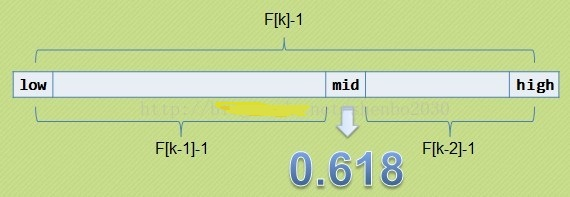

# 斐波那契查找

在介绍斐波那契查找算法之前，
我们先介绍一下很它紧密相连并且大家都熟知的一个概念——黄金分割。

黄金比例又称黄金分割，是指事物各部分间一定的数学比例关系，
即将整体一分为二，较大部分与较小部分之比等于整体与较大部分之比，
其比值约为1:0.618或1.618:1。

0.618被公认为最具有审美意义的比例数字，
这个数值的作用不仅仅体现在诸如绘画、雕塑、音乐、建筑等艺术领域，
而且在管理、工程设计等方面也有着不可忽视的作用。
因此被称为黄金分割。

大家记不记得斐波那契数列：1, 1, 2, 3, 5, 8, 13, 21, 34, 55, 89…….
（从第三个数开始，后边每一个数都是前两个数的和）。
然后我们会发现，随着斐波那契数列的递增，
前后两个数的比值会越来越接近0.618，
利用这个特性，我们就可以将黄金比例运用到查找技术中。




### 基本思想

也是二分查找的一种提升算法，
通过运用黄金比例的概念在数列中选择查找点进行查找，
提高查找效率。同样地，斐波那契查找也属于一种有序查找算法。

相对于折半查找，一般将待比较的key值与第mid=（low+high）/2位置的元素比较，
比较结果分三种情况：

1. 相等，mid位置的元素即为所求
2. 大于，low=mid+1;
3. 小于，high=mid-1。

斐波那契查找与折半查找很相似，
他是根据斐波那契序列的特点对有序表进行分割的。
他要求开始表中记录的个数为某个斐波那契数小1，及n=F(k)-1;

开始将k值与第F(k-1)位置的记录进行比较(及mid=low+F(k-1)-1),
比较结果也分为三种

1. 相等，mid位置的元素即为所求
2. 大于，low=mid+1,k-=2;
   
   说明：low=mid+1说明待查找的元素在[mid+1,high]范围内，k-=2 说明范围[mid+1,high]内的元素个数为n-(F(k-1))= Fk-1-F(k-1)=Fk-F(k-1)-1=F(k-2)-1个，所以可以递归的应用斐波那契查找。
3. 小于，high=mid-1,k-=1。

   说明：low=mid+1说明待查找的元素在[low,mid-1]范围内，k-=1 说明范围[low,mid-1]内的元素个数为F(k-1)-1个，所以可以递归 的应用斐波那契查找。

### 复杂度分析

最坏情况下，时间复杂度为O(log2n)，且其期望复杂度也为O(log2n)。

### 代码实现

```java

```
