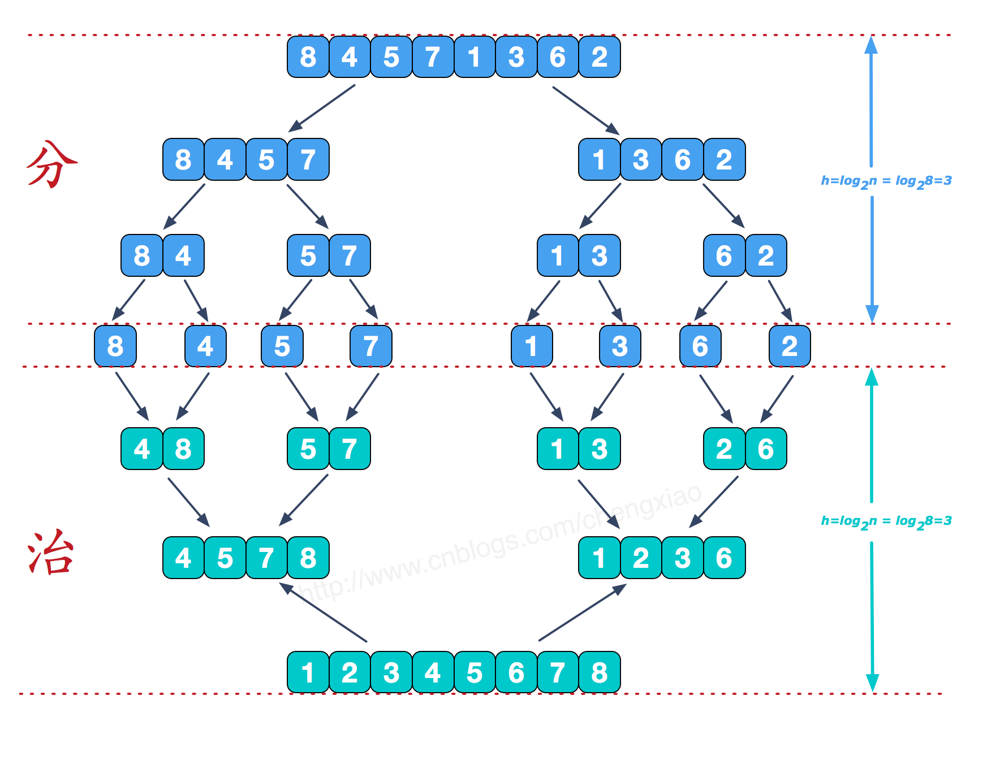
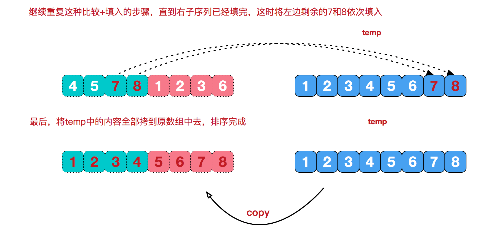

# 归并排序
和选择排序一样，归并排序的性能不受输入数据的影响，
但表现比选择排序好的多，
因为始终都是O(n log n）的时间复杂度。代价是需要额外的内存空间。

    归并排序 是建立在归并操作上的一种有效的排序算法。
该算法是采用分治法
（Divide and Conquer: 分治法将问题分(divide)成一些小的问题然后递归求解，
而治(conquer)的阶段则将分的阶段得到的各答案"修补"在一起，即分而治之）
的一个非常典型的应用。
归并排序是一种稳定的排序方法。
将已有序的子序列合并，得到完全有序的序列；
即先使每个子序列有序，再使子序列段间有序。
若将两个有序表合并成一个有序表，称为2-路归并。

###### 算法描述

* 步骤1：把长度为n的输入序列分成两个长度为n/2的子序列；
* 步骤2：对这两个子序列分别采用归并排序；
* 步骤3：将两个排序好的子序列合并成一个最终的排序序列。

###### 过程演示

* 分而治之


可以看到这种结构很像一棵完全二叉树，
本文的归并排序我们采用递归去实现（也可采用迭代的方式去实现）。
分阶段可以理解为就是递归拆分子序列的过程，递归深度为log2n

* 合并相邻有序子序列
再来看看治阶段，我们需要将两个已经有序的子序列合并成一个有序序列，比如上图中的最后一次合并，要将[4,5,7,8]和[1,2,3,6]两个已经有序的子序列，合并为最终序列[1,2,3,4,5,6,7,8]，来看下实现步骤。


* 归并排序动图


###### 代码实现

递归法

```java
package algorithm.sort;

import java.util.Arrays;

public class MergeSort {

    public static void main(String[] args) {

        int[] array = {1, 2, 9, 4, 6, 7, 8, 3, 0, 5};
        System.out.println("原始数组：" + Arrays.toString(array));
        System.out.println("排序后数组：" + Arrays.toString(MergeSort.mergeSort(array)));
    }

    private static int[] mergeSort(int[] array) {
        int length = array.length;
        if (length < 2) {
            return array;
        }


        int mid = length / 2;
        int[] left = Arrays.copyOfRange(array, 0, mid);
        int[] right = Arrays.copyOfRange(array, mid, length);

        return merge(mergeSort(left), mergeSort(right));

    }

    private static int[] merge(int[] left, int[] right) {
        int itemLength = left.length + right.length;
        int item[] = new int[itemLength];
        //l 为left的指针
        //r 为right的指针
        for (int index = 0, l = 0, r = 0; index < itemLength; index++) {
            if (l >= left.length) {
                //左数组已经遍历完
                item[index] = right[r++];
            } else if (r >= right.length) {
                //右侧数组已经遍历完
                item[index] = left[l++];
            } else if (left[l] > right[r]) {
                //这样是为了保证稳定性
                item[index] = right[r++];
            } else {
                item[index] = left[l++];
            }
        }

        return item;
    }

```

TimSort

归并排序是稳定排序，它也是一种十分高效的排序，能利用完全二叉树特性的排序一般性能都不会太差。java中Arrays.sort()采用了一种名为TimSort的排序算法，就是归并排序的优化版本。
从上文的图中可看出，每次合并操作的平均时间复杂度为O(n)，而完全二叉树的深度为|log2n|。总的平均时间复杂度为O(nlogn)。而且，归并排序的最好，最坏，平均时间复杂度均为O(nlogn)
```java


```

###### 算法分析
归并排序是一种稳定的排序方法。和选择排序一样，归并排序的性能不受输入数据的影响，但表现比选择排序好的多，因为始终都是O(nlogn）的时间复杂度。代价是需要额外的内存空间。

* 最佳情况：T(n) = O(n)
* 最差情况：T(n) = O(nlogn)
* 平均情况：T(n) = O(nlogn)

###### 复杂度

归并排序比较占用内存，但却是一种效率高且稳定的算法。
改进归并排序在归并时先判断前段序列的最大值与后段序列最小值的关系再确定是否进行复制比较。如果前段序列的最大值小于等于后段序列最小值，则说明序列可以直接形成一段有序序列不需要再归并，反之则需要。所以在序列本身有序的情况下时间复杂度可以降至O(n)
TimSort可以说是归并排序的终极优化版本，主要思想就是检测序列中的天然有序子段（若检测到严格降序子段则翻转序列为升序子段）。在最好情况下无论升序还是降序都可以使时间复杂度降至为O(n)，具有很强的自适应性。

| 名称 | 最好时间复杂度 | 平均时间复杂度 | 最坏时间复杂度 | 空间复杂度 | 稳定性 |
| :---: | :---: | :---: | :---: | :---: | :---: |
| 传统归并排序 | O(nlogn) | O(nlogn) | O(nlogn) | T(n) | 稳定 |
| 改进归并排序 | O(n) | O(nlogn) | O(nlogn) | T(n) | 稳定 |
| TimSort | O(n) | O(nlogn) | O(nlogn) | T(n) | 稳定 |

注：改进归并排序是一种改进的原地归并算法，空间复杂度为O(1)。在表格里的改进归并排序只是引入其预先判断的这一步，这样便可使传统归并排序时间复杂度降至O(n)
