# 结构性模式总结

结构型模式，顾名思义讨论的是类和对象的结构，它采用继承机制来组合接口或实现（类结构型模式），或者通过组合一些对象，从而实现新的功能（对象结构型模式）。
这些结构型模式，它们在某些方面具有很大的相似性，仔细推敲，侧重点却各有不同。

* Adapter模式：通过类的继承或者对象的组合侧重于转换已有的接口；
* Bridge模式：通过将抽象和实现相分离，让它们可以分别独立的变化，它强调的是系统沿着多个方向的变化；
* Decorator模式：采用对象组合而非继承的手法，实现了在运行时动态的扩展对象功能的能力，它强调的是扩展接口；
* Composite模式：模糊了简单元素和复杂元素的概念，它强调的是一种类层次式的结构；
* Façade 模式：将复杂系统的内部子系统与客户程序之间的依赖解耦，它侧重于简化接口，更多的是一种架构模式；
* Flyweight模式：解决的是由于大量的细粒度对象所造成的内存开销的问题，它与Façade模式恰好相反，关注的重点是细小的对象；
* Proxy模式：为其他对象提供一种代理以控制对这个对象的访问，它注重于增加间接层来简化复杂的问题。

* 适配器模式：将一个类的接口转换成客户希望的另外一种接口，这样就能实现已有接口的复用。适配器主要有类适配器和对象适配器两种实现方式，通常情况下，推荐优先使用对象适配器方式。
* 桥接模式：将抽象部分与实现部分分离，使它们都可以独立地变化。它主要用于应对多维度变化点问题，通过对象组合的方式，可以极大地减少子类的数目，同时还能让不同维度独立扩展变化。
* 组合模式：将对象组合成树形结构以表示“整合-部分”的层次结构，从而使得用户对单个对象和组合对象的使用具有一致性，也就是客户端能够透明地无区别地操作两者。
* 装饰模式：动态地给一个对象添加一些额外的职责，就增加功能来说，装饰模式相比生成子类更为灵活。假若使用多继承的方式来完成职责的添加，将会不可避免地造成子类数目的“爆炸性”增长，此外，因为是静态增加的，那也就不可能在运行状态时动态地添加或者删除额外职责呢。
* 外观模式：为子系统中的一组接口提供一个一致的接口，外观模式定义了一个高层接口，这个接口使得这一子系统更加容易使用。这样原来需要客户直接与复杂的子系统打交道、交互，现在这一过程将完全将交由外观对象来完成，极大地方便了客户端的调用。
* 享元模式：运用共享技术有效地支持大量细粒度的对象。享元模式关键是将对象的内部状态和外部状态分离，尽可能地对“稳定”的内部状态进行共享，而将会随运用场景而改变的状态通过外部状态传入。
* 代理模式：为其他对象提供一种代理以控制对这个对象的访问。主要是在客户端和目标对象间增加一层间接层，通过这个间接层来完成对目标对象的种种控制操作，所以也就形成了不同功能类型的代理呢，比如远程代理、保护代理和虚代理等等。

结构型模式主要用于描述如何组合类和对象以获得更大的结构。
其中，结构型类模式采用继承机制来组合接口和实现，而结构型对象模式则采用组合/聚合方式来组合对象以实现新功能，
因为它可以在运行时刻改变对象组合关系，所以对象组合方式具有更大的灵活性，这种机制是无法通过静态类组合来实现的。
当然两者都有彼此擅长之处，具体的取舍需要根据实际的应用场景而定。我们介绍过的结构型模式总共有七种，
简写为：ABCDFFP(Adapter,Bridge,Composite,Decorator,Façade,Flyweight,Proxy)，也就是对应的的适配器模式、桥接模式、组合模式、装饰模式、外观模式、享元模式和代理模式。
从之前对以上七种结构型模式的介绍里，我们了解到优先使用对象组合，而不是类继承原则在结构型模式中得到淋漓尽致的体现，当然并不是说不能使用继承方式，毕竟类继承可是面向对象的三大特性之一（多态、继承和封装）。
应该说继承是随便可见的，但是每一种继承只适合于封装一种变化，面对多维变化场景时，如果仍强行使用多继承方式来实现，必然会造成子类数目成“爆炸性”增长问题，这方面叙述在桥接模式和装饰器模式中都有很好的体现。
比如在桥接模式中，通过简单的继承方式并不能很好地处理抽象化与实现化都独立变化的情况，但是通过对象组合的方式却可以很好地应对这方面需求，使多维变化点能够独立地扩展和变化。

### 桥接模式与装饰模式

这两个模式在一定程度上都是为了减少子类的数目，避免出现复杂的继承关系。
但是它们解决的方法却各有不同，装饰模式把子类中比基类中多出来的部分放到单独的类里面，
以适应新功能增加的需要，当我们把描述新功能的类封装到基类的对象里面时，就得到了所需要的子类对象，
这些描述新功能的类通过组合可以实现很多的功能组合，装饰模式的简略图如下：

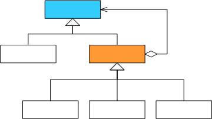
装饰模式图

桥接模式则把原来的基类的实现化细节抽象出来，在构造到一个实现化的结构中，然后再把原来的基类改造成一个抽象化的等级结构，这样就可以实现系统在多个维度上的独立变化，桥接模式的简略图如下：

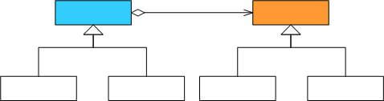
桥接模式图

### 外观模式和代理模式

外观模式和代理模式解决问题的侧重点不同，但是它们解决问题的手法却是一样的，即都是引入了间接层的手法，这也是我们软件系统中经常用的一种手法。外观模式虽然侧重于简化接口，
但是在某些情况下，外观模式也可以兼任代理模式的责任，例如外观对象有可能是另一个位于另一个地址空间对象的远程代理，这时候我们可以叫做外观代理模式，或者代理外观模式。它们的类简略图如下：
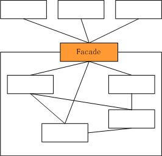 

外观模式图

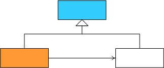
代理模式图

### 适配器模式

适配器模式重在转换接口，它能够使原本不能在一起工作的两个类一起工作，所以经常用在类库复用，代码迁移等方面，有一种亡羊补牢的味道。
类适配器和对象适配器可以根据具体实际情况来选用，但一般情况建议使用对象适配器模式，如下图所示，左边是类适配器模式，右边是对象适配器模式：

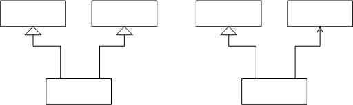

### 对变化的封装

如何应对变化，是软件开发的一个永恒的主题，也许我们不能够杜绝变化的发生，但至少我们可以通过一些手段让变化降到最低。“找到系统可变的因素，将之封装起来”，
通常就叫做对变化的封装。关于这个问题的解释在《Java与模式》中讲的很清晰，抽象化与实现化的简单实现，也就是“开-闭”原则在类层次上的最简单实现，如下图所示：

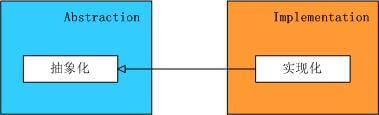

在这个继承结构中，第一层是抽象化，它封装了抽象的业务逻辑，这是系统中不变的部分；第二层是实现化，它是具体的业务逻辑的实现，
封装了系统中变化的部分，这个实现允许实现化角色多态性的变化：

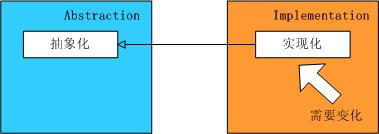

也就是说，客户端依赖的是业务逻辑的抽象化类型的对象，而与抽象化的具体实现无关，不在乎它到底是“实现化”，
“实现化2”还是“实现化3”，如下图所示：

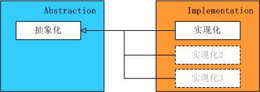

每一种继承关系都封装了一个变化因素，而一个继承关系不应当处理两个变化因素，换言之，这种简单继承关系不能处理抽象化与实现化都变化的情况，
如下图所示：

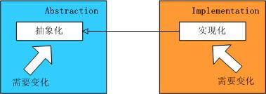

上图中的两个变化因素应当是独立的，可以在不影响另一者的情况下独立的变化，如下面这两个等级结构分别封装了自己的变化因素，由于每一个变化因素都是可以通过静态关系表达的，因此分别使用继承关系实现，如下图：

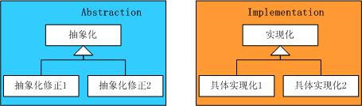

在抽象化和实现化之间的联系怎么办呢？好的设计只有一个，不好的设计却有很多中，下面这种设计就是继续使用继承进行静态关系设计的类图：

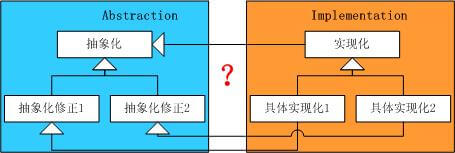

这样的设计其实存在着很多的问题，首先出现的是多重的继承关系，随着具体实现化的增多，子类的继承关系会变得异常复杂；其次如果出现新的抽象化修正或者新的具体实现角色，就只好重新修改现有系统中的静态关系，
以适应新的角色，这就违背了开放-封闭原则。
正确是设计应该是使用两个独立的等级结构封装两个独立的变化因素，
并在它们之间使用聚合关系，以达到功能复用的目的，
这就回到了我们的桥接模式上，如下图所示：

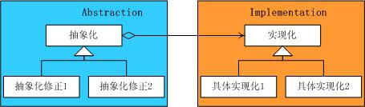

从另一个角度讲，一个好的设计通常没有多于两层的继承等级结构，或者说，如果出现两个以上的变化因素，就需要找出哪一个因素是静态的，可以使用静态关系，哪一个是动态的，必须使用聚合关系。

