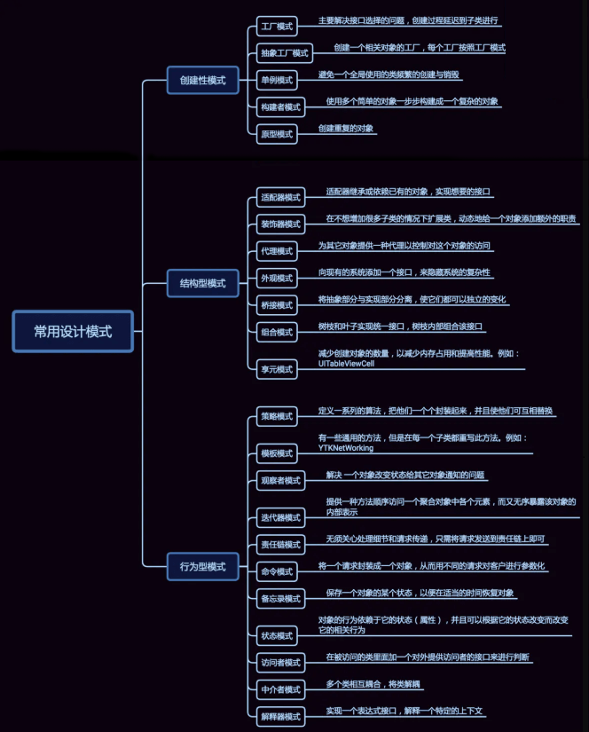

# 第四章 设计模式

## 简介
设计模式是一套被反复使用的、多数人知晓的、经过分类编目的、代码设计经验的总结。

使用设计模式是为了重用代码、让代码更容易被他人理解、保证代码可靠性。 

毫无疑问，设计模式于己于他人于系统都是多赢的，设计模式使代码编制真正工程化，设计模式是软件工程的基石，如同大厦的一块块砖石一样。

项目中合理地运用设计模式可以完美地解决很多问题，每种模式在现实中都有相应的原理来与之对应，每种模式都描述了一个在我们周围不断重复发生的问题，以及该问题的核心解决方案，这也是设计模式能被广泛应用的原因。

## 什么是 GOF（四人帮，全拼 Gang of Four）？
在 1994 年，由 Erich Gamma、Richard Helm、Ralph Johnson 和 John Vlissides 四人合著出版了一本名为 Design Patterns - Elements of Reusable Object-Oriented Software（中文译名：设计模式 - 可复用的面向对象软件元素） 的书，
该书首次提到了软件开发中设计模式的概念。

四位作者合称 GOF（四人帮，全拼 Gang of Four）。

他们所提出的设计模式主要是基于以下的面向对象设计原则。

* 对接口编程而不是对实现编程。
* 优先使用对象组合而不是继承。

## 设计模式的类型
总共有 23 种设计模式。这些模式可以分为三大类：创建型模式（Creational Patterns）、结构型模式（Structural Patterns）、行为型模式（Behavioral Patterns）。

* 创建型模式：对象实例化的模式，创建型模式用于解耦对象的实例化过程。
* 结构型模式：把类或对象结合在一起形成一个更大的结构。
* 行为型模式：类和对象如何交互，及划分责任和算法。

## 详解

1.  [面向对象](objectOriented.md)
2.  [设计原则](designPrinciples.md)
3.  [单例模式](singleton.md)
4.  [工厂模式](Factory.md)
5.  [抽象工厂模式](AbstractFactory.md)
6.  [构建者模式](Builder.md)
7.  [建造者与工厂的区别](BuilderFactory.md)
8.  [原型模式](Prototype.md)
9.  [创建性模式总结](create.md)
10. [一个不是GOF的设计模式](staticFactory.md)
11. [适配器模式](Adaper.md)
12. [装饰器模式](Decorato.md)
13. [代理模式](Proxy.md)
14. [代理模式和装饰器模式对比](ProxyDecorato.md)
15. [外观模式](Facade.md)
16. [桥接模式](Bridge.md)
17. [组合模式](Composite.md)
18. [享元模式](Flyweight.md)
19. [结构性模式总结](SummaryOfStructuralPatterns.md)
20. [模板模式](template.md)
21. [策略模式](Strategy.md)
22. [观察者模式](Observer.md)
23. [迭代器模式](iterator.md)
24. [责任链模式](chainOfResponsibility.md)
25. [命令模式](Command.md)
26. [状态模式](State.md)
27. [责任链和状态模式对比](StateExt.md)
28. [命令、状态、责任链模式区别](ChainExt.md)
29. [备忘录模式](Memo.md)
30. [访问者模式](Visitor.md)
31. [java的动态绑定与双分派](VisitorExt.md)
32. [中介模式](Intermediary.md)
33. [解释器模式](Interpreter.md)
34. [行为模式总结](SummaryOfBehaviorPatterns.md)
35. [java中的设计模式](designInJava.md)
36. [spring中的设计模式](designInSpring.md)
