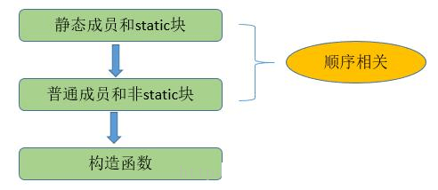

# 单例模式

**在面试中此模式是被问的最多的,因为可发散的思维点太多了**

所谓单例，就是整个程序有且仅有一个实例。该类负责创建自己的对象，同时确保只有一个对象被创建。
在Java中，一般常用在工具类的实现或创建对象需要消耗大量资源时。

特点

* 类构造器私有
* 持有自己类型的属性
* 对外提供获取实例的静态方法

## 懒汉模式

线程不安全，延迟初始化，严格意义上不是不是单例模式；在高并发时可能产生多个对象。

```java
public class Singleton {  
    private static Singleton instance;  
    private Singleton (){}  
  
    public static Singleton getInstance() {  
    if (instance == null) {  
        instance = new Singleton();  
    }  
    return instance;  
    }  
}
```

## 饿汉模式

线程安全，比较常用，但容易产生垃圾，因为一开始就初始化，但全局不使用。

```java
public class Singleton {  
    private static Singleton instance = new Singleton();  
    private Singleton (){}
    public static Singleton getInstance() {  
    return instance;  
    }  
}
```

## 双重锁模式

线程安全，延迟初始化。这种方式采用双锁机制，安全且在多线程情况下能保持高性能。

```java
public class Singleton {  
    private volatile static Singleton singleton;  
    private Singleton (){}  
    public static Singleton getSingleton() {  
        if (singleton == null) {  
            synchronized (Singleton.class) {  
                if (singleton == null) {  
                    singleton = new Singleton();  
                }  
            }  
        }  
        return singleton;  
    }  
}

```

双重检查模式，进行了两次的判断，第一次是为了避免不必要的实例;第二次是为了进行同步，避免多线程问题。

由于singleton = new Singleton()对象的创建在JVM中可能会进行重排序，
在多线程访问下存在风险，使用volatile修饰signleton实例变量，解决该问题。

## 推荐一个知乎上的问题:

**双重检查锁失效是因为对象的初始化并非原子操作?**

是因为指令重排造成的。
直接原因也就是**初始化一个对象并使一个引用指向他这个过程不是原子的**。
导致了可能会出现引用指向了对象并未初始化好的那块堆内存,
使用volatile修饰对象引用，防止重排序即可解决。

拿出来解释一下吧：

    help = new Help();

主要原因就是这个操作不是原子性的，从而留给了JVM重排序的机会。
JVM的重排序也是有原则的，在单线程中，不管怎么排，保证最终结果一致。
注意这里是单线程。

多线程的情况下指令重排序就会给程序带来问题。
如下help = new Help()这个操作可以拆成如下四步：

1. 栈内存开辟空间给help引用
2. 堆内存开辟空间准备初始化对象
3. 初始化对象
4. 栈中引用指向这个堆内存空间地址指令

重排之后可能会是1、2、4、3；这样重排之后对单个线程来说效果是一样的，
所以JVM认为是合法的重排序。但是这样在多线程环境下就会出问题，
这里到4的时候help已经指向了一块堆内存，只是这块堆内存还没初始化就直接返回了，
假如使用的时候就会抛NullPointException。
 
当然这里的几个步骤并不算真正的指令，指令的粒度只会比这个还小，但是可以说明问题。
加入volatile之后查看汇编代码可以发现多了一句 lock addl $0x0,(%esp)相当于一个内存屏障。

volatile的作用：保证内存可见性，防止指令重排序，并不保证操作原子性。

这里用到的就是防止指令重排序的性质。

如何实现这些性质的

* 保证可见性：使用该变量必须重新去主内存读取，修改了该变量必须立刻刷新主内存。
* 防止重排序：通过插入内存屏障。

## 静态内部类单例模式

```java
public class Singleton { 
    private Singleton(){
    }

    public static Singleton getInstance(){  
        return Inner.instance;  
    }

    private static class Inner {  
        private static final Singleton instance = new Singleton();   
    }  
} 


```
只有第一次调用getInstance方法时，虚拟机才加载 Inner 并初始化instance。

只有一个线程可以获得**对象的初始化锁**，其他线程无法进行初始化，保证对象的唯一性。
这个同步过程由JVM实现了，更合适，更可靠。

目前此方式是所有单例模式中最推荐的模式，但具体还是根据项目选择。

里面提到一个对象的初始化锁是什么意思，这里就不得不提**类的加载顺序**:

对于静态变量、静态初始化块、变量、初始化块、构造器，
它们的初始化顺序依次是（静态变量、静态初始化块）>（变量、初始化块）> 构造器。

而且一个类的静态变量、静态初始化块 全局加载且仅加载一次。及第一次实例化此类时。

这里又引出一个新的概念：[java 的init方法与clinit方法](../Chapter05/init.md)



```java
/**
 * 类的初始化顺序
 * 静态变量 -> 静态初始化块 -> 变量 -> 初始化块 -> 构造器
 */
public class InitialOrderTest {

    // 静态变量
    public static String staticField = "静态变量";

    // 静态初始化块
    static {
        System.out.println(staticField);
        System.out.println("静态初始化块");
    }

    // 变量
    public String field = "变量";

    // 初始化块
    {
        System.out.println(field);
        System.out.println("初始化块");
    }

    // 构造器
    public InitialOrderTest() {
        System.out.println("构造器");
    }

    public static void main(String[] args) {
        new InitialOrderTest();
        System.out.println("====");
        new InitialOrderTest();
    }

}

```

执行结果如下：

```console
静态变量
静态初始化块
变量
初始化块
构造器
====
变量
初始化块
构造器
```


如下是不是就有人提出用静态代码块实现单例

    静态代码块实现单例模式，事实上就是饿汉单例模式的变种。

```java
public class T{
    public static void main(String[] args) {
        Singleton.print();
        /*************/
        Singleton2.print();
    }
}


class Singleton{
    private static Singleton instance;
    private Singleton(){}
    static{
        System.out.println("Singleton--我在被调用的时候加载，而且只加载一次");
        instance = new Singleton();
    }
    public static Singleton getInstance(){
        return instance;
    }
    public static void print(){
        System.out.println("我只想调用这个方法，不想初始化实例对象");
    }
}

class Singleton2{
    private Singleton2(){}
    private static class Handler{
        static{
            System.out.println("Singleton2--我在调用的时候被加载，而且只加载一次");
        }
        private static Singleton2 instance = new Singleton2();
    }
    public static Singleton2 getInstance(){
        return Handler.instance;
    }
    public static void print(){
        System.out.println("我只想调用这个方法，不想初始化实例对象");
    }
}

```

输出结果：

```console
Singleton–我在被调用的时候加载，而且只加载一次
我只想调用这个方法，不想初始化实例对象
=======
我只想调用这个方法，不想初始化实例对象
```
很明显，这里在不想初始化的时候，它初始化了，所以是一种变种的饿汉单例模式。

## 枚举单例模式

```java

public enum Singleton {
    INSTANCE;
}
```
默认枚举实例的创建是线程安全的，并且在任何情况下都是单例。

实际上

* 枚举类隐藏了私有的构造器。
* 枚举类的域是相应类型的一个实例对象

那么枚举类型日常用例是这样子的：

```java
public enum Singleton  {
    INSTANCE 
 
    //doSomething 该实例支持的行为
      
    //可以省略此方法，通过Singleton.INSTANCE进行操作
    public static Singleton get Instance() {
        return Singleton.INSTANCE;
    }
}
```

枚举单例模式在《Effective Java》中推荐的单例模式之一。
但枚举实例在日常开发是很少使用的，就是很简单以导致可读性较差。

在以上所有的单例模式中，推荐静态内部类单例模式。主要是非常直观，即保证线程安全又保证唯一性。

## spring中的单例

大家应该都知道spring的对象默认是单例的，那么spring中是运用了怎样的单例模式呢？

如下是spring5.x **DefaultSingletonBeanRegistry**的源码

```java
	@Nullable
	protected Object getSingleton(String beanName, boolean allowEarlyReference) {
		Object singletonObject = this.singletonObjects.get(beanName);
		if (singletonObject == null && isSingletonCurrentlyInCreation(beanName)) {
			synchronized (this.singletonObjects) {
				singletonObject = this.earlySingletonObjects.get(beanName);
				if (singletonObject == null && allowEarlyReference) {
					ObjectFactory<?> singletonFactory = this.singletonFactories.get(beanName);
					if (singletonFactory != null) {
						singletonObject = singletonFactory.getObject();
						this.earlySingletonObjects.put(beanName, singletonObject);
						this.singletonFactories.remove(beanName);
					}
				}
			}
		}
		return singletonObject;
	}
```

## 什么情况下会破坏单例模式

#### 反序列化

众所周知，单例模式是创建型模式，都会新建一个实例。
那么一个重要的问题就是反序列化。
当实例被写入到文件到反序列化成实例时，
我们需要重写readResolve方法，以让实例唯一。

```java
private Object readResolve() throws ObjectStreamException{
        return singleton;
}
```

测试代码：

```java
package cp2;

import java.io.Serializable;
import java.util.Objects;

public class SerSingleton implements Serializable {
    String name;
    private SerSingleton(){
        System.out.println("Singleton is creating");
    }

    private static SerSingleton instance = new SerSingleton();

    public static SerSingleton getInstance(){
        return instance;
    }

    public static void createString(){
        System.out.println("create string in singleton");
    }
}

```


```java
import cp2.SerSingleton;
import junit.framework.Assert;
import org.junit.Test;

import java.io.FileInputStream;
import java.io.FileOutputStream;
import java.io.ObjectInputStream;
import java.io.ObjectOutputStream;

public class SerSingletonTest {

    @Test
    public void test() throws Exception{
        SerSingleton s1 = null;
        SerSingleton s = SerSingleton.getInstance();

        FileOutputStream fos = new FileOutputStream("a.txt");
        ObjectOutputStream oos = new ObjectOutputStream(fos);
        oos.writeObject(s);
        oos.flush();
        oos.close();

        FileInputStream fis = new FileInputStream("a.txt");
        ObjectInputStream ois = new ObjectInputStream(fis);
        s1 = (SerSingleton) ois.readObject();

        Assert.assertEquals(s,s1);
    }
}

```

结果：

```console
junit.framework.AssertionFailedError: 
Expected :cp2.SerSingleton@7ab2bfe1
Actual   :cp2.SerSingleton@497470ed
   <Click to see difference>
```
问题来了，怎么解决呢？jdk其实预料到这种情况了。

解决方法：加入readResolve()

在jdk中ObjectInputStream的类中有readUnshared（）方法，上面详细解释了原因。我简单描述一下，那就是如果被反序列化的对象的类存在readResolve这个方法，他会调用这个方法来返回一个“array”（我也不明白），然后浅拷贝一份，作为返回值，并且无视掉反序列化的值，即使那个字节码已经被解析。
所以，完整的单例模式是：

```java
package cp2;

import java.io.Serializable;
import java.util.Objects;

public class SerSingleton implements Serializable {
    String name;
    private SerSingleton(){
        System.out.println("Singleton is creating");
    }

    private static SerSingleton instance = new SerSingleton();

    public static SerSingleton getInstance(){
        return instance;
    }

    public static void createString(){
        System.out.println("create string in singleton");
    }

    private Object readResolve(){
        System.out.println("read resolve");
        return instance;
    }
}

```

#### 反射

一个单例类：

```java
public class Singleton {
    private static Singleton instance = new Singleton();  
 
    private Singleton() {}
 
    public static Singleton getInstance() {
        return instance;
    }
}
```
通过反射破坏单例模式：

```java
public class Test {
    public static void main(String[] args) throws Exception{
        Singleton s1 = Singleton.getInstance();
 
        Constructor<Singleton> constructor = Singleton.class.getDeclaredConstructor();
        constructor.setAccessible(true);
        Singleton s2 = constructor.newInstance();
 
        System.out.println(s1.hashCode());
        System.out.println(s2.hashCode());
 
    }
}
```

```yaml
输出结果：
671631440
935563443
```

结果表明s1和s2是两个不同的实例了。

通过反射获得单例类的构造函数，由于该构造函数是private的，
通过setAccessible(true)指示反射的对象在使用时应该取消 Java 语言访问检查,
使得私有的构造函数能够被访问，这样使得单例模式失效。

如果要抵御这种攻击，要防止构造函数被成功调用两次。
需要在构造函数中对实例化次数进行统计，大于一次就抛出异常。

```java
public class Singleton {
    private static int count = 0;
 
    private static Singleton instance = null;
 
    private Singleton(){
        synchronized (Singleton.class) {
            if(count > 0){
                throw new RuntimeException("创建了两个实例");
            }
            count++;
        }
 
    }
 
    public static Singleton getInstance() {
        if(instance == null) {
            instance = new Singleton();
        }
        return instance;
    }
 
    public static void main(String[] args) throws Exception {
 
        Constructor<Singleton> constructor = Singleton.class.getDeclaredConstructor();
        constructor.setAccessible(true);
        Singleton s1 = constructor.newInstance();
        Singleton s2 = constructor.newInstance();
    }
 
}
```
执行结果：
```java
Exception in thread "main" java.lang.reflect.InvocationTargetException
    at sun.reflect.NativeConstructorAccessorImpl.newInstance0(Native Method)
    at sun.reflect.NativeConstructorAccessorImpl.newInstance(Unknown Source)
    at sun.reflect.DelegatingConstructorAccessorImpl.newInstance(Unknown Source)
    at java.lang.reflect.Constructor.newInstance(Unknown Source)
    at com.yzz.reflect.Singleton.main(Singleton.java:33)
Caused by: java.lang.RuntimeException: 创建了两个实例
    at com.yzz.reflect.Singleton.<init>(Singleton.java:14)
    ... 5 more
```

## 优点

提供了对唯一实例的受控访问。因为单例类封装了它的唯一实例，所以它可以严格控制客户怎样以及何时访问它，并为设计及开发团队提供了共享的概念。
由于在系统内存中只存在一个对象，因此可以节约系统资源，对于一些需要频繁创建和销毁的对象，单例模式无疑可以提高系统的性能。
允许可变数目的实例。我们可以基于单例模式进行扩展，使用与单例控制相似的方法来获得指定个数的对象实例。

## 缺点

由于单例模式中没有抽象层，因此单例类的扩展有很大的困难。
单例类的职责过重，在一定程度上违背了“单一职责原则”。因为单例类既充当了工厂角色，提供了工厂方法，同时又充当了产品角色，包含一些业务方法，将产品的创建和产品的本身的功能融合到一起。
滥用单例将带来一些负面问题，如为了节省资源将数据库连接池对象设计为单例类，可能会导致共享连接池对象的程序过多而出现连接池溢出；现在很多面向对象语言(如Java、C#)的运行环境都提供了自动垃圾回收的技术，因此，如果实例化的对象长时间不被利用，系统会认为它是垃圾，会自动销毁并回收资源，下次利用时又将重新实例化，这将导致对象状态的丢失。

## 适用环境

系统只需要一个实例对象，如系统要求提供一个唯一的序列号生成器，或者需要考虑资源消耗太大而只允许创建一个对象。
客户调用类的单个实例只允许使用一个公共访问点，除了该公共访问点，不能通过其他途径访问该实例。
在一个系统中要求一个类只有一个实例时才应当使用单例模式。反过来，如果一个类可以有几个实例共存，就需要对单例模式进行改进，使之成为多例模式

## 模式应用

一个具有自动编号主键的表可以有多个用户同时使用，但数据库中只能有一个地方分配下一个主键编号，
否则会出现主键重复，因此该主键编号生成器必须具备唯一性，可以通过单例模式来实现。
