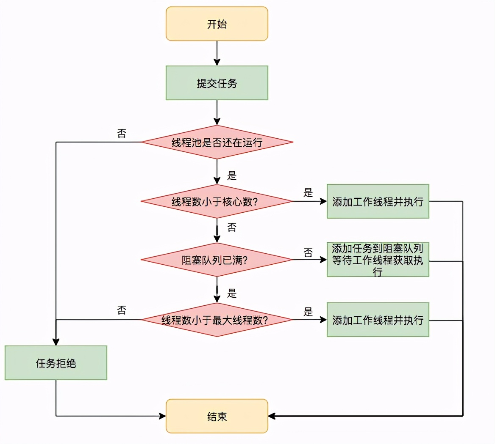
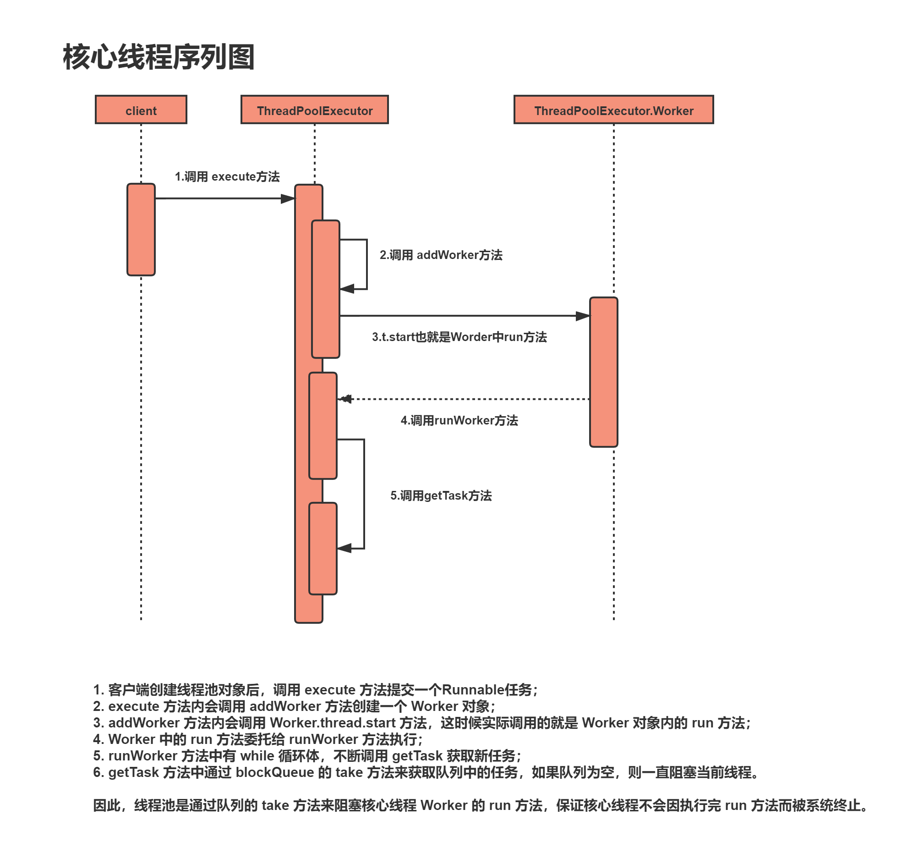

# 线程池

Java通过Executors提供四种线程池，分别为：

&emsp;&emsp;newCachedThreadPool创建一个可缓存线程池，如果线程池长度超过处理需要，可灵活回收空闲线程，若无可回收，则新建线程。

&emsp;&emsp;newFixedThreadPool 创建一个定长线程池，可控制线程最大并发数，超出的线程会在队列中等待。

&emsp;&emsp;newScheduledThreadPool 创建一个定长线程池，支持定时及周期性任务执行。

&emsp;&emsp;newSingleThreadExecutor 创建一个单线程化的线程池，它只会用唯一的工作线程来执行任务，保证所有任务按照指定顺序(FIFO, LIFO, 优先级)执行

&emsp;&emsp;newWorkStealingPool 适合使用在很耗时的操作，但是newWorkStealingPool不是ThreadPoolExecutor的扩展，它是新的线程池类ForkJoinPool的扩展，
但是都是在统一的一个Executors类中实现，由于能够合理的使用CPU进行对任务操作（并行操作），所以适合使用在很耗时的任务中：


## 线程池是如何工作的

首先我们来看下如何创建一个线程池
```
ThreadPoolExecutor threadPool = new ThreadPoolExecutor(10, 20, 600L,
                    TimeUnit.SECONDS, new LinkedBlockingQueue<>(4096),
                    new NamedThreadFactory("common-work-thread"));
// 设置拒绝策略，默认为 AbortPolicy
threadPool.setRejectedExecutionHandler(new ThreadPoolExecutor.AbortPolicy());   
```

看下其构造方法签名如下

```
rtPolicy());
看下其构造方法签名如下

public ThreadPoolExecutor(int corePoolSize,
                              int maximumPoolSize,
                              long keepAliveTime,
                              TimeUnit unit,
                              BlockingQueue<Runnable> workQueue,
                              ThreadFactory threadFactory,
                              RejectedExecutionHandler handler) {
            // 省略代码若干
}
```

要理解这些参数具体代表的意义，必须清楚线程池提交任务与执行任务流程，如下




步骤如下

1、corePoolSize：如果提交任务后线程还在运行，当线程数小于 corePoolSize 值时，无论线程池中的线程是否忙碌，都会创建线程，并把任务交给此新创建的线程进行处理，如果线程数少于等于 corePoolSize，那么这些线程不会回收，除非将 allowCoreThreadTimeOut 设置为 true，但一般不这么干，因为频繁地创建销毁线程会极大地增加系统调用的开销。

2、workQueue：如果线程数大于核心数（corePoolSize）且小于最大线程数（maximumPoolSize），则会将任务先丢到阻塞队列里，然后线程自己去阻塞队列中拉取任务执行。

3、maximumPoolSize: 线程池中最大可创建的线程数，如果提交任务时队列满了且线程数未到达这个设定值，则会创建线程并执行此次提交的任务，如果提交任务时队列满了但线池数已经到达了这个值，此时说明已经超出了线池程的负载能力，就会执行拒绝策略，这也好理解，总不能让源源不断地任务进来把线程池给压垮了吧，我们首先要保证线程池能正常工作。

4、RejectedExecutionHandler：一共有以下四种拒绝策略

AbortPolicy：丢弃任务并抛出异常，这也是默认策略；
CallerRunsPolicy：用调用者所在的线程来执行任务，所以开头的问题「线程把任务丢给线程池后肯定就马上返回了?」我们可以回答了，如果用的是 CallerRunsPolicy 策略，提交任务的线程（比如主线程）提交任务后并不能保证马上就返回，当触发了这个 reject 策略不得不亲自来处理这个任务。
DiscardOldestPolicy：丢弃阻塞队列中靠最前的任务，并执行当前任务。
DiscardPolicy：直接丢弃任务，不抛出任何异常，这种策略只适用于不重要的任务。

5、keepAliveTime: 线程存活时间，如果在此时间内超出 corePoolSize 大小的线程处于 idle 状态，这些线程会被回收

6、threadFactory：可以用此参数设置线程池的命名，指定 defaultUncaughtExceptionHandler（有啥用，后文阐述）,甚至可以设定线程为守护线程。

#### 首先来看线程大小设置

#### 线程池提交任务的两种方式


线程池创建好了，该怎么给它提交任务，有两种方式，调用 execute 和 submit 方法,区别在于调用 execute 无返回值，而调用 submit 可以返回 Future，那么这个 Future 能到底能干啥呢，看它的接口

可以用 Future 取消任务，判断任务是否已取消/完成，甚至可以阻塞等待结果。

submit 为啥能提交任务（Runnable）的同时也能返回任务（Future）的执行结果呢

原来在最后执行 execute 前用 newTaskFor 将 task 封装成了 RunnableFuture，newTaskFor 返回了 FutureTask 这个类，

可以看到 FutureTask 这个接口既实现了 Runnable 接口，也实现 Future 接口，所以在提交任务的同时也能利用 Future 接口来执行任务的取消，获取任务的状态，等待执行结果这些操作。

execute 与 submit 除了是否能返回执行结果这一区别外，还有一个重要区别，那就是使用 execute 执行如果发生了异常，是捕获不到的，默认会执行 ThreadGroup 的 uncaughtException 方法

所以如果你想监控执行 execute 方法时发生的异常，需要通过 threadFactory 来指定一个 UncaughtExceptionHandler，这样就会执行上图中的 1，进而执行 UncaughtExceptionHandler 中的逻辑,如下所示:


#### 如何实现核心线程池的预热

使用 prestartAllCoreThreads() 方法，这个方法会一次性创建 corePoolSize 个线程，无需等到提交任务时才创建，提交创建好线程的话，一有任务提交过来，这些线程就可以立即处理。

#### 下面简单画了一下核心线程的序列图：





跟踪 execute 方法源码，查看核心线程是如何被加添到池中的：

```

public void execute(Runnable command) {
    if (command == null)
        throw new NullPointerException();
    //获取线程池控制状态
    int c = ctl.get();
    //通过workerCountOf计算出实际线程数
    if (workerCountOf(c) < corePoolSize) {
        //未超过核心线程数，则新增 Worker 对象，true表示核心线程
        if (addWorker(command, true))
            return;
        c = ctl.get();
    }

    //核心线程满了，如果线程池处于运行状态则往队列中添加任务
    if (isRunning(c) && workQueue.offer(command)) {
        int recheck = ctl.get();
        //双重检测池是否处于运行状态
        if (! isRunning(recheck) && remove(command))
            reject(command);
        else if (workerCountOf(recheck) == 0)
            addWorker(null, false);
    } else if (!addWorker(command, false))//添加非核心线程
        reject(command);
}

```

根据方法内容和断点跟踪可以得出以下结论：

1. 核心线程数未超过 corePoolSize，每添加新的任务（command），都会创建新的线程（Worker中创建），即使有空闲线程存在；
2. 核心线程数等于corePoolSize后，如果继续添加新的任务（command），会将任务添加到阻塞队列 workQueue 中，等待调度；
3. 如果添加到队列失败，则检查 corePoolSize 是否小于 maximumPoolSize，如果小于则创建新的线程执行任务，直到线程总数 等于 maximumPoolSize；
4. 当线程数等于 maximumPoolSize 并且队列已满了，后续新增任务将会触发线程饱和策略。

上面代码中我们关心 addWorker 方法，它有两个参数，第一个是 Runnable 对象，第二参数是标记是否核心线程，true为核心线程，接下来看下源码：

```
private boolean addWorker(Runnable firstTask, boolean core) {
    retry:
    for (;;) {
        int c = ctl.get();
        // 省略部分代码
        ......
        
        for (;;) {
            //core主要用于判断是否继续创建新线程
            int wc = workerCountOf(c);
            //workCount 大于总容量或者workCount大于核心线程或最大线程将直接返回
            if (wc >= CAPACITY ||
                wc >= (core ? corePoolSize : maximumPoolSize))
                return false;
            //通过CAS将c加1，也就是将workCount加1    
            if (compareAndIncrementWorkerCount(c))
                break retry;
            c = ctl.get();  // Re-read ctl
            if (runStateOf(c) != rs)
                continue retry;
             retry inner loop
        }
    }

    boolean workerStarted = false;
    boolean workerAdded = false;
    Worker w = null;
    try {
        //创建新线程
        w = new Worker(firstTask);
        final Thread t = w.thread;
        if (t != null) {
            final ReentrantLock mainLock = this.mainLock;
            mainLock.lock();
            //省略部分代码
            ......
            workers.add(w);
            int s = workers.size();
            if (s > largestPoolSize)
                largestPoolSize = s;
            workerAdded = true;
            ......
            
            if (workerAdded) {
                //启动线程
                t.start();
                workerStarted = true;
            }
        }
    } finally {
        if (! workerStarted)
            addWorkerFailed(w);
    }
    return workerStarted;
}

```

从 addWorker 方法中，可以看到从 Worker 对象中获取到线程对象 t ，并调用 start 方法启动线程，那这个 t 线程是如何来的呢？

接下来要看下 Worker 是如何创建线程的：

```
private final class Worker extends AbstractQueuedSynchronizer implements Runnable {
    final Thread thread;
    /**初始执行任务，有可能为空*/
    Runnable firstTask;
    
    /**使用firstTask和来自线程工厂中的线程创建了 Worker 对象*/
    Worker(Runnable firstTask) {
        setState(-1); // inhibit interrupts until runWorker
        this.firstTask = firstTask;
        this.thread = getThreadFactory().newThread(this);
    }

    /**将run方法委托给runWorker执行*/
    public void run() {
        runWorker(this);
    }
}

```

Worker 类实现 Runnable 接口， Worker 类的构造方法中 this.thread = getThreadFactory().newThread(this)比较关键，这行代码的意思是说使用当前 Worker 对象创建了一个线程，那其实也就是说 thread 对象和 当前 Worker 对象中调用的 run 方法是一样的。到这一步我们可以得出上一步 addWorker 方法中的 t.start 调用的其实就是 Worker 类中的 run方法。

那 runWorker 又是如何运行的呢？

```
final void runWorker(Worker w) {
    Thread wt = Thread.currentThread();
    //获取要执行的任务
    Runnable task = w.firstTask;
    w.firstTask = null;
    w.unlock(); // allow interrupts
    boolean completedAbruptly = true;
    
    //轮询调用 getTask 用于获取任务
    while (task != null || (task = getTask()) != null) {
        w.lock();
        //省略部分代码
            ......
        //执行run方法
        task.run();
        //省略部分代码
            ......
    }
}

```

runWorker 中使用 while 循环，不断调用 getTask 去获取新任务。

最后看下 getTask 方法做了哪些事：

```
private Runnable getTask() {
    boolean timedOut = false; 
    //无限循环
    for (;;) {
        int c = ctl.get();
        int rs = runStateOf(c);
        // 检查队列是否为空
        if (rs >= SHUTDOWN && (rs >= STOP || workQueue.isEmpty())) {
            decrementWorkerCount();
            return null;
        }
        
        //获取运行线程数，根据allowCoreThreadTimeOut决定是否允许定时等待
        int wc = workerCountOf(c);
        boolean timed = allowCoreThreadTimeOut || wc > corePoolSize;
        //线程超时并且队列为空时通过CAS将实际运行线程数减1
        if ((wc > maximumPoolSize || (timed && timedOut))
                && (wc > 1 || workQueue.isEmpty())) {
            if (compareAndDecrementWorkerCount(c))
                return null;
            continue;
        }

        try {
            //允许超时则调用队列的poll方法定时等待
            //否则调用take获取任务
            Runnable r = timed ?
                    workQueue.poll(keepAliveTime, TimeUnit.NANOSECONDS) :
                    workQueue.take();
            //获取任务，返回结果
            if (r != null)
                return r;
            //继续循环，并且置超时标识为true
            timedOut = true;
        } catch (InterruptedException retry) {
            timedOut = false;
        }
    }
}

```

通过以上源码可以看出：

1. 在for无限循环中，通过不断的检查线程池状态和队列容量，来获取可执行任务；
2. 在 Runnable r = timed ? workQueue.poll(keepAliveTime, TimeUnit.NANOSECONDS) : workQueue.take();代码中，分为两种情况
   * timed 为 true，允许淘汰 Worker，即实际运行的线程，则通过workQueue.poll的方式定时等待拉取任务，如果在指定keepAliveTime时间内获取任务则返回，如果没有任务则继续for循环并直到timed等于false；
   * timed 为 false，则会调用 workQueue.take 方法，队列中 take 方法的含义是当队列有任务时，立即返回队首任务，没有任务时则一直阻塞当前线程，直到有新任务才返回。