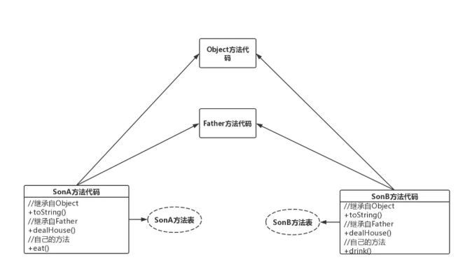

# 深入分析java中的多态(从jvm角度分析)

### 认识多态

##### 方法调用

在Java中，方法调用有两类，动态方法调用与静态方法调用。

1. 静态方法调用是指对于类的静态方法的调用方式，是在编译时刻就已经确定好具体调用方法的情况，是静态绑定的。
2. 动态方法调用需要有方法调用所作用的对象，是在调用的时候才确定具体的调用方法，是动态绑定的。

我们这里所讲的多态就是后者—动态方法调用。

##### 多态概念

多态有两种：类内部之间的多态和类之间的多态。我们先看一下标准的概念：

    多态是面向对象编程语言的重要特性，它允许基类的指针或引用指向派生类的对象，而在具体访问时实现方法的动态绑定

1. Java的方法重载（类内部之间的多态）：就是在类中可以创建多个方法，它们具有相同的名字，但可具有不同的参数列表、返回值类型。
我们举个例子来解释，就是一对夫妇生了多胞胎，多胞胎之间外观相似，其实是不同的孩子。
2. Java的方法重写（父类与子类之间的多态）：子类可继承父类中的方法，但有时子类并不想原封不动地继承父类的方法，而是想作一定的修改，这就需要采用方法的重写。
重写的参数列表和返回类型均不可修改。我们再举个例子，就是子承父业，但是儿子有自己想法，对父亲得产业进行再投资的过程。

### 代码实现多态

1. 类内部之间得多态：方法重载

```java
public class SingleClass {
    //孩子1：
    public String child(){
        System.out.println("child1");
        return "child1";
    }
    //孩子2：与孩子1参数个数不同
    public String child(String a){
        System.out.println("child2");
        return "child2";
    }   
    //孩子3：与孩子4参数顺序不同
    public String child(int a,String s){
        System.out.println("child3");
        return "child3";
    }   
    //孩子4：与孩子3参数顺序不同
    public String child(String s,int a){
        System.out.println("child4");
        return "child4";
    }   
    public static void main(String[] args){
        //重载方法调用：略
    }
}
```

从上述代码我们可以看到，在类的内部可以有相同的方法名，但是有唯一的参数列表。
当然返回类型和修饰符也可以不同。下面我们再看一下类之间的多态。

##### 类之间的多态：方法重写

类之间的多态其实是有两种方式：继承和接口。我们对这两种方式一个一个说明。

* 继承方式实现多态

对于继承方式我们使用一个例子来解释，比如说父亲可以对自己的房子有处理权，儿子继承父业同样也有处理权。

第一步：定义父类
```java
public class Father {
    public void dealHouse(){
        System.out.println("父亲处置房产"); 
    }   
}
```

第二步：定义子类（大儿子和小儿子）

```java
//大儿子
public class SonA extends Father {
    @Override
    public void dealHouse() {
        System.out.println("大儿子处置房产"); 
    }
}
//小儿子
public class SonB extends Father {
    @Override
    public void dealHouse() {
        System.out.println("小儿子处置房产"); 
    }
}
```

第三步：测试
```java
public class Test {
    public static void main(String[] args) {
        Father father=new Father(); 
        Father sonA=new SonA();
        Father sonB=new SonB();     
        father.dealHouse();
        sonA.dealHouse();
        sonB.dealHouse();
    }
}
//父亲处置房产
//大儿子处置房产
//小儿子处置房产
```

* 接口方式实现多态

接口方式实现继承方式其实跟上面一样，只不过把父类变成了接口而已，其他内容只有微笑的变化，这里就不演示了，在这里只给出父接口的形式。

```java
public interface Father {
    public void dealHouse();
}
```
到了这基本上就对多态形式的代码实现进行了演示，案例也比较简单，但是这对我们理解多态的思想还不够，我们最主要的还是从虚拟机的角度来分析一下。

### 分析多态

想要深入分析多态，我们需要弄清楚几个问题。

##### jvm内存

在上面的代码中我们其实已经看到了，不管是类内部之间实现的多态，还是类之间实现的多态，
这些方法的名字其实都是一样的，那我们的程序在运行的时候，底层虚拟机是如何去区分的呢（java虚拟机实现动态调用）？
为此我们还是先从java虚拟机讲起。

其实java虚拟机在执行java程序的时候，并不是直接运行的，
它需要一个过程，我们使用一张图来看下：


上面这张图已经很清晰，也就是说，我们的java文件要想运行，
需要通过java编译器编译成.class文件，
然后通过类装载器讲.class文件装载到JVM中，最后才是执行。
而且JVM分了五个区域，
那么在代码中定义的那些多态方法存到了哪个地方呢？
为此我们还需要对这块内存区域进行一个分析：


我给出了一张java7的运行时数据区划分图，对于每一个区域的基本情况我相信你也能看明白。
那么我们的多态方法到底存在了哪呢？没错就是后一个方法区。
java堆存的是就是我们建立的一个个实例对象，而方法区存的就是类的类型信息。

而且这个方法区中的类型信息跟在堆中存放的class对象是不同的。
在方法区中，这个class的类型信息只有唯一的实例（所以方法区是各个线程共享的内存区域），
而在堆中可以有多个该class对象。也就是说方法区的类型信息就是像一个模板，那些class对象就好比通过这些模板创建的一个个实例。

##### 通过例子来分析

现在我们拿上面的例子来说明一下多态在java虚拟机中是如何实现的。在测试类中有两行代码：

    Father sonA=new SonA();
    Father sonB=new SonB(); 

当程序运行到Father sonA=new SonA()这里就出现了多态，这是因为编译时看到Father，但是运行时new出来一个SonA类，两种类型还不一样。
那么这些代码在运行的时候在内存中是如何保存的呢？

1. Father sonA是一个引用类型，存在了java栈中的本地方法表中了。
2. new SonA其实创建了一个实例对象，存储在了java堆中。
3. SonA的类型数据存在了方法区中

我们在内存中看一下：


reference中存储的就是对象在堆中的实际地址，在堆中存储的对象信息中包含了在方法区中的相应类型数据。流程很简单，我们梳理一下：

* 第一步：虚拟机通过reference（Father的引用）查询java栈中的本地变量表，得到堆中的对象类型数据的指针，
* 第二步：通过到对象的指针找到方法区中的对象类型数据
* 第三步：查询方法表定位到实际类（SonA类）的方法运行。

好了，到第三步我们知道，其实是通过方法表来定位到实际运行的方法的。下面我们再来看看这个方法表是什么。

##### 方法表

方法表肯定是存在于方法区中的，它是实现多态的关键所在，这里面保存的就是实例方法的引用，而且是直接引用。
java虚拟机在执行程序的时候就是通过这个方法表来确定运行哪一个多态方法的。

我们通过上面的例子，来演示一下父子类在方法表中是如何保存的：



很明显每一个类都会有一个方法表，子类中不同的方法指向不同的类型信息。
继承自Object的就指向Object，继承自Father的就指向Father（也就是包含了父类的方法dealHouse）。

可能我们到这就迷糊了，既然子类的dealHouse方法其实是父类Father的，
那么为什么会执行子类的dealHouse方法呢？别着急往下看。
这是java虚拟机区分多态方法（实现动态调用）的精华所在。

当Son类的方法表会有一个指向Father类dealHouse方法的指针，同时也有一个指向自己dealHouse方法的指针，
这时候，新的数据会覆盖原有的数据，也就是说原来指向Father.dealHouse的那个引用会被替换成指向Son.dealHouse的引用（占据原来表中的位置）

### 注意

上述讲述的其实是对继承实现的多态的一种分析，对接口实现的，会有着不一样的理解。
Java虚拟机 对于接口方法的调用是采用搜索方法表的方式，
如，要在Father接口的方法表中找到dealHouse()方法，必须搜索Father的整个方法表。
从效率上来说，接口方法的调用总是慢于类方法的调用的。

以上就是对java多态的分析与理解，总结一下就是说，类调用和接口调用两种方式区分不同方法是不一样的，
类调用是根据多态方法在方法表中的位移量，而接口调用是根据搜索整个方法表来实现的。

