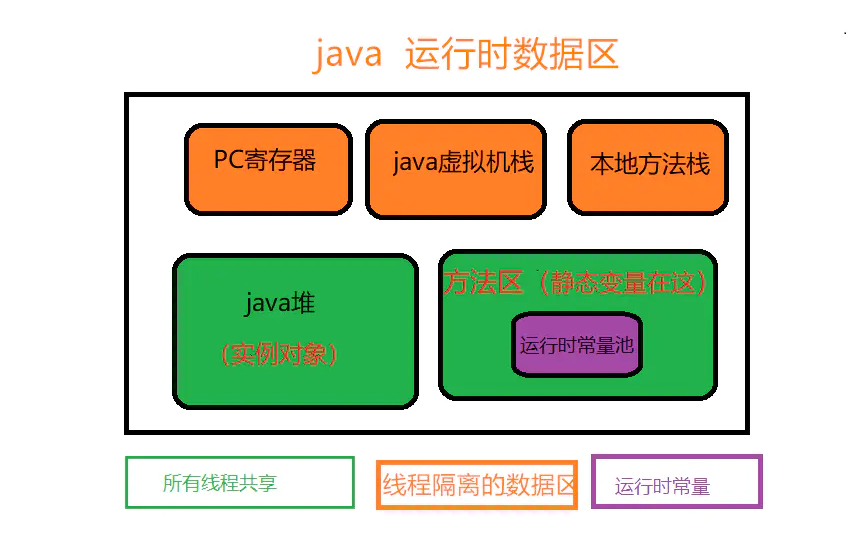
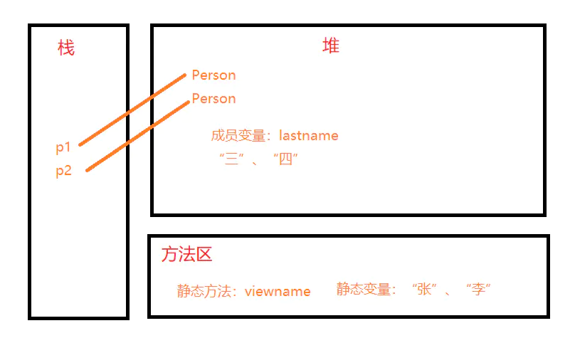

#深入分析java中的关键字static

在平时开发当中，我们经常会遇见static关键字。
这篇文章就把java中static关键字的使用方法的原理进行一个深入的分析。
先给出这篇文章的大致脉络：

>首先，描述了static关键字去修饰java类、方法、变量、代码块的方法<br>
>然后，从底层分析static关键字<br>
>接下来，给出static的一些使用场景和案例<br>
>最后，对static进行一个总结，包括和普通变量的区分。<br>
    
### static关键字的基本用法    

##### static关键字基本概念

我们可以一句话来概括：方便在没有创建对象的情况下来进行调用。

也就是说：被static关键字修饰的不需要创建对象去调用，直接根据类名就可以去访问。
对于这个概念，下面根据static关键字的四个基本使用来描述。
然后在下一部分再来去分析static的原理，希望你能认真读完。

##### static关键字修饰类

java里面static一般用来修饰成员变量或函数。
但有一种特殊用法是用static修饰内部类，普通类是不允许声明为静态的，只有内部类才可以。
下面看看如何使用。

```java
public class StaticTest {
    //static关键字修饰内部类
    public static class InnerClass{
        InnerClass(){
            System.out.println("============= 静态内部类=============");
        }
        public void InnerMethod() {
            System.out.println("============= 静态内部方法=============");
        }
    }
    public static void main(String[] args) {
        //直接通过StaticTest类名访问静态内部类InnerClass
        InnerClass inner=new StaticTest.InnerClass();
        //静态内部类可以和普通类一样使用
        inner.InnerMethod();
    }
}
/*  输出是
 * ============= 静态内部类=============
 * ============= 静态内部方法=============
 */
```
如果没有用static修饰InterClass，则只能new 一个外部类实例。再通过外部实例创建内部类。

##### static关键字修饰方法

修饰方法的时候，其实跟类一样，可以直接通过类名来进行调用：

```java
public class StaticMethod {
    public static void test() {
        System.out.println("============= 静态方法=============");
    };
    public static void main(String[] args) {
        //方式一：直接通过类名
        StaticMethod.test();
        //方式二：
        StaticMethod fdd=new StaticMethod();
        fdd.test();
    }
}
```
##### static关键字修饰变量

被static修饰的成员变量叫做静态变量，也叫做类变量，说明这个变量是属于这个类的，而不是属于是对象，没有被static修饰的成员变量叫做实例变量，说明这个变量是属于某个具体的对象的。

我们同样可以使用上面的方式进行调用变量：

```java
public class StaticVar {
    private static String name="java的架构师技术栈"；
    public static void main(String[] args) {
        //直接通过类名
        StaticVar.name;
    }
}
```
##### static关键字修饰代码块

静态代码块在类第一次被载入时执行，在这里主要是想验证一下，类初始化的顺序。

* 父类静态变量
* 父类静态代码块
* 子类静态变量
* 子类静态代码块
* 父类普通变量
* 父类普通代码块
* 父类构造函数
* 子类普通变量
* 子类普通代码块
* 子类构造函数

代码验证一下：

首先我们定义一个父类

```java
public class Father{
    //父类静态代码块
    static{
        System.out.println("Father static");
    }
    //父类构造函数
    public Father(){
        System.out.println("Father constructor");
    }
}
```

然后定义一个子类

```java
public class Son extends Father{
    //静态代码块
    static{
        System.out.println("Son static");
    }
    //构造方法
    public Son(){
        System.out.println("Son constructor");
    }
    public static void main(String[] args) {
        new Son();
    }
}
```

看个结果


### 深入分析static关键字

上面我们只是描述了一下static关键字的基本使用场景，下面主要解析一下static关键字的深层原理。
要理解static为什么会有上面的特性，首先我们还需要从jvm内存说起。
我们先给出一张java的内存结构图，然后通过案例描述一下static修饰的变量存放在哪？



从上图我们可以发现，静态变量存放在方法区中，并且是被所有线程所共享的。
这里要说一下java堆，java堆存放的就是我们创建的一个个实例变量。

* 堆区: 
1. 存储的全部是对象，每个对象都包含一个与之对应的class的信息。(class的目的是得到操作指令) 
2. jvm只有一个堆区(heap)被所有线程共享，堆中不存放基本类型和对象引用，只存放对象本身 
* 栈区: 
1. 每个线程包含一个栈区，栈中只保存基础数据类型的对象和自定义对象的引用(不是对象)，对象都存放在堆区中 
2. 每个栈中的数据(原始类型和对象引用)都是私有的，其他栈不能访问。 
3. 栈分为3个部分：基本类型变量区、执行环境上下文、操作指令区(存放操作指令)。 
* 方法区: 
1. 又叫静态区，跟堆一样，被所有的线程共享。方法区包含所有的class和static变量。
2. 方法区中包含的都是在整个程序中永远唯一的元素，如class，static变量。

下面通过一个案例说明一下，从内存的角度来看，static关键字为什么会有这样的特性。

首先我们定义一个类

```java
public class Person {
    //静态变量
    static String firstName;
    String lastName;
    public void showName(){
        System.out.println(firstName+lastName);
    }
    //静态方法
    public static void viewName(){
      System.out.println(firstName);
    }
    
    public static void main(String[] args) {
        Person p =new Person();
        Person.firstName = "张";
        p.lastName="三";
        p.showName();
        
        Person p2 =new Person();
        Person.firstName="李";
        p2.lastName="四";
        p2.showName();
    }
}
//输出。张三、李四
```
接下来我们从内存的角度出发，看看



从上面可以看到，我们的方法在调用的时候，是从方法区调用的，但是堆内存不一样，堆内存中的成员变量lastname是随着对象的产生而产生。随着对象的消失而消失。静态变量是所有线程共享的，所以不会消失。这也就能解释上面static关键字的真正原因。

下面对static关键字进行一个小结：

##### 特点：

1. static是一个修饰符，用于修饰成员。（成员变量，成员函数）static修饰的成员变量 称之为静态变量或类变量。
2. static修饰的成员被所有的对象共享。
3. static优先于对象存在，因为static的成员随着类的加载就已经存在。
4. static修饰的成员多了一种调用方式，可以直接被类名所调用，（类名.静态成员）。
5. static修饰的数据是共享数据，对象中的存储的是特有的数据。

##### 成员变量和静态变量的区别：

1. 生命周期的不同：
   * 成员变量随着对象的创建而存在随着对象的回收而释放。
   * 静态变量随着类的加载而存在随着类的消失而消失。
2. 调用方式不同：
   * 成员变量只能被对象调用。
   * 静态变量可以被对象调用，也可以用类名调用。（推荐用类名调用）
3. 别名不同：
   * 成员变量也称为实例变量。
   * 静态变量称为类变量。

4. 数据存储位置不同：
   * 成员变量数据存储在堆内存的对象中，所以也叫对象的特有数据。
   * 静态变量数据存储在方法区（共享数据区）的静态区，所以也叫对象的共享数据。

##### 静态使用时需要注意的事项：

1. 静态方法只能访问静态成员。（非静态既可以访问静态，又可以访问非静态）
2. 静态方法中不可以使用this或者super关键字。
3. 主函数是静态的


### 为什么java中静态方法不能调用非静态方法和变量？

我们先看效果：


我们在静态方法main中调用非静态变量或者是方法都会报错。
我们反过来看看：


反过来没有一点问题，接下来我们解释一下原因：

### 原因解释

我们需要首先知道的是静态方法和静态变量是属于某一个类，
而不属于类的对象。我们不直接讲原因，先从jvm说起：


这是一张类加载的生命周期图。

##### 加载
      
”加载“是”类加机制”的第一个过程，在加载阶段，虚拟机主要完成三件事：
      
1. 通过一个类的全限定名来获取其定义的二进制字节流
2. 将这个字节流所代表的的静态存储结构转化为方法区的运行时数据结构
3. 在堆中生成一个代表这个类的Class对象，作为方法区中这些数据的访问入口。
      
注意此时会扫描到我们的代码中是否有静态变量或者是静态方法等等这些静态数据结构，还未分配内存。

##### 验证

验证的主要作用就是确保被加载的类的正确性。

##### 准备

准备阶段主要为类变量分配内存并设置初始值。这些内存都在方法区分配。注意此时就会为我们的类变量也就是静态变量分配内存，但是普通成员变量还没。

##### 解析

解析阶段主要是虚拟机将常量池中的符号引用转化为直接引用的过程。


##### 初始化

这是类加载机制的最后一步，在这个阶段，java程序代码才开始真正执行。
我们知道，在准备阶段已经为类变量赋过一次值。在初始化阶端，程序员可以根据自己的需求来赋值了。初始化时候才会为我们的普通成员变量赋值。

写到这答案已经出来了，静态方法是属于类的，动态方法属于实例对象，
在类加载的时候就会分配内存，可以 通过类名直接去访问，
非静态成员（变量和方法）属于类的对象，所以只有该对象初始化之后才存在，然后通过类的对象去访问。

也就是说如果我们在静态方法中调用非静态成员变量会超前，
可能会调用了一个还未初始化的变量。因此编译器会报错。


## 静态类

静态类（只有内部类才能被声明为静态类，即静态内部类）
1. 只能在内部类中定义静态类
2. 静态内部类与外层类绑定，即使没有创建外层类的对象，它一样存在。
3. 静态类的方法可以是静态的方法也可以是非静态的方法，静态的方法可以在外层通过静态类调用，而非静态的方法必须要创建类的对象之后才能调用。
5. 只能引用外部类的static成员变量（也就是类变量）。
6. 如果一个内部类不是被定义成静态内部类，那么在定义成员变量或者成员方法的时候，是不能够被定义成静态的。

总结
1. 是否能拥有静态成员：静态内部类可以有静态成员(方法，属性)，而非静态内部类则不能有静态成员(方法，属性)。
2. 访问外部类的成员：静态内部类只能够访问外部类的静态成员,而非静态内部类则可以访问外部类的所有成员(方法，属性)。
3. 静态内部类和非静态内部类在创建时有区别

假设类A有静态内部类B和非静态内部类C，创建B和C的区别为：
```
A a=new A();
A.B b=new A.B();
A.C c=a.new C();
```

## Java 局部变量


局部变量声明在方法、构造方法或者语句块中；

局部变量在方法、构造方法、或者语句块被执行的时候创建，当它们执行完成后，变量将会被销毁；

访问修饰符不能用于局部变量；

局部变量只在声明它的方法、构造方法或者语句块中可见；

局部变量是在栈上分配的。

局部变量没有默认值，所以局部变量被声明后，必须经过初始化，才可以使用。

## 实例变量

实例变量声明在一个类中，但在方法、构造方法和语句块之外；当一个对象被实例化之后，每个实例变量的值就跟着确定；

实例变量在对象创建的时候创建，在对象被销毁的时候销毁；

实例变量的值应该至少被一个方法、构造方法或者语句块引用，使得外部能够通过这些方式获取实例变量信息；

实例变量可以声明在使用前或者使用后；

访问修饰符可以修饰实例变量；

实例变量对于类中的方法、构造方法或者语句块是可见的。一般情况下应该把实例变量设为私有。通过使用访问修饰符可以使实例变量对子类可见；

实例变量具有默认值。数值型变量的默认值是0，布尔型变量的默认值是false，引用类型变量的默认值是null。变量的值可以在声明时指定，也可以在构造方法中指定；

实例变量可以直接通过变量名访问。但在静态方法以及其他类中，就应该使用完全限定名：ObejectReference.VariableName。

## 类变量（静态变量）

类变量也称为静态变量，在类中以static关键字声明，但必须在方法构造方法和语句块之外。

无论一个类创建了多少个对象，类只拥有类变量的一份拷贝。

静态变量除了被声明为常量外很少使用。常量是指声明为public/private，final和static类型的变量。常量初始化后不可改变。

静态变量储存在静态存储区。经常被声明为常量，很少单独使用static声明变量。

静态变量在程序开始时创建，在程序结束时销毁。

与实例变量具有相似的可见性。但为了对类的使用者可见，大多数静态变量声明为public类型。

默认值和实例变量相似。数值型变量默认值是0，布尔型默认值是false，引用类型默认值是null。变量的值可以在声明的时候指定，也可以在构造方法中指定。此外，静态变量还可以在静态语句块中初始化。

静态变量可以通过：ClassName.VariableName的方式访问。

类变量被声明为public static final类型时，类变量名称一般建议使用大写字母。如果静态变量不是public和final类型，其命名方式与实例变量以及局部变量的命名方式一致。