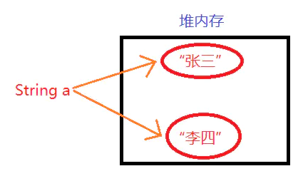
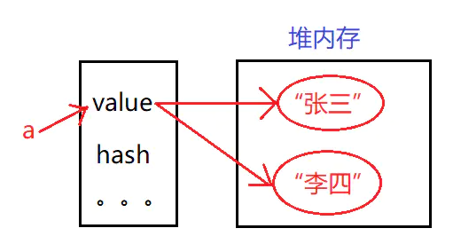

# 深入分析java中的String

想要完全了解String，在这里我们需要解决以下几个问题

* 什么是不可变对象？
* String如何被设计成不可变对象的？
* 有什么办法能够改变String？
* JAVA语言为什么把String类型设计成不可变？

### 什么是不可变对象

从字面意思也能够理解，也就是我们的创建的对象不可改变。
那什么是不可变呢？为了实现创建的对象不可变，java语言要求我们需要遵守以下5条规则：

1. 类内部所有的字段都是final修饰的。
2. 类内部所有的字段都是私有的，也就是被private修饰。
3. 类不能够被集成和拓展。
4. 类不能够对外提供哪些能够修改内部状态的方法，setter方法也不行。
5. 类内部的字段如果是引用，也就是说可以指向可变对象，那我们程序员不能获取这个引用。

正是由于我们的String类型遵循了上面5条规则，所以才说String对象是不可变的。
想要去了解他还是看看String类型内部长什么样子再来看上面5条规则吧。

### String如何被设计成不可变对象的

* 疑惑一

在看之前，我们先给出一个疑惑问题，我们看下面的代码，

```java
public class Test2 {
    public static void main(String[] args) {
        String a="张三";
        System.out.println(a);
        a="李四";
        System.out.println(a);
    }
}
//output:
//张三
//李四
```

在文章一开始我们就说了，String对象是不可变的，这里a=张三，然后a=李四，
这符合String的不可变性嘛？答案是当然符合。



* 源码解释疑惑

既然a指向的引用地址改变了，那么其String内部肯定有一个变量，能够指向不同的实际对象，
想要进一步弄清楚我们就进入其String的内部来看看。

我们在这里主要通过String类的源码来分析，看一下Java语言是如何设计，
能把String类型设计成不可变的。这里给出的是jdk1.8的一部分源码。

```java
public final class String
    implements java.io.Serializable, Comparable<String>, CharSequence {
    /** The value is used for character storage. */
    private final char value[];

    /** Cache the hash code for the string */
    private int hash; // Default to 0
    ......
}
```

上面最主要的是两个字段：value和hash。我们在这里主要是看value数组，hash和主题无关所以这里不再讲解了，
我有专门的文章介绍hash。

我们的String对象其实在内部就是一个个字符然后存储在这个value数组里面的。
但是value对外没有setValue的方法，所以整个String对象在外部看起来就是不可变的。我们画一张图解释一下上面的疑惑



现在明白了吧，也就是说真正改变引用的是value，因为value也是一个数组引用。
这也可以很方便的解释下一个疑惑问题了。

* 疑惑二

既然我们的String是不可变的，好像内部还有很多substring， replace， replaceAll这些操作的方法。好像都是对String对象改变了，解释起来也很简单，我们每次的replace这些操作，其实就是在堆内存中创建了一个新的对象。然后我们的value指向不同的对象罢了。

面试的时候我们只是解释上面的原因其实不是那么尽善尽美，想要更好的去加薪去装逼，我们还需更进一步回答。

### 有什么办法能够改变String

既然有这个标题。那肯定就是有办法的，别忘了我们的反射机制，
在通常情况下，他可以做出一些违反语言设计原则的事情。
这也是一个技巧，每当面试官问一些违反语言设计原则的问题，
你就可以拿反射来反驳他。下面我们来看一下：

```java
public class Test2 {
    public static void main(String[] args) {
        String str = "张三";
        System.out.println(str);
        try {
            //我们通过反射获取内部的value字符数组
            Field field = String.class.getDeclaredField("value");
            field.setAccessible(true);
            char[] value;
            value = (char[]) field.get(str);
            //把字符串第一个字符变成王
            value[0] = '王';
            System.out.println(str);
        } catch (Exception e) {
            e.printStackTrace();
        }
    }
}
//output:
//张三
//王三
```

我们可以通过反射来改变String。

### JAVA语言为什么把String类型设计成不可变

这里有几个特点。

第一：在Java程序中String类型是使用最多的，这就牵扯到大量的增删改查，每次增删改差之前其实jvm需要检查一下这个String对象的安全性，
就是通过hashcode，当设计成不可变对象时候，就保证了每次增删改查的hashcode的唯一性，也就可以放心的操作。

第二：网络连接地址URL,文件路径path通常情况下都是以String类型保存, 假若String不是固定不变的,将会引起各种安全隐患。
就好比我们的密码不能以String的类型保存，如果你将密码以明文的形式保存成字符串，那么它将一直留在内存中，直到垃圾收集器把它清除。
而由于字符串被放在字符串缓冲池中以方便重复使用，所以它就可能在内存中被保留很长时间，而这将导致安全隐患

第三：字符串值是被保留在常量池中的，也就是说假若字符串对象允许改变,那么将会导致各种逻辑错误

### java 字符串String的最大长度

java字符串String的最大长度，要分两个阶段，编译阶段及运行时阶段

* 编译阶段：

在我们使用字符串字面量直接定义String的时候，会把字符串在常量池中存储一份。
常量池中的每一项常量都是一个表，都有自己对应的类型。String类型，有一张固定长度的CONSTANT_String_info表用来存储文字字符串值，
注意：该表只存储文字字符串值，不存储符号引用。

JVM的常量池最多可放65535个项。第0项不用。最后一项最多只能是65534(下标值)。而每一项中，若是放一个UTF-8的常量串，
其长度最长是：65535个字节(不是字符)。

* 运行时阶段：

String内部是以char数组的形式存储，数组的长度是int类型，那么String允许的最大长度就是Integer.MAX_VALUE了,2147483647；
又由于java中的字符是以16位存储的，因此大概需要4GB的内存才能存储最大长度的字符串。

##### format()

转换符 | 详细说明 | 示例
--- | :---: | ---:
%s | 字符串类型 | “喜欢请收藏”
%d | 整数类型（十进制）| 88
%b | 布尔类型 | 	true
%% | 百分比类型 | ％(%特殊字符%%才能显示%)
%n | 换行符 | 不举例(基本用不到)
