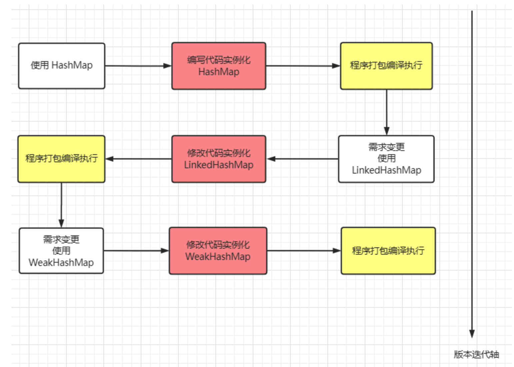

# 反射

要想理解反射的原理，首先要了解什么是类型信息。Java让我们在运行时识别对象和类的信息，
主要有两种方式：
* 一种是传统的RTTI（Run-Time Type Identification)，它假定我们在编译时已经知道了所有的类型信息；
* 另一种是反射机制，它允许我们在运行时发现和使用类的信息。

使用的前提条件：必须先得到代表的字节码的Class，Class类用于表示.class文件（字节码）

## 反射的概述

JAVA反射机制是在运行状态中，对于任意一个类，都能够知道这个类的所有属性和方法；对于任意一个对象，都能够调用它的任意一个方法和属性；这种动态获取的信息以及动态调用对象的方法的功能称为Java语言的反射机制。

要想解剖一个类，必须先要获取到该类的字节码文件对象。而解剖使用的就是Class类中的方法。所以先要获取到每一个字节码文件对应的Class类型的对象.。

反射就是把Java类中的各种成分映射成一个个的Java对象。

例如：

一个类有：成员变量、方法、构造方法、包等等信息，利用反射技术可以对一个类进行解剖，把各个组成部分映射成一个个对象。

（其实：一个类中这些成员方法、构造方法，在加入类中都有一个类来描述）

如图是类的正常加载过程：反射的原理在于class对象。

熟悉一下加载的时候：Class对象的由来是将class文件读入内存，并为之创建一个Class对象。


## 反射的思想及作用

上部分了解了一下什么是**正射**

```java
Map<Integer, Integer> map = new HashMap<>();
map.put(1, 1);
```

某一天发现，该段程序不适合用 HashMap 存储键值对，更倾向于用LinkedHashMap存储。重新编写代码后变成下面这个样子。

```java
Map<Integer, Integer> map = new LinkedHashMap<>();
map.put(1, 1);
```
假如又有一天，发现数据还是适合用 HashMap来存储，难道又要重新修改源码吗？

> 发现问题了吗？我们每次改变一种需求，都要去重新修改源码，然后对代码进行编译，打包，再到 JVM 上重启项目。这么些步骤下来，效率非常低。



对于这种需求频繁变更但变更不大的场景，频繁地更改源码肯定是一种不允许的操作，我们可以使用一个开关，判断什么时候使用哪一种数据结构。

```java
public Map<Integer, Integer> getMap(String param) {
    Map<Integer, Integer> map = null;
    if (param.equals("HashMap")) {
        map = new HashMap<>();
    } else if (param.equals("LinkedHashMap")) {
        map = new LinkedHashMap<>();
    } else if (param.equals("WeakHashMap")) {
        map = new WeakHashMap<>();
    }
    return map;
}
```

通过传入参数param决定使用哪一种数据结构，可以在项目运行时，通过动态传入参数决定使用哪一个数据结构。

如果某一天还想用TreeMap，还是避免不了修改源码，重新编译执行的弊端。这个时候，反射就派上用场了。

在代码运行之前，我们不确定将来会使用哪一种数据结构，只有在程序运行时才决定使用哪一个数据类，而反射可以在程序运行过程中动态获取类信息和调用类方法。通过反射构造类实例，代码会演变成下面这样。


```java
public Map<Integer, Integer> getMap(String className) {
    Class clazz = Class.forName(className);
    Consructor con = clazz.getConstructor();
    return (Map<Integer, Integer>) con.newInstance();
}
```

无论使用什么 Map，只要实现了Map接口，就可以使用全类名路径传入到方法中，获得对应的 Map 实例。例如java.util.HashMap / java.util.LinkedHashMap····如果要创建其它类例如WeakHashMap，我也不需要修改上面这段源码。

## 反射的基本使用

Java 反射的主要组成部分有4个：

* Class：任何运行在内存中的所有类都是该 Class 类的实例对象，每个 Class 类对象内部都包含了本来的所有信息。记着一句话，通过反射干任何事，先找 Class 准没错！
* Field：描述一个类的属性，内部包含了该属性的所有信息，例如数据类型，属性名，访问修饰符······
* Constructor：描述一个类的构造方法，内部包含了构造方法的所有信息，例如参数类型，参数名字，访问修饰符······
* Method：描述一个类的所有方法（包括抽象方法），内部包含了该方法的所有信息，与Constructor类似，不同之处是 Method 拥有返回值类型信息，因为构造方法是没有返回值的。

反射中的用法有非常非常多，常见的功能有以下这几个：

在运行时获取一个类的 Class 对象
在运行时构造一个类的实例化对象
在运行时获取一个类的所有信息：变量、方法、构造器、注解

我们在学习反射的基本使用时，我会用一个**SmallPineapple**类作为模板进行说明，首先我们先来熟悉这个类的基本组成：属性，构造函数和方法


```java
```

#### 获取类的 Class 对象

在 Java 中，每一个类都会有专属于自己的 Class 对象，当我们编写完.java文件后，使用javac编译后，就会产生一个字节码文件.class，在字节码文件中包含类的所有信息，如属性，构造方法，方法······当字节码文件被装载进虚拟机执行时，会在内存中生成 Class 对象，它包含了该类内部的所有信息，在程序运行时可以获取这些信息。

获取 Class 对象的方法有3种：

类名.class：这种获取方式只有在编译前已经声明了该类的类型才能获取到 Class 对象

```java
Class clazz = SmallPineapple.class;
```

实例.getClass()：通过实例化对象获取该实例的 Class 对象

```java
SmallPineapple sp = new SmallPineapple();
Class clazz = sp.getClass();
```

Class.forName(className)：通过类的全限定名获取该类的 Class 对象

```java
Class clazz = Class.forName("com.bean.smallpineapple");
```

拿到 Class对象就可以对它为所欲为了：剥开它的皮（获取类信息）、指挥它做事（调用它的方法），看透它的一切（获取属性），总之它就没有隐私了。

不过在程序中，每个类的 Class 对象只有一个，也就是说你只有这一个奴隶。我们用上面三种方式测试，通过三种方式打印各个 Class 对象都是相同的。

```java
    public static void main(String[] args) throws ClassNotFoundException {

        Class clazz1 = Class.forName("reflect.SmallPineapple");

        Class clazz2 = SmallPineapple.class;

        SmallPineapple instance = new SmallPineapple();

        Class clazz3 = instance.getClass();

        System.out.println("Class.forName() == SmallPineapple.class:" + (clazz1 == clazz2));
        System.out.println("Class.forName() == instance.getClass():" + (clazz1 == clazz3));
        System.out.println("instance.getClass() == SmallPineapple.class:" + (clazz2 == clazz3));
    }

Class.forName() == SmallPineapple.class:true
Class.forName() == instance.getClass():true
instance.getClass() == SmallPineapple.class:true

```

> 内存中只有一个 Class 对象的原因要牵扯到 JVM 类加载机制的双亲委派模型，它保证了程序运行时，加载类时每个类在内存中仅会产生一个Class对象。在这里我不打算详细展开说明，可以简单地理解为 JVM 帮我们保证了一个类在内存中至多存在一个 Class 对象。

#### 构造类的实例化对象

通过反射构造一个类的实例方式有2种：

###### Class 对象调用newInstance()方法

```java
        Class clazz = Class.forName("reflect.SmallPineapple");
        SmallPineapple smallPineapple = (SmallPineapple) clazz.newInstance();
        smallPineapple.getInfo();

[null 的年龄是：0]
```

即使 SmallPineapple 已经显式定义了构造方法，通过 newInstance() 创建的实例中，所有属性值都是对应类型的初始值，
因为 newInstance() 构造实例会调用默认无参构造器。

###### Constructor 构造器调用newInstance()方法

```java
        Class clazz = Class.forName("reflect.SmallPineapple");
//        SmallPineapple smallPineapple = (SmallPineapple) clazz.newInstance();
//        smallPineapple.getInfo();

        Constructor constructor = clazz.getConstructor(String.class, int.class);
        constructor.setAccessible(true);
        SmallPineapple smallPineapple2 = (SmallPineapple) constructor.newInstance("小菠萝", 21);
        smallPineapple2.getInfo();

[小菠萝 的年龄是：21]
```

通过 getConstructor(Object... paramTypes) 方法指定获取指定参数类型的 Constructor， Constructor 调用 newInstance(Object... paramValues) 时传入构造方法参数的值，同样可以构造一个实例，且内部属性已经被赋值。

通过Class对象调用 newInstance() 会走默认无参构造方法，如果想通过显式构造方法构造实例，需要提前从Class中调用getConstructor()方法获取对应的构造器，通过构造器去实例化对象。

#### 获取一个类的所有信息

Class 对象中包含了该类的所有信息，在编译期我们能看到的信息就是该类的变量、方法、构造器，在运行时最常被获取的也是这些信息。


###### 获取类中的变量（Field）
* Field[] getFields()：获取类中所有被public修饰的所有变量
* Field getField(String name)：根据变量名获取类中的一个变量，该变量必须被public修饰
* Field[] getDeclaredFields()：获取类中所有的变量，但无法获取继承下来的变量
* Field getDeclaredField(String name)：根据姓名获取类中的某个变量，无法获取继承下来的变量
###### 获取类中的方法（Method）
* Method[] getMethods()：获取类中被public修饰的所有方法
* Method getMethod(String name, Class...<?> paramTypes)：根据名字和参数类型获取对应方法，该方法必须被public修饰
* Method[] getDeclaredMethods()：获取所有方法，但无法获取继承下来的方法
* Method getDeclaredMethod(String name, Class...<?> paramTypes)：根据名字和参数类型获取对应方法，无法获取继承下来的方法
###### 获取类的构造器（Constructor）
* Constuctor[] getConstructors()：获取类中所有被public修饰的构造器
* Constructor getConstructor(Class...<?> paramTypes)：根据参数类型获取类中某个构造器，该构造器必须被public修饰
* Constructor[] getDeclaredConstructors()：获取类中所有构造器
* Constructor getDeclaredConstructor(class...<?> paramTypes)：根据参数类型获取对应的构造器

每种功能内部以 Declared 细分为2类：

> 有Declared修饰的方法：可以获取该类内部包含的所有变量、方法和构造器，但是无法获取继承下来的信息
  
> 无Declared修饰的方法：可以获取该类中public修饰的变量、方法和构造器，可获取继承下来的信息

如果想获取类中所有的（包括继承）变量、方法和构造器，则需要同时调用getXXXs()和getDeclaredXXXs()两个方法，用Set集合存储它们获得的变量、构造器和方法，以防两个方法获取到相同的东西

例如：要获取SmallPineapple获取类中所有的变量，代码应该是下面这样写。

```java
       // 获取 public 属性，包括继承
        Field[] fields1 = clazz.getFields();
        // 获取所有属性，不包括继承
        Field[] fields2 = clazz.getDeclaredFields();
        // 将所有属性汇总到 set
        Set<Field> allFields = new HashSet<>();
        allFields.addAll(Arrays.asList(fields1));
        allFields.addAll(Arrays.asList(fields2));
```

```
        Class clazz2 = SmallPineapple.class;
        Object object = clazz2.newInstance();
        Field field = clazz2.getDeclaredField("name");
        field.setAccessible(true);
        field.set(object, "小儿");
        Field ageField = clazz2.getDeclaredField("age");
        ageField.setAccessible(true);
        ageField.set(object, 2);
        Method method = clazz2.getMethod("getInfo");
        method.invoke(object);
```

> 不知道你有没有发现一件有趣的事情，如果父类的属性用protected修饰，利用反射是无法获取到的。

> protected 修饰符的作用范围：只允许同一个包下或者子类访问，可以继承到子类。

> getFields() 只能获取到本类的public属性的变量值；

> getDeclaredFields() 只能获取到本类的所有属性，不包括继承的；无论如何都获取不到父类的 protected 属性修饰的变量，但是它的的确确存在于子类中。

#### 获取注解

获取注解单独拧了出来，因为它并不是专属于 Class 对象的一种信息，每个变量，方法和构造器都可以被注解修饰，所以在反射中，Field，Constructor 和 Method 类对象都可以调用下面这些方法获取标注在它们之上的注解。

* Annotation[] getAnnotations()：获取该对象上的所有注解
* Annotation getAnnotation(Class annotaionClass)：传入注解类型，获取该对象上的特定一个注解
* Annotation[] getDeclaredAnnotations()：获取该对象上的显式标注的所有注解，无法获取继承下来的注解
* Annotation getDeclaredAnnotation(Class annotationClass)：根据注解类型，获取该对象上的特定一个注解，无法获取继承下来的注解

只有注解的@Retension标注为RUNTIME时，才能够通过反射获取到该注解，@Retension 有3种保存策略：

* SOURCE：只在源文件(.java)中保存，即该注解只会保留在源文件中，编译时编译器会忽略该注解，例如 @Override 注解
* CLASS：保存在字节码文件(.class)中，注解会随着编译跟随字节码文件中，但是运行时不会对该注解进行解析
* RUNTIME：一直保存到运行时，用得最多的一种保存策略，在运行时可以获取到该注解的所有信息

像下面这个例子，SmallPineapple 类继承了抽象类Pineapple，getInfo()方法上标识有 @Override 注解，且在子类中标注了@Transient注解，在运行时获取子类重写方法上的所有注解，只能获取到@Transient的信息。

```java
public abstract class Pineapple {
    public abstract void getInfo();
}
public class SmallPineapple extends Pineapple {
    @Transient
    @Override
    public void getInfo() {
        System.out.print("小菠萝的身高和年龄是:" + height + "cm ; " + age + "岁");
    }
}
```

启动类Bootstrap获取 SmallPineapple 类中的 getInfo() 方法上的注解信息：
```java
public class Bootstrap {
    /**
     * 根据运行时传入的全类名路径判断具体的类对象
     * @param path 类的全类名路径
     */
    public static void execute(String path) throws Exception {
        Class obj = Class.forName(path);
        Method method = obj.getMethod("getInfo");
        Annotation[] annotations = method.getAnnotations();
        for (Annotation annotation : annotations) {
            System.out.println(annotation.toString());
        }
    }
    public static void main(String[] args) throws Exception {
        execute("com.pineapple.SmallPineapple");
    }
}
// @java.beans.Transient(value=true)
```
## 通过反射调用方法

通过反射获取到某个 Method 类对象后，可以通过调用invoke方法执行。

* invoke(Oject obj, Object... args)：参数``1指定调用该方法的**对象**，参数2`是方法的参数列表值。

如果调用的方法是静态方法，参数1只需要传入null，因为静态方法不与某个对象有关，只与某个类有关。

可以像下面这种做法，通过反射实例化一个对象，然后获取Method方法对象，调用invoke()指定SmallPineapple的getInfo()方法。

```java
Class clazz = Class.forName("com.bean.SmallPineapple");
Constructor constructor = clazz.getConstructor(String.class, int.class);
constructor.setAccessible(true);
SmallPineapple sp = (SmallPineapple) constructor.newInstance("小菠萝", 21);
Method method = clazz.getMethod("getInfo");
if (method != null) {
    method.invoke(sp, null);
}
```

## 反射调用的实现

首先，我们来看看方法的反射调用，也就是 Method.invoke，是怎么实现的。

```java
public final class Method extends Executable {
    ...
    public Object invoke(Object obj, Object... args) throws ... {
        ... //权限检查
        MethodAccessor ma = methodAccessor;
        if (ma == null) {
            ma = acquireMethodAccessor();
        }
        return ma.invoke(obj, args);
    }
}
```

如果你查阅 Method.invoke 的源代码，那么你会发现，它实际上委派给MethodAccessor 来处理。MethodAccessor 是一个接口，它有两个已有的具体实现：一个通过本地方法来实现反射调用，另一个则使用了委派模式。为了方便记忆，我便用“本地实现”和“委派实现”来指代这两者。

每个 Method 实例的第一次反射调用都会生成一个委派实现，它所委派的具体实现便是一个本地实现。本地实现非常容易理解。当进入了 Java 虚拟机内部之后，我们便拥有了Method 实例所指向方法的具体地址。这时候，反射调用无非就是将传入的参数准备好，然后调用进入目标方法。

```java
// v0版本
import java.lang.reflect.Method;
public class Test {
    public static void target(int i) {
        new Exception("#" + i).printStackTrace();
    }
    public static void main(String[] args) throws Exception {
        Class<?> klass = Class.forName("Test");
        Method method = klass.getMethod("target", int.class);
        method.invoke(null, 0);
    }
}
#不同版本的输出略有不同，这里我使用了Java 10。
$ java Test
java.lang.Exception: #0
at Test.target(Test.java:5)
at java.base/jdk.internal.reflect.NativeMethodAccessorImpl .invoke0(Native Methoa      t java.base/jdk.internal.reflect.NativeMethodAccessorImpl. .invoke(NativeMethodAt       java.base/jdk.internal.reflect.DelegatingMethodAccessorImpl.i .invoke(Delegatin
java.base/java.lang.reflect.Method.invoke(Method.java:564)
t        Test.main(Test.java:131
```

为了方便理解，我们可以打印一下反射调用到目标方法时的栈轨迹。在上面的 v0 版本代码中，我们获取了一个指向 Test.target 方法的 Method 对象，并且用它来进行反射调用。在 Test.target 中，我会打印出栈轨迹。

可以看到，反射调用先是调用了 Method.invoke，然后进入委派实现（DelegatingMethodAccessorImpl），再然后进入本地实现（NativeMethodAccessorImpl），最后到达目标方法。

这里你可能会疑问，为什么反射调用还要采取委派实现作为中间层？直接交给本地实现不可以么？

其实，Java 的反射调用机制还设立了另一种动态生成字节码的实现（下称动态实现），直接使用 invoke 指令来调用目标方法。之所以采用委派实现，便是为了能够在本地实现以及动态实现中切换。

```java
//动态实现的伪代码，这里只列举了关键的调用逻辑，其实它还包括调用者检测、参数检测的字节码。
package jdk.internal.reflect;
public class GeneratedMethodAccessor1 extends ... {
    @Overrides
    public Object invoke(Object obj, Object[] args) throws ... {
        Test.target((int) args[0]);
        return null;
    }
}
```

动态实现和本地实现相比，其运行效率要快上 20 倍。这是因为动态实现无需经过 Java到 C++ 再到 Java 的切换，但由于生成字节码十分耗时，仅调用一次的话，反而是本地实现要快上 3 到 4 倍。

考虑到许多反射调用仅会执行一次，Java 虚拟机设置了一个阈值 15（可以通过 -Dsun.reflect.inflationThreshold= 来调整），当某个反射调用的调用次数在 15 之下时，采用本地实现；当达到 15 时，便开始动态生成字节码，并将委派实现的委派对象切换至动态实现，这个过程我们称之为 Inflation。

为了观察这个过程，我将刚才的例子更改为下面的 v1 版本。它会将反射调用循环 20 次。

```java
// v1版本
import java.lang.reflect.Method;
public class Test {
    public static void target(int i) {
        new Exception("#" + i).printStackTrace();
    }
    public static void main(String[] args) throws Exception {
        Class<?> klass = Class.forName("Test");
        Method method = klass.getMethod("target", int.class);
        for (int i = 0; i < 20; i++) {
            method.invoke(null, i);
        }
    }
}
#使用-verbose:class打印加载的类
$ java -verbose:class Test
...
java.lang.Exception: #14
at Test.target(Test.java:5)
at java.base/jdk.internal.reflect.NativeMethodAccessorImpl .invoke0(Native Methoat java.base/jdk.internal.reflect.NativeMethodAccessorImpl .invoke(NativeMethodAat java.base/jdk.internal.reflect.DelegatingMethodAccessorImpl .invoke(Delegatinat java.base/java.lang.reflect.Method.invoke(Method.java:564)
at Test.main(Test.java:12)
[0.158s][info][class,load] ...
...
[0.160s][info][class,load] jdk.internal.reflect.GeneratedMethodAccessor1 source: __JVM_Djava.lang.Exception: #15
at Test.target(Test.java:5)
at java.base/jdk.internal.reflect.NativeMethodAccessorImpl .invoke0(Native Methodat java.base/jdk.internal.reflect.NativeMethodAccessorImpl .invoke(NativeMethodAcat java.base/jdk.internal.reflect.DelegatingMethodAccessorImpl .invoke(Delegatingat java.base/java.lang.reflect.Method.invoke(Method.java:564)
at Test.main(Test.java:12)
java.lang.Exception: #16
at Test.target(Test.java:5)
at jdk.internal.reflect.GeneratedMethodAccessor1 .invoke(Unknown Source)
at java.base/jdk.internal.reflect.DelegatingMethodAccessorImpl .invoke(Delegatingat java.base/java.lang.reflect.Method.invoke(Method.java:564)
at Test.main(Test.java:12)
...
```

可以看到，在第 15 次（从 0 开始数）反射调用时，我们便触发了动态实现的生成。这时候，Java 虚拟机额外加载了不少类。其中，最重要的当属GeneratedMethodAccessor1（第 30 行）。并且，从第 16 次反射调用开始，我们便切换至这个刚刚生成的动态实现（第 40 行）。

反射调用的 Inflation 机制是可以通过参数（-Dsun.reflect.noInflation=true）来关闭的。这样一来，在反射调用一开始便会直接生成动态实现，而不会使用委派实现或者本地实现。

## 反射调用的开销

下面，我们便来拆解反射调用的性能开销。

在刚才的例子中，我们先后进行了 Class.forName，Class.getMethod 以及Method.invoke 三个操作。其中，Class.forName 会调用本地方法，Class.getMethod则会遍历该类的公有方法。如果没有匹配到，它还将遍历父类的公有方法。可想而知，这两个操作都非常费时。

值得注意的是，以 getMethod 为代表的查找方法操作，会返回查找得到结果的一份拷贝。因此，我们应当避免在热点代码中使用返回 Method 数组的 getMethods 或者getDeclaredMethods 方法，以减少不必要的堆空间消耗。

在实践中，我们往往会在应用程序中缓存 Class.forName 和 Class.getMethod 的结果。因此，下面我就只关注反射调用本身的性能开销。

为了比较直接调用和反射调用的性能差距，我将前面的例子改为下面的 v2 版本。它会将反射调用循环二十亿次。此外，它还将记录下每跑一亿次的时间。

我将取最后五个记录的平均值，作为预热后的峰值性能。（注：这种性能评估方式并不严谨，我会在专栏的第三部分介绍如何用 JMH 来测性能。）

在我这个老笔记本上，一亿次直接调用耗费的时间大约在 120ms。这和不调用的时间是一致的。其原因在于这段代码属于热循环，同样会触发即时编译。并且，即时编译会将对Test.target 的调用内联进来，从而消除了调用的开销。

```java
// v2版本
mport java.lang.reflect.Method;
public class Test {
    public static void target(int i) {
        //空方法
    }
    public static void main(String[] args) throws Exception {
        Class<?> klass = Class.forName("Test");
        Method method = klass.getMethod("target", int.class);
        long current = System.currentTimeMillis();
        for (int i = 1; i <= 2_000_000_000; i++) {
            if (i % 100_000_000 == 0) {
                long temp = System.currentTimeMillis();
                System.out.println(temp - current);
                current = temp;
            }
            method.invoke(null, 128);
        }
    }
}
```

下面我将以 120ms 作为基准，来比较反射调用的性能开销。

由于目标方法 Test.target 接收一个 int 类型的参数，因此我传入 128 作为反射调用的参数，测得的结果约为基准的 2.7 倍。我们暂且不管这个数字是高是低，先来看看在反射调用之前字节码都做了什么。

```java
aload_2                         //加载Method对象
aconst_null                     //反射调用的第一个参数null
iconst_1
anewarray Object                //生成一个长度为1的Object数组
dup
iconst_0
sipush 128
invokestatic Integer.valueOf    //将128自动装箱成Integer73: aastore                         //存入Object数组中
invokevirtual Method.invoke     //反射调用
```

这里我截取了循环中反射调用编译而成的字节码。可以看到，这段字节码除了反射调用外，还额外做了两个操作。

* 第一，由于 Method.invoke 是一个变长参数方法，在字节码层面它的最后一个参数会是Object 数组（感兴趣的同学私下可以用 javap 查看）。Java 编译器会在方法调用处生成一个长度为传入参数数量的 Object 数组，并将传入参数一一存储进该数组中。
* 第二，由于 Object 数组不能存储基本类型，Java 编译器会对传入的基本类型参数进行自动装箱。

这两个操作除了带来性能开销外，还可能占用堆内存，使得 GC 更加频繁。（如果你感兴趣的话，可以用虚拟机参数 -XX:+PrintGC 试试。）那么，如何消除这部分开销呢？

关于第二个自动装箱，Java 缓存了 [-128, 127] 中所有整数所对应的 Integer 对象。当需要自动装箱的整数在这个范围之内时，便返回缓存的 Integer，否则需要新建一个 Integer对象。

因此，我们可以将这个缓存的范围扩大至覆盖 128（对应参数-Djava.lang.Integer.IntegerCache.high=128），便可以避免需要新建 Integer 对象的场景。

或者，我们可以在循环外缓存 128 自动装箱得到的 Integer 对象，并且直接传入反射调用中。这两种方法测得的结果差不多，约为基准的 1.8 倍。

现在我们再回来看看第一个因变长参数而自动生成的 Object 数组。既然每个反射调用对应的参数个数是固定的，那么我们可以选择在循环外新建一个 Object 数组，设置好参数，并直接交给反射调用。改好的代码可以参照文稿中的 v3 版本。

```java
// v3版本
import java.lang.reflect.Method;
public class Test {
    public static void target(int i) {
        //空方法
    }
    public static void main(String[] args) throws Exception {
        Class<?> klass = Class.forName("Test");
        Method method = klass.getMethod("target", int.class);
        Object[] arg = new Object[1];
        //在循环外构造参数数组
        arg[0] = 128;
        long current = System.currentTimeMillis();
        for (int i = 1; i <= 2_000_000_000; i++) {
            if (i % 100_000_000 == 0) {
                long temp = System.currentTimeMillis();
                System.out.println(temp - current);
                current = temp;
            }
            method.invoke(null, arg);
        }
    }
}
```

测得的结果反而更糟糕了，为基准的 2.9 倍。这是为什么呢？

如果你在上一步解决了自动装箱之后查看运行时的 GC 状况，你会发现这段程序并不会触发 GC。其原因在于，原本的反射调用被内联了，从而使得即时编译器中的逃逸分析将原本新建的 Object 数组判定为不逃逸的对象。

如果一个对象不逃逸，那么即时编译器可以选择栈分配甚至是虚拟分配，也就是不占用堆空间。具体我会在本专栏的第二部分详细解释。

如果在循环外新建数组，即时编译器无法确定这个数组会不会中途被更改，因此无法优化掉访问数组的操作，可谓是得不偿失。

到目前为止，我们的最好记录是 1.8 倍。那能不能再进一步提升呢？

刚才我曾提到，可以关闭反射调用的 Inflation 机制，从而取消委派实现，并且直接使用动态实现。此外，每次反射调用都会检查目标方法的权限，而这个检查同样可以在 Java 代码里关闭，在关闭了这两项机制之后，也就得到了我们的 v4 版本，它测得的结果约为基准的1.3 倍。

```java
// v4版本
import java.lang.reflect.Method;
//在运行指令中添加如下两个虚拟机参数：
// -Djava.lang.Integer.IntegerCache.high=128
// -Dsun.reflect.noInflation=true
public class Test {
    public static void target(int i) {
        //空方法
    }
    public static void main(String[] args) throws Exception {
        Class<?> klass = Class.forName("Test");
        Method method = klass.getMethod("target", int.class);
        method.setAccessible(true);
        //关闭权限检查
        long current = System.currentTimeMillis();
        for (int i = 1; i <= 2_000_000_000; i++) {
            if (i % 100_000_000 == 0) {
                long temp = System.currentTimeMillis();
                System.out.println(temp - current);
                current = temp;
            }
            method.invoke(null, 128);
        }
    }
}
```

到这里，我们基本上把反射调用的水分都榨干了。接下来，我来把反射调用的性能开销给提回去。

首先，在这个例子中，之所以反射调用能够变得这么快，主要是因为即时编译器中的方法内联。在关闭了 Inflation 的情况下，内联的瓶颈在于 Method.invoke 方法中对MethodAccessor.invoke 方法的调用。

我会在后面的文章中介绍方法内联的具体实现，这里先说个结论：在生产环境中，我们往往拥有多个不同的反射调用，对应多个 GeneratedMethodAccessor，也就是动态实现。

由于 Java 虚拟机的关于上述调用点的类型 profile（注：对于 invokevirtual 或者invokeinterface，Java 虚拟机会记录下调用者的具体类型，我们称之为类型 profile）无法同时记录这么多个类，因此可能造成所测试的反射调用没有被内联的情况。

```java
// v5版本
import java.lang.reflect.Method;
public class Test {
    public static void target(int i) {
        //空方法
    }
    public static void main(String[] args) throws Exception {
        Class<?> klass = Class.forName("Test");
        Method method = klass.getMethod("target", int.class);
        method.setAccessible(true);
        //关闭权限检查
        polluteProfile();
        long current = System.currentTimeMillis();
        for (int i = 1; i <= 2_000_000_000; i++) {
            if (i % 100_000_000 == 0) {
                long temp = System.currentTimeMillis();
                System.out.println(temp - current);
                current = temp;
            }
            method.invoke(null, 128);
        }
    }
    public static void polluteProfile() throws Exception {
        Method method1 = Test.class.getMethod("target1", int.class);
        Method method2 = Test.class.getMethod("target2", int.class);
        for (int i = 0; i < 2000; i++) {
            method1.invoke(null, 0);
            method2.invoke(null, 0);
        }
    }
    public static void target1(int i) {
    }
    public static void target2(int i) {
    }
}
```

在上面的 v5 版本中，我在测试循环之前调用了 polluteProfile 的方法。该方法将反射调用另外两个方法，并且循环上 2000 遍。

而测试循环则保持不变。测得的结果约为基准的 6.7 倍。也就是说，只要误扰了Method.invoke 方法的类型 profile，性能开销便会从 1.3 倍上升至 6.7 倍。

之所以这么慢，除了没有内联之外，另外一个原因是逃逸分析不再起效。这时候，我们便可以采用刚才 v3 版本中的解决方案，在循环外构造参数数组，并直接传递给反射调用。这样子测得的结果约为基准的 5.2 倍。

除此之外，我们还可以提高 Java 虚拟机关于每个调用能够记录的类型数目（对应虚拟机参数 -XX:TypeProfileWidth，默认值为 2，这里设置为 3）。最终测得的结果约为基准的2.8 倍，尽管它和原本的 1.3 倍还有一定的差距，但总算是比 6.7 倍好多了。

#### 总结

在默认情况下，方法的反射调用为委派实现，委派给本地实现来进行方法调用。在调用超过15 次之后，委派实现便会将委派对象切换至动态实现。这个动态实现的字节码是自动生成的，它将直接使用 invoke 指令来调用目标方法。

方法的反射调用会带来不少性能开销，原因主要有三个：变长参数方法导致的 Object 数组，基本类型的自动装箱、拆箱，还有最重要的方法内联。

## 反射的优势及缺陷

#### 反射的优点：

增加程序的灵活性：面对需求变更时，可以灵活地实例化不同对象

但是，有得必有失，一项技术不可能只有优点没有缺点，反射也有两个比较隐晦的缺点：

#### 反射的缺点点：

* 破坏类的封装性：可以强制访问 private 修饰的信息
* 性能损耗：反射相比直接实例化对象、调用方法、访问变量，中间需要非常多的检查步骤和解析步骤，JVM无法对它们优化。

###### 破坏类的封装性

很明显的一个特点，反射可以获取类中被private修饰的变量、方法和构造器，这违反了面向对象的封装特性，因为被 private 修饰意味着不想对外暴露，只允许本类访问，而setAccessable(true)可以无视访问修饰符的限制，外界可以强制访问。

还记得单例模式一文吗？里面讲到反射破坏饿汉式和懒汉式单例模式，所以之后用了枚举避免被反射KO。

回到最初的起点，SmallPineapple 里有一个 weight 属性被 private 修饰符修饰，目的在于自己的体重并不想给外界知道。

###### 性能损耗

在直接 new 对象并调用对象方法和访问属性时，编译器会在编译期提前检查可访问性，如果尝试进行不正确的访问，IDE会提前提示错误，例如参数传递类型不匹配，非法访问 private 属性和方法。

> 而在利用反射操作对象时，编译器无法提前得知对象的类型，访问是否合法，参数传递类型是否匹配。只有在程序运行时调用反射的代码时才会从头开始检查、调用、返回结果，JVM也无法对反射的代码进行优化。

虽然反射具有性能损耗的特点，但是我们不能一概而论，产生了使用反射就会性能下降的思想，反射的慢，需要同时调用上100W次才可能体现出来，在几次、几十次的调用，并不能体现反射的性能低下。所以不要一味地戴有色眼镜看反射，在单次调用反射的过程中，性能损耗可以忽略不计。如果程序的性能要求很高，那么尽量不要使用反射。


## Java 反射效率低的原因
了解了反射的原理以后，我们来分析一下反射效率低的原因。

1. Method#invoke 方法会对参数做封装和解封操作

我们可以看到，invoke 方法的参数是 Object[] 类型，也就是说，如果方法参数是简单类型的话，需要在此转化成 Object 类型，例如 long ,在 javac compile 的时候 用了Long.valueOf() 转型，也就大量了生成了Long 的 Object, 同时 传入的参数是Object[]数值,那还需要额外封装object数组。

而在上面 MethodAccessorGenerator#emitInvoke 方法里我们看到，生成的字节码时，会把参数数组拆解开来，把参数恢复到没有被 Object[] 包装前的样子，同时还要对参数做校验，这里就涉及到了解封操作。

因此，在反射调用的时候，因为封装和解封，产生了额外的不必要的内存浪费，当调用次数达到一定量的时候，还会导致 GC。

2. 需要检查方法可见性

通过上面的源码分析，我们会发现，反射时每次调用都必须检查方法的可见性（在 Method.invoke 里）

3. 需要校验参数

反射时也必须检查每个实际参数与形式参数的类型匹配性（在NativeMethodAccessorImpl.invoke0 里或者生成的 Java 版 MethodAccessor.invoke 里）；

4. 反射方法难以内联

Method#invoke 就像是个独木桥一样，各处的反射调用都要挤过去，在调用点上收集到的类型信息就会很乱，影响内联程序的判断，使得 Method.invoke() 自身难以被内联到调用方。参见 www.iteye.com/blog/rednax…

5. JIT 无法优化

在 JavaDoc 中提到：

Because reflection involves types that are dynamically resolved, certain Java virtual machine optimizations can not be performed. Consequently, reflective operations have slower performance than their non-reflective counterparts, and should be avoided in sections of code which are called frequently in performance-sensitive applications.

因为反射涉及到动态加载的类型，所以无法进行优化。