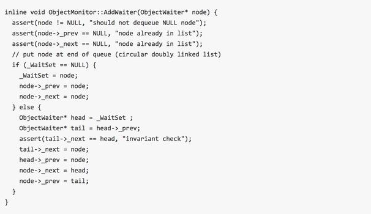
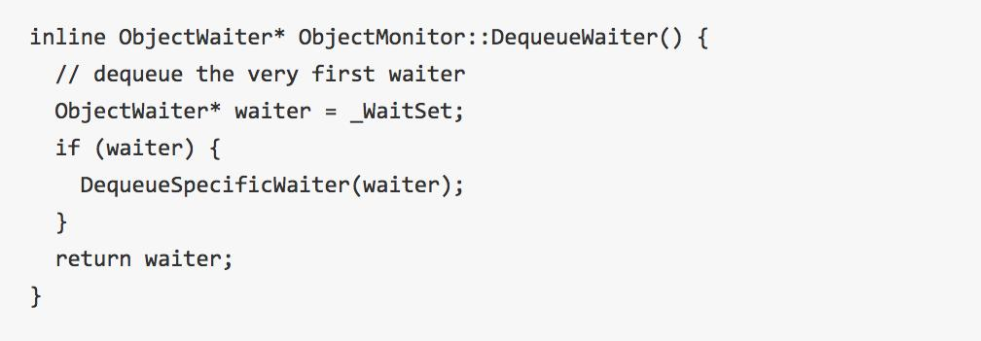

# 深入理解wait和notify

生产者和消费者模式：有个盛装数据的容器(list)即缓冲区,
一个往容器里放数据即生产者,一个从容器中取数据即消费者。
但当容器满的时候，生产者就不能往里放东西了，此时需要等待缓冲区不满，
即有消费者从容器中取出数据了，这就需要一个等待和通知的功能了。
这个功能我当时是直接使用Java 中 Object 定义的wait、notify和notifyAll来实现的。


如果线程调用了Object对象的wait()方法，那么线程会处于该对象的**等待池**中，等待池中的线程不会去竞争该对象的锁。
当有线程调用了Object对象的notify()方法（只随机唤醒一个wait线程）或是notifyAll()方法（唤醒所有wait线程）
被唤醒的的线程会进入该对象的**锁池**中，**锁池**中的线程会去竞争该对象锁。
优先级高的线程竞争到对象锁的概率大，假若某线程没有竞争到该对象锁，它还会留在**锁池**中，
只有线程再次调用wait()方法，它才会重新回到**等待池**中。而竞争到对象锁的线程则继续往下执行，直到执行完了synchronized代码块，
它会释放掉该对象锁，这时**锁池**中的线程会继续竞争该对象锁

### 有问题却一眼看不出问题的消费者和生产者模式

下文将使用Java 实现一个简单的消费者和生产者模式，代码如下：

```java
public class Producer {
    //缓冲区 
    private CircleQueue<String> cache;


    public Producer(CircleQueue<String> cache) {
        this.cache = cache;
    }
    
    public synchronized void produce(String e) throws InterruptedException {
        if (cache.isFull()) {
            cache.wait();
        }
        cache.put(e);
        cache.notifyAll();
    }
}

public class Consumer {
    private CircleQueue<String> cache;
    public Consumer(CircleQueue<String> container) {
        this.cache = container;
    }
    public synchronized void consume() throws InterruptedException {
        if (cache .isEmpty()) {
            cache.wait();
        }
        System.out.println(
                String.format("thread:%s,consume a element:%s",
                        Thread.currentThread().getName(),
                        cache .take()));
        cache.notifyAll();
    }
}
```

大家看了一遍，有没有看出来上面代码运行会报错？运行一下测试代码(见最下面)大家就明白了：


生产者执行produce 函数的时候，执行到cache.notifyAll() 会抛出这个异常，这个异常代表什么意思呢？
我们来看看IllegalMonitorStateException 的注释：
Thrown to indicate that a thread has attempted to wait on an object's monitor or to notify other threads waiting on an object's monitor without owning the specified monitor.
上面这个注释, 它想表达两个意思
1. 在不拥有当前对象监视器的情况下调用当前对象的wait方法
2. 在不拥有当前对象监视器的情况下调用当前对象的notify和notifyAll

上面报错的原因就是因为满足了第2条,其实同样 cache.wait() 这里也有问题。下面我们来改下代码：

```java
public void produce(String e) throws InterruptedException {
        synchronized (cache) {
            if (cache.isFull()) {
                cache .wait();
            }
            cache.put(e);
            cache.notifyAll();
        }
    }

public  void consume() throws InterruptedException {
        synchronized (cache) {
            if (cache.isEmpty()) {
                cache.wait();
            }
            System.out.println(
                    String.format("thread:%s,consume a element:%s",
                            Thread.currentThread().getName(),
                            cache.take()));
            cache.notifyAll();
        }
    }
```

上面只粘贴了主要的代码，synchronized 关键字修饰的是cache,因此当线程进来的时候获取的是cache对象的监视器，
因此到下面无论执行cache.wait()还是cache.notifyAll() 都不会抛出异常。
当然上面的代码还是有问题的，不知道大家有没有看出来？我们来执行下测试代码，发现报错了，
但是也有可能你执行的时候并没有报错，因为这是多线程，存在很多偶然性，多运行几遍你就会发现你中奖了，报错如下：


上面报错的是Consumer 中的cache.take()处抛的异常，
cache对象的类型CircleQueue 是我自己实现的一个环形队列,抛出该异常是因为队列已空，
如果这样大家就奇怪了，能执行到cache.take() 不是因为队列不为空才唤醒当前线程的吗？

我先介绍下当某个线程调用wait的时候发生了什么？
它会释放调用对象上的监视器即锁，然后进入一个条件等待队列中等待被唤醒，
此时有别的线程改变了状态(eg: 队列为空，队列已满),然后调用notifyAll(),
条件等待队列中的线程再次获取调用对象上的监视器，然后继续向下执行。
画一个草图给大家理解下：


在一个线程被唤醒到获取锁的这个时间里，
可能有另外一个线程改变了状态 ( 往队列插入元素或者从队列中取出元素 ), 
然后该线程往下执行的时候发现缓冲区为空或者已满这种现象。
大家估计也想到了解决办法，就是被唤醒再次获取锁之后再判断一次状态，
加一个循环就搞定了，代码如下：

```java
 public void consume() throws InterruptedException {
        synchronized (cache) {
          // 这里把if改为while 就可以了
            while (cache.isEmpty()) {
                cache.wait();
            }
            System.out.println(
                    String.format("thread:%s,consume a element:%s",
                            Thread.currentThread().getName(),
                            cache.take()));
            cache.notifyAll();
        }
    }
```

### 为啥需要操作同一个共享资源cache对象呢?

先说明： object类的wait/notify 方法都是native方法,需要额外下载jvm的源码才可以看到传送门：openJDK 下载， 
打开源码：openjdk\hotspot\src\share\vm\runtime 目录下objectMonitor.cpp objectMonitor.hpp 2个文件， 
这些属于c语言源码。

其中在objectMonitor.hpp文件中定义一个非常重要的对象ObjectMonitor对象

ObjectMonitor对象:

主要用来监视创立的Object , 说白了就是我们经常说的所对象在jvm中的具体化(c++的结构体， 单纯看做java对象就可以)


上面对象结构体中有4个非常关键的属性

* _owner：指向于当前持有锁的线程
* _object：指向例子中的shop对象
* _WaitSet：调用wait方法之后的线程会被挂入到这个队列
* _EntryList：等待获取锁(那个shop对象锁)的线程，被挂入到这个队列。

**注意：_WaitSet跟_EntryList 实现类是ObjectWaiter,是一个双向链表。**

调用wait方法;在objectMonitor.cpp 文件中，有个方法：


去掉一些看不懂， 留下几行比较有用的操作

1. ObjectWaiter node(Self);java线程调用shop.wait方法,jvm马上当前线程进行封装成一个ObjectWaiter对象
2. AddWaiter(&node);接着将该对象添加到_WaitSet队列中
     
     
3. _waiters++; 队列的长度加1
4. exit (true, Self) 这里注意， 直接退出，这里表示马上释放锁。也就是当线程调用了wait方法之后， 马上释放对象锁。
5. Self->_ParkEvent->park () ; 表示停止，等待， 也就是挂起来， 等待被唤醒。

调用notify方法,在objectMonitor.cpp 文件中，有个方法：


总结：调用wait方法之后， 会将线程挂起， 暂存到_waitSet队列中，然后释放锁。

调用了DequeueWaiter方法



再调用DequeueSpecificWaiter方法


总结：调用notify方法之后， 会从_waitSet队列中随机唤醒一个线程， 然后暂存到_entryList队列中， 参与cpu争夺。注意此时还没有释放锁。
需要等notify方法调用方法执行完之后再释放。

