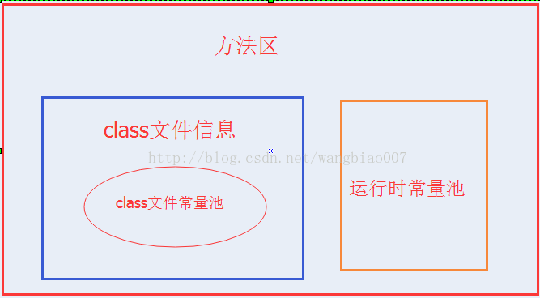

# 常量池

在java的内存分配中，经常听到很多关于常量池的描述，我开始看的时候也是看的很模糊，网上五花八门的说法简直太多了，最后查阅各种资料，终于算是差不多理清了，很多网上说法都有问题，笔者尝试着来区分一下这几个概念。

## 全局字符串池（string pool也有叫做string literal pool）

全局字符串池里的内容是在类加载完成，经过验证，准备阶段之后在堆中生成字符串对象实例，然后将该字符串对象实例的引用值存到string pool中（记住：string pool中存的是引用值而不是具体的实例对象，具体的实例对象是在堆中开辟的一块空间存放的。）。 在HotSpot VM里实现的string pool功能的是一个StringTable类，它是一个哈希表，里面存的是驻留字符串(也就是我们常说的用双引号括起来的)的引用（而不是驻留字符串实例本身），也就是说在堆中的某些字符串实例被这个StringTable引用之后就等同被赋予了”驻留字符串”的身份。这个StringTable在每个HotSpot VM的实例只有一份，被所有的类共享。

## class文件常量池（class constant pool）

我们都知道，class文件中除了包含类的版本、字段、方法、接口等描述信息外，还有一项信息就是常量池(constant pool table)，用于存放编译器生成的各种字面量(Literal)和符号引用(Symbolic References)。 字面量就是我们所说的常量概念，如文本字符串、被声明为final的常量值等。 符号引用是一组符号来描述所引用的目标，符号可以是任何形式的字面量，只要使用时能无歧义地定位到目标即可（它与直接引用区分一下，直接引用一般是指向方法区的本地指针，相对偏移量或是一个能间接定位到目标的句柄）。一般包括下面三类常量：

* 类和接口的全限定名
* 字段的名称和描述符
* 方法的名称和描述符

常量池的每一项常量都是一个表，一共有如下表所示的11种各不相同的表结构数据，这每个表开始的第一位都是一个字节的标志位（取值1-12），代表当前这个常量属于哪种常量类型。


每种不同类型的常量类型具有不同的结构，具体的结构本文就先不叙述了，本文着重区分这三个常量池的概念（读者若想深入了解每种常量类型的数据结构可以查看《深入理解java虚拟机》第六章的内容）。

## 运行时常量池（runtime constant pool）

当java文件被编译成class文件之后，也就是会生成我上面所说的class常量池，那么运行时常量池又是什么时候产生的呢？

jvm在执行某个类的时候，必须经过加载、连接、初始化，而连接又包括验证、准备、解析三个阶段。而当类加载到内存中后，
jvm就会将class常量池中的内容存放到运行时常量池中，由此可知，运行时常量池也是每个类都有一个。在上面我也说了，class常量池中存的是字面量和符号引用，
也就是说他们存的并不是对象的实例，而是对象的符号引用值。而经过解析（resolve）之后，也就是把符号引用替换为直接引用，解析的过程会去查询全局字符串池，
也就是我们上面所说的StringTable，以保证运行时常量池所引用的字符串与全局字符串池中所引用的是一致的。

举个实例来说明一下:

```
public class HelloWorld {
    public static void main(String []args) {
		String str1 = "abc"; 
		String str2 = new String("def"); 
		String str3 = "abc"; 
		String str4 = str2.intern(); 
		String str5 = "def"; 
		System.out.println(str1 == str3);//true 
		System.out.println(str2 == str4);//false 
		System.out.println(str4 == str5);//true
    }
}
```

回到上面的那个程序，现在就很容易解释整个程序的内存分配过程了，首先，在堆中会有一个”abc”实例，全局StringTable中存放着”abc”的一个引用值，然后在运行第二句的时候会生成两个实例，一个是”def”的实例对象，并且StringTable中存储一个”def”的引用值，还有一个是new出来的一个”def”的实例对象，与上面那个是不同的实例，当在解析str3的时候查找StringTable，里面有”abc”的全局驻留字符串引用，所以str3的引用地址与之前的那个已存在的相同，str4是在运行的时候调用intern()函数，返回StringTable中”def”的引用值，如果没有就将str2的引用值添加进去，在这里，StringTable中已经有了”def”的引用值了，所以返回上面在new str2的时候添加到StringTable中的 “def”引用值，最后str5在解析的时候就也是指向存在于StringTable中的”def”的引用值，那么这样一分析之后，下面三个打印的值就容易理解了。上面程序的首先经过编译之后，在该类的class常量池中存放一些符号引用，然后类加载之后，将class常量池中存放的符号引用转存到运行时常量池中，然后经过验证，准备阶段之后，在堆中生成驻留字符串的实例对象（也就是上例中str1所指向的”abc”实例对象），然后将这个对象的引用存到全局String Pool中，也就是StringTable中，最后在解析阶段，要把运行时常量池中的符号引用替换成直接引用，那么就直接查询StringTable，保证StringTable里的引用值与运行时常量池中的引用值一致，大概整个过程就是这样了。

## 总结

* 全局常量池在每个VM中只有一份，存放的是字符串常量的引用值。
* class常量池是在编译的时候每个class都有的，在编译阶段，存放的是常量的符号引用。
* 运行时常量池是在类加载完成之后，将每个class常量池中的符号引用值转存到运行时常量池中，也就是说，每个class都有一个运行时常量池，类在解析之后，将符号引用替换成直接引用，与全局常量池中的引用值保持一致。

## class文件常量池和运行时常量池

最近一直被方法区里面存着什么东西困扰着？

1. 方法区里存class文件信息和class文件常量池是个什么关系。
2. class文件常量池和运行时常量池是什么关系。        

方法区存着类的信息，常量和静态变量，即类被编译后的数据。这个说法其实是没问题的，只是太笼统了。更加详细一点的说法是方法区里存放着类的版本，字段，方法，接口和常量池。常量池里存储着字面量和符号引用。

符号引用包括：
1. 类的全限定名，
2. 字段名和属性，
3. 方法名和属性。

下面一张图是方法区，class文件信息，class文件常量池和运行时常量池的关系



下面一张图用来表示方法区class文件信息包括哪些内容:


可以看到在方法区里的class文件信息包括：魔数，版本号，常量池，类，父类和接口数组，字段，方法等信息，其实类里面又包括字段和方法的信息。

下面的图表是class文件中存储的数据类型  


|类型 |名称 |数量 |
|:---:|:---:|:---:|
| u4| magic| 1|
| u2| minor_version| 1|
| u2 | major_version| 1|
| u2| constant_pool_count| 1|
| cp_info| constant_pool| constant_pool_count -1 |
| u2| access_flags| 1|
| | | |
| | | |
| | | |
| | | |
| | | |
| | | |

下面用一张图来表示常量池里存储的内容：


  

## class文件常量池和运行时常量池的关系以及区别

class文件常量池存储的是当class文件被java虚拟机加载进来后存放在方法区的一些字面量和符号引用，字面量包括字符串，基本类型的常量。

运行时常量池是当class文件被加载完成后，java虚拟机会将class文件常量池里的内容转移到运行时常量池里，在class文件常量池的符号引用有一部分是会被转变为直接引用的，比如说类的静态方法或私有方法，实例构造方法，父类方法，这是因为这些方法不能被重写其他版本，所以能在加载的时候就可以将符号引用转变为直接引用，而其他的一些方法是在这个方法被第一次调用的时候才会将符号引用转变为直接引用的。

## 总结：

方法区里存储着class文件的信息和运行时常量池,class文件的信息包括类信息和class文件常量池。

运行时常量池里的内容除了是class文件常量池里的内容外，还将class文件常量池里的符号引用转变为直接引用，而且运行时常量池里的内容是能动态添加的。例如调用String的intern方法就能将string的值添加到String常量池中，这里String常量池是包含在运行时常量池里的，但在jdk1.8后，将String常量池放到了堆中


首先看一下这道常见的面试题，下面代码中，会创建几个字符串对象？

```
String s="a"+"b"+"c";
```

如果你比较一下Java源代码和反编译后的字节码文件，就可以直观的看到答案，只创建了一个String对象。


估计大家会有疑问了，为什么源代码中字符串拼接的操作，在编译完成后会消失，直接呈现为一个拼接后的完整字符串呢？

这是因为在编译期间，应用了编译器优化中一种被称为**常量折叠**(Constant Folding)的技术，会将**编译期常量**的加减乘除的运算过程在编译过程中折叠。编译器通过语法分析，会将常量表达式计算求值，并用求出的值来替换表达式，而不必等到运行期间再进行运算处理，从而在运行期间节省处理器资源。

而上边提到的**编译期常量**的特点就是它的值在编译期就可以确定，并且需要完整满足下面的要求，才可能是一个编译期常量：

- 被声明为`final`
- 基本类型或者字符串类型
- 声明时就已经初始化
- 使用常量表达式进行初始化

上面的前两条比较容易理解，需要注意的是第三和第四条，通过下面的例子进行说明：

```
final String s1="hello "+"Hydra";
final String s2=UUID.randomUUID().toString()+"Hydra";
```

编译器能够在编译期就得到`s1`的值是`hello Hydra`，不需要等到程序的运行期间，因此`s1`属于编译期常量。而对`s2`来说，虽然也被声明为`final`类型，并且在声明时就已经初始化，但使用的不是常量表达式，因此不属于编译期常量，这一类型的常量被称为**运行时常量**。再看一下编译后的字节码文件中的常量池区域：


可以看到常量池中只有一个`String`类型的常量`hello Hydra`，而`s2`对应的字符串常量则不在此区域。对编译器来说，运行时常量在编译期间无法进行折叠，编译器只会对尝试修改它的操作进行报错处理。

另外值得一提的是，编译期常量与运行时常量的另一个不同就是是否需要对类进行初始化，下面通过两个例子进行对比：

```
public class IntTest1 {
    public static void main(String[] args) {
        System.out.println(a1.a);
    }
}
class a1{
    static {
        System.out.println("init class");
    }
    public static int a=1;
}
```

运行上面的代码，输出：

```
init class
1
```

如果对上面进行修改，对变量`a`添加`final`进行修饰：

```
public static final int a=1;
```

再次执行上面的代码，会输出：

```
1
```

可以看到在添加了`final`修饰后，两次运行的结果是不同的，这是因为在添加`final`后，变量`a`成为了编译期常量，不会导致类的初始化。另外，在声明编译器常量时，`final`关键字是必要的，而`static`关键字是非必要的，上面加`static`修饰只是为了验证类是否被初始化过。

我们再看几个例子来加深对`final`关键字的理解，运行下面的代码：

```
public static void main(String[] args) {
    final String h1 = "hello";
    String h2 = "hello";
    String s1 = h1 + "Hydra";
    String s2 = h2 + "Hydra";
    System.out.println((s1 == "helloHydra"));
    System.out.println((s2 == "helloHydra"));
}
```

执行结果：

```
true
false
```

代码中字符串`h1`和`h2`都使用常量赋值，区别在于是否使用了`final`进行修饰，对比编译后的代码，`s1`进行了折叠而`s2`没有，可以印证上面的理论，`final`修饰的字符串变量属于编译期常量。


再看一段代码，执行下面的程序，结果会返回什么呢？

```
public static void main(String[] args) {
    String h ="hello";
    final String h2 = h;
    String s = h2 + "Hydra";
    System.out.println(s=="helloHydra");
}
```

答案是`false`，因为虽然这里字符串`h2`被`final`修饰，但是初始化时没有使用编译期常量，因此它也不是编译期常量。

在上面的一些例子中，在执行常量折叠的过程中都遵循了**使用常量表达式进行初始化**这一原则，这里可能有的同学还会有疑问，到底什么样才能算得上是常量表达式呢？在`Oracle`官网的文档中，列举了很多种情况，下面对常见的情况进行列举（除了下面这些之外官方文档上还列举了不少情况，如果有兴趣的话，可以自己查看）：

- 基本类型和String类型的字面量
- 基本类型和String类型的强制类型转换
- 使用`+`或`-`或`!`等一元运算符（不包括`++`和`--`）进行计算
- 使用加减运算符`+`、`-`，乘除运算符`*`、 `/` 、`%` 进行计算
- 使用移位运算符 `>>`、 `<<`、 `>>>`进行位移操作
- ……

字面量（literals）是用于表达源代码中一个固定值的表示法，在Java中创建一个对象时需要使用`new`关键字，但是给一个基本类型变量赋值时不需要使用`new`关键字，这种方式就可以被称为字面量。Java中字面量主要包括了以下类型的字面量：

```
//整数型字面量：
long l=1L;
int i=1;
 
//浮点类型字面量：
float f=11.1f;
double d=11.1;
 
//字符和字符串类型字面量：
char c='h';
String s="Hydra";
 
//布尔类型字面量：
boolean b=true;
```

当我们在代码中定义并初始化一个字符串对象后，程序会在常量池（`constant pool`）中缓存该字符串的字面量，如果后面的代码再次用到这个字符串的字面量，会直接使用常量池中的字符串字面量。

除此之外，还有一类比较特殊的`null`类型字面量，这个类型的字面量只有一个就是`null`，这个字面量可以赋值给任意引用类型的变量，表示这个引用类型变量中保存的地址为空，也就是还没有指向任何有效的对象。

那么，如果不是使用的常量表达式进行初始化，在变量的初始化过程中引入了其他变量（且没有被`final`修饰）的话，编译器会怎样进行处理呢？我们下面再看一个例子：

```
public static void main(String[] args) {
    String s1="a";
    String s2=s1+"b";
    String s3="a"+"b";
    System.out.println(s2=="ab");
    System.out.println(s3=="ab");
}
```

结果打印：

```
false
true
```

为什么会出现不同的结果？在Java中，String类型在使用`==`进行比较时，是判断的引用是否指向堆内存中的同一块地址，出现上面的结果那么说明指向的不是内存中的同一块地址。

通过之前的分析，我们知道`s3`会进行常量折叠，引用的是常量池中的`ab`，所以相等。而字符串`s2`在进行拼接时，表达式中引用了其他对象，不属于编译期常量，因此不能进行折叠。

那么，在没有常量折叠的情况下，为什么最后返回的是`false`呢？我们看一下这种情况下，编译器是如何实现，先执行下面的代码：

```
public static void main(String[] args) {
    String s1="my ";
    String s2="name ";
    String s3="is ";
    String s4="Hydra";
    String s=s1+s2+s3+s4;
}
```

然后使用`javap`对字节码文件进行反编译，可以看到在这一过程中，编译器同样会进行优化：


可以看到，虽然我们在代码中没有显示的调用`StringBuilder`，但是在字符串拼接的场景下，Java编译器会自动进行优化，新建一个`StringBuilder`对象，然后调用`append`方法进行字符串的拼接。而在最后，调用了`StringBuilder`的`toString`方法，生成了一个新的字符串对象，而不是引用的常量池中的常量。这样，也就能解释为什么在上面的例子中，`s2=="ab"`会返回`false`了。

> 本文代码基于Java 1.8.0_261-b12 版本测试