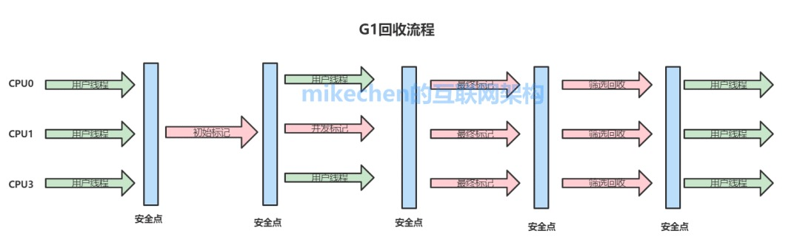

# G1垃圾收集器

# G1收集器概述

HotSpot团队一直努力朝着高效收集、减少停顿(STW: Stop The World)的方向努力，也贡献了从串行Serial收集器、到并行收集器Parallerl收集器，再到CMS并发收集器，乃至如今的G1在内的一系列优秀的垃圾收集器。

G1(Garbage First)垃圾收集器关注最小时延的垃圾回收器，也同样适合大尺寸堆内存的垃圾收集，官方也推荐使用G1来代替选择CMS。

**1.G1收集器的最大特点**

- G1最大的特点是引入分区的思路，弱化了分代的概念。
- 合理利用垃圾收集各个周期的资源，解决了其他收集器甚至CMS的众多缺陷。

**2.G1相比较CMS的改进**

- 算法：G1基于标记-整理算法, 不会产生空间碎片，分配大对象时不会无法得到连续的空间而提前触发一次FULL GC。
- 停顿时间可控：G1可以通过设置预期停顿时间（Pause Time）来控制垃圾收集时间避免应用雪崩现象。
- 并行与并发：G1能更充分的利用CPU，多核环境下的硬件优势来缩短stop the world的停顿时间。

**3.CMS和G1的区别**

- CMS中，堆被分为PermGen，YoungGen，OldGen；而YoungGen又分了两个survivo区域。在G1中，堆被平均分成几个区域(region)，在每个区域中，虽然也保留了新老代的概念，但是收集器是以整个区域为单位收集的。
- G1在回收内存后会马上同时做合并空闲内存的工作、而CMS默认是在STW（stop the world）的时候做。
- G1会在Young GC中使用、而CMS只能在O区使用。

**4.G1收集器的应用场景**

G1垃圾收集算法主要应用在多CPU大内存的服务中，在满足高吞吐量的同时，尽可能的满足垃圾回收时的暂停时间。
就目前而言、CMS还是默认首选的GC策略、可能在以下场景下G1更适合：

- 服务端多核CPU、JVM内存占用较大的应用（至少大于4G）
- 应用在运行过程中会产生大量内存碎片、需要经常压缩空间
- 想要更可控、可预期的GC停顿周期，防止高并发下应用雪崩现象

# G1的堆内存算法

# 1.G1之前的JVM内存模型

- 新生代：伊甸园区(eden space) + 2个幸存区
- 老年代
- 持久代(perm space)：JDK1.8之前
- 元空间(metaspace)：JDK1.8之后取代持久代

# 2.G1收集器的内存模型

**1)G1堆内存结构**
堆内存会被切分成为很多个固定大小区域（Region），每个是连续范围的虚拟内存。
堆内存中一个区域(Region)的大小可以通过-XX:G1HeapRegionSize参数指定，大小区间最小1M、最大32M，总之是2的幂次方。

默认把堆内存按照2048份均分。

**2)G1堆内存分配**
每个Region被标记了E、S、O和H，这些区域在逻辑上被映射为Eden，Survivor和老年代。
存活的对象从一个区域转移（即复制或移动）到另一个区域。区域被设计为并行收集垃圾，可能会暂停所有应用线程。
如上图所示，区域可以分配到Eden，survivor和老年代。此外，还有第四种类型，被称为巨型区域（Humongous Region）。Humongous区域是为了那些存储超过50%标准region大小的对象而设计的，它用来专门存放巨型对象。如果一个H区装不下一个巨型对象，那么G1会寻找连续的H分区来存储。为了能找到连续的H区，有时候不得不启动Full GC。

# G1回收流程

在执行垃圾收集时，G1以类似于CMS收集器的方式运行。

# 1.G1收集器的阶段分以下几个步骤：

1）G1执行的第一阶段：初始标记(Initial Marking )
这个阶段是STW(Stop the World )的，所有应用线程会被暂停，标记出从GC Root开始直接可达的对象。

2）G1执行的第二阶段：并发标记
从GC Roots开始对堆中对象进行可达性分析，找出存活对象，耗时较长。当并发标记完成后，开始最终标记(Final Marking )阶段

3）最终标记（标记那些在并发标记阶段发生变化的对象，将被回收）

4）筛选回收（首先对各个Regin的回收价值和成本进行排序，根据用户所期待的GC停顿时间指定回收计划，回收一部分Region）

最后，G1中提供了两种模式垃圾回收模式，Young GC和Mixed GC，两种都是Stop The World(STW)的。

# G1的GC模式

# 1.YoungGC年轻代收集

在分配一般对象（非巨型对象）时，当所有eden region使用达到最大阀值并且无法申请足够内存时，会触发一次YoungGC。每次younggc会回收所有Eden以及Survivor区，并且将存活对象复制到Old区以及另一部分的Survivor区。
YoungGC的回收过程如下：

- 根扫描,跟CMS类似，Stop the world，扫描GC Roots对象。
- 处理Dirty card,更新RSet.
- 扫描RSet,扫描RSet中所有old区对扫描到的young区或者survivor去的引用。
- 拷贝扫描出的存活的对象到survivor2/old区
- 处理引用队列，软引用，弱引用，虚引用

# 2.mixed gc

当越来越多的对象晋升到老年代old region时，为了避免堆内存被耗尽，虚拟机会触发一个混合的垃圾收集器，即mixed gc，该算法并不是一个old gc，除了回收整个young region，还会回收一部分的old region，这里需要注意：是一部分老年代，而不是全部老年代，可以选择哪些old region进行收集，从而可以对垃圾回收的耗时时间进行控制。
G1没有fullGC概念，需要fullGC时，调用serialOldGC进行全堆扫描（包括eden、survivor、o、perm）。

# G1的推荐用例

G1的第一个重要特点是为用户的应用程序的提供一个低GC延时和大内存GC的解决方案。这意味着堆大小6GB或更大，稳定和可预测的暂停时间将低于0.5秒。
如果应用程序使用CMS或ParallelOld垃圾回收器具有一个或多个以下特征，将有利于切换到G1：

- Full GC持续时间太长或太频繁
- 对象分配率或年轻代升级老年代很频繁
- 不期望的很长的垃圾收集时间或压缩暂停（超过0.5至1秒）

注意：如果你正在使用CMS或ParallelOld收集器，并且你的应用程序没有遇到长时间的垃圾收集暂停，则保持与您的当前收集器是很好的，升级JDK并不必要更新收集器为G1。