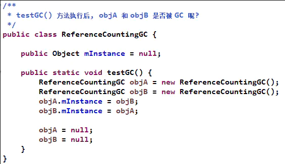
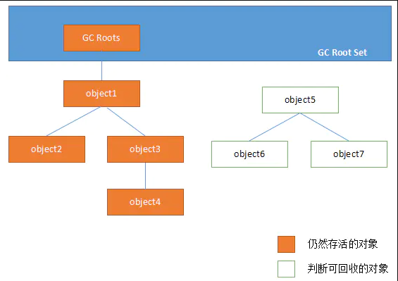
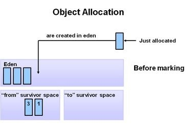
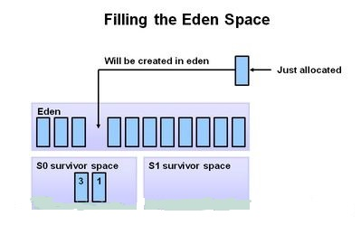
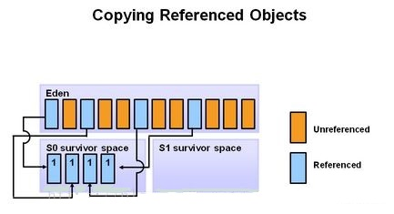
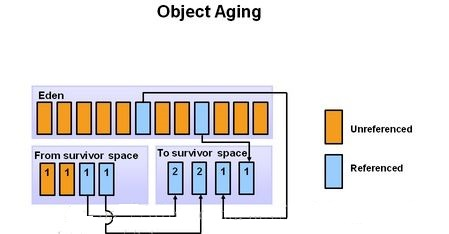
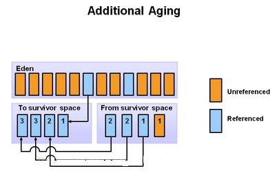
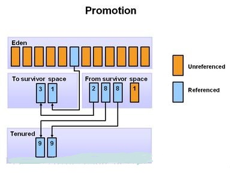
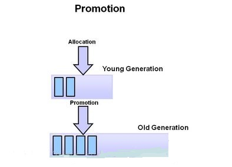
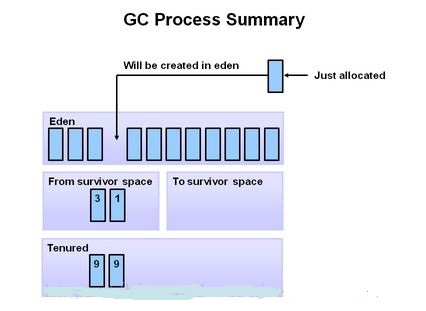

# 垃圾回收

## 一个对象什么时候才能被回收

#### 怎样判断一个对象“已死”？

    在堆里面存放着 Java 世界中几乎所有的对象实例，垃圾收集器在对堆进行回收前，
    第一件事情就是要确定这些对象之中哪些还“存活”着，哪些已经“死去”（即不可能再被任何途径使用的对象）。

那么怎么判断一个对象“已死”呢，目前有两种算法可以判断对象“已死”。

###### 引用计数算法

  这个算法的判断依据是通过给对象中添加一个引用计数器，每当有一个地方引用它时，计数器值就加 1；当引用失效时，计数器值就减 1；任何时刻计数器为 0 的对象就不可能再被使用的。
客观的说，引用计数算法的实现简单，判断效率也很高，在大部分情况下它都是一个不错的算法，也有一些比较著名的应用案例，例如微软公司的 COM（Component Object Model）技术。但是，至少主流的 Java 虚拟机里面没有选用引用计算法来管理内存，其中最主要的原因是它很难解决对象之间相互循环引用的问题。
举个简单的例子，请看下面代码中的 testGC() 方法：对象 objA 和 objB 都有字段 mInstance，赋值令 objA.mInstance = objB 及 objB.mInstance = objA，除此之外，这两个对象再无任何实际上这两个对象已经不可能再被访问，但是它们因为互相引用着对方，导致它们的引用计数都不为 0，于是引用技术算法无法通知 GC 收集器回收它们。

  

###### 可达性分析算法

在主流的商用程序语言（如Java）的主流实现中，
都是称通过可达性分析来判断对象是否存活的。
这个算法的基本思路就是通过一系列的称为“GC Roots”的对象作为起始点，
从这些节点开始向下搜索，搜索所走过的路径称为引用链，
当一个对象到 GC Roots 没有任何引用链相连时，
则证明此对象是不可用的。

在 Java 语言中，可作为 GC Roots 的对象包括下面几种：
* 虚拟机栈（栈帧中的本地变量表）中引用的对象。
* 方法区中类静态属性引用的对象。
* 方法区中常量引用的对象。
* 本地方法栈中 JNI（即一般说的 Native 方法）引用的对象。

#### 引用的分类

    无论是通过引用计数算法判断对象的引用数量，还是通过可达性分析判断对象的引用链是否可达，判断对象是否存活都与“引用”有关。
    
在 JDK 1.2 之后，Java 对引用的概念进行了扩充，将引用分为强引用（Strong Reference）、软引用（Soft Reference）、弱引用（Weak Reference）、虚引用（Phantom Reference） 4 种，这 4 种引用强度一次逐渐减弱。

* 强引用就是指在程序代码之中普遍存在的，
只要强引用还存在，垃圾收集器永远不会回收掉被引用的对象。
* 软引用是用来描述一些还有用但并非必须的对象。
对于软引用关联着的对象，在系统将要发生内存溢出异常之前（即内存紧张）， 将会把这些对象列进垃圾回收范围之中进行第二次回收。如果这次回收还没有足够的内存，才会抛出内存溢出异常。在 JDK1.2 之后， 提供了 SoftReference 类累实现软引用。
* 弱引用是用来描述非必需的对象的，但是它的强度比软引用更弱一些，
被弱引用关联的对象只能生存到下一次垃圾收集发生之前。
 当垃圾收集器工作时，无论当前内存是否足够，
 都会回收掉只被弱引用关联的对象。
 使用 WeekReference 类来实现弱引用。
* 虚引用也成为幽灵引用或者幻影引用，它是最弱的一种引用。一个对象是否有虚引用的存在，完全不会对其生存周期时间构成影响， 也无法通过虚引用来取得一个对象实例。唯一的作用就是能在这个对象被收集器回收时收到一个系统通知。使用 PhantomReference 表示。

#### 回收方法区数据

    方法区的垃圾收集主要回收两部分内容：废弃常量和无用的类。
    回收废弃常量与回收 Java 堆中的对象非常类似。
    以常量池中字面量的回收为例，
    假如一个字符串“abc”已经进入了常量池，
    但是当前系统没有任何一个 String 对象是叫做 “abc”的，
    换句话说，就是没有任何一个 String 对象引用常量池中的“abc”常量，
    也没有其他地方引用了这个字面量，如果这时发生内存回收，
    而且必要的话，这个“abc”常量就会被系统清理出常量池。
    常量池中的其他类（接口）、方法、字段的符号引用也与此类似。
    
判定一个常量为“废弃常量”比较简单，
而要判断一个常量池中的类是否是“无用的类”条件则苛刻很多。
类需要同时满足下面 3 个条件才能称为“无用的类”：

* 该类所有的实例都已经被全部回收，也就是说 Java 堆中不再存在任何该类的实例。
* 加载该类的 ClassLoader 已经被回收。
* 该类对应的 java.lang.Class 对象没有在任何地方引用，并且无法再任何地方通过反射调用该类的方法。

#### 最后做个总结

1. 我们可以通过 引用计数器 和 可达性算法 来判断一个对象是否“已死”。
引用计数器很难解决对象之间互相循环引用的问题，
所以在主流的商用程序语言（如Java）的主流实现中，
都是称通过可达性分析来判断对象是否存活的。   
2. 对象的引用可以分为 强引用、软引用、弱引用 以及 虚引用 4 种，
其中被 强引用 引用的对象垃圾收集器永远不会回收掉；被 软引用 引用的对象，
只有当系统将要发生内存溢出时，才会去回收软引用引用的对象；只被 弱引用关联的对象，
只要发生垃圾收集事件，只被弱引用关联的对象就会被回收；
被虚引用关联的对象的唯一作用是能在这个对象被回收器回收时受到一个系统通知。
3. 回收方法区的数据，垃圾收集器主要回收 废弃常量和无用的类 两部分内容。

## Java垃圾回收机制

GC，即就是Java垃圾回收机制。
目前主流的JVM（HotSpot）采用的是分代收集算法。
作为Java开发者，一般不需要专门编写内存回收和垃圾清理代码，
对内存泄露和溢出的问题。
与C++不同的是，Java采用的是类似于树形结构的可达性分析法来判断对象是否还存在引用。
即：从gcroot开始，把所有可以搜索得到的对象标记为存活对象。
缺点就是：
1. 有可能不知不觉浪费了很多内存。
2. JVM花费过多时间来进行内存回收。
3. 内存泄露

理解Java的垃圾回收机制，
就要从：“什么时候”，“对什么东西”，“做了什么”三个方面来具体分析。

第一：“什么时候”即就是GC触发的条件。
GC触发的条件有两种。
（1）程序调用System.gc时可以触发；
（2）系统自身来决定GC触发的时机。
系统判断GC触发的依据：
根据Eden区和From Space区的内存大小来决定。
当内存大小不足时，则会启动GC线程并停止应用线程。

Minor GC触发条件：当Eden区满时，触发Minor GC。

Full GC触发条件：

* 调用System.gc时，系统建议执行Full GC，但是不必然执行
* 老年代空间不足
* 方法去空间不足
* 通过Minor GC后进入老年代的平均大小大于老年代的可用内存
* 由Eden区、From Space区向To Space区复制时，对象大小大于To Space可用内存，则把该对象转存到老年代，且老年代的可用内存小于该对象大小。

第二：“对什么东西”笼统的认为是Java对象。
但是准确来讲，GC操作的对象分为：
通过可达性分析法无法搜索到的对象和可以搜索到的对象。
对于搜索不到的方法进行标记。

第三：“做了什么”最浅显的理解为释放对象。
但是从GC的底层机制可以看出，对于可以搜索到的对象进行复制操作，
对于搜索不到的对象，调用finalize()方法进行释放。

具体过程：当GC线程启动时，
会通过可达性分析法把Eden区和From Space区的存活对象复制到To Space区，
然后把Eden Space和From Space区的对象释放掉。
当GC轮训扫描To Space区一定次数后，把依然存活的对象复制到老年代，然后释放To Space区的对象。

对于用可达性分析法搜索不到的对象，
GC并不一定会回收该对象。要完全回收一个对象，
至少需要经过两次标记的过程：

第一次标记：对于一个没有其他引用的对象，
筛选该对象是否有必要执行finalize()方法，
如果没有执行必要，则意味可直接回收。
（筛选依据：是否复写或执行过finalize()方法；
因为finalize方法只能被执行一次）。

第二次标记：如果被筛选判定位有必要执行，
则会放入FQueue队列，
并自动创建一个低优先级的finalize线程来执行释放操作。
如果在一个对象释放前被其他对象引用，则该对象会被移除FQueue队列。

## 虚拟机中GC的过程

在初始阶段，新创建的对象被分配到Eden区，survivor的两块空间都为空。

当Eden区满了的时候，minor garbage 被触发 。

经过扫描与标记，存活的对象被复制到S0，不存活的对象被回收

在下一次的Minor GC中，Eden区的情况和上面一致，
没有引用的对象被回收，存活的对象被复制到survivor区。
然而在survivor区，S0的所有的数据都被复制到S1，需要注意的是，
在上次minor GC过程中移动到S0中的两个对象在复制到S1后其年龄要加1。
此时Eden区S0区被清空，所有存活的数据都复制到了S1区，
并且S1区存在着年龄不一样的对象，过程如下图所示

再下一次MinorGC则重复这个过程，
这一次survivor的两个区对换，存活的对象被复制到S0，
存活的对象年龄加1，Eden区和另一个survivor区被清空。

再经过几次Minor GC之后，当存活对象的年龄达到一个阈值之后
（可通过参数配置，默认是8），就会被从年轻代Promotion到老年代。

随着MinorGC一次又一次的进行，不断会有新的对象被promote到老年代。

上面基本上覆盖了整个年轻代所有的回收过程。最终，MajorGC将会在老年代发生，老年代的空间将会被清除和压缩。

从上面的过程可以看出，Eden区是连续的空间，且Survivor总有一个为空。经过一次GC和复制，一个Survivor中保存着当前还活着的对象，而Eden区和另一个Survivor区的内容都不再需要了，可以直接清空，到下一次GC时，两个Survivor的角色再互换。因此，这种方式分配内存和清理内存的效率都极高，这种垃圾回收的方式就是著名的“停止-复制（Stop-and-copy）”清理法（将Eden区和一个Survivor中仍然存活的对象拷贝到另一个Survivor中），这不代表着停止复制清理法很高效，其实，它也只在这种情况下（基于大部分对象存活周期很短的事实）高效，如果在老年代采用停止复制，则是非常不合适的。

老年代存储的对象比年轻代多得多，而且不乏大对象，对老年代进行内存清理时，如果使用停止-复制算法，则相当低效。一般，老年代用的算法是标记-压缩算法，即：标记出仍然存活的对象（存在引用的），将所有存活的对象向一端移动，以保证内存的连续。在发生Minor GC时，虚拟机会检查每次晋升进入老年代的大小是否大于老年代的剩余空间大小，如果大于，则直接触发一次Full GC，否则，就查看是否设置了-XX:+HandlePromotionFailure（允许担保失败），如果允许，则只会进行MinorGC，此时可以容忍内存分配失败；如果不允许，则仍然进行Full GC（这代表着如果设置-XX:+Handle PromotionFailure，则触发MinorGC就会同时触发Full GC，哪怕老年代还有很多内存，所以，最好不要这样做）。

关于方法区即永久代的回收，永久代的回收有两种：常量池中的常量，无用的类信息，常量的回收很简单，没有引用了就可以被回收。对于无用的类进行回收，必须保证3点：

* 类的所有实例都已经被回收。
* 加载类的ClassLoader已经被回收。
* 类对象的Class对象没有被引用（即没有通过反射引用该类的地方）。

永久代的回收并不是必须的，可以通过参数来设置是否对类进行回收。

