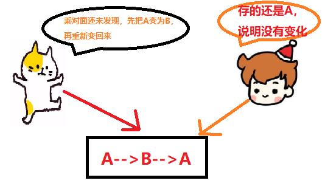

# AtomicReference和AtomicStampedReference

## AtomicReference底层：

AtomicReference原子应用类，可以保证你在修改对象引用时的线程安全性，比较时可以按照偏移量进行

## 怎样使用AtomicReference：

```
  AtomicReference<String> ar = new AtomicReference<String>();
  ar.set("hello");
  //CAS操作更新
   ar.compareAndSet("hello", "hello1");
```

## AtomicReference的成员变量：

```
    private static final long serialVersionUID = -1848883965231344442L;
    //unsafe类,提供cas操作的功能
    private static final Unsafe unsafe = Unsafe.getUnsafe();
    //value变量的偏移地址,说的就是下面那个value,这个偏移地址在static块里初始化
    private static final long valueOffset;
    //实际传入需要原子操作的那个类实例
    private volatile V value;
```

类装载的时候初始化偏移地址：

```
static {
        try {
            valueOffset = unsafe.objectFieldOffset
                (AtomicReference.class.getDeclaredField("value"));
        } catch (Exception ex) { throw new Error(ex); }
    }
```

compareAndSet方法：

```
//就是调用Unsafe的cas操作,传入对象,expect值,偏移地址,需要更新的值,即可,如果更新成功,返回true,如果失败,返回false
public final boolean compareAndSet(V expect, V update) {
        return unsafe.compareAndSwapObject(this, valueOffset, expect, update);
    }
 
```

对于String变量来说,必须是对象相同才视为相同,而不是字符串的内容相同就可以相同:

```
AtomicReference<String> ar = new AtomicReference<String>();
        ar.set("hello");
        System.out.println(ar.compareAndSet(new String("hello"), "hello1"));//false
```

这里的compareAndSet方法即cas操作本身是原子的，但是在某些场景下会出现异常场景

此处说一下ABA问题：



什么意思呢？就是说一个线程把数据A变为了B，然后又重新变成了A。此时另外一个线程读取的时候，发现A没有变化，就误以为是原来的那个A。这就是有名的ABA问题。ABA问题会带来什么后果呢？我们举个例子。

一个小偷，把别人家的钱偷了之后又还了回来，还是原来的钱吗，你老婆出轨之后又回来，还是原来的老婆吗？ABA问题也一样，如果不好好解决就会带来大量的问题。最常见的就是资金问题，也就是别人如果挪用了你的钱，在你发现之前又还了回来。但是别人却已经触犯了法律。

```
public class AtomicStampedReferenceTest {

    private static AtomicInteger ai = new AtomicInteger(10);

    public static void main(String[] args) throws InterruptedException {

       Thread thread1 = new Thread(()->{
            ai.compareAndSet(10, 11);
            ai.compareAndSet(11, 10);
            System.out.println(Thread.currentThread().getName() + ": 10 - 11 - 10");
        }, "张三");

        Thread thread2 = new Thread(()->{
            try {
                TimeUnit.SECONDS.sleep(2);
            } catch (InterruptedException e) {
                e.printStackTrace();
            }

            boolean success = ai.compareAndSet(10, 12);


        }, "李四");

        thread1.start();
        thread2.start();
        thread1.join();
        thread2.join();

        System.out.println(ai.get());


    }
}
```
如何去解决这个ABA问题呢，就是使用今天所说的AtomicStampedReference。


## AtomicStampedReference与AtomicReference的区别：

AtomicStampedReference它内部不仅维护了对象值，还维护了一个时间戳（我这里把它称为时间戳，实际上它可以使任何一个整数，它使用整数来表示状态值）。
当AtomicStampedReference对应的数值被修改时，除了更新数据本身外，还必须要更新时间戳。当AtomicStampedReference设置对象值时，
对象值以及时间戳都必须满足期望值，写入才会成功。因此，即使对象值被反复读写，写回原值，只要时间戳发生变化，就能防止不恰当的写入。

```
public class AtomicStampedReferenceTest {

    private static AtomicStampedReference<Integer> asr = new AtomicStampedReference<>(10, 1);

    public static void main(String[] args) throws InterruptedException {


        Thread thread1 = new Thread(() -> {
            int version = asr.getStamp();

            asr.compareAndSet(10, 11, version, version + 1);
            asr.compareAndSet(11, 10, version + 1, version + 2);
            System.out.println(Thread.currentThread().getName() + ": 10 - 11 - 10");
        }, "张三");

        Thread thread2 = new Thread(() -> {
            try {
                int version = asr.getStamp();
                TimeUnit.SECONDS.sleep(2);
                boolean success = asr.compareAndSet(10, 12, version, version + 1);
            } catch (InterruptedException e) {
                e.printStackTrace();
            }


        }, "李四");

        thread1.start();
        thread2.start();
        thread1.join();
        thread2.join();

        System.out.println(asr.getReference());


    }
}
```

## 源码分析

```
    public boolean compareAndSet(V   expectedReference,
                                 V   newReference,
                                 int expectedStamp,
                                 int newStamp) {
        Pair<V> current = pair;
        return
            expectedReference == current.reference &&
            expectedStamp == current.stamp &&
            ((newReference == current.reference &&
              newStamp == current.stamp) ||
             casPair(current, Pair.of(newReference, newStamp)));
    }
```

刚刚这四个参数的意思已经说了，我们主要关注的就是实现，首先我们看到的就是这个Pair，因此想要弄清楚，我们再看看这个Pair是什么，

```
    private static class Pair<T> {
        final T reference;
        final int stamp;
        private Pair(T reference, int stamp) {
            this.reference = reference;
            this.stamp = stamp;
        }
        static <T> Pair<T> of(T reference, int stamp) {
            return new Pair<T>(reference, stamp);
        }
    }
```

在这里我们会发现Pair里面只是保存了值reference和时间戳stamp。

在compareAndSet方法中最后还调用了casPair方法，从名字就可以看到，主要是使用CAS机制更新新的值reference和时间戳stamp。我们可以进入这个方法中看看。

```
        return UNSAFE.compareAndSwapObject(this, pairOffset, cmp, val);
    }
```


## AtomicReference即可解决volatile不具有原子性(i++问题)

```
private static volatile Integer num1 = 0;
    private static AtomicReference<Integer> ar=new AtomicReference<Integer>(num1);
 
    public void dfasd111() throws InterruptedException{
        for (int i = 0; i < 1000; i++) {
            new Thread(new Runnable(){
                @Override
                public void run() {
                    for (int i = 0; i < 10000; i++)
                        while(true){
                            Integer temp=ar.get();
                            if(ar.compareAndSet(temp, temp+1))break;
                        }
                }       
            }).start();
        }
        Thread.sleep(10000);
        System.out.println(ar.get()); //10000000
    }
        
```

类似i++这样的"读-改-写"复合操作(在一个操作序列中, 后一个操作依赖前一次操作的结果), 在多线程并发处理的时候会出现问题, 因为可能一个线程修改了变量, 而另一个线程没有察觉到这样变化, 当使用原子变量之后, 则将一系列的复合操作合并为一个原子操作,从而避免这种问题, i++=>i.incrementAndGet()

## 总结
   
其实除了AtomicStampedReference类，还有一个原子类也可以解决，就是AtomicMarkableReference，它不是维护一个版本号，而是维护一个boolean类型的标记，用法没有AtomicStampedReference灵活。因此也只是在特定的场景下使用。