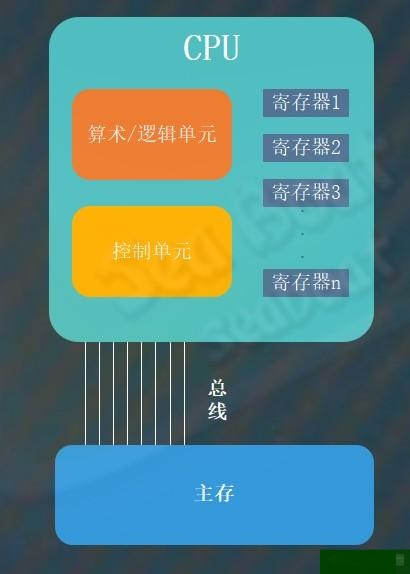
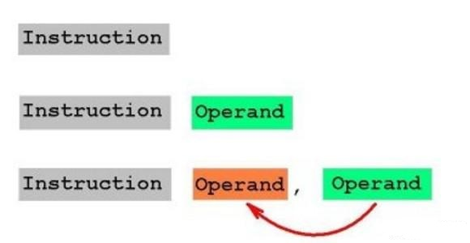
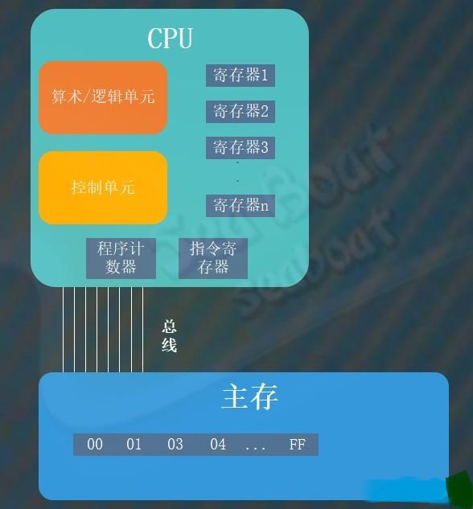
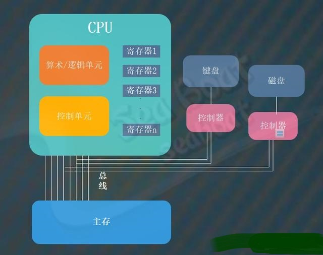

# 计算机体系结构基础知识

### CPU基础

CPU即处理器，是计算机中控制数据操控的电路。
它主要由三部分构成：算术/逻辑单元、控制单元和寄存器单元。
它们的作用分别为执行运算、协调机器活动以及临时存储。

### CPU与主存

CPU中的寄存器分为通用寄存器和专用寄存器，通用寄存器用于临时存放CPU正在使用的数据，而专用寄存器用于CPU专有用途，比如指令寄存器和程序计数器。
CPU与主存的通过总线进行通信，CPU通过控制单元能够操作主存中的数据。

执行两个数值相加的过程大致为：从主存读取第一个值放到寄存器1->从主存读取第二个值放到寄存器2->两个寄存器保存的值作为输入送到加法电路->将加法结果保存到寄存器3->控制单元将结果放到主存中。



### 程序等同数据

原始的计算机并不像现代计算机一样将程序保存起来，以前的人们只对数据进行保存，而设备执行的步骤作为计算机的一部分而被内置在控制单元中。这样就很不灵活，最多只能通过重新布线来提升灵活性。将程序与数据视作相同本质是很大的思想突破，因为人们一直认为它们是不同的事物，数据应该存放在主存中而程序应该属于CPU的一部分。

将程序作为数据一样保存在主存中大有好处，控制单元能够从主存读取程序，然后对它们解码并执行。当我们要修改执行程序时可以在计算机的主存中修改，而不必对CPU更改或重新布线。

### 指令系统

程序包含了大量的机器指令，CPU对这些指令进行解码并执行。CPU分为两类体系：精简指令集计算机（RISC）和复杂指令集计算机(CISC)。RISC提供了最小的机器指令集，计算机效率高速度快且制造成本低。而CISC提供了强大丰富的指令集，能更方便实现复杂的软件。

机器指令分为三类：数据传输类、算术/逻辑类与控制类。

数据传输类指令用于将数据从一个地方移动到另一个地方。比如将主存单元的内容加载到寄存器的LOAD指令，反之将寄存器的内容保存到主存的STORE指令。此外，CPU与其它设备（键盘、鼠标、打印机、显示器、磁盘等）进行通信的指令被称为I/O指令。

算术/逻辑类指令用于让控制单元请求在算术/逻辑单元内执行运算。这些运算包括算术、与、或、异或和位移等。

控制类指令用于指导程序执行。比如转移（JUMP）指令，它包括无条件转移和条件转移。



### 指令寄存器与程序计数器

CPU将主存的指令加载进来解码并执行，其中涉及两个重要寄存器：指令寄存器与程序计数器。指令寄存器英语存储正在执行的指令，而程序计数器则保持下一个待执行的指令地址。

CPU向主存请求加载程序计数器指定的地址的指令，将其存放到指令寄存器中，加载后将程序计数器的值加2（假如指令长度为2个字节）。

### 指令如何执行

比如我们要计算11+22，假设过程为：将主存地址为00的内容加载到寄存器1中->将主存地址为01的内容加载到寄存器2中->将寄存器1和寄存器2的数据相加并将结果保存到寄存器3->将寄存器3的结果存储到主存地址为02的位置->停止。

这个过程CPU涉及到四个操作：加载(load)、存储(store)、加法(add)和停止(halt)。可以对这些操作进行编码，比如可以分别用1、2、3、0000表示。

```code
1100
1201
3312
2302
0000
```



### 控制器

CPU与其他设备的通信一般通过控制器来实现，控制器可能在主板上，也可能以电路板形式查到主板。控制器本身可以看成是小型计算机，也有自己简单的CPU。
以前每连接一种外设都需要购买对应的控制器，而现在随着通用串行总线（USB）成为通用的标准，很多外设都可以直接用USB控制器作为通信接口。每个控制器都连接在总线上，通过总线进行通信。



每个控制器可能被设计成对应一组地址引用，主存则会忽略这些地址引用。当CPU往这些地址上发送消息时，其实是直接穿过主存而到控制器的，操作的是控制器而非主存。这种模式称为存储映射输入/输出。此外，这种模式的另外一种实现可以在机器指令中提供特定的操作码，专门用于与控制器通信，这样的操作码称为I/O指令。

### 直接存储器存取

直接存储器存取（DMA）是一种提升外设通信性能的措施，CPU并非总是需要使用总线，在总线空闲的时间里控制器能够充分利用起来。因为控制器都与总线相连接，而控制器又有执行指令的能力，所以可以将CPU的一些工作分给控制器来完成。比如在磁盘中检索数据时，CPU可以将告知控制器，然后由控制器找到数据并放到主存上，期间CPU可以去执行其他任务。这样能节省CPU资源。不过DMA会使总线通信更加复杂，而且会导致总线竞争问题。总线瓶颈源自冯诺依曼体系结构。
