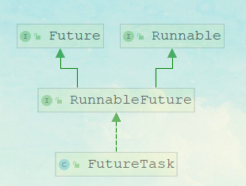

# Callable/Future 使用及原理分析

> 线程池的执行任务有两种方法，一种是 submit、一种是 execute；这两个方法是有区别的，那么基于这个区别我们再来看看。
 
#### execute 和 submit 区别
* execute 只可以接收一个 Runnable 的参数
* execute 如果出现异常会抛出
* execute 没有返回值
* submit 可以接收 Runable 和 Callable 这两种类型的参数，
* 对于 submit 方法，如果传入一个 Callable，可以得到一个 Future 的返回值
* submit 方法调用不会抛异常，除非调用 Future.get

这里，我们重点了解一下 Callable/Future，可能很多同学知道他是一个带返回值的线程，但是具体的实现可能不清楚。

#### Callable/Future 案例演示

Callable/Future 和 Thread 之类的线程构建最大的区别在于，能够很方便的获取线程执行完以后的结果。首先来看一个简单的例子

```
public class CallableDemo implements Callable<String> {
    public String call() throws Exception {
        Thread.sleep(3000);//阻塞案例演示
        return "hello world";
    }

    public static void main(String[] args) throws ExecutionException,
            InterruptedException {
        CallableDemo callableDemo = new CallableDemo();
        FutureTask futureTask = new FutureTask(callableDemo);
        new Thread(futureTask).start();
        System.out.println(futureTask.get());
    }
}
```
想一想我们为什么需要使用回调呢？那是因为结果值是由另一线程计算的，当前线程是不知道结果值什么时候计算完成，所以它传递一个回调接口给计算线程，当计算完成时，调用这个回调接口，回传结果值。

这个在很多地方有用到，比如 Dubbo 的异步调用，比如消息中间件的异步通信等等… 利用 FutureTask、 Callable、 Thread 对耗时任务（如查询数据库）做预处理，在需要计算结果之前就启动计算。

所以我们来看一下 Future/Callable 是如何实现的

#### Callable/Future 原理分析

在刚刚实现的 demo 中，我们用到了两个 api，分别是 Callable 和 FutureTask。Callable 是一个函数式接口，里面就只有一个 call 方法。子类可以重写这个方法，并且这个方法会有一个返回值

````
@FunctionalInterface
public interface Callable<V> {
    /**
     * Computes a result, or throws an exception if unable to do so.
     *
     * @return computed result
     * @throws Exception if unable to compute a result
     */
    V call() throws Exception;
}
````

FutureTask
FutureTask 的类关系图如下，它实现 RunnableFuture 接口，那么这个 RunnableFuture 接口的作用是什么呢。

在讲解 FutureTask 之前，先看看 Callable, Future, FutureTask 它们之间的关系图，如下：



```
public interface RunnableFuture<V> extends Runnable, Future<V> {
/**
* Sets this Future to the result of its computation
* unless it has been cancelled.
*/
  void run();
}
```

RunnableFuture 是一个接口，它继承了 Runnable 和 Future 这两个接口， Runnable 太熟悉了， 那么 Future 是什么呢？

Future 表示一个任务的生命周期，并提供了相应的方法来判断是否已经完成或取消，以及获取任务的结果和取消任务等。

```
public interface Future<V> {
  boolean cancel(boolean mayInterruptIfRunning);
  // 当前的 Future 是否被取消，返回 true 表示已取消
  boolean isCancelled();
  // 当前 Future 是否已结束。包括运行完成、抛出异常以及取消，都表示当前 Future 已结束
  boolean isDone();
  // 获取 Future 的结果值。如果当前 Future 还没有结束，那么当前线程就等待，
  // 直到 Future 运行结束，那么会唤醒等待结果值的线程的。
  V get() throws InterruptedException, ExecutionException;
  // 获取 Future 的结果值。与 get()相比较多了允许设置超时时间
  V get(long timeout, TimeUnit unit)
  throws InterruptedException, ExecutionException, TimeoutException;
}
```

分析到这里我们其实有一些初步的头绪了， FutureTask 是 Runnable 和 Future 的结合，如果我们把 Runnable 比作是生产者， Future 比作是消费者，那么 FutureTask 是被这两者共享的，生产者运行 run 方法计算结果，消费者通过 get 方法获取结果。

作为生产者消费者模式，有一个很重要的机制，就是如果生产者数据还没准备的时候，消费者会被阻塞。当生产者数据准备好了以后会唤醒消费者继续执行。

这个有点像我们上次可分析的阻塞队列，那么在 FutureTask 里面是基于什么方式实现的呢？

###### state 的含义
表示 FutureTask 当前的状态，分为七种状态

```
private static final int NEW = 0; // NEW 新建状态，表示这个 FutureTask还没有开始运行
// COMPLETING 完成状态， 表示 FutureTask 任务已经计算完毕了
// 但是还有一些后续操作，例如唤醒等待线程操作，还没有完成。
private static final int COMPLETING = 1;
// FutureTask 任务完结，正常完成，没有发生异常
private static final int NORMAL = 2;
// FutureTask 任务完结，因为发生异常。
private static final int EXCEPTIONAL = 3;
// FutureTask 任务完结，因为取消任务
private static final int CANCELLED = 4;
// FutureTask 任务完结，也是取消任务，不过发起了中断运行任务线程的中断请求
private static final int INTERRUPTING = 5;
// FutureTask 任务完结，也是取消任务，已经完成了中断运行任务线程的中断请求
private static final int INTERRUPTED = 6;
```

run 方法
```
   public void run() {
        // 如果状态 state 不是 NEW，或者设置 runner 值失败
        // 表示有别的线程在此之前调用 run 方法，并成功设置了 runner 值
        // 保证了只有一个线程可以运行 try 代码块中的代码。
        if (state != NEW ||
                !UNSAFE.compareAndSwapObject(this, runnerOffset,
                        null, Thread.currentThread()))
            return;
        try {
            Callable<V> c = callable;
            //只有c不为null且状态state为NEW的情况
            if (c != null && state == NEW) {
                V result;
                boolean ran;
                try {
                    //调用callable的call方法，并获得返回结果
                    result = c.call();
                    //运行成功
                    ran = true;
                } catch (Throwable ex) {
                    result = null;
                    ran = false;
                    setException(ex);
                }
                if (ran)
                    //设置结果
                    set(result);
            }
        } finally {
            // runner must be non-null until state is settled to
            // prevent concurrent calls to run()
            runner = null;
            // state must be re-read after nulling runner to prevent
            // leaked interrupts
            int s = state;
            if (s >= INTERRUPTING)
                handlePossibleCancellationInterrupt(s);
        }
    }
```

其实 run 方法作用非常简单，就是调用 callable 的 call 方法返回结果值 result，根据是否发生异常，调用 set(result)或 setException(ex)方法表示 FutureTask 任务完结。

不过因为 FutureTask 任务都是在多线程环境中使用，所以要注意并发冲突问题。注意在 run方法中，我们没有使用 synchronized 代码块或者 Lock 来解决并发问题，而是使用了 CAS 这个乐观锁来实现并发安全，保证只有一个线程能运行 FutureTask 任务。

###### get 方法
get 方法就是阻塞获取线程执行结果，这里主要做了两个事情

1. 判断当前的状态，如果状态小于等于 COMPLETING，表示 FutureTask 任务还没有完结，所以调用 awaitDone 方法，让当前线程等待。
2. report 返回结果值或者抛出异常

```
    public V get() throws InterruptedException, ExecutionException {
        int s = state;
        if (s <= COMPLETING)
            s = awaitDone(false, 0L);
        return report(s);
    }
```

###### awaitDone
如果当前的结果还没有被执行完，把当前线程线程和插入到等待队列

```
   private int awaitDone(boolean timed, long nanos)
            throws InterruptedException {
        final long deadline = timed ? System.nanoTime() + nanos : 0L;
        FutureTask.WaitNode q = null;
        boolean queued = false;// 节点是否已添加
        for (;;) {
            // 如果当前线程中断标志位是 true，
            // 那么从列表中移除节点 q，并抛出 InterruptedException 异常
            if (Thread.interrupted()) {
                removeWaiter(q);
                throw new InterruptedException();
            }

            int s = state;
            // 当状态大于 COMPLETING 时，表示FutureTask任务已结束
            if (s > COMPLETING) {
                if (q != null)
                    // 将节点 q 线程设置为 null，因为线程没有阻塞等待
                    q.thread = null;
                return s;
            }
            // 表示还有一些后序操作没有完成，那么当前线程让出执行权
            else if (s == COMPLETING) // cannot time out yet
                Thread.yield();
                //表示状态是 NEW，那么就需要将当前线程阻塞等待。
                // 就是将它插入等待线程链表中
            else if (q == null)
                q = new FutureTask.WaitNode();
            // 使用 CAS 函数将新节点添加到链表中，如果添加失败，那么queued 为 false，
            // 下次循环时，会继续添加，知道成功。
            else if (!queued)
                queued = UNSAFE.compareAndSwapObject(this, waitersOffset,
                        q.next = waiters, q);
            // timed 为 true 表示需要设置超时
            else if (timed) {
                nanos = deadline - System.nanoTime();
                if (nanos <= 0L) {
                    removeWaiter(q);
                    return state;
                }
                // 让当前线程等待 nanos 时间
                LockSupport.parkNanos(this, nanos);
            }
            else
                LockSupport.park(this);
        }
    }
```

被阻塞的线程，会等到 run 方法执行结束之后被唤醒

###### report

report 方法就是根据传入的状态值 s，来决定是抛出异常，还是返回结果值。 这个两种情况都表示 FutureTask 完结了

```
private V report(int s) throws ExecutionException {
    Object x = outcome;//表示 call 的返回值
    if (s == NORMAL) // 表示正常完结状态，所以返回结果值
        return (V)x;
    // 大于或等于 CANCELLED，都表示手动取消 FutureTask 任务，
    // 所以抛出 CancellationException 异常
  if (s >= CANCELLED)
    throw new CancellationException();
   // 否则就是运行过程中，发生了异常，这里就抛出这个异常
   throw new ExecutionException((Throwable)x);
}
```

###### 线程池对于 Future/Callable 的执行

我们现在再来看线程池里面的 submit 方法，就会很清楚了。

```
public class CallableDemo implements Callable<String> {
    public String call() throws Exception {
        Thread.sleep(3000);//阻塞案例演示
        return "hello world";
    }

    public static void main(String[] args) throws ExecutionException,
            InterruptedException {
        ExecutorService es= Executors.newFixedThreadPool(1);
        CallableDemo callableDemo = new CallableDemo();
        FutureTask futureTask = new FutureTask(callableDemo);

        Future future=es.submit(callableDemo);
        System.out.println(futureTask.get());
    }
}
```

###### AbstractExecutorService.submit

调用抽象类中的 submit 方法，这里其实相对于 execute 方法来说，只多做了一步操作，就是封装了一个 RunnableFuture

```
   public <T> Future<T> submit(Callable<T> task) {
        if (task == null) throw new NullPointerException();
        RunnableFuture<T> ftask = newTaskFor(task);
        execute(ftask);
        return ftask;
    }
```

newTaskFor更简单

```
 protected <T> RunnableFuture<T> newTaskFor(Callable<T> callable) {
        return new FutureTask<T>(callable);
    }
```

然后调用 execute 方法，这里面的逻辑前面分析过了，会通过 worker 线程来调用过 ftask 的run 方法。而这个 ftask 其实就是 FutureTask 里面最终实现的逻辑。


## Future .get()为啥能等待呢？

