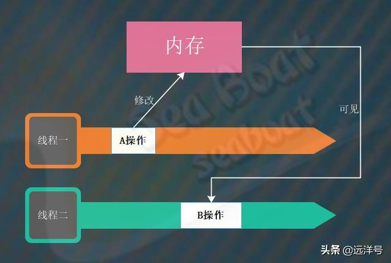
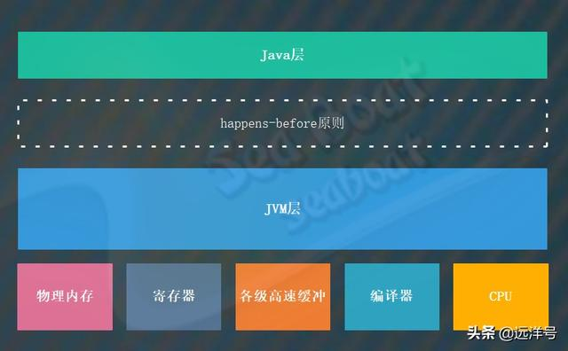
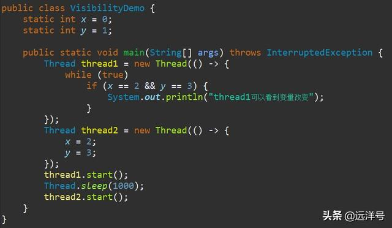
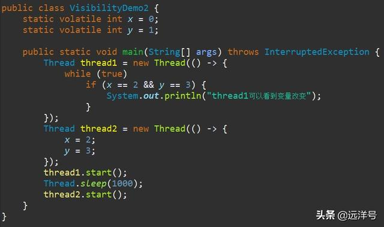
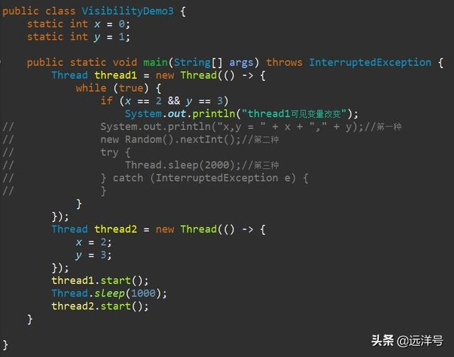
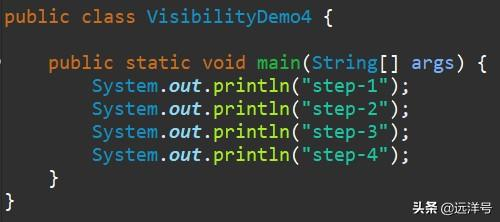
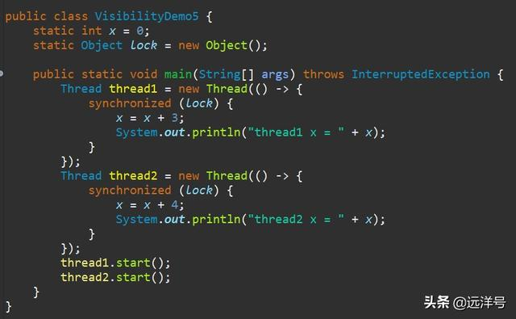
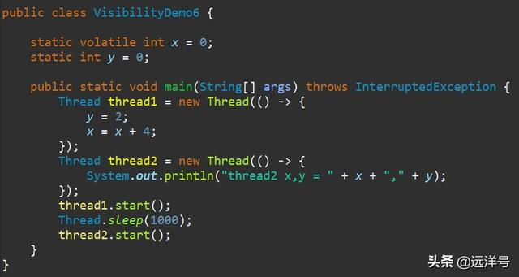
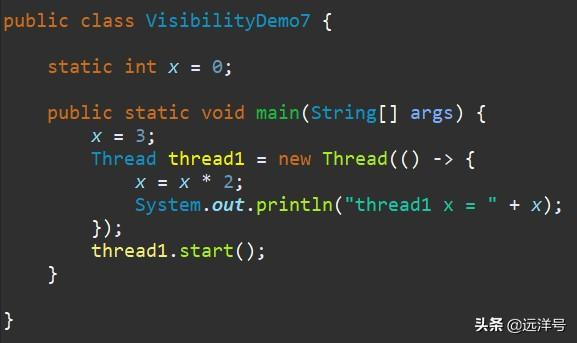

# 一文理解Java并发中Happens-before原则

## 关于happens-before原则

happens-before原则实际上是一种一致性模型，它主要规定了Java内存在多线程下操作的顺序性。如果某个操作happens-before于另外一个操作，那么先发生的操作的执行结果将对后发生的操作可见。
正式点的描述就是：假设操作A和操作B由多线程执行，如果A操作happens-before于B操作，那么A操作对内存产生的影响将对于B操作可见，即执行B操作前能看到A操作对内存的改变。
如下图中，线程一执行了A操作并对内存做了一些修改，此时如果A和B满足happens-before关系，那么线程二中的B操作就能看到A操作对内存的修改。



## 为什么制定happens-before原则

总的来说，happens-before原则用于保证某个线程执行的某个操作能被其它线程中的某个操作可见。对于Java体系而言，它希望通过某些规范来将复杂的物理计算机底层封装到JVM里面，从而向上提供一种统一的内存模型语义。
通过happens-before原则就能够规范JVM的实现，同时又能向上层的Java开发人员描述多线程并发中的可见性问题，而且还不必关注JVM复杂的实现。



## 可见性问题

为了让大家更清楚了解什么是可见性问题，下面我们通过几个例子来说明可见性问题以及如何解决可见性问题。示例1中有x和y两个共享变量，线程二负责更改x和y的值，而线程一则通过while循环检测x和y是否被线程二更改过，主线程启动线程一后睡眠一秒钟再启动线程二。
原本我们期望的结果是当线程二启动后线程一应该输出"thread1可以看到变量改变"，但事实却是永远都不会输出该提示。

由于JVM体系非常复杂，我们写的Java层代码可能会在编译时被编译器改动，也可能会在执行时被改动。所以实际上我们无法百分之百保证上述Java例子就一定是严格的可见性例子，因为示例中的Java代码可能会被编译器优化。
而上面对可见性的分析也只是从Java层源码去分析，有两种情况可能发生。情况一是编译器将线程一中的while(true)if(x==2&amp;&amp;y==3)的顺序反过来了，变成了if(x==2&amp;&amp;y==3)while(true)，当然这是编译器的优化策略，我们无法控制。
与此同时也导致了线程一只会去内存读一次x和y，后面不再读内存，也就读不到被线程二修改的x和y的新值。情况二是编译器不会改变Java层代码逻辑，线程一一直无线循环处于繁忙状态而不去读取内存中最新的x和y值。



接着我们看示例2如何解决可见性问题，其实很简单，就是将x和y都声明为volatile便可。关于volatile我们前面有分析过，每个线程对volatile变量的读写相当于直接对主内存读写，所以能保证线程对变量的可见性。这次运行的结果则是不断地输出“thread1可以看到变量改变”。



最后这里再提一下前面讲的编译器优化问题，给大家抛出一些现象，大家可以自己去深入探索。我们在示例1的基础上分别增加三种情况的代码，第一种是调用System.out.println()，第二种是调用new Random().nextInt()，而第三种就是Thread.sleep()。
最终可以发现这三种情况都能使线程一输出“thread1可见变量改变”，这说明线程一能看到线程二对x和y的修改。这个是不是因为增加了这些代码而阻止了编译器的优化操作呢？还是因为增加了这些代码使得while循环会去读取内存中的x和y的最新值？感兴趣的朋友可以去深挖下。



## 常见happens-before原则

我们一般将Java并发常见的happens-before原则归类为八个，其中很多都是我们非常熟悉的了，只是我们很少从happens-before的角度去理解它。下面我们来分别介绍这八个原则。

#### 单线程原则

单线程原则是最简单的规则，就是说在单个线程内前面的代码happens-before于后面的代码。比如下面的例子，在主线程内step-1比step-2输出更早，四个输出操作按照代码顺序执行。



#### 锁原则

锁原则是指某个锁解锁前的操作happens-before于接下去获取该锁后的其它操作。以synchronized的锁为例，我们都知道进入和离开synchronized大括号就是加锁和解锁操作，那么假如线程一先获取锁则解锁前的所有操作都happens-before于线程二获取该锁后的其它操作。反之亦成立。

该例子可能输出以下两种情况，因为happens-before原则保证了可见性。第一种情况是线程一解锁前的操作对线程二获取锁后的操作可见，所以线程一的x=3而线程二的x=7。第二种情况是线程二解锁前的操作对线程一获取锁后的操作可见，所以线程二的x=4而线程一的x=7。

> thread1 x = 3<br>
> thread2 x = 7<br>
>thread2 x = 4<br>
>thread1 x = 7



#### volatile原则

volatile原则是指对某个volatile变量的写操作和写操作之前的所有操作都happens-before于对这个volatile变量的读操作和读操作之后的所有操作。比如下面例子中，x是volatile变量而y为非volatile变量。线程一对y和x进行写操作，那么线程二在对x和y读操作时就能看到x和y的最新值，即输出“thread2 x,y = 4,2”。这里x写操作前的所有操作都对x读操作后的所有操作可见。



#### 线程start原则

线程start原则是指某个线程在调用另外一个线程的start方法前的所有操作都happens-before于刚被启动的线程中的所有操作。看下面的例子，主线程中先执行x=3，然后创建thread1并调用它的start方法。运行后输出为“thread1 x = 6”，调用start方法前的x=3对于线程一中是可见的。



#### 线程join原则

线程join原则是指如果线程A调用了线程B的join方法，那么线程B的所有动作都happens-before于线程A中join方法后面的所有动作。如下例子中，主线程启动线程一后并调用join方法等待线程一执行完

```java
Thread B = new Thread(()->{
  // 此处对共享变量 var 修改
  var = 66;
});
// 例如此处对共享变量修改，
// 则这个修改结果对线程 B 可见
// 主线程启动子线程
B.start();
B.join()
// 子线程所有对共享变量的修改
// 在主线程调用 B.join() 之后皆可见
// 此例中，var==66

```

此处，主线程A能看到线程B对共享变量var的操作，也就是可以看到var==66。


#### 线程的interrupt()规则

指的是线程A调用线程B的interrupt()方法，Happens-Before 于线程B检测中断事件(也就是Thread.interrupted()方法)。这个也很容易理解。

#### 传递性

传递性，指的是如果A Happens-Before于B，B Happens-Before于C，则A Happens-Before于C。这个是很好理解的。用白话说就是，如果A的操作结果对B可见，B操作结果对C可见，则A的操作结果对C也是可见的。

#### finalize()规则

指的是对象的构造函数执行、结束 Happens-Before 于finalize()方法的开始。


as-if-serial语义的意思是：不管怎么重排序（编译器和处理器为了提高并行度），单线程程序的执行结果不能被改变。编译器、runtime和处理器都必须遵守as-if-serial语义。为了遵守as-if-serial语义，编译器和处理器不会对存在数据依赖关系的操作做重排序，因为这种重排序会改变执行结果。
但是，如果操作之间不存在数据依赖关系，这些操作就可能被编译器和处理器重排序。为了具体说明，请看下面代码示例：


## 总结

Happens-Before原则非常重要，它是判断数据是否存在竞争、线程是否安全的主要一句，依靠这个原则，我们可以解决并发环境下两个操作之间是否存在冲突的所有问题。
