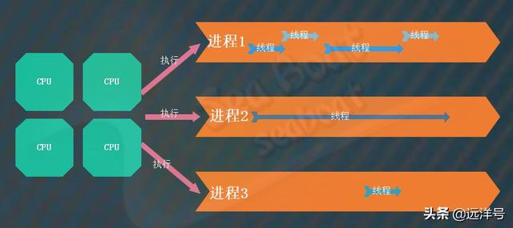
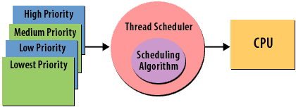
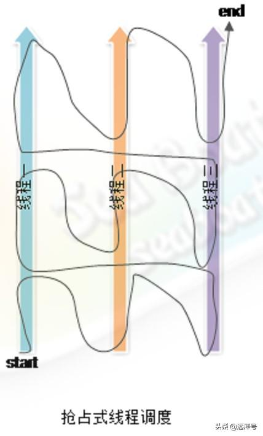
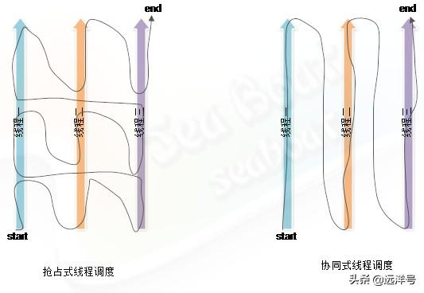

# JVM对线程的调度

## 进程与线程

进程是指程序的一次动态执行过程，通常我们说计算机中正在执行的程序就是进程，每个程序都会对应着一个进程。一个进程包含了从代码加载到执行完成的一个完整过程，它是操作系统资源分配最小单元。

而线程则是比进程更小的执行单位，是CPU调度和分派的基本单位。每个进程至少有一个线程，反过来一个线程只能属于一个进程，线程可以对进程所有的资源进行调度和运算。线程既可以由操作系统内核来控制调度，也可以由用户程序进行控制调度。

根据下图可以看到，多个CPU会去执行这三个进程。其中每个进程都包含着至少一个线程，比如进程1包含了四个线程，进程2和进程3包含一个线程。此外，每个进程都有自己的资源，而进程内的所有线程都共享进程包含的资源。

## 线程调度器

在Java多线程环境中，为保证所有线程的执行能按照一定的规则执行，JVM需要实现一个线程调度器。这个调度器定义了线程调度的策略，同时对CPU运算的分配都进行了约定，通过特定的机制为多个线程分配CPU的使用权。

线程调度器里面包含了多种调度策略算法，由这些算法来决定CPU的任务执行。此外，每个线程还有自己的优先级，比如有高、中、低，调度算法会通过这些优先级来实现优先机制。

#### 抢占式调度

常见的线程调度模式有两种：抢占式调度和协同式调度。

抢占式调度指的是每条线程的执行时间、线程的切换都由调度系统控制，调度系统拥有某种运行机制。调度系统可能为每条线程都分配相同的执行时间片，也可能为某些特定线程分配较长的执行时间，甚至在极端条件下还可能不给某些线程分配执行时间片，从而导致某些线程得不到执行。在抢占式调度机制下，一个线程的堵塞不会导致整个进程堵塞。

### 协同式调度

协同式调度指某一线程执行完后主动通知调度系统切换到另一线程上执行。这种调度模式就像接力赛一样，一个人跑完自己的路程后就把接力棒交接给下一个人，下个人继续往下跑。在这种模型下，线程的执行时间由线程本身控制，也就是说线程的切换点是可以预先知道的。所以这种模式不存在多线程同步问题，但它有一个致命弱点：如果一个线程编写得有问题，则可能导致系统运行到一半就一直阻塞了，最终将可能导致整个系统崩溃。

## 两种模式对比

我们通过下面的对比图来理解两种模式的不同。左边为抢占式线程调度，现在假如存在三条线程需要运行，在该模式的调度下，处理器的执行路径为：先在线程一运行一个时间片，然后强制切换到线程二运行一个时间片，最后切到线程三去执行。接着下一轮又再回到线程一，如此循环直至三条线程都执行完。而在协同式线程调度下，执行的策略则不是这样的，调度器会先将处理器分配给线程一并且一次性执行完。然后线程一再通知线程二，线程二也一次性执行完。最后线程二通知线程三，线程三一次性执行完。

## Java的调度

在了解了两种线程调度模式后，现在我们来看Java使用的是哪种线程调度模式。实际上，Java的线程调度涉及到了JVM的实现，JVM规范中规定每个线程都有优先级，且优先级越高越优先执行。但优先级高并不代表能独自占用执行时间片，可能是优先级高得到越多的执行时间片。反之，优先级低的分到的执行时间少但不会分配不到执行时间。JVM的规范并没有严格地给调度策略定义，可能因为面对众多不同调度策略，JVM要封装所有细节提供一个统一的策略不太现实，于是给了一个不严格但足够统一的定义。

那么Java线程使用的是什么调度呢？其实它使用的是抢占式调度。在JVM中体现为让可运行池中优先级高的线程拥有CPU使用权，如果可运行池中线程优先级一样则随机选择线程。但我们要注意的是实际上一个绝对时间点只有一个线程在运行，这里是相对于一个CPU来说，如果你的机器是多核的还是可能多个线程同时运行的。只有线程进入非可运行状态或另一个具有更高优先级的线程进入到可运行线程池时，才会使之让出CPU的使用权，从而更高优先级的线程会抢占优先级低的线程的CPU执行。

