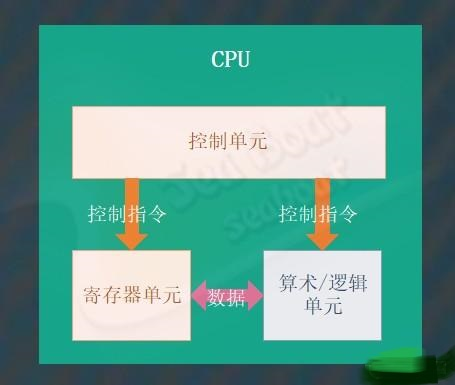
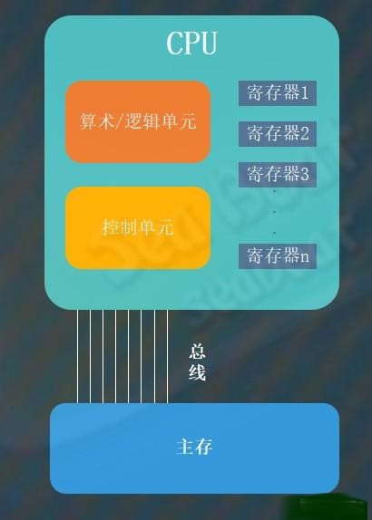
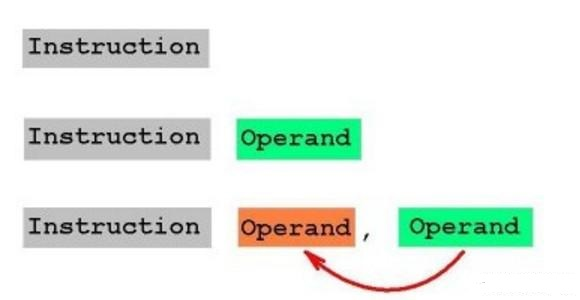

#   java并发必知的底层CPU知识

### 前言

Java并发为什么有这么多难点呢？实际上并不是Java语言的问题，从本质上来说是因为并发操作本身的问题，此外还有一些问题是由计算机的体系结构引发的。为了能更好地理解Java并发过程中的问题，我们应该对CPU有一些基础的认识。

### CPU

在信息时代，CPU是我们耳熟能详的一个概念，大家都知道CPU就是计算机的大脑。计算机中一连串复杂的指令就是由它负责执行，而这些指令通常就是我们称之为程序的东西。那么CPU到底是什么呢？CPU即中央处理器，它是计算机中控制数据操控的电路。它主要由三部分构成：算术/逻辑单元、控制单元和寄存器单元。

控制单元是整个CPU的指挥控制中心，它的主要职责就是协调机器活动，通过向其它两个单元发送控制指令来达到控制效果。算术/逻辑单元主要的职责是负责执行运算，包括算术运算和逻辑运算，它估计控制单元发送过来的指令执行相应的运算操作。寄存器单元主要的作用就是用来临时存储数据，它保存着待处理的或已处理的数据，它的出现是为了减少CPU对内存的访问次数，提升读取数据性能，从而提升CPU的整个工作效率。

### CPU与主存的协作

CPU中的寄存器分为通用寄存器和专用寄存器，通用寄存器用于临时存放CPU正在使用的数据，而专用寄存器用于CPU专有用途，比如指令寄存器和程序计数器。CPU与主存的通过总线进行通信，CPU通过控制单元能够操作主存中的数据。

执行两个数值相加的过程大致为：从主存读取第一个值放到寄存器1->从主存读取第二个值放到寄存器2->两个寄存器保存的值作为输入送到加法电路->将加法结果保存到寄存器3->控制单元将结果放到主存中。

### 程序等于数据

原始的计算机并不像现代计算机一样将程序保存起来，以前的人们只对数据进行保存，而设备执行的步骤作为计算机的一部分而被内置在控制单元中。这样就很不灵活，最多只能通过重新布线来提升灵活性。将程序与数据视作相同本质是很大的思想突破，因为人们一直认为它们是不同的事物，数据应该存放在主存中而程序应该属于CPU的一部分。

将程序作为数据一样保存在主存中大有好处，控制单元能够从主存读取程序，然后对它们解码并执行。当我们要修改执行程序时可以在计算机的主存中修改，而不必对CPU更改或重新布线。

### 指令系统

程序包含了大量的机器指令，CPU对这些指令进行解码并执行。CPU分为两类体系：精简指令集计算机（RISC）和复杂指令集计算机(CISC)。RISC提供了最小的机器指令集，计算机效率高速度快且制造成本低。而CISC提供了强大丰富的指令集，能更方便实现复杂的软件。

机器指令分为三类：数据传输类、算术/逻辑类与控制类。

数据传输类指令用于将数据从一个地方移动到另一个地方。比如将主存单元的内容加载到寄存器的LOAD指令，反之将寄存器的内容保存到主存的STORE指令。此外，CPU与其它设备（键盘、鼠标、打印机、显示器、磁盘等）进行通信的指令被称为I/O指令。

算术/逻辑类指令用于让控制单元请求在算术/逻辑单元内执行运算。这些运算包括算术、与、或、异或和位移等。

控制类指令用于指导程序执行。比如转移（JUMP）指令，它包括无条件转移和条件转移。

### 指令寄存器与程序计数器

CPU将主存的指令加载进来解码并执行，其中涉及两个重要寄存器：指令寄存器与程序计数器。指令寄存器用于存储正在执行的指令，而程序计数器则保持下一个待执行的指令地址。

CPU向主存请求加载程序计数器指定的地址的指令，将其存放到指令寄存器中，加载后将程序计数器的值加2（假如指令长度为2个字节）。

### 指令如何执行

比如我们要计算11+22，假设过程为：将主存地址为00的内容加载到寄存器1中->将主存地址为01的内容加载到寄存器2中->将寄存器1和寄存器2的数据相加并将结果保存到寄存器3->将寄存器3的结果存储到主存地址

