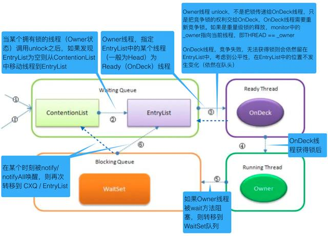

# Java锁机制


## 什么是锁？

在计算机科学中，锁(lock)或互斥(mutex)是一种同步机制，用于在有许多执行线程的环境中强制对资源的访问限制。锁旨在强制实施互斥排他、并发控制策略。

锁通常需要硬件支持才能有效实施。这种支持通常采取一个或多个原子指令的形式，如"test-and-set", "fetch-and-add" or "compare-and-swap"”。这些指令允许单个进程测试锁是否空闲，如果空闲，则通过单个原子操作获取锁。

## 锁的一个重要属性 粒度 Granularity

在引入锁粒度之前，需要了解关于锁的三个概念：

1. 锁开销 lock overhead 锁占用内存空间、 cpu初始化和销毁锁、获取和释放锁的时间。程序使用的锁越多，相应的锁开销越大
2. 锁竞争 lock contention 一个进程或线程试图获取另一个进程或线程持有的锁，就会发生锁竞争。锁粒度越小，发生锁竞争的可能性就越小
3. 死锁 deadlock 至少两个任务中的每一个都等待另一个任务持有的锁的情况锁粒度是衡量锁保护的数据量大小，通常选择粗粒度的锁(锁的数量少，每个锁保护大量的数据)，
在当单进程访问受保护的数据时锁开销小，但是当多个进程同时访问时性能很差。因为增大了锁的竞争。相反，使用细粒度的锁(锁数量多，每个锁保护少量的数据)增加了锁的开销但是减少了锁竞争。例如数据库中，锁的粒度有表锁、页锁、行锁、字段锁、字段的一部分锁

相关术语  Critical Section(临界区)、 Mutex/mutual exclusion(互斥体)、 Semaphore/binary semaphore(信号量)


## 锁的种类

#### 独享锁/共享锁

独享锁是指该锁一次只能被一个线程所持有。 (ReentrantLock、 Synchronized)

共享锁是指该锁可被多个线程所持有。 (ReadWriteLock)

互斥锁/读写锁

独享锁/共享锁这是广义上的说法，互斥锁/读写锁就分别对应具体的实现。在Java中如ReentrantLock就是互斥锁(独享锁)， ReadWriteLock就是读写锁(共享锁)。 独享锁与共享锁也是通过AQS来实现的

锁升级：读锁到写锁 (不支持)

锁降级：写锁到读锁 (支持)

#### 读写锁 ReentrantReadWriteLock

低16位代表写锁，高16位代表读锁

#### 公平锁/非公平锁

公平锁是指多个线程按照申请锁的顺序来获取锁。

非公平锁是指多个线程获取锁的顺序并不是按照申请锁的顺序，有可能后申请的线程比先申请的线程优先获取锁。有可能会造成饥饿现象。

对于Java ReentrantLock而言，通过构造函数指定该锁是否是公平锁，默认是非公平锁。非公平锁的优点在于吞吐量比公平锁大。

对于Synchronized而言，也是一种非公平锁。由于其并不像ReentrantLock是通过AQS的控制线程对锁的获取， 所以并没有任何办法使其变成公平锁。

#### 可重入锁


可重入锁又名递归锁，是指同一个线程在外层方法获取锁的时候，在进入内层方法会自动获取锁。

ReentrantLock和Synchronized都是可重入锁。可重入锁的一个好处是可一定程度避免死锁

#### 乐观锁/悲观锁

乐观锁/悲观锁不是指具体类型的锁，而是看待并发的角度。

悲观锁认为存在很多并发更新操作，采取加锁操作，如果不加锁一定会有问题

乐观锁认为不存在很多的并发更新操作，不需要加锁。数据库中乐观锁的实现一般采用版本号，Java中可使用CAS实现乐观锁。

乐观锁与悲观锁并不是特指某两种类型的锁，是人们定义出来的概念或思想，主要是指看待并发同步的角度。

乐观锁：顾名思义，就是很乐观，每次去拿数据的时候都认为别人不会修改，所以不会上锁，但是在更新的时候会判断一下在此期间别人有没有去更新这个数据，可以使用版本号等机制。乐观锁适用于多读的应用类型，这样可以提高吞吐量，在Java中java.util.concurrent.atomic包下面的原子变量类就是使用了乐观锁的一种实现方式CAS(Compare and Swap 比较并交换)实现的。

悲观锁：总是假设最坏的情况，每次去拿数据的时候都认为别人会修改，所以每次在拿数据的时候都会上锁，这样别人想拿这个数据就会阻塞直到它拿到锁。比如Java里面的同步原语synchronized关键字的实现就是悲观锁。

悲观锁适合写操作非常多的场景，乐观锁适合读操作非常多的场景，不加锁会带来大量的性能提升。

悲观锁在Java中的使用，就是利用各种锁。

乐观锁在Java中的使用，是无锁编程，常常采用的是CAS算法，典型的例子就是原子类，通过CAS自旋实现原子操作的更新。


乐观锁与悲观锁是一种广义上的概念，体现了看待线程同步的不同角度。在Java和数据库中都有此概念对应的实际应用。

先说概念。对于同一个数据的并发操作，悲观锁认为自己在使用数据的时候一定有别的线程来修改数据，因此在获取数据的时候会先加锁，确保数据不会被别的线程修改。Java中，synchronized关键字和Lock的实现类都是悲观锁。

而乐观锁认为自己在使用数据时不会有别的线程修改数据，所以不会添加锁，只是在更新数据的时候去判断之前有没有别的线程更新了这个数据。如果这个数据没有被更新，当前线程将自己修改的数据成功写入。如果数据已经被其他线程更新，则根据不同的实现方式执行不同的操作（例如报错或者自动重试）。

乐观锁在Java中是通过使用无锁编程来实现，最常采用的是CAS算法，Java原子类中的递增操作就通过CAS自旋实现的。

###### 乐观锁

乐观锁总是认为不存在并发问题，每次去取数据的时候，总认为不会有其他线程对数据进行修改，因此不会上锁。但是在更新时会判断其他线程在这之前有没有对数据进行修改，一般会使用“数据版本机制”或“CAS操作”来实现。

* 数据版本机制

实现数据版本一般有两种，第一种是使用版本号，第二种是使用时间戳。以版本号方式为例。

版本号方式：一般是在数据表中加上一个数据版本号version字段，表示数据被修改的次数，当数据被修改时，version值会加一。当线程A要更新数据值时，在读取数据的同时也会读取version值，在提交更新时，若刚才读取到的version值为当前数据库中的version值相等时才更新，否则重试更新操作，直到更新成功。
核心SQL代码

     update table set xxx=#{xxx}, version=version+1 where id=#{id} and version=#{version};

* CAS操作

CAS（Compare and Swap 比较并交换），当多个线程尝试使用CAS同时更新同一个变量时，只有其中一个线程能更新变量的值，而其它线程都失败，失败的线程并不会被挂起，而是被告知这次竞争中失败，并可以再次尝试。

CAS操作中包含三个操作数——需要读写的内存位置(V)、进行比较的预期原值(A)和拟写入的新值(B)。如果内存位置V的值与预期原值A相匹配，那么处理器会自动将该位置值更新为新值B，否则处理器不做任何操作。

###### 悲观锁

悲观锁认为对于同一个数据的并发操作，一定会发生修改的，哪怕没有修改，也会认为修改。因此对于同一份数据的并发操作，悲观锁采取加锁的形式。悲观的认为，不加锁并发操作一定会出问题。

在对任意记录进行修改前，先尝试为该记录加上排他锁（exclusive locking）。

如果加锁失败，说明该记录正在被修改，那么当前查询可能要等待或者抛出异常。具体响应方式由开发者根据实际需要决定。

如果成功加锁，那么就可以对记录做修改，事务完成后就会解锁了。

期间如果有其他对该记录做修改或加排他锁的操作，都会等待我们解锁或直接抛出异常。

#### 分段锁

分段锁是一种锁的设计，并不是一种具体的锁。对于ConcuttentHashMap就是通过分段锁实现高效的并发操作。

#### 自旋锁

自旋锁是指尝试获取锁的线程不会阻塞，而是采用循环的方式尝试获取锁。好处是减少上下文切换，缺点是一直占用CPU资源。

#### 偏向锁/轻量级锁/重量级锁

## 背景知识

#### 指令流水线

CPU的基本工作是执行存储的指令序列，即程序。程序的执行过程实际上是不断地取出指令、分析指令、执行指令的过程。

几乎所有的冯•诺伊曼型计算机的CPU，其工作都可以分为5个阶段：取指令、指令译码、执行指令、访存取数和结果写回。


现代处理器的体系结构中，采用了流水线的处理方式对指令进行处理。指令包含了很多阶段，对其进行拆解，每个阶段由专门的硬件电路、寄存器来处 理，就可以实现流水线处理。实现更高的CPU吞吐量，但是由于流水线处理本身的额外开销，可能会增加延迟。

#### cpu多级缓存


在计算机系统中，CPU高速缓存（CPU Cache，简称缓存）是用于减少处理器访问内存所需平均时间的部件。在金字塔式存储体系中它位于自顶向下的第二层，仅次于CPU寄存器。其容量远小于内存，但速度却可以接近处理器的频率。

当处理器发出内存访问请求时，会先查看缓存内是否有请求数据。如果存在（命中），则不经访问内存直接返回该数据；如果不存在（失效），则要先把内存中的相应数据载入缓存，再将其返回处理器。

缓存之所以有效，主要是因为程序运行时对内存的访问呈现局部性（Locality）特征。这种局部性既包括空间局部性（Spatial Locality），也包括时间局部性（Temporal Locality）。有效利用这种局部性，缓存可以达到极高的命中率。

## 问题引入

#### 原子性

即一个操作或者多个操作 要么全部执行并且执行的过程不会被任何因素打断，要么就都不执行。
        
示例方法：{i++ （i为实例变量）}

这样一个简单语句主要由三个操作组成：

* 读取变量i的值
* 进行加一操作
* 将新的值赋值给变量i

如果对实例变量i的操作不做额外的控制，那么多个线程同时调用，就会出现覆盖现象，丢失部分更新。

另外，如果再考虑上工作内存和主存之间的交互，可细分为以下几个操作：

* read 从主存读取到工作内存 （非必须）
* load 赋值给工作内存的变量副本（非必须）
* use 工作内存变量的值传给执行引擎
* 执行引擎执行加一操作
* assign 把从执行引擎接收到的值赋给工作内存的变量
* store 把工作内存中的一个变量的值传递给主内存（非必须）
* write 把工作内存中变量的值写到主内存中的变量（非必须）

#### 可见性

是指当多个线程访问同一个变量时，一个线程修改了这个变量的值，其他线程能够立即看得到修改的值

存在可见性问题的根本原因是由于缓存的存在，线程持有的是共享变量的副本，无法感知其他线程对于共享变量的更改，导致读取的值不是最新的。

```java
while (flag) {//语句1
   doSomething();//语句2
}

flag = false;//语句3
```

线程1判断flag标记，满足条件则执行语句2；线程2flag标记置为false，但由于可见性问题，线程1无法感知，就会一直循环处理语句2。

#### 顺序性

即程序执行的顺序按照代码的先后顺序执行

由于编译重排序和指令重排序的存在，是的程序真正执行的顺序不一定是跟代码的顺序一致，这种情况在多线程情况下会出现问题。

```java
if (inited == false) {	
   context = loadContext();   //语句1
   inited = true;             //语句2
}
doSomethingwithconfig(context); //语句3
```

由于语句1和语句2没有依赖性，语句1和语句2可能 并行执行 或者 语句2先于语句1执行，如果这段代码两个线程同时执行，线程1执行了语句2，而语句1还没有执行完，这个时候线程2判断inited为true，则执行语句3，但由于context没有初始化完成，则会导致出现未知的异常。


## JMM内存模型

> Java虚拟机规范定义了Java内存模型（Java Memory Model，JMM）来屏蔽各种硬件和操作系统的内存访问差异，以实现让Java程序在各种平台下都能达到一致的内存访问效果（C/C++等则直接使用物理机和OS的内存模型，使得程序须针对特定平台编写），它在多线程的情况下尤其重要。

#### 内存划分

JMM的主要目标是定义程序中各个变量的访问规则，即在虚拟机中将变量存储到内存和从内存中取出变量这样的底层细节。这里的变量是指共享变量，存在竞争问题的变量，如实例字段、静态字段、数组对象元素等，不包括线程私有的局部变量、方法参数等，因为私有变量不存在竞争问题。可以认为JMM包括内存划分、变量访问操作与规则两部分。


分为主内存和工作内存，每个线程都有自己的工作内存，它们共享主内存。

* 主内存（Main Memory）存储所有共享变量的值。
* 工作内存（Working Memory）存储该线程使用到的共享变量在主内存的的值的副本拷贝。

线程对共享变量的所有读写操作都在自己的工作内存中进行，不能直接读写主内存中的变量。

不同线程间也无法直接访问对方工作内存中的变量，线程间变量值的传递必须通过主内存完成。

> 这种划分与Java内存区域中堆、栈、方法区等的划分是不同层次的划分，两者基本没有关系。硬要联系的话，大致上主内存对应Java堆中对象的实例数据部分、工作内存对应栈的部分区域；从更低层次上说，主内存对应物理硬件内存、工作内存对应寄存器和高速缓存。

#### 内存间交互规则

关于主内存与工作内存之间的交互协议，即一个变量如何从主内存拷贝到工作内存，如何从工作内存同步到主内存中的实现细节。Java内存模型定义了8种原子操作来完成：


* lock: 将一个变量标识为被一个线程独占状态
* unclock: 将一个变量从独占状态释放出来，释放后的变量才可以被其他线程锁定
* read: 将一个变量的值从主内存传输到工作内存中，以便随后的load操作
* load: 把read操作从主内存中得到的变量值放入工作内存的变量的副本中
* use: 把工作内存中的一个变量的值传给执行引擎，每当虚拟机遇到一个使用到变量的指令时都会使用该指令
* assign: 把一个从执行引擎接收到的值赋给工作内存中的变量，每当虚拟机遇到一个给变量赋值的指令时，都要使用该操作
* store: 把工作内存中的一个变量的值传递给主内存，以便随后的write操作
* write: 把store操作从工作内存中得到的变量的值写到主内存中的变量

###### 定义原子操作的使用规则

1. 不允许一个线程无原因地（没有发生过任何assign操作）把数据从工作内存同步会主内存中
2. 一个新的变量只能在主内存中诞生，不允许在工作内存中直接使用一个未被初始化（load或者assign）的变量。即就是对一个变量实施use和store操作之前，必须先自行assign和load操作。
3. 一个变量在同一时刻只允许一条线程对其进行lock操作，但lock操作可以被同一线程重复执行多次，多次执行lock后，只有执行相同次数的unlock操作，变量才会被解锁。lock和unlock必须成对出现。
4. 如果对一个变量执行lock操作，将会清空工作内存中此变量的值，在执行引擎使用这个变量之前需要重新执行load或assign操作初始化变量的值。
5. 如果一个变量事先没有被lock操作锁定，则不允许对它执行unlock操作；也不允许去unlock一个被其他线程锁定的变量。
6. 对一个变量执行unlock操作之前，必须先把此变量同步到主内存中（执行store和write操作）

从上面可以看出，把变量从主内存复制到工作内存需要顺序执行read、load，从工作内存同步回主内存则需要顺序执行store、write。总结：

1. read、load、use必须成对顺序出现，但不要求连续出现。assign、store、write同之；
2. 变量诞生和初始化：变量只能从主内存“诞生”，且须先初始化后才能使用，即在use/store前须先load/assign；
3. lock一个变量后会清空工作内存中该变量的值，使用前须先初始化；unlock前须将变量同步回主内存；
4. 一个变量同一时刻只能被一线程lock，lock几次就须unlock几次；未被lock的变量不允许被执行unlock，一个线程不能去unlock其他线程lock的变量。

###### long和double型变量的特殊规则

Java内存模型要求前述8个操作具有原子性，但对于64位的数据类型long和double，在模型中特别定义了一条宽松的规定：允许虚拟机将没有被volatile修饰的64位数据的读写操作划分为两次32位的操作来进行。即未被volatile修饰时线程对其的读取read不是原子操作，可能只读到“半个变量”值。虽然如此，商用虚拟机几乎都把64位数据的读写实现为原子操作，因此我们可以忽略这个问题。

#### 先行发生原则

> Java内存模型具备一些先天的“有序性”，即不需要通过任何同步手段（volatile、synchronized等）就能够得到保证的有序性，这个通常也称为happens-before原则。

如果两个操作的执行次序不符合先行原则且无法从happens-before原则推导出来，那么它们就不能保证它们的有序性，虚拟机可以随意地对它们进行重排序。

1. 程序次序规则（Program Order Rule）：一个线程内，逻辑上书写在前面的操作先行发生于书写在后面的操作。
1. 锁定规则（Monitor Lock Rule）：一个unLock操作先行发生于后面对同一个锁的lock操作。“后面”指时间上的先后顺序。
1. volatile变量规则（Volatile Variable Rule）：对一个volatile变量的写操作先行发生于后面对这个变量的读操作。“后面”指时间上的先后顺序。
1. 传递规则（Transitivity）：如果操作A先行发生于操作B，而操作B又先行发生于操作C，则可以得出操作A先行发生于操作C。
1. 线程启动规则（Thread Start Rule）：Thread对象的start()方法先行发生于此线程的每个一个动作。
1. 线程中断规则（Thread Interruption Rule）：对线程interrupt()方法的调用先行发生于被中断线程的代码检测到中断事件的发生（通过Thread.interrupted()检测）。
1. 线程终止规则（Thread Termination Rule）：线程中所有的操作都先行发生于线程的终止检测，我们可以通过Thread.join()方法结束、Thread.isAlive()的返回值手段检测到线程已经终止执行。
1. 对象终结规则（Finaizer Rule）：一个对象的初始化完成（构造函数执行结束）先行发生于他的finalize()方法的开始。

## 问题解决

#### 原子性

* 由JMM直接保证的原子性变量操作包括read、load、use、assign、store、write；
* 基本数据类型的读写（工作内存）是原子性的

由JMM的lock、unlock可实现更大范围的原子性保证，但是这是JVM需要实现支持的功能，对于开发者则是有由synchronized关键字 或者 Lock读写锁 来保证原子性。

#### 可见性

volatile 变量值被一个线程修改后会立即同步回主内存、变量值被其他线程读取前立即从主内存刷新值到工作内存。即read、load、use三者连续顺序执行，assign、store、write连续顺序执行。

synchronized/Lock 由lock和unlock的使用规则保证

* “对一个变量执行unlock操作之前，必须先把此变量同步到主内存中（执行store和write操作）”。
*"如果对一个变量执行lock操作，将会清空工作内存中此变量的值，在执行引擎使用这个变量之前需要重新执行load或assign操作初始化变量的值"

final 修饰的字段在构造器中一旦初始化完成，且构造器没有把“this”的引用传递出去，则其他线程可立即看到final字段的值。

#### 顺序性

volatile 禁止指令重排序

synchronized/Lock “一个变量在同一个时刻只允许一条线程对其执行lock操作”


## 开发篇

#### volatile

被volatile修饰的变量能保证器顺序性和可见性

###### 顺序性

对一个volatile变量的写操作先行发生于后面对这个变量的读操作。“后面”指时间上的先后顺序

###### 可见性

* 当写一个 * volatile 变量时，JMM 会把该线程对应的工作内存中的共享变量刷新到主内存。
* 当读一个 * volatile 变量时，JMM 会把该线程对应的工作内存置为无效，线程接下来将从主内存中读取共享变量。

volatile相比于synchronized/Lock是非常轻量级，但是使用场景是有限制的：

* 对变量的写入操作不依赖于其当前值，即仅仅是读取和单纯的写入，比如操作完成、中断或者状态之类的标志
* 禁止对volatile变量操作指令的重排序

###### 实现原理

> volatile底层是通过cpu提供的内存屏障指令来实现的。硬件层的内存屏障分为两种：Load Barrier 和 Store Barrier即读屏障和写屏障。

内存屏障有两个作用：
 
* 阻止屏障两侧的指令重排序
* 强制把写缓冲区/高速缓存中的脏数据等写回主内存，让缓存中相应的数据失效


#### final

对于final域的内存语义，编译器和处理器要遵守两个重排序规则（内部实现也是使用内存屏障）：

* 写final域的重排序规则：在构造函数内对一个final域的写入，与随后把这个被构造对象的引用赋值给一个引用变量，这两个操作之间不能重排序。
* 读final域的重排序规则：初次读一个包含final域的对象的引用，与随后初次读这个final域，这两个操作之间不能重排序。

```java
public class FinalExample {
       int i;//普通域
       final int j;//final域
       static FinalExample obj;
       
       public FinalExample () {
              i = 1;//写普通域。对普通域的写操作【可能会】被重排序到构造函数之外 
              j = 2;//写final域。对final域的写操作【不会】被重排序到构造函数之外
       }
       
       // 写线程A执行
       public static void writer () {    
              obj = new FinalExample ();
       }
       
       // 读线程B执行
       public static void reader () {    
              FinalExample object = obj;//读对象引用
              int a = object.i;//读普通域。可能会看到结果为0(由于i=1可能被重排序到构造函数外，此时y还没有被初始化)
              int b = object.j;//读final域。保证能够看到结果为2
       }
}
```

初次读对象引用与初次读该对象包含的final域，这两个操作之间存在间接依赖关系。由于编译器遵守间接依赖关系，因此编译器不会重排序这两个操作。大多数处理器也会遵守间接依赖，也不会重排序这两个操作。但有少数处理器允许对存在间接依赖关系的操作做重排序（比如alpha处理器），这个规则就是专门用来针对这种处理器的。

对于final域是引用类型，写final域的重排序规则对编译器和处理器增加了如下约束：

* 在构造函数内对一个final引用的对象的成员域的写入，与随后在构造函数外把这个被构造对象的引用赋值给一个引用变量，这两个操作之间不能重排序。

#### synchronized

synchronized用于修饰普通方法、修饰静态方法、修饰代码块

* 确保代码的同步执行（即不同线程间的互斥）（原子性）
* 确保对共享变量的修改能够及时可见（可见性）
* 有效解决指令重排问题（顺序性）

###### 实现原理

使用对象的监视器(Monitor，也有叫管程的)进行控制

* 进入/加锁时执行字节码指令MonitorEnter
* 退出/解锁时执行字节码指令MonitorExit 当执行代码有异常退出方法/代码段时，会自动解锁

使用哪个对象的监视器：

* 修饰对象方法时，使用当前对象的监视器
* 修饰静态方法时，使用类类型（Class 的对象）监视器
* 修饰代码块时，使用括号中的对象的监视器 必须为 Object 类或其子类的对象

###### MonitorEnter（加锁）：

* 每个对象都有一个关联的监视器。
* 监视器被锁住，当且仅当它有属主(Owner)时。
* 线程执行MonitorEnter就是为了成为Monitor的属主。
* 如果 Monitor 对象的记录数(Entry Count，拥有它的线程的重入次数)为 0， 将其置为 1，线程将自己置为 Monitor 对象的属主。
* 如果Monitor的属主为当前线程，就会重入监视器，将其记录数增一。
* 如果Monitor的属主为其它线程，当前线程会阻塞，直到记录数为0，才会 去竞争属主权。

###### MonitorExit（解锁）：

* 执行MonitorExit的线程一定是这个对象所关联的监视器的属主。
* 线程将Monitor对象的记录数减一。
* 如果Monitor对象的记录数为0，线程就会执行退出动作，不再是属主。 此时其它阻塞的线程就被允许竞争属主。

对于 MonitorEnter、MonitorExit 来说，有两个基本参数:

* 线程
* 关联监视器的对象

###### 关键结构

在 JVM 中，对象在内存中的布局分为三块区域：对象头、实例数据、对齐填充。 如下:

###### 实例变量

* 存放类的属性数据信息，包括父类的属性信息
* 如果是数组的实例变量，还包括数组的长度
* 这部分内存按4字节对齐

###### 填充数据

* 由于虚拟机要求对象起始地址必须是8字节的整数倍
* 填充数据仅仅是为了字节对齐 保障下一个对象的起始地址为 8 的整数倍
* 长度可能为0

###### 对象头（Object Header）

* 对象头由 Mark Word 、Class Metadata Address（类元数据地址） 和 数组长度（对象为数组时）组成
* 在 32 位和 64 位的虚拟机中，Mark Word 分别占用 32 字节和 64 字节，因此称其为 word

Mark Word 存储的并非对象的 实际业务数据（如对象的字段值），属于 额外存储成本。为了节约存储空间，Mark Word 被设计为一个 非固定的数据结构，以便在尽量小的空间中存储尽量多的数据，它会根据对象的状态，变换自己的数据结构，从而复用自己的存储空间。


锁的状态共有 4 种:无锁、偏向锁、轻量级锁、重量级锁。随着竞争的增加，锁的使用情况如下:

> 无锁 -> 偏向锁 -> 轻量级锁 -> 重量级锁

其中偏向锁和轻量级锁是从 JDK 6 时引入的，在 JDK 6 中默认开启。 锁的升级(锁膨胀，inflate)是单向的，只能从低到高(从左到右)。不会出现 锁的降级。

###### 偏向锁

当锁对象第一次被线程获取的时候，虚拟机将会把对象头中的标志位设为“01” （可偏向），即偏向模式。同时使用CAS操作把获取到这个锁的线程的ID记录在对象的Mark Word之中，如果CAS操作成功，持有偏向锁的线程以后每次进入这个锁相关的同步块时，虚拟机都可以不再进行任何同步操作。

当有另外一个线程去尝试获取这个锁时，偏向模式就宣告结束。根据锁对象目前是否处于被锁定的状态，撤销偏向（Revoke Bias）后恢复到未锁定（标志位为“01”，不可偏向）或 轻量级锁定（标志位为“00”）的状态，后续的同步操作就进入轻量级锁的流程。

###### 轻量级锁

进入到轻量级锁说明不止一个线程尝试获取锁，这个阶段会通过自适应自旋CAS方式获取锁。如果获取失败，则进行锁膨胀，进入重量级锁流程，线程阻塞。

###### 重量级锁

重量级锁是通过系统的线程互斥锁来实现的，代价最昂贵



###### ContentionList，CXQ，存放最近竞争锁的线程

* LIFO，单向链表
* 很多线程都可以把请求锁的线程放入队列中
* 但只有一个线程能将线程出队

###### EntryLis，表示胜者组

* 双向链表
* 只有拥有锁的线程才可以访问或变更 EntryLis
* 只有拥有锁的线程在释放锁时，并且在 EntryList 为空、ContentionList 不为 空的情况下，才能将ContentionList 中的线程全部出队，放入到EntryList 中

###### WaitSet，存放处于等待状态的线程

* 将进行 wait() 调用的线程放入WaitSet
* 当进行 notify()、notifyAll()调用时，会将线程放入到ContentionList或EntryList 队列中

###### 注意：

* 对一个线程而言，在任何时候最多只处于三个集合中的一个
* 处于这三个集合中的线程，均为 BLOCKED 状态，底层使用互斥量来进行阻塞

**当一个线程成功获取到锁时** 对象监视器的 owner 字段从 NULL 变为非空，指向此线程 必须将自己从ContentionList或EntryList中出队

**竞争型的锁传递机制** 线程释放锁时，不保证后继线程一定可以获得到锁，而是后继线程去竞争锁

**OnDeck**，表示准备就绪的线程，保证任何时候都只有一个线程来直接竞争 锁

* 在获取锁时，如果发生竞争，则使用自旋锁来争用，如果自旋后仍得不 到，再放入上述队列中。
* 自旋可以减少ContentionList和EntryList上出队入队的操作，也就是减少了内部 维护的这些锁的争用。

###### OS 互斥锁

重量级锁是通过操作系统的线程互斥锁来实现的，在 Linux 下，锁所用的技术是 pthead_mutex_lock / pthead_mutex_unlock，即线程间的互斥锁。

线程互斥锁是基于 futex（Fast Userspace Mutex）机制实现的。 常规的操作系统的同步机制(如 IPC 等)，调用时都需要陷入到内核中执行，即使没有竞争也要执行一次陷入操作(int 0x80，trap)。而 futex 则是内核态和用户态的混合，无竞争时，获取锁和释放锁都不需要陷入内核。

###### 初始分配

首先在内存分配 futex 共享变量，对线程而言，内存是共享的，直接分配(malloc)即可，为整数类型，初始值为1。

###### 获取锁

使用CAS对 futex 变量减1，观察其结果：

* 如果由1变为0，表示无竞争，继续执行
* 如果小于 0，表示有竞争，调用 futex(..., FUTEX_WAIT, ...) 使当前线程休眠

###### 释放锁

使用CAS给futex变量加1

* 如果futex变量由0变为1，表示无竞争，继续执行
* 如果 futex 变量变化前为负值，表示有竞争，调用 futex(..., FUTEX_WAKE, ...) 唤醒一个或多个等待线程
