# 并发锁LockSupport原理剖析

## 关于LockSupport

LockSupport类为构建锁和同步器提供了基本的线程阻塞唤醒原语，JDK中我们熟悉的AQS基础同步类就使用了它来控制线程的阻塞和唤醒，当然还有其他的同步器或锁也会使用它。
也许我们更加熟悉的阻塞唤醒操作是wait/notify方式，它主要以Object的角度来设计。而LockSupport提供的park/unpark则是以线程的角度来设计，真正解耦了线程之间的同步。
为了更好地理解JDK的这些并发工具，我们需要具体分析一下该类的实现。该类主要包含两种操作，分别为阻塞操作和唤醒操作。

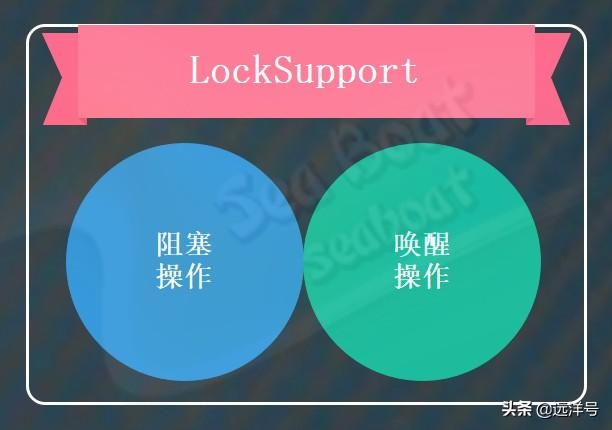

## LockSupport核心方法

通过下面的思维导图来看LockSupport类的几个核心方法，总体可以分为以park开头的方法和unpark方法。park开头的方法用于执行阻塞操作，它又分为两类：参数包含阻塞对象和参数不包含阻塞对象。下面对每个方法进行说明。

* park()方法，对当前线程执行阻塞操作，直到获取到可用许可后才解除阻塞，也就相当于当前线程进入阻塞状态。
* parkNanos(long)方法，对当前线程执行阻塞操作，等待获取到可用许可后才解除阻塞，最大的等待时间由传入的参数来指定，一旦超过最大时间它也会解除阻塞。
* parkUntil(long)方法，，对当前线程执行阻塞操作，等待获取到可用许可后才解除阻塞，最大的等待时间为参数所指定的最后期限时间。
* park(Object)方法，与park()方法同义，但它多传入的参数为阻塞对象。
* parkNanos(Object,long)方法，与parkNanos(long)同义，但指定了阻塞对象。
* parkUntil(Object,long)方法，与parkUntil(long)同义，但指定了阻塞对象。
* unpark(Thread)方法，将指定线程的许可置为可用，也就相当于唤醒了该线程。

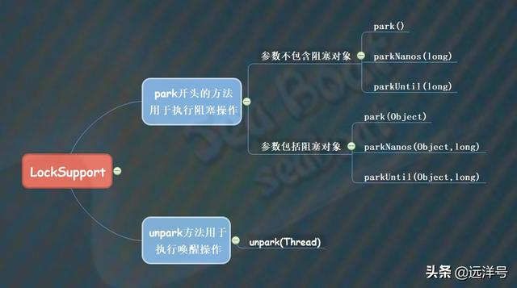

## 许可机制

在介绍核心方法时出现了一个高频的词——许可，那么什么是许可呢？其实很容易理解，线程成功拿到许可则能够往下执行，否则将进入阻塞状态。对于LockSupport使用的许可可看成是一种二元信号，该信号分有许可和无许可两种状态。
每个线程都对应一个信号变量，当线程调用park时其实就是去获取许可，如果能成功获取到许可则能够往下执行，否则则阻塞直到成功获取许可为止。而当线程调用unpark时则是释放许可，供线程去获取。如下图所示，每个线程都对应一个信号，其中有许可用和无许可分别用1和0来表示。
刚开始四个线程调用park方法，因为无许可而都处于阻塞状态。接着假如线程一和线程四的信号变为有许可，则它们都能继续往下执行。最后线程一和线程四获取许可后，其信号又变为无许可。

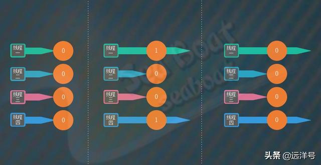

## LockSupport例子

下面看一个通过LockSupport来进行阻塞和唤醒的例子，主线程分别创建thread1和thread2，然后先启动thread1，thread1,调用LockSupport.park()方法进入阻塞状态。接着主线程睡眠三秒后启动thread2，thread2会调用LockSupport.unpark(thread1)方法让thread1得到许可，即唤醒thread1。最终thread1被唤醒，输出"thread2 wakes up thread1"。

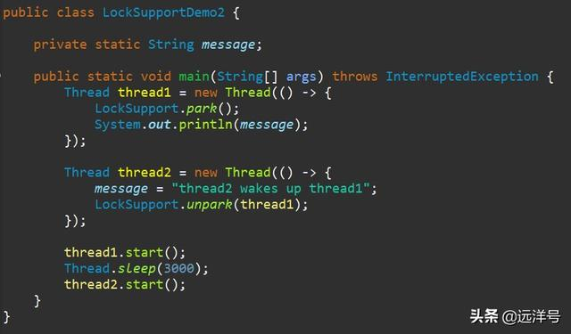

需要注意的是在调用LockSupport的park方法时一般会使用while(condition)循环体，如下方框的代码所示，这样能保证在线程被唤醒后再一次判断条件是否符合。

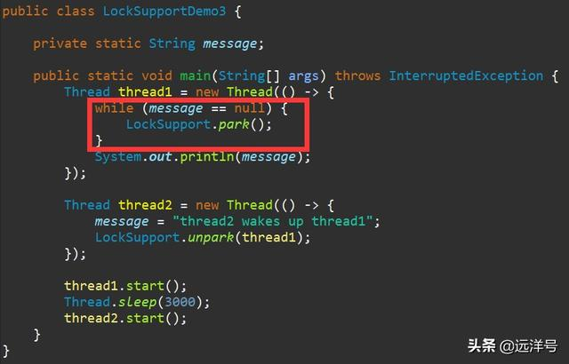

## park与unpark的顺序

下面来探讨LockSupport的park和unpark的执行顺序的问题。正常来说一般是先park线程阻塞，然后unpark来唤醒该线程。但是如果先执行unpark再执行park，会不会park就永远没办法被唤醒了呢？在往下分析之前我们先来看看wait/notify方式的执行顺序例子。主线程分别创建了thread1和thread2，然后启动它们。由于thread1会睡眠三秒，所以先由thead2执行了notify去唤醒阻塞在锁对象的线程，而在三秒后thread1才会执行wait方法，此时它将一直阻塞在那里。所以wait/notify方式的执行顺序会影响到唤醒。

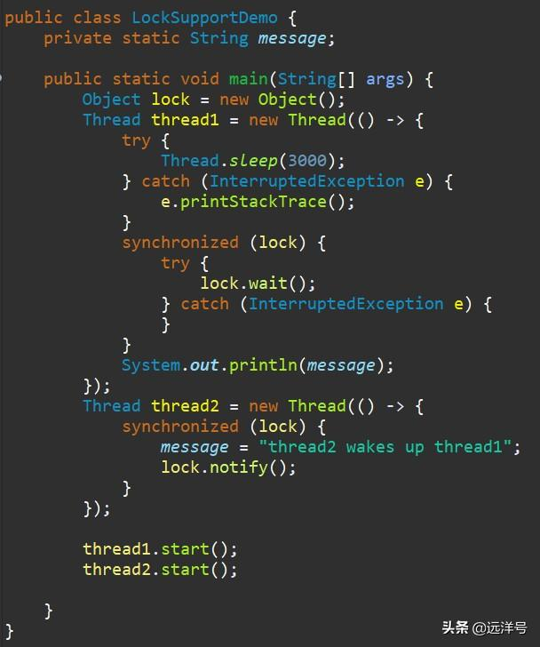

类似地，我们队park和unpark进行分析。这个例子与上面的wait/notify例子逻辑几乎相同，唯一不同的是阻塞和唤醒操作改为了park和unpark。实际上这个例子能正确运行，且最终输出了“thread2 wakes up thread1”。从此可以看出park/unpark方式的执行顺序不影响唤醒，这是因为park/unpark是使用了许可机制，如果先调用unpark去释放许可，那么调用park时就直接能获取到许可而不必等待。

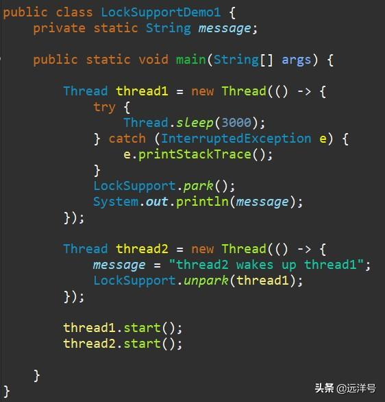

## park对中断的响应

park方法支持中断，也就是说一个线程调用park方法进入阻塞后，如果该线程被中断则能够解除阻塞立即返回。但需要注意的是，它不会抛出中断异常，所以我们不必去捕获InterruptedException。下面是一个中断的例子，thread1启动后调用park方法进入阻塞状态，然后主线程睡眠一秒后中断thread1，此时thread1将解除阻塞状态并输出null。接着主线程睡眠三秒后启动thread2，thread2将调用unpark，但thread1已经因中断而解除阻塞了。

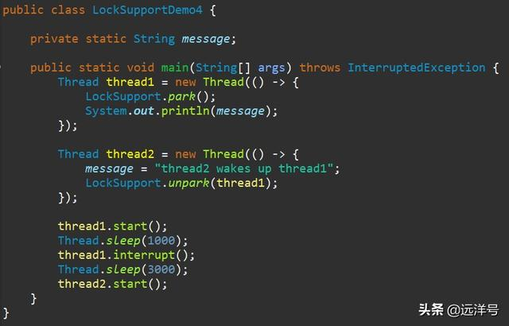

## park是否会释放锁

我们再思考一个问题，当线程调用LockSupport的park方法时是否会释放该线程所持有的锁资源呢？答案是不会。我们看下面的例子来理解，thread1和thread2两个线程都通过synchronized(lock)来获取锁。由于thread1先启动所以获得锁，而且它调用park方法使得thread1进入阻塞状态，但是thread1却不会释放锁lock。对于thread2这边，因为一直无法获取锁而无法进入同步块，也就没办法执行unpark操作。最终的结果就是造成了死锁，thread1在等thread2的unpark，而thread2却在等thread1释放锁。

## Blocker是什么

前面介绍park相关方法时将其分为了两大类，一类是不带阻塞对象，而另一类是带阻塞对象。下面看什么是阻塞对象及其作用。阻塞对象（Blocker）就是线程调用park方法时所在的对象，它的主要作用是供监视、诊断工具使用，通过getBlocker方法获取阻塞对象从而对阻塞进行分析。下面是使用的例子，我们定义一个Blocker类，其中doPark方法调用LockSupport的park方法，并传入了this作为阻塞对象。
thread1 启动后调用Blocker的doPark方法，thread2则能够通过LockSupport的getBlocker方法来获取阻塞对象，从而进一步对阻塞对象进行分析。这里会输出“我是blocker”

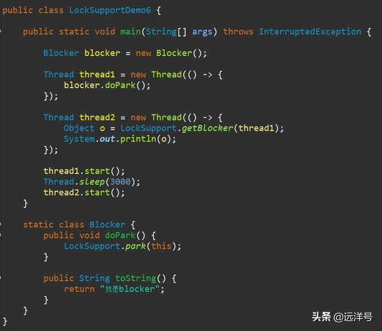

## LockSupport的实现

实际上LockSupport的实现很简单，如果用一句话来概括就是间接调用Unsafe的方法。Unsafe类提供了很多底层和不安全的操作，主要用了它park、unpark和putObject三类方法，
park和unpark方法可以看出是对底层线程进行操作，而putObject方法则是将对象设置为Thread对象里面的parkBlocker属性，
getObjectVolatile方法则是获取Thread对象里面的parkBlocker属性值。

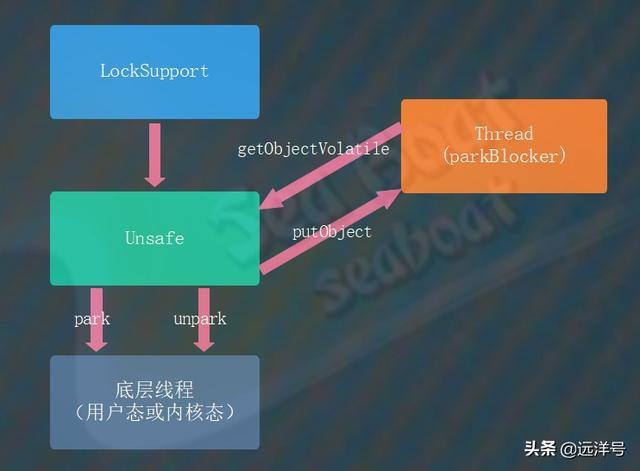

下面我们分析LockSupport类的实现，代码并非与JDK完全相同，但核心实现是一样的。该类主要包含一个Unsafe对象和long变量，
由于Java开发者无法直接通过new来实例化Unsafe对象，所以在static块中通过发射来获取Unsafe对象，而long变量表示
Thread对象parkBlocker属性的偏移，有了偏移就可以操作该属性。可以看到park、parkNanos和parkUntil三个方法都是间接调用了Unsafe对象的park方法。

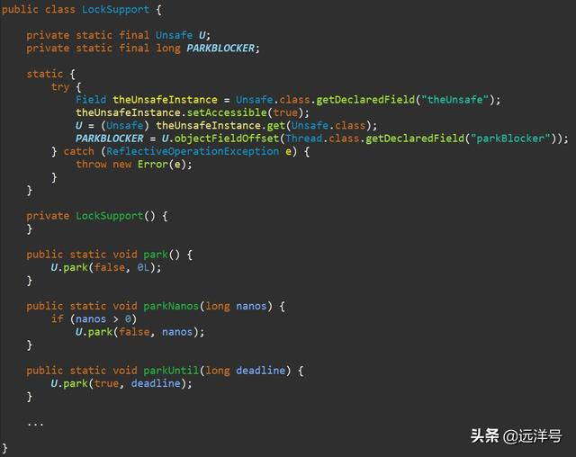

继续看传入阻塞对象的情况，包括park、parkNonos和parkUntil三个方法，这三个方法都是会先通过Thread.currentThread()获取当前线程对象，
然后调用serBlocker将阻塞对象设置到Thread对象中的parkBlocker属性，接着调用Unsafe对象的park方法，最终调用serBlocker将Thread对象中的parkBlocker属性清空。
注意这里的setBlocker方法间接调用了Unsafe对象的putObject方法，该方法能够通过属性偏移来修改属性值，而gerBlocker方法则是间接调用
Unsafe对象的getObjectVolatile方法则是获取Thread对象里面的parkBlocker属性值

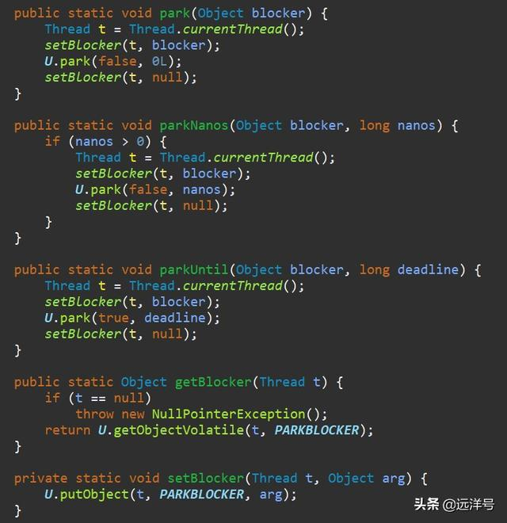

unpark方法则是间接调用Unsafe对象的unpark方法。

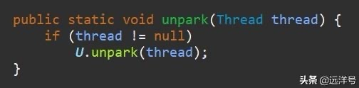

## 总结

本文讲解了JDK并发包中锁支持类LockSupport，它主要的功能就是实现线程的阻塞和唤醒，而且使用了许可机制。他的核心方法包括六种park方法和unpark
方法，然后通过例子我们了解了LockSupport的基本用法，接着探讨了park和unpark的执行顺序，然后继续分析了park对中断的响应和park时是否会释放锁，
同时也介绍了阻塞对象Blocker以及他的作用。最后从源码角度跑细了LockSupport类的实现，至此我们已经完全掌握了LockSupport的机制原理。