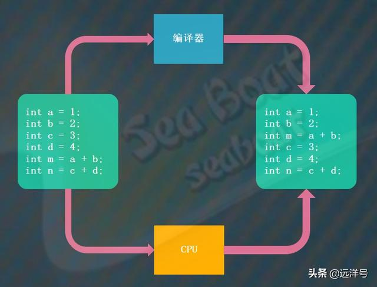
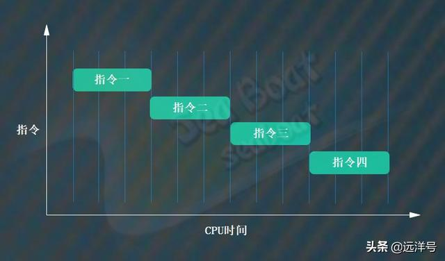
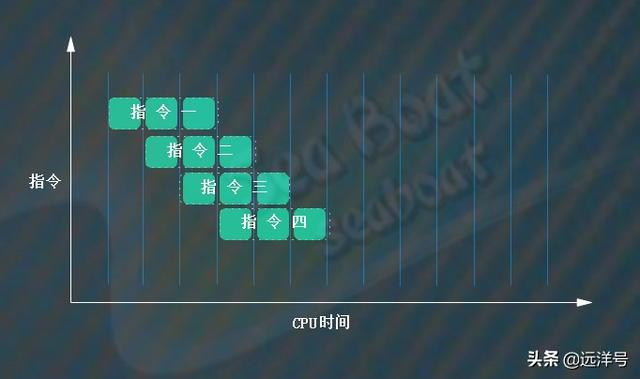
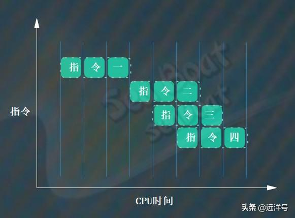
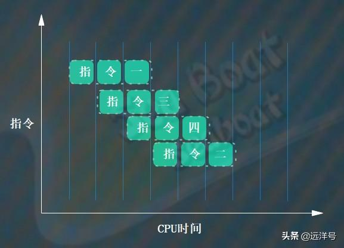
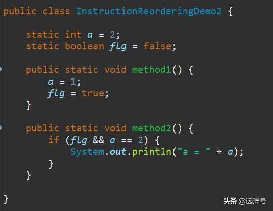
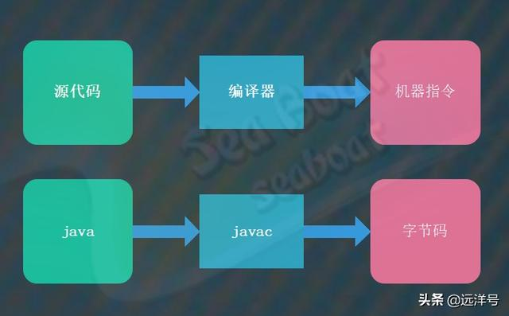
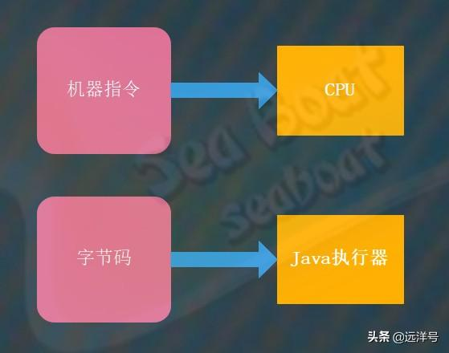
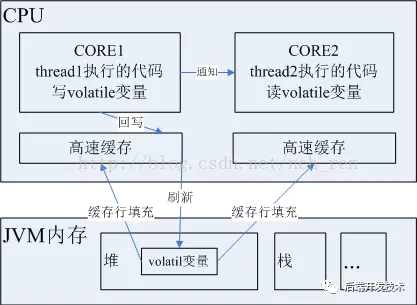

# Java编译会打乱指令顺序？指令重新排序问题该如何解决？

## 指令重排

“你看到的不一定就是你以为的！”，我觉得用这句话来描述指令重排非常贴切。当我们在语言层面写代码时，我们是按照我们的理解和习惯去编写程序，但对于编译器和CPU来说执行时的顺序却有可能与你的代码顺序不一样。
因为每个层面都有各自需要关注和考虑的事情，编译器和CPU可能会对愚蠢的人类编写的代码进行优化再执行，以此提高执行效率。
所以指令重排其实是为了提升机器执行效率而提出的一种措施。比如下图中，左边的是原来的代码，通过编译器编译后或被CPU执行时等同的代码顺序是可能为右边的代码，当然这里只是举个例子，并不是说一定会这样重排。

## 引入流水线之前

为了更好地理解指令重排的作用，我们先了解流水线相关技术。在没有使用流水线之前，所有指令是一条条执行的，只有当一条指令执行完后才会执行下一条指令。如下图中，一共有四个指令，假设每个指令都需要三个单位的CPU时间，那么四条指令总共耗时12个单位CPU时间。

## 引入流水线后

那么引入流水线技术后指令是如何执行的呢？每个指令将被拆分成若干个部分，而在同一个单位CPU时间内执行多个指令的不同部分，这样就能提升执行效率。比如下图，每个指令都被分成三部分，指令一的第二部分和指令二的第一部分可以同时被执行，最终四个指令被执行完一共花费了6个单位CPU时间。可见运行速度提升了很多。那么流水线技术为什么能这样执行呢？主要是因为一条指令被执行时不同阶段会涉及到不同的硬件部分，比如取指阶段使用指令通路和指令寄存器，译码阶段使用指令译码器，执行阶段使用执行单元和数据通路。鉴于此，可以将指令分成多个部分，并且不同指令的不同阶段能够同时被执行。总的来说，流水线的本质就是充分利用CPU的各个硬件部分，不同硬件部分执行不同指令的不同部分，看起来就像是并行的效果，从多个指令的整体效果来看执行性能大大提升。

## 为什么要指令重排

我们知道指令重排的原因是为了能让CPU能更快执行完所有指令，也就是说指令重排能让流水线更加高效。我们的代码生成指令后可能前后指令是相关的，比如后面一条指令依赖于前面指令执行的结果，那么在流水线的执行过程中就可能导致空等待而白白浪费CPU时间。我们看下面两个图，假设原来是按照指令一二三四的顺序执行的，而且指令二依赖于指令一的结果。那么不重排指令的情况需要等到指令一执行完才能接着执行指令二，但是如果我们将指令二当成最后一条指令则流水线能够充分执行，因为指令三和指令四不需要指令一的结果，而当要执行指令二时指令一已经执行完得到结果了。

## 指令重排的原则

指令重排的原则就是不能影响到程序在单线程下的准确性，就是说不管怎么重排都要保证其与重排前在单线程中执行的结果相同。比如下面的例子，尽管指令被重排了，但最终m和n的结果是与重排前相同的。

但对于多线程来说，指令重排却可能导致程序执行出现错误的结果。这也是指令重排的弊端，虽然它能让执行效率提升，但同样也会引入多线程问题。比如下面的例子，线程一调用method1方法且线程二调用method2方法，如果没有进行指令重排的话则不会输出a=2，但如果method1被重排则可能flg=true在a=1前面，则程序可能会输出a=2。

## 两类指令重排

指令重排主要发生在编译和运行时两个阶段，这两个阶段对应的主角分别为编译器和CPU。我们先看编译阶段重排，总的来说就是源代码经过编译器编译后成为机器指令，而机器指令可能被重排。对于Java来说，就是java源文件被javac编译后成为字节码指令。而字节码则可能被重排。

运行时阶段重排，指的是机器指令被CPU执行时可能会被CPU重排后才执行。对于Java来说，就是字节码被Java执行器执行时可能会被重排后才执行。

## 如何解决指令重排

以多核CPU为例（两核），我们知道CPU的速度比内存要快得多，为了弥补这个性能差异，CPU内核都会有自己的高速缓存区，当内核运行的线程执行一段代码时，首先将这段代码的指令集进行缓存行填充到高速缓存，
如果非volatil变量当CPU执行修改了此变量之后，会将修改后的值回写到高速缓存，然后再刷新到内存中。
如果在刷新会内存之前，由于是共享变量，那么CORE2中的线程执行的代码也用到了这个变量，这是变量的值依然是旧的。    

volatile关键字就会解决这个问题的，如何解决呢，首先被volatile关键字修饰的共享变量在转换成汇编语言时，
会加上一个以lock为前缀的指令，当CPU发现这个指令时，立即做两件事：

1. 将当前内核高速缓存行的数据立刻回写到内存；
2. 使在其他内核里缓存了该内存地址的数据无效。

第一步很好理解，第二步如何做到呢？

MESI协议：在早期的CPU中，是通过在总线加LOCK#锁的方式实现的，但这种方式开销太大，
所以Intel开发了缓存一致性协议，也就是MESI协议，该解决缓存一致性的思路是：
当CPU写数据时，如果发现操作的变量是共享变量，即在其他CPU中也存在该变量的副本，
那么他会发出信号通知其他CPU将该变量的缓存行设置为无效状态。当其他CPU使用这个变量时，
首先会去嗅探是否有对该变量更改的信号，当发现这个变量的缓存行已经无效时，
会从新从内存中读取这个变量。

