# Java多线程并发读写锁ReadWriteLock实现原理剖析

### 关于读写锁
前面的章节中我们分析了Java语法层面的synchronized锁和JDK内置可重入锁ReentrantLock，我们在多线程并发场景中可以通过它们来控制对资源的访问从而达到线程安全。这两种锁都属于纯粹的独占锁，也就是说这些锁任意时刻只能由一个线程持有，其它线程都得排队依次获取锁。

有些场景下为了提高并发性能我们会对纯粹的独占锁进行改造，额外引入共享锁来与独占锁共同对外构成一个锁，这种就叫读写锁。为什么叫读写锁呢？主要是因为它的使用考虑了读写场景，一般认为读操作不会改变数据所以可以多线程进行读操作，但写操作会改变数据所以只能一个线程进行写操作。读写锁在内部维护了一对锁（读锁和写锁），它通过将锁进行分离从而得到更高的并发性能。

如下图中，存在一个读写锁对象，其内部包含了读锁和写锁两个对象。假如存在五个线程，其中线程一和线程二想要获取读锁，那么两个线程是可以同时获取到读锁的。但是写锁就不可以共享，它是独占锁。比如线程三、线程四和线程五都想要持有写锁，那么只能一个个线程轮着持有。

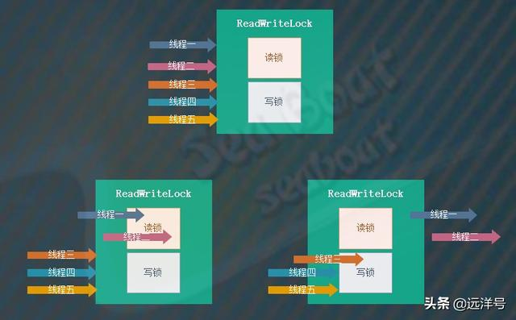

### 读写锁的性质

可以多个线程同时持有读锁，某个线程成功获取读锁后其它线程仍然能成功获取读锁，即使该线程不释放读锁。

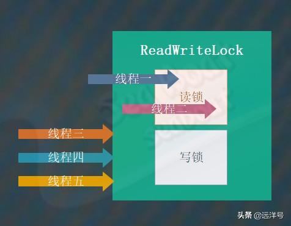

在某个线程持有读锁的情况下其它线程不能持有写锁，除非持有读锁的线程全部都释放掉读锁。

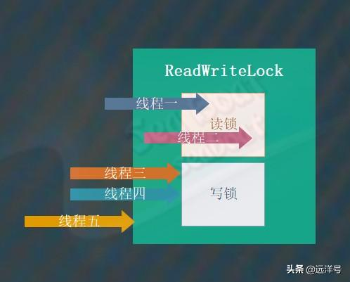

在某个线程持有写锁的情况下其它线程不能持有写锁或读锁，某个线程成功获取写锁后其它所有尝试获取读锁和写锁的线程都将进入等待状态，只有当该线程释放写锁后才其它线程能够继续往下执行。

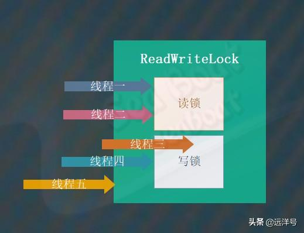

如果我们要获取读锁则需要满足两个条件：目前没有线程持有写锁和目前没有线程请求获取写锁。

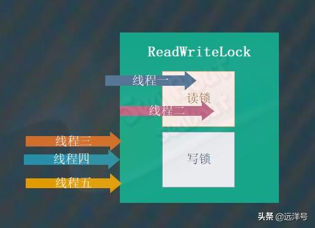

如果我们要获取写锁则需要满足两个条件：目前没有线程持有写锁和目前没有线程持有读锁。

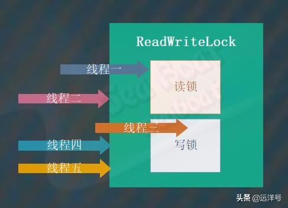

### 简单的实现版本

为了加深对读写锁的理解，在分析JDK实现的读写锁之前我们先来看一个简单的读写锁实现版本。其中三个整型变量分别表示持有读锁的线程数、持有写锁的线程数以及请求获取写锁的线程数，四个方法分别对应读锁、写锁的获取和释放操作。acquireReadLock方法用于获取读锁，如果持有写锁的线程数量或请求读锁的线程数大于0则让线程进入等待状态。releaseReadLock方法用于释放读锁，将读锁线程数减一并唤醒其它线程。acquireWriteLock方法用于获取写锁，如果持有读锁的线程数量或持有写锁的线程数量大于0则让线程进入等待状态。releaseWriteLock方法用于释放写锁，
将写锁线程数减一并唤醒其它线程。

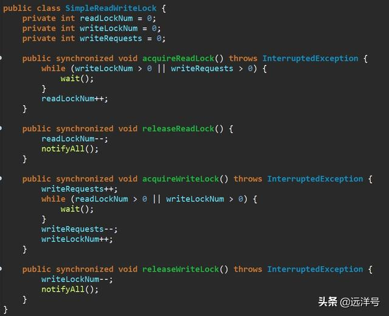

### 读锁升级为写锁

在某些场景下，我们希望某个已经拥有读锁的线程能够获得写锁，并将原来的读锁释放掉，这种情况就涉及到读锁升级为写锁操作。读写锁的升级操作需要满足一定的条件，这个条件就是某个线程必须是唯一拥有读锁的线程，否则将无法成功升级。如下图中，线程二已经持有读锁了，而且它是唯一的一个持有读锁的线程，所以它可以成功获得写锁。

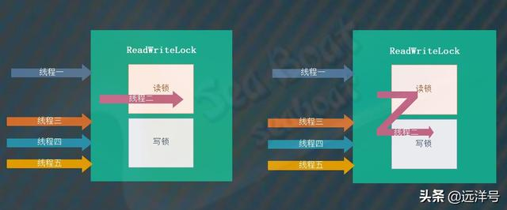

### 写锁降级为读锁

与锁升级相对应的是锁降级，锁降级就是某个已经拥有写锁的线程希望能够获得读锁，并将原来的写锁释放掉。锁降级操作几乎没有什么风险，因为写锁是独占锁，持有写锁的线程肯定是唯一的，而且读锁也肯定不存在持有线程，所以写锁可以直接降级为读锁。如下图中，线程三持有写锁，此时其它线程不可能持有读锁和写锁，所以可以安全地将写锁降为读锁。

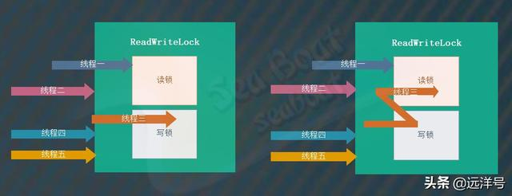

### ReadWriteLock接口

ReadWriteLock实际上是一个接口，它仅仅提供了两个方法：readLock和writeLock。分别表示获取读锁对象和获取写锁对象，JDK为我们提供了一个内置的读写锁工具，那就是ReentrantReadWriteLock类，我们将对其进行深入分析。ReentrantReadWriteLock类包含的属性和方法较多，为了让分析思路清晰且方便读者理解，我们将剔除非核心源码，只对核心功能进行分析。

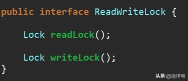

### ReentrantReadWriteLock三要素


ReentrantReadWriteLock类的三要素为：公平/非公平模式、读锁对象和写锁对象。其中公平/非公平模式表示多个线程同时去获取锁时是否按照先到先得的顺序获得锁，如果是则为公平模式，否则为非公平模式。读锁对象负责实现读锁功能，而写锁对象负责实现写锁功能，这两个类都属于ReentrantReadWriteLock的内部类，下面会详细讲解。


### ReentrantReadWriteLock实现思想

总的来说，ReentrantReadWriteLock类的内部包含了ReadLock内部类和WriteLock内部类，分别对应读锁和写锁，这两种锁都提供了公平模式和非公平模式。不管公平模式还是非公平模式、不管是读锁还是写锁都是基于AQS同步器来实现的。实现的主要难点在于只使用一个AQS同步器对象来实现读锁和写锁，这就要求读锁和写锁共用同一个共享状态变量，下面会具体讲解如何用一个状态变量来供读锁和写锁使用。

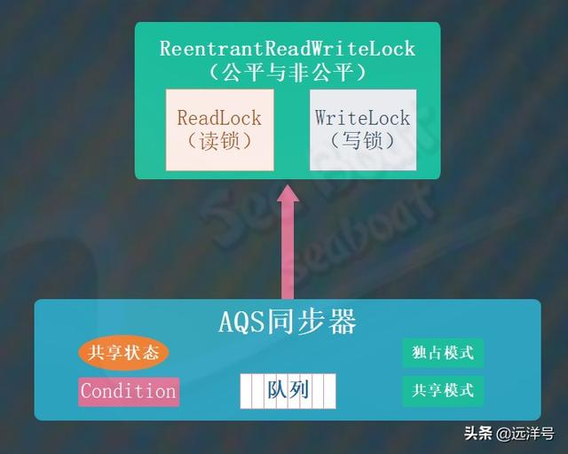

对应ReentrantReadWriteLock类的结构如下，ReentrantReadWriteLock.ReadLock和ReentrantReadWriteLock.WriteLock分别为读锁对象和写锁对象。Sync对象表示ReentrantReadWriteLock类的同步器，它基于AQS同步器，而FairSync类和NonfairSync类分别表示公平模式和非公平模式的同步器，可以看到默认情况下使用的是非公平模式。

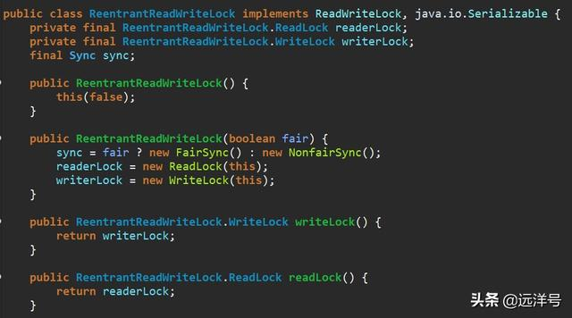

### 读写锁共用状态变量

前面提到过ReentrantReadWriteLock的难点在于读锁和写锁都共用一个共享变量，下面看具体是如何共用的。我们知道AQS同步器的共享状态是整型的，即32位，那么最简单的共用方式就是读锁和写锁分别使用16位。其中高16位用于读锁的状态，而低16位则用于写锁的状态，这样便达到共用效果。但是这样设计后当我们要获取读锁和写锁的状态值时则需要一些额外的计算，比如一些移位和逻辑与操作。

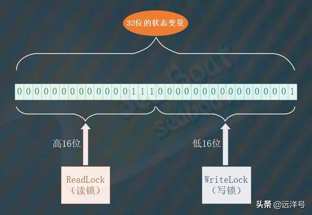

ReentrantReadWriteLock的同步器共用状态变量的逻辑如下，其中SHARED_SHIFT表示移动的位数为16；SHARED_UNIT表示读锁每次加锁对应的状态值大小，1左移16位刚好对应高16位的1；MAX_COUNT表示读锁能被加锁的最大次数，值为16个1（二进制）；EXCLUSIVE_MASK表示写锁的掩码，值为16个1（二进制）。sharedCount方法用于获取读锁（高16位）的状态值，左移16位即能得到。exclusiveCount方法用于获取写锁（低16位）的状态值，通过掩码即能得到。

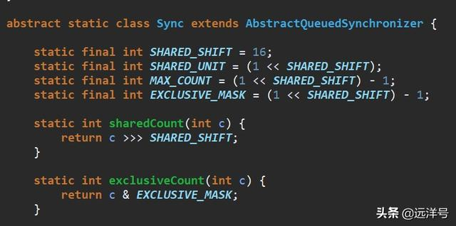

### ReadLock与WriteLock简介

ReadLock与WriteLock是ReentrantReadWriteLock的两个要素，它们都属于ReentrantReadWriteLock的内部类。它们都实现了Lock接口，我们主要关注lock、unlock和newCondition这几个核心方法。分别表示对读锁和写锁的加锁操作、释放锁操作和创建Condition对象操作，可以看到这些方法都间接调用了ReentrantReadWriteLock的同步器的方法，需要注意的是读锁不支持创建Condition对象。我们在可重入锁ReentrantLock章节中已经讲解过Condition对象，本节将不再赘述。

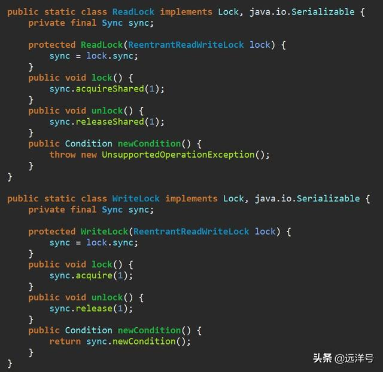

### 公平/非公平模式

ReentrantReadWriteLock的默认模式为非公平模式，其内部类Sync是公平模式FairSync类和非公平模式NonfairSync类的抽象父类。因为ReentrantReadWriteLock的读锁使用了共享模式，而写锁使用了独占模式，所以该父类将不同模式下的公平机制抽象成readerShouldBlock和writerShouldBlock两个抽象方法，然后子类就可以各自实现不同的公平模式。换句话说，ReentrantReadWriteLock的公平机制就由这两个方法来决定了。

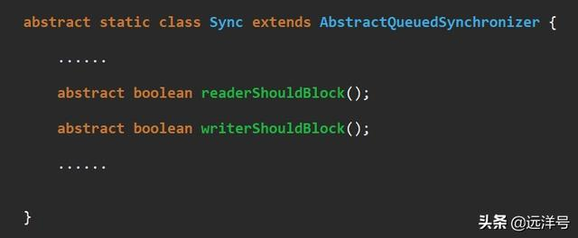

下面看公平模式的FairSync类，该类的readerShouldBlock和writerShouldBlock两个方法都直接返回hasQueuedPredecessors方法的结果，这个方法是AQS同步器的方法，用于判断当前线程前面是否有排队的线程。如果有排队队列就要让当前线程也加入排队队列中，这样按照队列顺序获取锁也就保证了公平性。

继续看非公平模式NonfairSync类，该类的writerShouldBlock方法直接返回false，表明不要让当前线程进入排队队列中，直接进行锁的获取竞争。readerShouldBlock方法则调用apparentlyFirstQueuedIsExclusive方法，这个方法是AQS同步器的方法，用于判断头结点的下一个节点线程是否在请求获取独占锁（写锁）。如果是则让其它线程先获取写锁，而自己则乖乖去排队。如果不是则说明下一个节点线程是请求共享锁（读锁），此时直接与之竞争读锁。

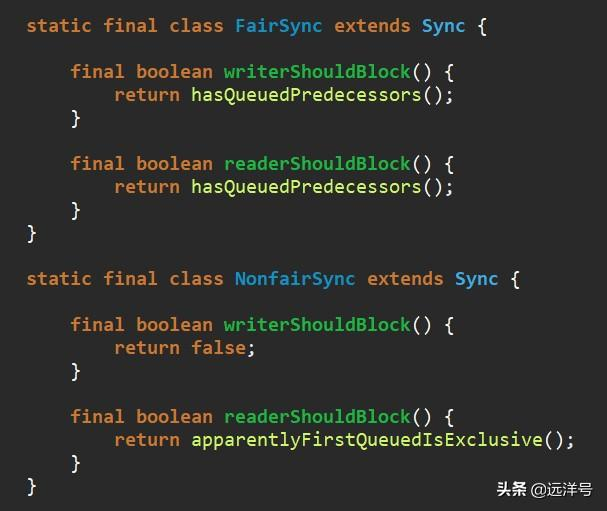

### 写锁WriteLock的实现

上面的介绍中我们知道WriteLock有两个核心方法：lock和unlock。它们都会间接调用了ReentrantReadWriteLock内部同步器的对应方法，在同步器中需要重写tryAcquire方法和tryRelease方法，分别用于获取写锁和释放写锁操作。

先看tryAcquire方法的逻辑，获取状态值并通过exclusiveCount方法得到低16位的写锁状态值。c!=0时有两种情况，一种是高16位的读锁状态不为0，一种是低16位的写锁状态不为0。w等于0时表示还有线程持有读锁，直接返回false表示获取写锁失败。如果持有写锁的线程为当前线程，则表示写锁重入操作，此时需要将状态变量进行累加，此外需要校验的是写锁重入状态值不能超过MAX_COUNT。通过writerShouldBlock方法判断是否需要将当前线程放入排队队列中，同时通过拥有CAS算法的compareAndSetState方法对状态变量进行累加操作，CAS失败的话也需要将当前线程放入排队队列中。对于非公平模式，这里的CAS操作就是闯入操作，即线程先尝试一次竞争写锁。最后通过setExclusiveOwnerThread设置当前线程持有写锁，该方法只是简单的设置变量方法。

继续看tryRelease方法的逻辑，先用isHeldExclusively方法检查当前线程必须为写锁持有线程。然后将状态值减去释放的值，并通过exclusiveCount得到低16位的写锁状态值，如果其值为0则表示已经没有重入可以彻底释放锁了，调用setExclusiveOwnerThread(null)设置没有线程持有写锁。最后设置新的状态值。

## ReadWriteLock读写锁用法

ReadWriteLock接口定义了两个Lock对象，其中一个用于读操作，一个用于写操作。

```
public interface ReadWriteLock {   
    Lock readLock();
    Lock writeLock();
}
```

在读写锁的加锁策略中，允许多个读操作同时进行，但每次只允许一个写操作，即读读不冲突，读写、写写冲突。

ReentrantReadWriteLock实现了ReadWriteLock接口，为这两种锁都提供了可重入的加锁语义。与ReentrantLock类似，ReentrantReadWriteLock在构造时也可以选择是一个非公平锁还是一个公平的锁，默认是非公平锁。

ReentrantReadWriteLock的构造函数：

```

    public ReentrantReadWriteLock() {
        this(false);
    }

    public ReentrantReadWriteLock(boolean fair) {
        sync = fair ? new FairSync() : new NonfairSync();
        readerLock = new ReadLock(this);
        writerLock = new WriteLock(this);
    }
```

ReentrantReadWriteLock类派生出了ReadLock和WriteLock分别表示读锁和写锁。

ReadLock的加锁方法是基于AQS同步器的共享模式。

```
public void lock() {
    sync.acquireShared(1);
}
```

WriteLock的加锁方法是基于AQS同步器的独占模式。

```
public void lock() {
    sync.acquire(1);
}
```

我们用读写锁构建线程安全的Map来熟悉它的用法：

```
    ReentrantReadWriteLock reentrantReadWriteLock = new ReentrantReadWriteLock();
    final Lock readLock = reentrantReadWriteLock.readLock();
    final Lock writeLock = reentrantReadWriteLock.writeLock();
    final HashMap<String, Integer> map = new HashMap<>();

    public void put(String k, Integer v) {
        writeLock.lock();
        try {
            map.put(k, v);
        } finally {
            writeLock.unlock();
        }
    }

    public Integer get(String k) {
        readLock.lock();
        try {
            return map.get(k);
        } finally {
            readLock.unlock();
        }
    }
```

从上面代码我们可能觉着读写控制分开了，提高了读的共享控制是不是读写锁的性能要比独占锁要高呢？


**写锁的获取与释放**

```
protected final boolean tryAcquire(int acquires) {
            /*
             * Walkthrough:
             * 1. If read count nonzero or write count nonzero
             *    and owner is a different thread, fail.
             * 2. If count would saturate, fail. (This can only
             *    happen if count is already nonzero.)
             * 3. Otherwise, this thread is eligible for lock if
             *    it is either a reentrant acquire or
             *    queue policy allows it. If so, update state
             *    and set owner.
             */
            Thread current = Thread.currentThread();
            int c = getState();
            //获取独占锁(写锁)的被获取的数量
            int w = exclusiveCount(c);
            if (c != 0) {
                // (Note: if c != 0 and w == 0 then shared count != 0)
                //1.如果同步状态不为0，且写状态为0,则表示当前同步状态被读锁获取
                //2.或者当前拥有写锁的线程不是当前线程
                if (w == 0 || current != getExclusiveOwnerThread())
                    return false;
                if (w + exclusiveCount(acquires) > MAX_COUNT)
                    throw new Error("Maximum lock count exceeded");
                // Reentrant acquire
                setState(c + acquires);
                return true;
            }
            if (writerShouldBlock() ||
                !compareAndSetState(c, c + acquires))
                return false;
            setExclusiveOwnerThread(current);
            return true;
        }
```

1)c是获取当前锁状态,w是获取写锁的状态。

2)如果锁状态不为零，而写锁的状态为0，则表示读锁状态不为0，所以当前线程不能获取写锁。或者锁状态不为零，而写锁的状态也不为0，但是获取写锁的线程不是当前线程，则当前线程不能获取写锁。

3)写锁是一个可重入的排它锁，在获取同步状态时，增加了一个读锁是否存在的判断。

写锁的释放与ReentrantLock的释放过程类似，每次释放将写状态减1，直到写状态为0时，才表示该写锁被释放了。

**3.读锁的获取与释放**

```
protected final int tryAcquireShared(int unused) {
    for(;;) {
        int c = getState();
        int nextc = c + (1<<16);
        if(nextc < c) {
           throw new Error("Maxumum lock count exceeded");
        }
        if(exclusiveCount(c)!=0 && owner != Thread.currentThread())
           return -1;
        if(compareAndSetState(c,nextc))
           return 1;
    }}
```

1)读锁是一个支持重进入的共享锁，可以被多个线程同时获取。

2)在没有写状态为0时，读锁总会被成功获取，而所做的也只是增加读状态（线程安全）

3)读状态是所有线程获取读锁次数的总和，而每个线程各自获取读锁的次数只能选择保存在ThreadLocal中，由线程自身维护。

读锁的每次释放均减小状态（线程安全的，可能有多个读线程同时释放锁），减小的值是1<<16。


**4.锁降级**

降级是指当前把持住写锁，再获取到读锁，随后释放(先前拥有的)写锁的过程。

锁降级过程中的读锁的获取是否有必要，答案是必要的。主要是为了保证数据的可见性，如果当前线程不获取读锁而直接释放写锁，假设此刻另一个线程T获取的写锁，并修改了数据，那么当前线程就无法感知到线程T的数据更新，如果当前线程遵循锁降级的步骤，那么线程T将会被阻塞，直到当前线程使数据并释放读锁之后，线程T才能获取写锁进行数据更新。


**5.读锁与写锁的整体流程**


但是从一些性能测试上来说，读写锁的性能并不好，而且使用不当还会引起饥饿写的问题。

饥饿写即在使用读写锁的时候，读线程的数量要远远大于写线程的数量，导致锁长期被读线程持有，写线程无法获取写操作权限而进入饥饿状态。

因此JDK1.8引入了StampedLock。