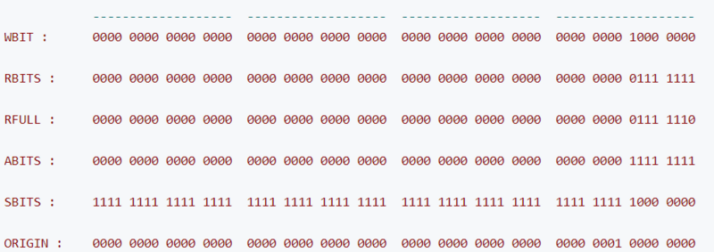
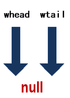
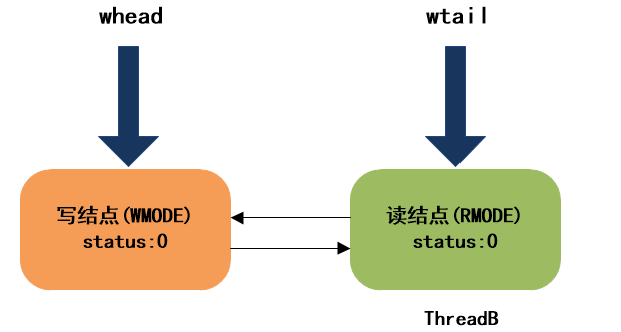
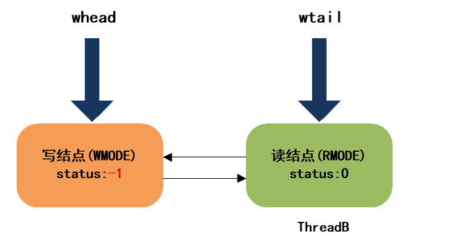
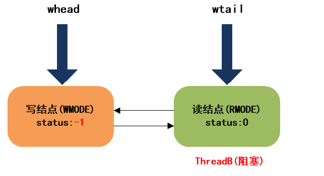

# StampedLock实现原理剖析

StampedLock在获取锁的时候会返回一个long型的数据戳，该数据戳用于稍后的锁释放参数，如果返回的数据戳为0则表示锁获取失败。

StampedLock是不可重入的，即使当前线程持有了锁再次获取锁还是会返回一个新的数据戳，所以要注意锁的释放参数，使用不小心可能会导致死锁。

StampedLock几乎具备了ReentrantReadWriteLock和ReentrantLock的功能，我们将上面的测试代码替换为StampedLock来熟悉下它的用法。

```
    final HashMap<String, Integer> map = new HashMap<>();
    final StampedLock stampedLock = new StampedLock();

    public void put2(String k, Integer v) {
        long stamp = stampedLock.writeLock();
        try {
            map.put(k, v);
        } finally {
            stampedLock.unlockWrite(stamp);
        }
    }

    public Integer get2(String k) {
        long stamp = stampedLock.readLock();
        try {
            return map.get(k);
        } finally {
            stampedLock.unlockRead(stamp);
        }
    }
```

StampedLock还提供了乐观读模式，使用tryOptimisticRead()方法获取一个非排他锁并且不会进入阻塞状态。

该方法会返回long型的数据戳，数据戳非0表示获取锁成功，如果为0表示获取锁失败。

我们把上面测试用例的读操作换成乐观读模式。

```
public String optimisticGet(String k) {
    //尝试获取读锁，返回获取的结果，线程不会进入阻塞
    long stamp = lock.tryOptimisticRead();
    //对上一步获取的结果进行验证
    //如果验证失败，则此时可能其他线程加了写锁，那么此时线程通过加读锁进入阻塞状态直到获取到读锁
    //如果验证成功，不进行任何加锁操作直接返回共享数据，这样的话就实现了无锁读的操作，提高了读访问性能。
    if (!lock.validate(stamp)) {
        stamp = lock.readLock();
        try {
            return map.get(k);
        }finally {
            lock.unlockRead(stamp);
        }
    }
    return map.get(k);                
}
```


那么什么时候选择synchronized，什么时候选择ReentrantLock呢？

如果你用到了ReentrantLock的高级性能，那么没办法只能ReentrantLock了。

如果不是高级性能可以优先选择synchronized，毕竟不用显示的加锁和解锁。但是我们需要考虑synchronized锁的升级不可逆的特点，如果线程并发存在比较明显的峰谷，则可以考虑选用ReentrantLock，毕竟重量级锁的性能确实不怎么好。

StampedLock的性能明显优于ReentrantReadWriteLock，且它还提供了乐观读的模式，优化了读操作的性能。StampedLock还提供了ReentrantLock的加锁解锁方式，因此如果遇到读写锁的场景那么可以考虑优先选择StampedLock。

## StampedLock的特点
StampedLock的主要特点概括一下，有以下几点：

所有获取锁的方法，都返回一个邮戳（Stamp），Stamp为0表示获取失败，其余都表示成功；

所有释放锁的方法，都需要一个邮戳（Stamp），这个Stamp必须是和成功获取锁时得到的Stamp一致；

StampedLock是不可重入的；（如果一个线程已经持有了写锁，再去获取写锁的话就会造成死锁）

StampedLock有三种访问模式：

①Reading（读模式）：功能和ReentrantReadWriteLock的读锁类似

②Writing（写模式）：功能和ReentrantReadWriteLock的写锁类似

③Optimistic reading（乐观读模式）：这是一种优化的读模式。

StampedLock支持读锁和写锁的相互转换

我们知道RRW中，当线程获取到写锁后，可以降级为读锁，但是读锁是不能直接升级为写锁的。

StampedLock提供了读锁和写锁相互转换的功能，使得该类支持更多的应用场景。

无论写锁还是读锁，都不支持Conditon等待

我们知道，在ReentrantReadWriteLock中，当读锁被使用时，如果有线程尝试获取写锁，该写线程会阻塞。

但是，在Optimistic reading中，即使读线程获取到了读锁，写线程尝试获取写锁也不会阻塞，这相当于对读模式的优化，但是可能会导致数据不一致的问题。所以，当使用Optimistic reading获取到读锁时，必须对获取结果进行校验。

## StampedLock原理

StampedLock虽然不像其它锁一样定义了内部类来实现AQS框架，但是StampedLock的基本实现思路还是利用CLH队列进行线程的管理，通过同步状态值来表示锁的状态和类型。

StampedLock内部定义了很多常量，定义这些常量的根本目的还是和ReentrantReadWriteLock一样，对同步状态值按位切分，以通过位运算对State进行操作：

> 对于StampedLock来说，写锁被占用的标志是第8位为1，读锁使用0-7位，正常情况下读锁数目为1-126，超过126时，使用一个名为readerOverflow的int整型保存超出数。

```
    /** Number of processors, for spin control */
//cpu核数 用于控制自旋次数
    private static final int NCPU = Runtime.getRuntime().availableProcessors();

    /** Maximum number of retries before enqueuing on acquisition */
//尝试获取锁时如果超过该值仍未获得锁，加入等待队列
    private static final int SPINS = (NCPU > 1) ? 1 << 6 : 0;

    /** Maximum number of retries before blocking at head on acquisition */
//等待队列的首节点，自选获取锁失败 超过该值时会继续阻塞
    private static final int HEAD_SPINS = (NCPU > 1) ? 1 << 10 : 0;

//首次进入阻塞之前的最大重试次数
    /** Maximum number of retries before re-blocking */
    private static final int MAX_HEAD_SPINS = (NCPU > 1) ? 1 << 16 : 0;

    /** The period for yielding when waiting for overflow spinlock */
    private static final int OVERFLOW_YIELD_RATE = 7; // must be power 2 - 1

    /** The number of bits to use for reader count before overflowing */
    private static final int LG_READERS = 7;

    // Values for lock state and stamp operations
    private static final long RUNIT = 1L;    //一单位读锁 0000 0001
    private static final long WBIT  = 1L << LG_READERS;  //写锁标识位
    private static final long RBITS = WBIT - 1L;  //读状态标识位 0111 1111
    private static final long RFULL = RBITS - 1L;  //读锁的最大数量 0111 1110
    private static final long ABITS = RBITS | WBIT;  //用于获取读写状态 1111 1111
    private static final long SBITS = ~RBITS; // note overlap with ABITS  11111... 1000 0000

        //初始state的值
    // Initial value for lock state; avoid failure value zero
    private static final long ORIGIN = WBIT << 1;

    // Special value from cancelled acquire methods so caller can throw IE
    private static final long INTERRUPTED = 1L;

    // Values for node status; order matters
    private static final int WAITING   = -1;
    private static final int CANCELLED =  1;

    // Modes for nodes (int not boolean to allow arithmetic)
    private static final int RMODE = 0;
    private static final int WMODE = 1;

    /** Wait nodes */
    static final class WNode {
        volatile WNode prev;
        volatile WNode next;
        volatile WNode cowait;    // list of linked readers
        volatile Thread thread;   // non-null while possibly parked
        volatile int status;      // 0, WAITING, or CANCELLED
        final int mode;           // RMODE or WMODE
        WNode(int m, WNode p) { mode = m; prev = p; }
    }

    /** Head of CLH queue */
    private transient volatile WNode whead;
    /** Tail (last) of CLH queue */
    private transient volatile WNode wtail;

    // views
    transient ReadLockView readLockView;
    transient WriteLockView writeLockView;
    transient ReadWriteLockView readWriteLockView;

    //同步状态state ，处于写锁使用第8位（为1标识占用）读锁使用前7位（1-126，附加的readerOverflow用于当读锁超过126时）
    /** Lock sequence/state */
    private transient volatile long state;
    /** extra reader count when state read count saturated */
//因为读锁只使用前7位，所以当超过 128之后将使用一个int变量来记录
    private transient int readerOverflow;

    /**
     * Creates a new lock, initially in unlocked state.
     */
    public StampedLock() {
        state = ORIGIN;
    }

```

部分常量的比特位表示如下：



另外，StampedLock相比ReentrantReadWriteLock，对多核CPU进行了优化，可以看到，当CPU核数超过1时，会有一些自旋操作

#### 来看下writeLock方法

```
/**
*获取写锁，如果获取失败进入阻塞
* 注意该方法不响应中断
**/
    public long writeLock() {
        long s, next;  // bypass acquireWrite in fully unlocked case only
        return ((((s = state) & ABITS) == 0L &&   ///((s = state) & ABITS) == 0L 表示读锁和写锁都为使用
                 U.compareAndSwapLong(this, STATE, s, next = s + WBIT)) ?  //cas 操作 将第8位置1 表示写锁被占用
                next : acquireWrite(false, 0L)); //获取失败则调用acquireWrite 加入等待队列
    }
```

StampedLock中大量运用了位运算，这里(s = state) & ABITS == 0L 表示读锁和写锁都未被使用，这里写锁可以立即获取成功，然后CAS操作更新同步状态值State。

操作完成后，等待队列的结构如下：



> 注意：StampedLock中，等待队列的结点要比AQS中简单些，仅仅三种状态。<br>
>  0：初始状态<br>
>  -1：等待中<br>
>   1：取消<br>


#### 来看下readLock方法

由于ThreadA此时持有写锁，所以ThreadB获取读锁失败，将调用acquireRead方法，加入等待队列：
```
/**
* 获取读锁，如果写锁被占用，线程会阻塞
* 
**/
    public long readLock() {
        long s = state, next;  // bypass acquireRead on common uncontended case
        //whead == wtail 队列为空 且读锁数目未超限
        //(s & ABITS) < RFULL 表示写锁未被占用，且读锁数量没有超限 
        return ((whead == wtail && (s & ABITS) < RFULL &&
                 U.compareAndSwapLong(this, STATE, s, next = s + RUNIT)) ?
                next : acquireRead(false, 0L));
    }
```

acquireRead方法非常复杂，用到了大量自旋操作：

```
/**
 * 尝试自旋的获取读锁, 获取不到则加入等待队列, 并阻塞线程
 *
 * @param interruptible true 表示检测中断, 如果线程被中断过, 则最终返回INTERRUPTED
 * @param deadline      如果非0, 则表示限时获取
 * @return 非0表示获取成功, INTERRUPTED表示中途被中断过
 */
private long acquireRead(boolean interruptible, long deadline) {
    WNode node = null, p;   // node指向入队结点, p指向入队前的队尾结点

    /**
     * 自旋入队操作
     * 如果写锁未被占用, 则立即尝试获取读锁, 获取成功则返回.
     * 如果写锁被占用, 则将当前读线程包装成结点, 并插入等待队列（如果队尾是写结点,直接链接到队尾;否则,链接到队尾读结点的栈中）
     */
    for (int spins = -1; ; ) {
        WNode h;
        if ((h = whead) == (p = wtail)) {   // 如果队列为空或只有头结点, 则会立即尝试获取读锁
            for (long m, s, ns; ; ) {
                if ((m = (s = state) & ABITS) < RFULL ?     // 判断写锁是否被占用
                    U.compareAndSwapLong(this, STATE, s, ns = s + RUNIT) :  //写锁未占用,且读锁数量未超限, 则更新同步状态
                    (m < WBIT && (ns = tryIncReaderOverflow(s)) != 0L))        //写锁未占用,但读锁数量超限, 超出部分放到readerOverflow字段中
                    return ns;          // 获取成功后, 直接返回
                else if (m >= WBIT) {   // 写锁被占用,以随机方式探测是否要退出自旋
                    if (spins > 0) {
                        if (LockSupport.nextSecondarySeed() >= 0)
                            --spins;
                    } else {
                        if (spins == 0) {
                            WNode nh = whead, np = wtail;
                            if ((nh == h && np == p) || (h = nh) != (p = np))
                                break;
                        }
                        spins = SPINS;
                    }
                }
            }
        }
        if (p == null) {                            // p == null表示队列为空, 则初始化队列(构造头结点)
            WNode hd = new WNode(WMODE, null);
            if (U.compareAndSwapObject(this, WHEAD, null, hd))
                wtail = hd;
        } else if (node == null) {                  // 将当前线程包装成读结点
            node = new WNode(RMODE, p);
        } else if (h == p || p.mode != RMODE) {     // 如果队列只有一个头结点, 或队尾结点不是读结点, 则直接将结点链接到队尾, 链接完成后退出自旋
            if (node.prev != p)
                node.prev = p;
            else if (U.compareAndSwapObject(this, WTAIL, p, node)) {
                p.next = node;
                break;
            }
        }
        // 队列不为空, 且队尾是读结点, 则将添加当前结点链接到队尾结点的cowait链中（实际上构成一个栈, p是栈顶指针 ）
        else if (!U.compareAndSwapObject(p, WCOWAIT, node.cowait = p.cowait, node)) {    // CAS操作队尾结点p的cowait字段,实际上就是头插法插入结点
            node.cowait = null;
        } else {
            for (; ; ) {
                WNode pp, c;
                Thread w;
                // 尝试唤醒头结点的cowait中的第一个元素, 假如是读锁会通过循环释放cowait链
                if ((h = whead) != null && (c = h.cowait) != null &&
                    U.compareAndSwapObject(h, WCOWAIT, c, c.cowait) &&
                    (w = c.thread) != null) // help release
                    U.unpark(w);
                if (h == (pp = p.prev) || h == p || pp == null) {
                    long m, s, ns;
                    do {
                        if ((m = (s = state) & ABITS) < RFULL ?
                            U.compareAndSwapLong(this, STATE, s,
                                ns = s + RUNIT) :
                            (m < WBIT &&
                                (ns = tryIncReaderOverflow(s)) != 0L))
                            return ns;
                    } while (m < WBIT);
                }
                if (whead == h && p.prev == pp) {
                    long time;
                    if (pp == null || h == p || p.status > 0) {
                        node = null; // throw away
                        break;
                    }
                    if (deadline == 0L)
                        time = 0L;
                    else if ((time = deadline - System.nanoTime()) <= 0L)
                        return cancelWaiter(node, p, false);
                    Thread wt = Thread.currentThread();
                    U.putObject(wt, PARKBLOCKER, this);
                    node.thread = wt;
                    if ((h != pp || (state & ABITS) == WBIT) && whead == h && p.prev == pp) {
                        // 写锁被占用, 且当前结点不是队首结点, 则阻塞当前线程
                        U.park(false, time);
                    }
                    node.thread = null;
                    U.putObject(wt, PARKBLOCKER, null);
                    if (interruptible && Thread.interrupted())
                        return cancelWaiter(node, p, true);
                }
            }
        }
    }

    for (int spins = -1; ; ) {
        WNode h, np, pp;
        int ps;
        if ((h = whead) == p) {     // 如果当前线程是队首结点, 则尝试获取读锁
            if (spins < 0)
                spins = HEAD_SPINS;
            else if (spins < MAX_HEAD_SPINS)
                spins <<= 1;
            for (int k = spins; ; ) { // spin at head
                long m, s, ns;
                if ((m = (s = state) & ABITS) < RFULL ?     // 判断写锁是否被占用
                    U.compareAndSwapLong(this, STATE, s, ns = s + RUNIT) :  //写锁未占用,且读锁数量未超限, 则更新同步状态
                    (m < WBIT && (ns = tryIncReaderOverflow(s)) != 0L)) {      //写锁未占用,但读锁数量超限, 超出部分放到readerOverflow字段中
                    // 获取读锁成功, 释放cowait链中的所有读结点
                    WNode c;
                    Thread w;

                    // 释放头结点, 当前队首结点成为新的头结点
                    whead = node;
                    node.prev = null;

                    // 从栈顶开始(node.cowait指向的结点), 依次唤醒所有读结点, 最终node.cowait==null, node成为新的头结点
                    while ((c = node.cowait) != null) {
                        if (U.compareAndSwapObject(node, WCOWAIT, c, c.cowait) && (w = c.thread) != null)
                            U.unpark(w);
                    }
                    return ns;
                } else if (m >= WBIT &&
                    LockSupport.nextSecondarySeed() >= 0 && --k <= 0)
                    break;
            }
        } else if (h != null) {     // 如果头结点存在cowait链, 则唤醒链中所有读线程
            WNode c;
            Thread w;
            while ((c = h.cowait) != null) {
                if (U.compareAndSwapObject(h, WCOWAIT, c, c.cowait) &&
                    (w = c.thread) != null)
                    U.unpark(w);
            }
        }
        if (whead == h) {
            if ((np = node.prev) != p) {
                if (np != null)
                    (p = np).next = node;   // stale
            } else if ((ps = p.status) == 0)        // 将前驱结点的等待状态置为WAITING, 表示之后将唤醒当前结点
                U.compareAndSwapInt(p, WSTATUS, 0, WAITING);
            else if (ps == CANCELLED) {
                if ((pp = p.prev) != null) {
                    node.prev = pp;
                    pp.next = node;
                }
            } else {        // 阻塞当前读线程
                long time;
                if (deadline == 0L)
                    time = 0L;
                else if ((time = deadline - System.nanoTime()) <= 0L)   //限时等待超时, 取消等待
                    return cancelWaiter(node, node, false);

                Thread wt = Thread.currentThread();
                U.putObject(wt, PARKBLOCKER, this);
                node.thread = wt;
                if (p.status < 0 && (p != h || (state & ABITS) == WBIT) && whead == h && node.prev == p) {
                    // 如果前驱的等待状态为WAITING, 且写锁被占用, 则阻塞当前调用线程
                    U.park(false, time);
                }
                node.thread = null;
                U.putObject(wt, PARKBLOCKER, null);
                if (interruptible && Thread.interrupted())
                    return cancelWaiter(node, node, true);
            }
        }
    }
}
```

我们来分析下这个方法。
该方法会首先自旋的尝试获取读锁，获取成功后，就直接返回；否则，会将当前线程包装成一个读结点，插入到等待队列。
由于，目前等待队列还是空，所以ThreadB会初始化队列，然后将自身包装成一个读结点，插入队尾，然后在下面这个地方跳出自旋：

```
        if (p == null) {                            // p == null表示队列为空, 则初始化队列(构造头结点)
            WNode hd = new WNode(WMODE, null);
            if (U.compareAndSwapObject(this, WHEAD, null, hd))
                wtail = hd;
        } else if (node == null) {                  // 将当前线程包装成读结点
            node = new WNode(RMODE, p);
        } else if (h == p || p.mode != RMODE) {     // 如果队列只有一个头结点, 或队尾结点不是读结点, 则直接将结点链接到队尾, 链接完成后退出自旋
            if (node.prev != p)
                node.prev = p;
            else if (U.compareAndSwapObject(this, WTAIL, p, node)) {
                p.next = node;
                break;  //跳出自选
            }
        }
```

此时，等待队列的结构如下：




跳出自旋后，ThreadB会继续向下执行，进入下一个自旋，在下一个自旋中，依然会再次尝试获取读锁，如果这次再获取不到，就会将前驱的等待状态置为WAITING, 表示我（当前线程）要去睡了（阻塞），到时记得叫醒我：

```
        if (whead == h) {
            if ((np = node.prev) != p) {
                if (np != null)
                    (p = np).next = node;   // stale
            } else if ((ps = p.status) == 0)        // 将前驱结点的等待状态置为WAITING, 表示之后将唤醒当前结点
                U.compareAndSwapInt(p, WSTATUS, 0, WAITING);  //进入阻塞    
            else if (ps == CANCELLED) {
                if ((pp = p.prev) != null) {
                    node.prev = pp;
                    pp.next = node;
                }
```



最终, ThreadB进入阻塞状态:

```
            } else {        // 阻塞当前读线程
                long time;
                if (deadline == 0L)
                    time = 0L;
                else if ((time = deadline - System.nanoTime()) <= 0L)   //限时等待超时, 取消等待
                    return cancelWaiter(node, node, false);

                Thread wt = Thread.currentThread();
                U.putObject(wt, PARKBLOCKER, this);
                node.thread = wt;
                if (p.status < 0 && (p != h || (state & ABITS) == WBIT) && whead == h && node.prev == p) {
                    // 如果前驱的等待状态为WAITING, 且写锁被占用, 则阻塞当前调用线程
                    U.park(false, time);
                }
                node.thread = null;
                U.putObject(wt, PARKBLOCKER, null);
                if (interruptible && Thread.interrupted())
                    return cancelWaiter(node, node, true);
            }
```

最终，等待队列的结构如下：

