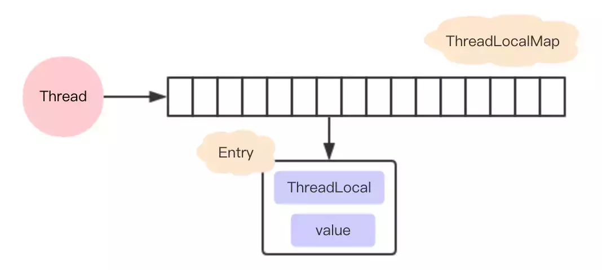
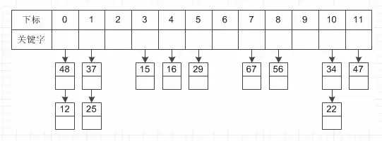

# ThreadLocal原理

ThreadLocal可以理解为线程本地变量，他会在每个线程都创建一个副本，那么在线程之间访问内部副本变量就行了，做到了线程之间互相隔离，相比于synchronized的做法是用空间来换时间。

ThreadLocal有一个静态内部类ThreadLocalMap，ThreadLocalMap又包含了一个Entry数组，Entry本身是一个弱引用，他的key是指向ThreadLocal的弱引用，Entry具备了保存key value键值对的能力。

弱引用的目的是为了防止内存泄露，如果是强引用那么ThreadLocal对象除非线程结束否则始终无法被回收，弱引用则会在下一次GC的时候被回收。

但是这样还是会存在内存泄露的问题，假如key和ThreadLocal对象被回收之后，entry中就存在key为null，但是value有值的entry对象，但是永远没办法被访问到，同样除非线程结束运行。

但是只要ThreadLocal使用恰当，在使用完之后调用remove方法删除Entry对象，实际上是不会出现这个问题的。


ThreadLocal 是一个线程的本地变量，也就意味着这个变量是线程独有的，是不能与其他线程共享的，这样就可以避免资源竞争带来的多线程的问题，这种解决多线程的安全问题和lock(这里的lock 指通过synchronized 或者Lock 等实现的锁) 是有本质的区别的:

1. lock 的资源是多个线程共享的，所以访问的时候需要加锁。
2. ThreadLocal 是每个线程都有一个副本，是不需要加锁的。
3. lock 是通过时间换空间的做法。
4. ThreadLocal 是典型的通过空间换时间的做法。

## 使用

```
public class ThreadLocalTest {

    public static void main(String[] args) {
        ThreadLocal threadLocal = new ThreadLocal();
        threadLocal.set("1");
        threadLocal.get();
    }
}
```


## 源码分析

在分析源码之前先画一下ThreadLocal ，ThreadLocalMap 和Thread 的关系.




#### set 方法

```
    public void set(T value) {
        Thread t = Thread.currentThread();
           //获取线程绑定的ThreadLocalMap
        ThreadLocalMap map = getMap(t);
        if (map != null)
            map.set(this, value);
        else
 // 第一次设置值的时候走的这里逻辑
            createMap(t, value);
    }
```

createMap 方法只是在第一次设置值的时候创建一个ThreadLocalMap 赋值给Thread 对象的threadLocals 属性进行绑定，以后就可以直接通过这个属性获取到值了。从这里可以看出，为什么说ThreadLocal 是线程本地变量来的了

```
    void createMap(Thread t, T firstValue) {
        t.threadLocals = new ThreadLocalMap(this, firstValue);
    }
```

值真正是放在ThreadLocalMap 中存取的，ThreadLocalMap 内部类有一个Entry 类，key是ThreadLocal 对象，value 就是你要存放的值，上面的代码value 存放的就是hello word。ThreadLocalMap 和HashMap的功能类似，但是实现上却有很大的不同：


1. HashMap 的数据结构是数组+链表
2. ThreadLocalMap的数据结构仅仅是数组
3. HashMap 是通过链地址法解决hash 冲突的问题
4. ThreadLocalMap 是通过开放地址法来解决hash 冲突的问题
5. HashMap 里面的Entry 内部类的引用都是强引用
6. ThreadLocalMap里面的Entry 内部类中的key 是弱引用，value 是强引用

#### 为什么ThreadLocalMap 采用开放地址法来解决哈希冲突?

jdk 中大多数的类都是采用了链地址法来解决hash 冲突，为什么ThreadLocalMap 采用开放地址法来解决哈希冲突呢？首先我们来看看这两种不同的方式

###### 链地址法

这种方法的基本思想是将所有哈希地址为i的元素构成一个称为同义词链的单链表，并将单链表的头指针存在哈希表的第i个单元中，因而查找、插入和删除主要在同义词链中进行。列如对于关键字集合{12,67,56,16,25,37, 22,29,15,47,48,34}，我们用前面同样的12为除数，进行除留余数法：





###### 开放地址法

这种方法的基本思想是一旦发生了冲突，就去寻找下一个空的散列地址(这非常重要，源码都是根据这个特性，必须理解这里才能往下走)，只要散列表足够大，空的散列地址总能找到，并将记录存入。

比如说，我们的关键字集合为{12,33,4,5,15,25},表长为10。 我们用散列函数f(key) = key mod l0。 当计算前S个数{12,33,4,5}时，都是没有冲突的散列地址，直接存入（蓝色代表为空的，可以存放数据）


计算key = 15时，发现f(15) = 5，此时就与5所在的位置冲突。于是我们应用上面的公式f(15) = (f(15)+1) mod 10 =6。于是将15存入下标为6的位置。这其实就是房子被人买了于是买下一间的作法：


#### 链地址法和开放地址法的优缺点

###### 开放地址法：

1. 容易产生堆积问题，不适于大规模的数据存储。
2. 散列函数的设计对冲突会有很大的影响，插入时可能会出现多次冲突的现象。
3. 删除的元素是多个冲突元素中的一个，需要对后面的元素作处理，实现较复杂。

###### 链地址法：

1. 处理冲突简单，且无堆积现象，平均查找长度短。
2. 链表中的结点是动态申请的，适合构造表不能确定长度的情况。
3. 删除结点的操作易于实现。只要简单地删去链表上相应的结点即可。
4. 指针需要额外的空间，故当结点规模较小时，开放定址法较为节省空间。

##### ThreadLocalMap 采用开放地址法原因

1. ThreadLocal 中看到一个属性 HASH_INCREMENT = 0x61c88647 ，0x61c88647 是一个神奇的数字，让哈希码能均匀的分布在2的N次方的数组里, 即 Entry[] table，关于这个神奇的数字google 有很多解析，这里就不重复说了
4. ThreadLocal 往往存放的数据量不会特别大（而且key 是弱引用又会被垃圾回收，及时让数据量更小），这个时候开放地址法简单的结构会显得更省空间，同时数组的查询效率也是非常高，加上第一点的保障，冲突概率也低

## 弱引用

接下来我们看看ThreadLocalMap 中的存放数据的内部类Entry 的实现源码

```
        static class Entry extends WeakReference<ThreadLocal<?>> {
            /** The value associated with this ThreadLocal. */
            Object value;

            Entry(ThreadLocal<?> k, Object v) {
                super(k);
                value = v;
            }
        }
```

我们可以知道Entry 的key 是一个弱引用，也就意味这可能会被垃圾回收器回收掉

    threadLocal.get()==null

也就意味着被回收掉了

ThreadLocalMap set 方法

```
        private void set(ThreadLocal<?> key, Object value) {

            // We don't use a fast path as with get() because it is at
            // least as common to use set() to create new entries as
            // it is to replace existing ones, in which case, a fast
            // path would fail more often than not.

            Entry[] tab = table;
            int len = tab.length;
//计算数组的的下标
            int i = key.threadLocalHashCode & (len-1);
//注意这里结束循环的条件是e！=null 这个很重要，还记得上面的开放地址法吗？
//这里遍历的逻辑是，先通过hash找到数组下标，然后寻相等的threadLocal对象
//找不到就往下一个index找
//有两种可能退出循环
//1. 找到相同的threadLocal对象
//2. 一直往数组的下一个下标查询，直到下一个下标对应的null跳出
            for (Entry e = tab[i];
                 e != null;
                 e = tab[i = nextIndex(i, len)]) {
                ThreadLocal<?> k = e.get();
           //如果找到直接设置value值返回
                if (k == key) {
                    e.value = value;
                    return;
                }

                if (k == null) {
//被收回的话就需要替换掉过期的值，把新值放在这里
                    replaceStaleEntry(key, value, i);
                    return;
                }
            }
//到这里说明没有找到
            tab[i] = new Entry(key, value);
            int sz = ++size;
            if (!cleanSomeSlots(i, sz) && sz >= threshold)
//进行扩容
                rehash();
        }
```

还是拿上面解释开放地址法解释的例子来说明下。 比如说，我们的关键字集合为{12,33,4,5,15,25},表长为10。 
我们用散列函数f(key) = key mod l0。 当计算前S个数{12,33,4,5,15,25}时，并且此时key=33,k=5 已经过期了（蓝色代表为空的，可以存放数据，红色代表key 过期，过期的key为null）：


replaceStaleEntry 这个方法

```
        private void replaceStaleEntry(ThreadLocal<?> key, Object value,
                                       int staleSlot) {
            Entry[] tab = table;
            int len = tab.length;
            Entry e;

            // Back up to check for prior stale entry in current run.
            // We clean out whole runs at a time to avoid continual
            // incremental rehashing due to garbage collector freeing
            // up refs in bunches (i.e., whenever the collector runs).
//这里采用的是从当前staleSlot位置向前遍历， i--
//这样的话是为了把前面所有的已经被垃圾回收的也一起释放空间
//（注意这里只是key回收，value还没有回收，entry更加没有回收，所以需要让他们回收）
//同时这样也避免了存在很多过期对象的占用，导致这个时候刚好来了一个新元素达到阈值而触发一次rehash
            int slotToExpunge = staleSlot;
            for (int i = prevIndex(staleSlot, len);
                 (e = tab[i]) != null;
                 i = prevIndex(i, len))
                if (e.get() == null)
                    slotToExpunge = i;

            // Find either the key or trailing null slot of run, whichever
            // occurs first
//这个时候是从数组下标小的向数组下标大的方向遍历， i++，刚好和上面相反
//这俩个遍历就是为了在左边遇到第一个空的entry到右边遇到第一个空的entry之间查询所有过期对象
//注意：在右边如果找到需要设置的key，（这个例子是key-15）相同的时候开始清理，然后返回，不再继续遍历下去
            for (int i = nextIndex(staleSlot, len);
                 (e = tab[i]) != null;
                 i = nextIndex(i, len)) {
                ThreadLocal<?> k = e.get();

                // If we find key, then we need to swap it
                // with the stale entry to maintain hash table order.
                // The newly stale slot, or any other stale slot
                // encountered above it, can then be sent to expungeStaleEntry
                // to remove or rehash all of the other entries in run.
//说面之前已经存在相同的key，所以需要替换旧的值并且和前面那个过期的对象进行位置交换
//
                if (k == key) {
                    e.value = value;

                    tab[i] = tab[staleSlot];
                    tab[staleSlot] = e;

                    // Start expunge at preceding stale entry if it exists
//这里的意思就是前面的第一个for循环（i--）往前查找的时候没有找到过期的，只有staleSlot这个过期
//由于前面过期对象已经通过交换位置的方式放到了index=i上，所以需要清理位置是i，而不是传过来的staleSlot
                    if (slotToExpunge == staleSlot)
                        slotToExpunge = i;
//进行清理过期数据
                    cleanSomeSlots(expungeStaleEntry(slotToExpunge), len);
                    return;
                }

                // If we didn't find stale entry on backward scan, the
                // first stale entry seen while scanning for key is the
                // first still present in the run.
//如果我们在第一个for循环（i--）向前遍历的时候没有找到任何过期对象
//那么我们需要把slotToExpunge设置为向后遍历（i++）的第一个过期对象的位置
//因为如果整个数组都没找到要设置的key的时候，该key会设置在改 staleSlot的位置上
//如果数组中存在要设置的key，那么上面也会通过交换位置的时候把有效值移到staleSlot位置上
//综上所述，staleSlot位置上不管怎么样，存放的都是有效值，所以不需要清除
                if (k == null && slotToExpunge == staleSlot)
                    slotToExpunge = i;
            }

            // If key not found, put new entry in stale slot
//如果key在数组中没存在，那么直接新建一个新的放进去就可以
            tab[staleSlot].value = null;
            tab[staleSlot] = new Entry(key, value);
//如果有其它已经过期的对象 那么需要清理它
            // If there are any other stale entries in run, expunge them
            if (slotToExpunge != staleSlot)
                cleanSomeSlots(expungeStaleEntry(slotToExpunge), len);
        }
```

第一个for 循环是向前遍历数据的，直到遍历到空的entry 就停止（这个是根据开放地址的线性探测法）,这里的例子就是遍历到index=1就停止了。
向前遍历的过程同时会找出过期的key,这个时候找到的是下标index=3 的为过期，进入到


    if (e.get() == null) slotToExpunge = i;

注意此时slotToExpunge=3，staleSlot=5

第二个for 循环是从index=staleSlot开始，向后编列的，找出是否有和当前匹配的key,有的话进行清理过期的对象和重新设置当前的值。
这个例子遍历到index=6 的时候，匹配到key=15的值，

先进行数据交换，注意此时slotToExpunge=3，staleSlot=5，i=6。这里就是把5 和6 的位置的元素进行交换，并且设置新的value=new,交换后的图是这样的


#### 为什么要交换

这里解释下为什么交换，我们先来看看如果不交换的话，经过设置值和清理过期对象，会是以下这张图


这个时候如果我们再一次设置一个key=15,value=new2 的值，通过f(15)=5,这个时候由于上次index=5是过期对象，被清空了，所以可以存在数据，那么就直接存放在这里了


你看，这样整个数组就存在两个key=15 的数据了，这样是不允许的，所以一定要交换数据

###### expungeStaleEntry

```
        private int expungeStaleEntry(int staleSlot) {
            Entry[] tab = table;
            int len = tab.length;

            // expunge entry at staleSlot
            tab[staleSlot].value = null;
            tab[staleSlot] = null;
            size--;

            // Rehash until we encounter null
            Entry e;
            int i;
            for (i = nextIndex(staleSlot, len);
                 (e = tab[i]) != null;
                 i = nextIndex(i, len)) {
                ThreadLocal<?> k = e.get();
                if (k == null) {
//这里设置成null方便让GC回收
                    e.value = null;
                    tab[i] = null;
                    size--;
                } else {
//这里的主要作用是由于使用的是开放地址法，所以删除的元素是多个冲突元素中的一个，需要对后面的元素做处理
//可以简单的理解就是让后面的元素往前移动
//为什么这么做？
//主要是开放地址寻找元素的时候遇到null就停止寻找了，你前面k==null的时候已经设置了entry==null，不移动的话，那么后面的元素永远访问不了
                    int h = k.threadLocalHashCode & (len - 1);
//他们不相等，说明经过hash是有冲突的
                    if (h != i) {
                        tab[i] = null;

                        // Unlike Knuth 6.4 Algorithm R, we must scan until
                        // null because multiple entries could have been stale.
                        while (tab[h] != null)
                            h = nextIndex(h, len);
                        tab[h] = e;
                    }
                }
            }
            return i;
        }
```

接下来我们详细模拟下整个过程 根据我们的例子，key=5,15,25 都是冲突的，并且k=5的值已经过期，经过replaceStaleEntry 方法，在进入expungeStaleEntry 方法之前，数据结构是这样的


此时传进来的参数staleSlot=6，
```
                if (k == null) {
//这里设置成null方便让GC回收
                    e.value = null;
                    tab[i] = null;
                    size--;
                }
```
这个时候会把index=6设置为null,数据结构变成下面的情况


接下来我们会遍历到i=7，经过int h = k.threadLocalHashCode & (len - 1) (实际上对应我们的举例的函数int h= f(25)); 得到的h=5,而25实际存放在index=7 的位置上，这个时候我们需要从h=5的位置上重新开始编列，直到遇到空的entry 为止


```
                    int h = k.threadLocalHashCode & (len - 1);
//他们不相等，说明经过hash是有冲突的
                    if (h != i) {
                        tab[i] = null;

                        // Unlike Knuth 6.4 Algorithm R, we must scan until
                        // null because multiple entries could have been stale.
                        while (tab[h] != null)
                            h = nextIndex(h, len);
                        tab[h] = e;
                    }
```
这个时候h=6，并把k=25 的值移到index=6 的位置上，同时设置index=7 为空，如下图


其实目的跟replaceStaleEntry 交换位置的原理是一样的，为了防止由于回收掉中间那个冲突的值，导致后面冲突的值没办法找到（因为e==null 就跳出循环了）

## ThreadLocal 内存溢出问题

通过上面的分析，我们知道expungeStaleEntry() 方法是帮助垃圾回收的，根据源码，我们可以发现 get 和set 方法都可能触发清理方法expungeStaleEntry()，
所以正常情况下是不会有内存溢出的 但是如果我们没有调用get 和set 的时候就会可能面临着内存溢出，养成好习惯不再使用的时候调用remove(),加快垃圾回收，避免内存溢出

退一步说，就算我们没有调用get 和set 和remove 方法,线程结束的时候，也就没有强引用再指向ThreadLocal 中的ThreadLocalMap了，
这样ThreadLocalMap 和里面的元素也会被回收掉，但是有一种危险是，如果线程是线程池的， 在线程执行完代码的时候并没有结束，只是归还给线程池，这个时候ThreadLocalMap 和里面的元素是不会回收掉的

## InheritableThreadLocal——父线程传递本地变量到子线程的解决方式及分析


可以看出ThreadLocal是相对于每一个线程自己使用的本地变量，但是在实际的开发中，有这样的一种需求：父线程生成的变量需要传递到子线程中进行使用，
那么在使用ThreadLocal似乎就解决不了这个问题，难道这个业务就没办法使用这个本地变量了吗？
答案肯定是否定的，ThreadLocal有一个子类InheritableThreadLocal就是为了解决这个问题而产生的，
使用这个变量就可以轻松的在子线程中依旧使用父线程中的本地变量。

 
InheritableThreadLocal继承自ThreadLocal，并且重写了父类的方法：createMap（),getMap(),childValue();


其次当主线程中对该变量进行set操作的时候，和ThreadLocal一样会初始化一个ThreadLocalMap对实际的变量值进行存储，以ThreadLocal为key，值为value，如果有多个ThreadLocal变量也都是存储在这个Map中。
该Map使用的是HashMap的原理进行数据的存储，但是和ThreadLocal有一点差别，因为其覆写了createMap的方法。


再将目光转移到线程Thread类中，可以看出Thread类维护了两个成员变量，ThreadLocal以及InheritableThreadLocal，数据类型都是ThreadLocalMap.这也就解释了为什么这个变量是线程私有的。但是如果要知道为什么父子线程的变量传递，那就继续看一下源码。当我们在主线程中开一个新的子线程的时候，开始会new一个新的Thread，具体的实现也就是在这里。

```
    public Thread(ThreadGroup group, Runnable target) {
        init(group, target, "Thread-" + nextThreadNum(), 0);
    }
```

经过调用init方法可以看出，方法中存在对InheritableThreadLocal的操作。获取的父线程也就是当前实际开辟线程的主线程。

```
    private void init(ThreadGroup g, Runnable target, String name,
                      long stackSize, AccessControlContext acc,
                      boolean inheritThreadLocals) {
        if (name == null) {
            throw new NullPointerException("name cannot be null");
        }

        this.name = name;
        // 这里 获取的父线程也就是当前实际开辟线程的主线程。
        Thread parent = currentThread();
        SecurityManager security = System.getSecurityManager();
        if (g == null) {
            /* Determine if it's an applet or not */

            /* If there is a security manager, ask the security manager
               what to do. */
            if (security != null) {
                g = security.getThreadGroup();
            }

            /* If the security doesn't have a strong opinion of the matter
               use the parent thread group. */
            if (g == null) {
                g = parent.getThreadGroup();
            }
        }

        /* checkAccess regardless of whether or not threadgroup is
           explicitly passed in. */
        g.checkAccess();

        /*
         * Do we have the required permissions?
         */
        if (security != null) {
            if (isCCLOverridden(getClass())) {
                security.checkPermission(SUBCLASS_IMPLEMENTATION_PERMISSION);
            }
        }

        g.addUnstarted();

        this.group = g;
        this.daemon = parent.isDaemon();
        this.priority = parent.getPriority();
        if (security == null || isCCLOverridden(parent.getClass()))
            this.contextClassLoader = parent.getContextClassLoader();
        else
            this.contextClassLoader = parent.contextClassLoader;
        this.inheritedAccessControlContext =
                acc != null ? acc : AccessController.getContext();
        this.target = target;
        setPriority(priority);
        if (inheritThreadLocals && parent.inheritableThreadLocals != null)
//当父线程中的inheritableThreadLocal被赋值时，会将当前线程的inheritableThreadLocal变量进行createInheritedMap(),看一下这个方法的具体实现，它会继续调用ThreadLocalMap(parentMap),主要的目的是父线程的变量值赋值给子线程。这里直接改变的是Entry[],因为ThreadLocalMap只是一个类名，具体数据存储和操作是使用内部的数组搭配Hash算法和Entry内部类实现。
            this.inheritableThreadLocals =
                ThreadLocal.createInheritedMap(parent.inheritableThreadLocals);
        /* Stash the specified stack size in case the VM cares */
        this.stackSize = stackSize;

        /* Set thread ID */
        tid = nextThreadID();
    }
```

其实就是把父线程的变量复制到了子线程

#### InheritableThreadLocal和线程池搭配使用存在的问题：

因为线程池中是缓存使用过的线程，当线程被重复调用的时候并没有再重新初始化init()线程，而是直接使用已经创建过的线程，所以这里的值并不会被再次操作。因为实际的项目中线程池的使用频率非常高，每一次从线程池中取出线程不能够直接使用之前缓存的变量，所以要解决这一个问题，网上大部分是推荐使用alibaba的开源项目transmittable-thread-local。具体可以自行了解，但是笔者认为需要弄清楚线程池和主线程以及本地变量直接的详细关系才可以更好的对这个项目有所理解。