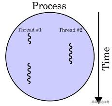
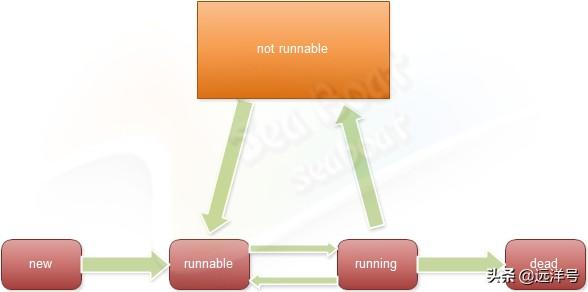
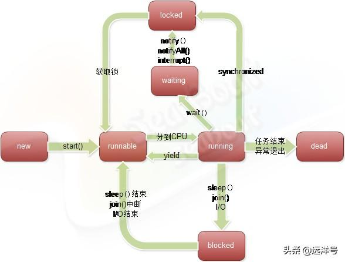

# 线程的状态及其转换过程

## 线程生命周期

线程跟人类一样拥有自己的生命周期，一条线程从创建到执行完毕的过程即是线程的生命周期。整个生命周期中线程可能在不同时刻处于不同的状态，有些线程任务简单，可能涉及的状态就很少。而有些线程任务复杂，相对应的状态也更多。那么线程到底有多少种状态？不同状态之间是如何转化的呢？

## 线程的状态

实际上可以这样说，线程状态的分类并没有严格的规定，只要能正确表示状态即可。如下图，我们来看一种常见的状态分类。一个线程从创建到死亡可能会经历若干个状态，但在任意一个时间点线程只能处于其中一种状态。线程总共包含了五个状态：新建（new）、可运行（runnable）、运行（running）、非可运行（not runnable）、死亡（dead）。

## 五种状态

新建状态（new），一个线程被创建但未被启动的话则处于新建状态。在程序中使用new MyThread();来创建的线程实例就处于此状态。

可运行状态（runnable），创建的线程实例调用start()方法后便进入可运行状态。处于此状态的线程并不是说一定处于运行状态，我们在前面讲解线程调度策略有讲到Java多线程使用的是抢占式调度，所以每个可运行线程在队列里面等着获取CPU时间片。我们可以想象成有一个可运行线程池，start()方法把线程放进可运行线程池中，而后CPU会按一定规则去执行池里的线程。

运行（running），当可运行线程获取到CPU执行时间片则进入了运行状态。

非可运行（notrunnable）：运行中的线程因某种原因暂时放弃CPU的使用权，可能是因为执行了挂起、睡眠或等待等操作。在执行I/O操作时由于外部设备速度远低于处理器速度也可能导致线程暂时放弃CPU使用权，在获取对象的同步锁过程中如果同步锁先被别的线程占用同样可能导致线程暂时放弃CPU。

死亡（dead）：线程执行完run()方法实现的任务，或因为异常导致退出任务停止执行，线程进入死亡状态后将无法再转换成其他状态。

## 状态的转换

线程状态的转换可以由Java程序控制，我们可以通过某些API来达到状态转换效果。例如Thread类的start、stop、sleep、suspend、resume、wait、notify等方法，但要注意的是stop、suspend、resume等方法因为容易引起死锁问题而已被弃用。

## 具体转换过程

下图完整地画出了线程的状态及状态之间的转换情况，下面我们将根据该图对每个状态及其转换进行说明。其实该图的状态与前面介绍的五个状态本质是相同的，不同的地方在于这里将非可运行（not runnable）状态进行了细分。而新建、可运行、运行、死亡四个状态的定义和转化都与前面的一样。现在我们重点看看非可运行状态引申出来的三个状态：阻塞（blocked）、同步锁（locked）、等待（waiting）。

阻塞（blocked）：该状态由阻塞事件触发，线程处于阻塞状态将放弃CPU的使用权，暂时停止运行。一般如果线程执行了sleep()、join()方法，或发出了I/O请求，则线程将处于阻塞状态。一旦sleep()执行的睡眠结束、join()执行的等待中断超时、I/O请求结束，则线程将重新回到可执行状态，等待分配CPU。

同步锁（locked）：假如一个线程准备调用一个同步方法，而同步方法对应的对象正被其他线程占用，此时线程就将进入同步锁状态。实际上，Java中的每个object对象都有一个monitor。此monitor负责对同步域在并发时的独占处理，即一个线程调用某对象

