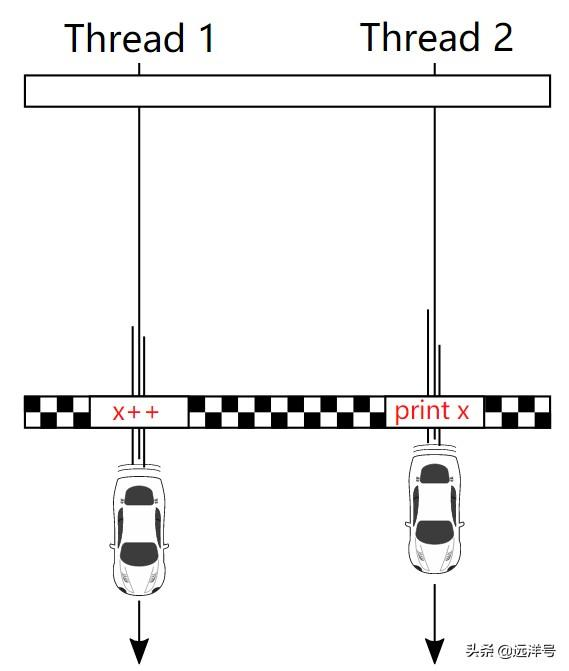
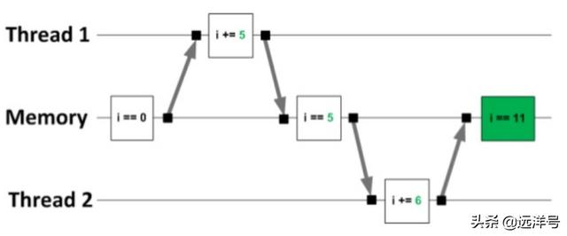
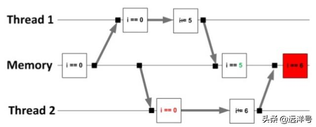
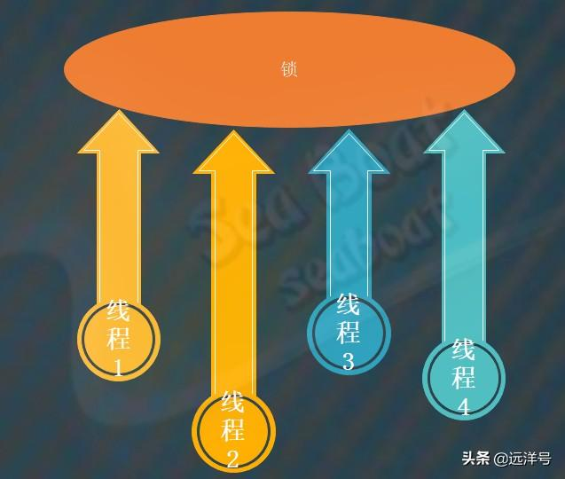
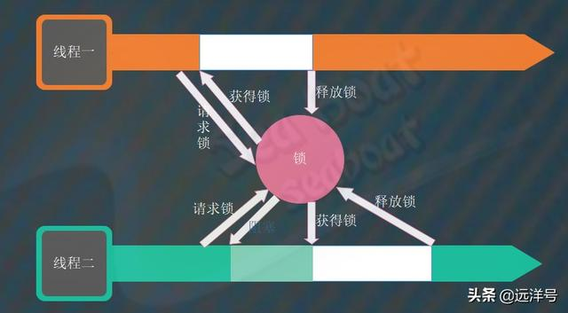
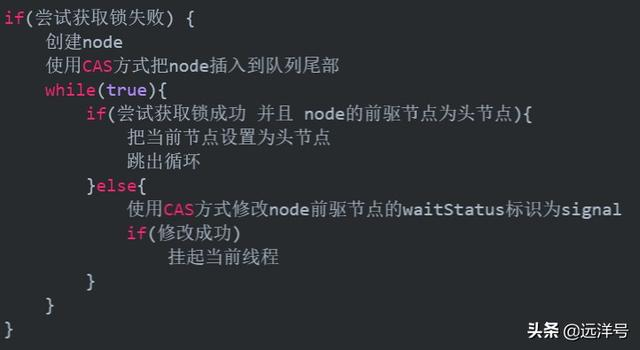
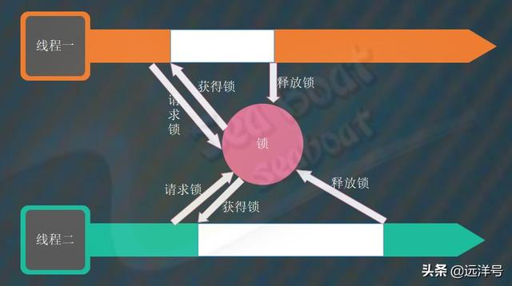

# JDK的互斥锁与共享锁

## 数据竞争

我们知道现代机器处理器几乎都是多核多线程的，引入多核多线程机制是为了尽可能提升机器整体处理性能。但是多核多线程也会带来很多并发问题，其中很重要的一个问题是数据竞争，数据竞争即多个线程同时访问共享数据而导致了数据冲突（不正确）。数据竞争如果没处理好则意味着整个业务逻辑可能出错，所以在高并发环境中我们要特别注意这点。

## 数据竞争产生条件

**存在数据竞争的场景必须满足以下几个条件：**

* 多个线程对某个共享数据进行访问。
* 这些线程同时地进行访问。
* 访问即是读或写数据操作。
* 至少有一个线程是执行写数据操作。

## 数据竞争例子

为更好理解数据竞争问题，下面我们举一个数据竞争的例子。下面两张图，上面的是不存在数据竞争时正确的结果。刚开始内存中i=0，线程一读取后将i加5。修改完后线程二才读取内存中的i并将其加6，最终i=11。而下面的情况则不同，线程二在线程一还没修改完就读取内存中i，此时导致最终的结果为i=6。

## 同步与锁

既然多个线程并发执行经常会涉及数据竞争问题，那么我们该如何解决这个问题呢？答案就是引入同步机制，通过同步机制来控制共享数据的访问，就能够解决数据竞争问题。实现同步机制可以通过锁来实现，所以AQS框架也抽象出了锁的获取操作和释放操作。而且还提供了包括独占锁和共享锁两种模式，这样对于上层的各种同步器的实现就方便很多了。

## 独占锁

独占锁是指该锁一次只能由一个线程持有，其它线程则无法获得，除非已持有锁的线程释放了该锁。一个线程只有在成功获取锁后才能继续往下执行，当离开竞争区域时则释放锁，释放的锁供其他即将进入数据竞争区域的线程获取。

获取独占锁和释放独占锁分别对应acquire方法和release方法。获取独占锁的主要逻辑为：先尝试获取锁，成功则往下执行，否则把线程放到等待队列中并可能将线程挂起。释放独占锁的主要逻辑为：唤醒等待队列中一个或多个线程去尝试获取锁。在AQS中可以用以下伪代码表示独占锁的获取与释放。

获取独占锁的伪代码：

释放独占锁的伪代码：

## 共享锁

共享锁是指该锁可以由多个线程所持有，多个线程都能同时获得该锁，而不必等到持有锁的线程释放该锁。比如一般我们所说的读锁就是共享锁，一个共享数据是可以被多个线程去读取的，只要它们都不改变共享数据就不会有数据竞争问题。

获取共享锁和释放共享锁分别对应acquireShared方法和releaseShared方法。获取共享锁的主要逻辑为：
先尝试获取锁，成功则往下执行，否则把线程放到等待队列中并可能将线程挂起。释放共享锁的主要逻辑为：唤醒等待队列中一个或多个线程去尝试获取锁。在AQS中可以用以下伪代码表示共享锁的获取与释放。

## 获取共享锁的伪代码

释放共享锁的伪代码

