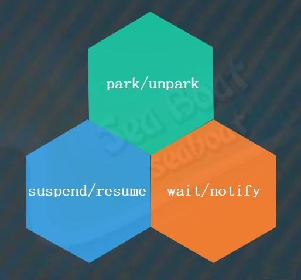
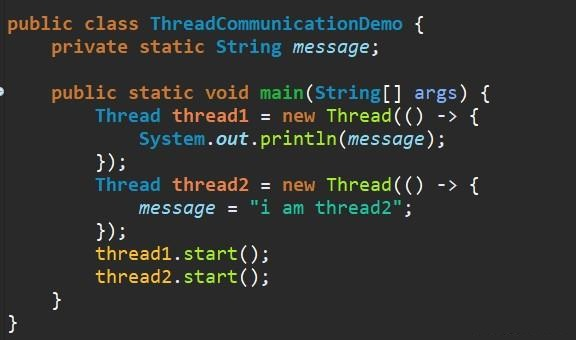
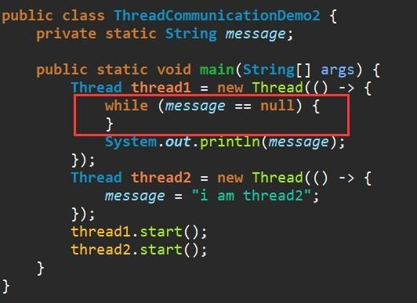
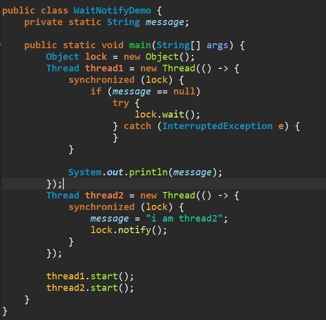
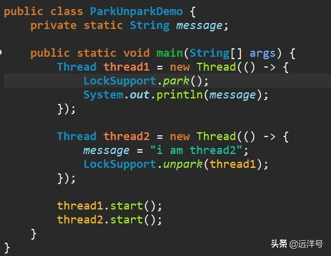
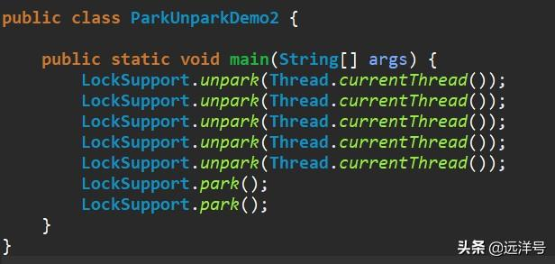
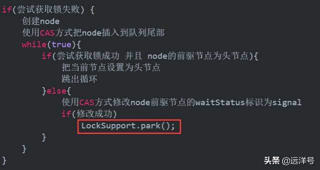
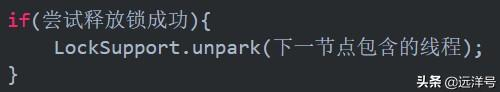

# Java多线程如何阻塞与唤醒线程？

目前在Java语言层面能实现阻塞唤醒的方式一共有三种：suspend与resume组合、wait与notify组合、park与unpark组合。
其中suspend与resume因为存在无法解决的竟态问题而被Java废弃。同样地，wait与notify也存在竟态条件，wait必须在notify之前执行，假如一个线程先执行notify再执行wait将可能导致一个线程永远阻塞。

如此一来，必须要另外一种解决方案，即park与unpark组合。该方案的实现类位于juc包下，自JDK1.5版本引入，应该也是因为当时编写JUC时发现Java现有方式无法解决问题而引入的新阻塞唤醒方式。由于park与unpark的实现基于许可机制，许可只能为0或1两种状态，所以unpark与park的操作不会累加状态值。也就是说许可是一次性的，也就是说不管是先unpark一次还是一百次，只要使用了park后许可就没了，下次要得到许可就得重新unpark。此外park与unpark没有时序性要求，unpark可以在park之前执行。如unpark先执行，后面park将不阻塞。下面我们将重新回顾下阻塞与唤醒相关操作知识。

### 为什么需要阻塞和唤醒

对于线程的阻塞和唤醒我们已经非常熟悉了，但为什么需要阻塞和唤醒操作呢？笼统地说，就是为了控制线程在某些关键节点执行的先后顺序。因为线程之间是独立的，它们要互相通信就比较麻烦，而为了让线程之间能够通信我们就引入共享变量。比如某个线程将信息写到变量上，而另外一个线程就能够读取信息了，这样便能够实现线程之间的通信。比如下面的例子，线程一通过共享变量message与线程二进行通信。但这种方式并不总是正确，因为两个线程是独立执行的，无法控制线程二先赋值共享变量，导致偶尔线程一接收到的message是null。

为了解决上述问题，我们可以在线程一中增加一个while判断，当message变量为null时就一直循环，直到线程二将信息赋值到message。这样做确实能解决问题，但这种做法最多只能算是二流方法。

所以，最终还是需要Java从内置角度来提供阻塞与唤醒的操作，这样才能是线程之间通信更加高效。也就是suspend与resume、wait与notify、park与unpark三套组合解决方案。

### wait与notify实现阻塞与唤醒

suspend与resume很早就已弃用，我们跳过，先看wait与notify组合。这两个线程通过wait与notify组合来实现阻塞与唤醒。需要注意到按要求必须使用synchronized对wait和notify进行加锁，否则将会产生异常。假如线程一先得到锁，那么message肯定为null，这时线程一会调用wait方法进去阻塞状态。而如果线程二先获得锁，那么message则已经被赋值，肯定不为空。这两种情况都没问题，保证了程序的准确性。

### park与unpark实现阻塞与唤醒

对于wait与notify方式，仍然存在不足。wait必须在notify之前执行，假如先执行notify再执行wait将可能导致线程永远无法被唤醒。可以看到使用了park与unpark组合后代码也简洁很多，而且更容易理解。假如线程一执行得更快则该线程执行park操作而阻塞，等到线程二对message赋值后执行unpark操作才能让线程一继续往下执行。假如线程二执行得更快则对message赋值后会对线程一进行unpark操作，那么线程一在执行park操作时就能直接通过了。这就是park与unpark使用许可机制的优势。

另外，我们需要注意的是许可是一次性的。也就是说不管是先unpark一次还是一百次，只要使用了park后许可就没了，下次要得到许可就得重新unpark。比如下面先对当前线程unpark了五次，然后第一次park就将许可使用掉了，那么第二个park就阻塞了，主线程被阻塞无法往下执行。

### 阻塞唤醒核心类LockSupport

Java语言层面真正意义上的并发编程应该从并发专家Doug Lea领导的JSR-166开始，该规范向JCP提交了向Java语言中添加并发编程工具的申请，即在JDK中添加java.util.concurrent工具包供开发者使用。该工具包为开发者提供了大量并发工具，从而轻松解决多线程并发过程中的各种问题。同时也可以通过该工具构建自己的同步器，而在此之前Java并发问题都只能依靠JVM内置的管程。

### AQS同步器的阻塞与唤醒

JDK内置并发AQS同步器的阻塞与唤醒使用的就是LockSupport类的park与unpark方法，该类分别调用的是Unsafe类的park与unpark本地方法，本地方法依赖于不同操作系统的实现。AQS同步器的阻塞唤醒操作会在获取锁的操作中使用，即如果获取不到锁的线程进入排队队列后则需要阻塞，阻塞使用的正是LockSupport.park()方法。

对应地，对于排队队列中，前一个节点负责唤醒下一个节点包含的线程，唤醒使用的是LockSupport.unpark(某个线程)方法。

完整的逻辑为：假如一条线程参与锁竞争，首先它会先尝试获取锁。如果失败的话就创建节点并插入队列尾部，然后再次尝试获取锁，如若成功则直接返回。否则设置节点状态为待运行状态，最后使用LockSupport的park阻塞当前线程。前驱节点运行完后将尝试唤醒后继节点，使用的即是LockSupport的unpark唤醒。

